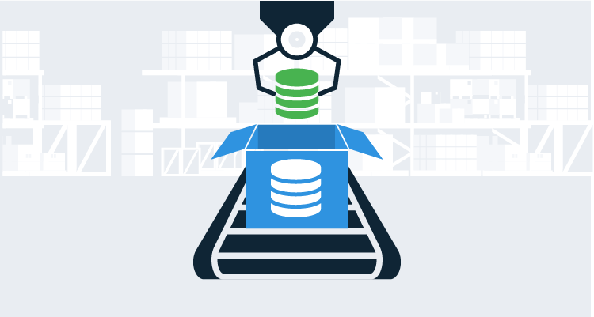

Automated database deployments was the final piece of the CI/CD puzzle I needed to go from deployments that took between 2 and 4 hours down to around 10 minutes.  It took many attempts to successfully automate database deployments, and the failures weren’t because of the tooling, the process was just fundamentally broken, and it had to be completely redesigned.

In the next couple of articles, I walk you through designing an automated database deployment process.  In this article, I focus on core concepts.  If you want to skip ahead, here are the links to the other articles:

- [Automated database deployment process: case study](/blog/2019-11/use-case-for-designing-db-deployment-process/index.md).
- [Implementing a database deployment process with Octopus Deploy](/blog/2019-11/implementing-db-deployment-process/index.md).

All of our database deployment articles can be found [here](https://octopus.com/database-deployments).

## In this article

!toc

## A typical manual database deployment process

I often see manual database deployment processes that look like:
- A developer makes a change in `development`.
- The developer adds that change to a Word document, Excel spreadsheet, Trello board (insert your board tool of choice), or on a piece of paper.
- Those changes are manually compiled into a delta script to push to `test`, `staging`, or `production`.
- The delta script is given to a DBA (or a person who has the correct permissions) to run it.
- The DBA runs the script and sends the results back to the requester.

Let’s take a step back and evaluate why that process exists:

- No source control to keep track of history, such as why a change was made, when it was made, and who made it.  
- Without source control it is extremely difficult to enforce a review process.
- If/when reviews do occur, they occur very late in the development life cycle, and it’s often too late to hold up a deployment unless something is very wrong.
- Without a consistent review process there is a much higher chance for a suboptimal change to be introduced.
- There is no history of the review process detailing who approved it or when it was approved.
- Most companies require a separation of duties, so the person who made the change cannot be the one who deploys the change.  

It comes down to trust and enforcement.  Unless the process is automatically enforced it cannot be trusted, and automation cannot occur without trust.

## Lessons learned trying to automate database deployments

Below is a list of hard lessons I learned automating database deployments:

- Don’t include everyone at the start.  Create a small work group of 2 to 4 key people, including DBAs or database architects.  Pick a pilot team to work through the kinks.  The pilot team should send 1 or 2 people to the work group (bringing the total to between 4 and 6 people).  The work group should be empowered to make decisions.
- Don’t exclude a specific group from the work group.  If you have developers, QA, database developers, and DBAs, then a representative from each group should be included in the work group.
- Don’t spend weeks or months trying to design the perfect process.  The work group should meet for a 1 or 2 day kick-off meeting to create a draft of the ideal process.  After that, schedule regular check-ins to see how the pilot team is doing.
- Don’t break your focus during the kick-off meeting.  Block out 1 to 2 days and don’t allow open laptops, except to look up answers to specific questions.
- Don’t focus on specific tooling.  Focus on the core concepts of the tooling available.  For example, modern version control software supports branching and a review process for merging, and every database deployment tool has a way to run from the command-line.
- Don’t try to automate rollbacks at the start.  You could spend the entire two days at the kick-off meeting trying to figure out all the possible scenarios.
- Don’t be afraid to ask for help if you get stuck.  When I worked for a previous company, we asked Redgate for help, and they walked us through this process.  There are consulting firms, such as [DLM Consultants](http://dlmconsultants.com/), which can also help.
- Don’t make decisions in a vacuum.  The work group should be transparent and solicit feedback at key points, and provide regular updates to everyone.

Depending on the size of your company, you might only have 4 to 6 developers and a DBA, or maybe only 2 or 3 people have the desire/bandwidth to solve the issues.  In this case, *work group* really means *anyone who wants to be included*.

## Kick-off meeting day 1

The first day is going to be focused solely on the deployment process.  

The existing process will need to change, and in some cases, a completely new process needs to be created.  But you have to start somewhere.  Write down the existing process, so everyone is on the same page.  Include all the steps it takes for a change to make its way from developer to production.  While writing the process down, focus on answering these questions:

1. Who are the people involved in the process?
2. What permissions do they have?
3. Why are they involved?
4. Which environments have a different process?
5. Why are they different?
6. What happens when the script fails to run?
7. Why do scripts typically fail?
8. Who reviews the scripts and when?
9. Who needs to be involved with each deployment?
10. What isn’t working, and what needs to change?

With those answers in hand, it’s time to start working on a rough draft of the ideal process.  When designing the process, stay away from specific tooling terminology.  Say `all database changes will be reviewed by a database developer during the merge process` instead of `all database changes will be reviewed by a database developer via a pull request prior to merging into master`.  At first blush, they look almost identical, but `pull request` and `master` are terms common to Git.

Hopefully, by the end of the first day, you’ll have a working draft of the process.  This is a pre-alpha draft, and it’s okay if there are holes in it.  

## Kick-off meeting day 2

The second day is focused on tooling and refinement.  

Now that you have a rough idea of what you want to do, it’s time to research the tooling that’s out there.  Refine your process as you do your research.  It’s okay to add steps, remove steps, or move them around as you learn more.  

When it comes to database deployment tooling, there are a lot of options.  For example, how to automate deployments for sql server, there is [Redgate](https://www.red-gate.com/), [DbUp](https://dbup.readthedocs.io/en/latest/), [ApexSQL](https://www.apexsql.com/), [SQL Server Data Tools for Visual Studio (SSDT)](https://docs.microsoft.com/en-us/sql/ssdt/sql-server-data-tools?view=sql-server-ver15), [RoundhousE](https://github.com/chucknorris/roundhouse), and [Flyway](https://flywaydb.org/) to name a few.  It is very easy to get analysis paralysis, especially when doing a side by side comparison.

Using the ideal process, identify two or three critical features the tooling must-have.  Leave features every tool supports off the list, for instance, it’s a given any tool can save to source control in some fashion, so there’s no need to include that.  

Here are some questions to help tease out the requirements:

1. [State-Based database development (i.e. model-driven)](https://octopus.com/blog/database-deployment-automation-approaches#state-based-database-deployment-approach) vs [Migration-Based database development (i.e. change-driven or migration scripts)](https://octopus.com/blog/database-deployment-automation-approaches#database-migration-scripts-approach)?
2. What is the common tool used to make database changes?  For SQL Server that is typically SQL Server Management Studio (SSMS) or Visual Studio?
3. How are database changes detected and saved to source control?
4. Who will make the majority of the changes?  DBAs? Developers? Database Developers?

In some cases, a tool will meet 2 out of the 3 critical requirements.  But the tool is free, and it is very hard to argue with free.  Meanwhile, a paid tool meets all 3 critical requirements.  There are some questions to consider in this scenario.

1. Will that missing feature slow down adoption?
2. What can we do to augment the free tool to get to 2.5 out of 3 requirements?
3. Has the company attempted to use the free tool in the past?  If so why wasn’t it adopted?

I had a similar **free vs. paid** debate with Redgate vs. SQL Server Data Tools for Visual Studio (SSDT).  To purchase Redgate for 100+ developers cost well into six figures.  Meanwhile, SSDT was free, but SSDT integrates with Visual Studio, not SSMS.  Several teams had attempted to adopt SSDT in the past, and all of them eventually abandoned the effort.  Too many people preferred to make their changes in SSMS, not Visual Studio.  Those who made their changes in SSMS ended up with a manual process to get the changes into SSDT, and half the time the change wasn’t checked into source control.  I’m not saying SSDT is a bad tool, just that it didn’t work for our specific needs.

## Pilot team, iterations, and early adopters

After the kick-off meeting and tooling research, it’s time for the pilot team to take over.  Their goal is to implement the tooling and process.  Ideally to the point where it deploys through all environments to production.  Along the way, they will provide valuable feedback to the work group and discuss what iterations need to be made.  The pilot team should not be shy about providing that feedback.  Any minor annoyances they face, will be multiplied exponentially during general adoption.

After a period of time, and depending on the company size, roll out the process to early adopter teams.  This helps refine the process even more.  Assumptions or unintentional short-cuts made by the pilot team will be found, and additional scenarios will be discovered and included in the process.  Early adopters can help, but they are not necessary.  

## General adoption and building trust

The general adoption phase will be *moving a [lot of cheese](https://en.wikipedia.org/wiki/Who_Moved_My_Cheese%3F)* for a lot of people.  Expect to get push back.  Databases are the key component of most applications, and a bad script can result in ruined days or weeks.

It’s important to build trust in your process.  

I’ve found the two best ways to build that trust is with manual verification and pilot teams/applications.  We have already discussed pilot teams and applications.  Most of the time, building trust involves adding manual verification into the process at earlier stages.  In your process, a DBA reviews a delta script prior to going to production, and as teams start using the process, that delta script is generated and reviewed for each environment to help build trust.  

Don’t be surprised when you have to iterate on the process even more.  Every team and application is unique, and they might implement a database feature you haven’t come across.  

## TL;DR

To summarize:

- Create a small team or work group to define the process.  Include representatives from each stage of deployment (developers, DBAs, etc.).  The work group should be no more than 4 to 6 people.
- Identify the pilot team or application to include in the work group.
- Kick off the work group with a 1 to 2 day meeting.
    - Write down the existing process, identify key people, pain points, and what needs to change.
    - Draft the ideal deployment process.
    - Research the tooling.
    - By the end of kick-off, the pilot team should know what needs to be implemented and what tools to use.
- The pilot team implements the new process.
    - Deploy all the way to production.
    - Iterate on the process.
    - After the process has been successful for a period of time, see if anyone would like to be an early adopter.
    - Iterate on the process with early adopter teams.
- General adoption.
    - Focus on building trust with the process.
    - Roll out to multiple teams.
    - Iterate when pain points are found.

## Conclusion

This article covered a lot of high-level concepts.  In the next article, I walk through a time when I followed a similar process.  It will hopefully ground this article with something tangible.  

Until next time, Happy Deployments!

If you enjoyed this article, great news, we have a whole series on [automated database deployments](https://octopus.com/database-deployments).
