Welcome to another edition of Beyond Hello World!  In this post, I'll expand on my previous post where I showed you how to create Docker container images for the OctoPetShop application by including them in a Continuous Integration (CI)/Continuous Delivery (CD) pipeline!  We'll cover the following topics
- Configure a TeamCity build agent to build Docker images
- Create a build definition to build our Docker images
- Upload our Docker images to Docker Hub
- Create an Octopus Deploy project 
- Deploy our containers to a machine running Docker

## Build server
All of the major build servers (Azure DevOps, TeamCity, Jenkins, and Bamboo) have the ability to build Docker images either via a built-in step or a downloadable plug-in.  For this demonstration, I chose to use TeamCity since most of my experience is with Azure DevOps and I wanted to expand my horizons :)  One thing that I found with both Azure DevOps and TeamCity (and I imagine the others as well) is that though they had built-in steps to perform Docker builds, the build agents still needed Docker installed to work.  It makes sense, but seemed counter-intuitive since it was an available step to choose.

Rather than create a new VM, install and configure an OS, install the build agent, and finally install Docker, I chose a much nerdier path.  JetBrains, maker of TeamCity (amongst other products), provides a [Docker image for their build agent](https://hub.docker.com/r/jetbrains/teamcity-agent/)!  Not only do they have a build agent image, this image can also run Docker to do Docker builds (I chose optione 2 under Running Builds Which Require Docker)!  My first attempt at running this ran into an issue where the agent container wasn't able to resolve local DNS entries, [this article](https://development.robinwinslow.uk/2016/06/23/fix-docker-networking-dns/) showed me a neat trick to fix that problem ;)

With the DNS issue resolved, the container started up and registered itself to my TeamCity server under the Unauthorized category of Agents!

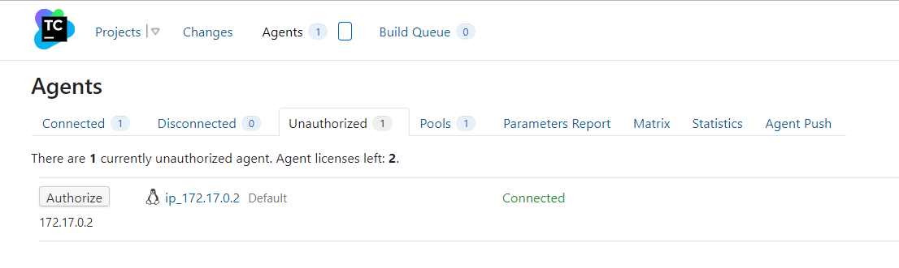

Clicking the Authorize button finilized the connection and the agent was now available to perform builds!  Pure nerddom :)

## The Docker project
Using my local instance of Azure DevOps as my source control repository for the OctoPetShop project, I created a new project within TeamCity and connected my Azure DevOps repo to it.  This post assumes you already know how to create a project within TeamCity and focuses on the build/deploy process.

### Adding connection to Docker Hub
In order to push our images to Docker Hub, we'll need a bit more configuration on our build server to make sure it will work, namely providing a connection to Docker Hub with an authorized user.

For this we'll need to navigate to the Connections tab of our OctoPetShop project.

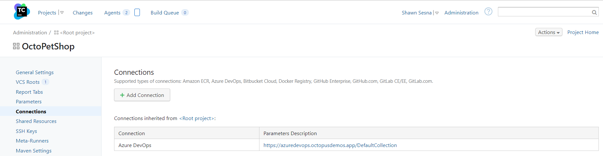

Click on Add Connection

Choose Docker Registry from the dropdown and fill in the username and password.  Don't forget to Test Connection to make sure your credentials are valid :)

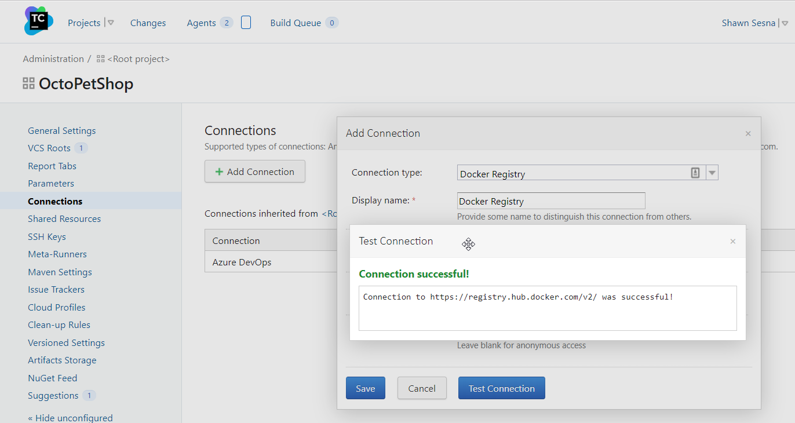

With that bit of houskeeping out of the way, we can proceed with our build definition.

### Build Definition
Once the project had been created, we can proced with creating a new build definition that will perform our Docker build operation.  This build definition will need to perform the following steps:
- Build OctoPetShop web front-end
- Build OctoPetShop Product Service
- Build OctoPetShop Shopping Cart Service
- Build OctoPetShop Database DbUp
- Push the images to Docker Hub for use in deployment

#### Adding Docker Support Build Feature
We need to connect our Docker Hub Connection to our build definition.  To do this we'll click on the Build Features tab and Add build feature.

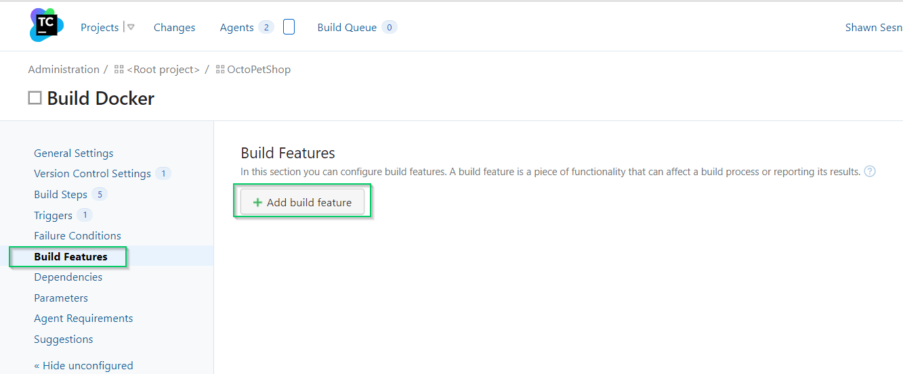

Choose Docker Support from the drop-down menu

Check the Log in to the Docker registry before the build and choose the connection that we we created for our project then click Save.

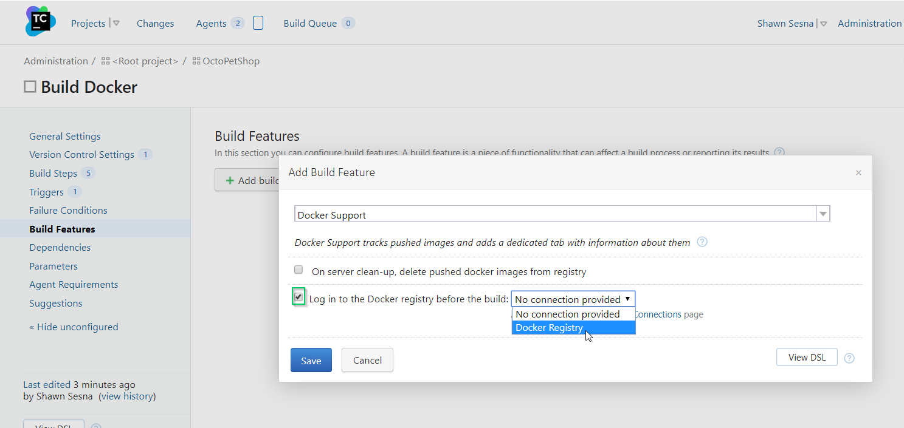

#### Add build steps
Steps 1-4 are going to be identical with the only difference being the docker file that we're going to build.  Click on the Build Steps tab, then click the add Build Step button

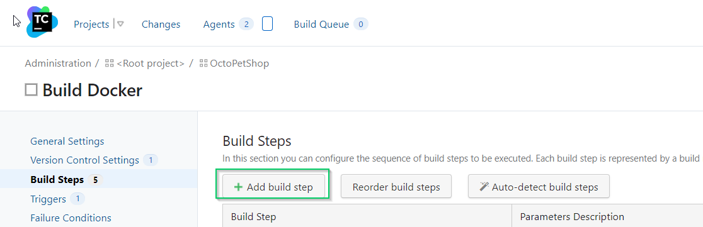

For the step, fill in the following:
- Runner type: Docker
- Docker command: build
- Path to dockerfile in the repo
- Image name:tag: 

For docker images, it's considered best practice to tag your image with the `DockerId/ImageName:version`.  It's not uncommon to ommit the `version` part of the tag, whenever a new version of an image is uploaded to Docker Hub, it will automatically attach `latest` as the version if a version number is not specified.  Octopus Deploy uses SemVer when selecting package versions, which `latest` doesn't follow.  In this example I've hardcoded `1.0.0.0` as the version number, but we could have just as easily used a TeamCity Parameter to dynamically assign the version number.

We'll add three more steps just like this one for Product Service, Shopping Cart Service, and Database.

The last step we'll add is the step that will push our built images to the Docker Hub.  For this step, we'll fill in the following:
- Runner type: Docker
- Docker command: push
- Image name:tag:

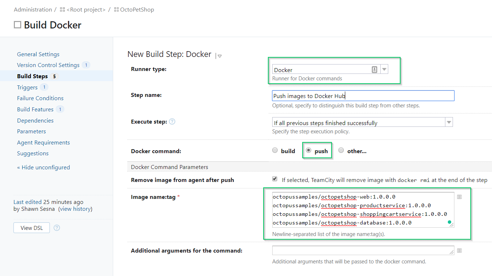

For the push step, we're able to specify all of the images that were built in steps 1-4 and push them in a single step.  Barring any type-o's, we should be able to execute a build successfully

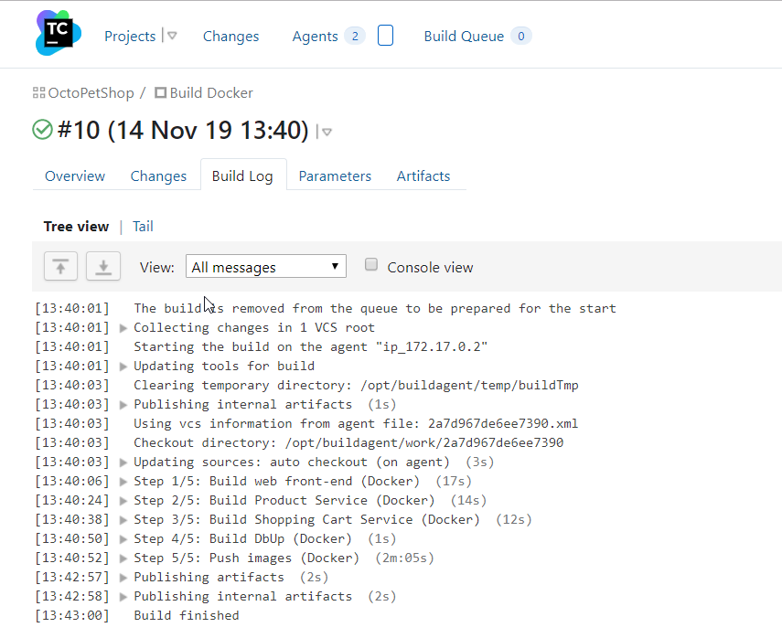

Congratulations!  We just finished the CI portion of this article!  The only thing left to do would be to add a trigger so that when someone commits to source control, a build will automatically execute :)

## Octopus Deploy
For the CD portion of this article, we'll be using Octopus Deploy.  Within Octopus, we'll do the following:
- Add Docker Hub as an external feed
- Create new project
- Define our deployment steps

### Adding Docker Hub as an external feed
We need to add Docker Hub as an external feed so that Octopus Deploy can pull our images from Docker Hub and deploy them to our server running Docker.

Once you're logged into Octopus, click on the Library tab

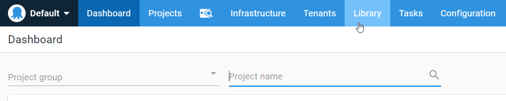

Once in the Library section, click on External Feeds, then click the ADD FEED button

On the Create Feed form, fill in the following
- Feed Type: Docker Container Registry
- Name: Docker Hub (or whatever you want to call it)
- Username
- Password

Test the feed to make sure you Octopus can log into Docker Hub

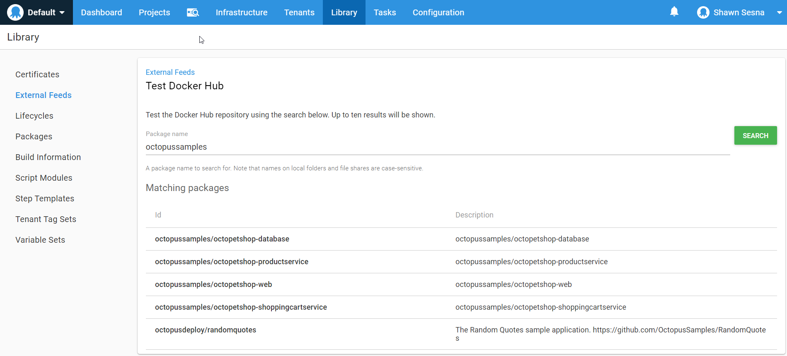

With our external feed configured, we can now define our steps!

### Octopus Deploy project
To create a new project, click on the Projects tab, then the ADD PROJECT button

Give the project a name and click SAVE

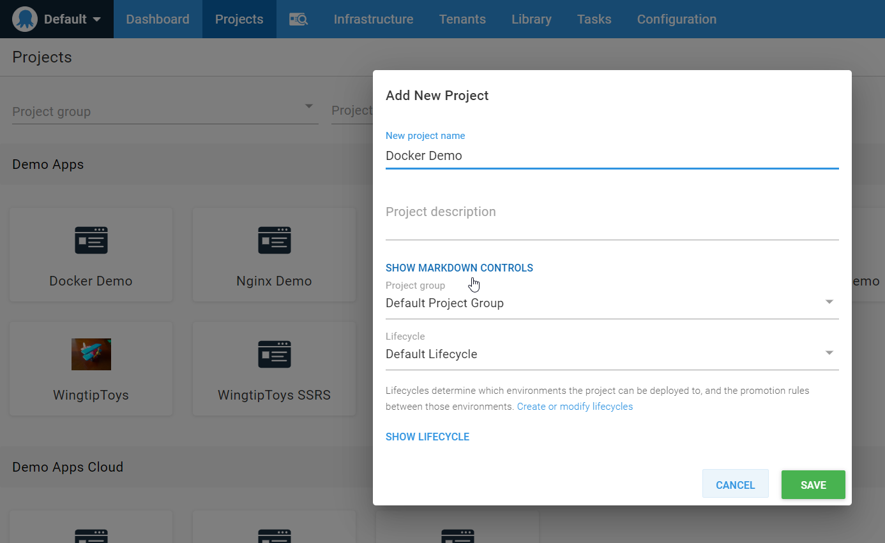

Similar to our build, the steps in Octopus are going to be largely the same with minor differences.  I'll walk you through the first step we'll add to our process, then point out the differences in the remaining.

On the Process tab of our project, click ADD STEP

Choose the Docker category and the Run a Docker Container step

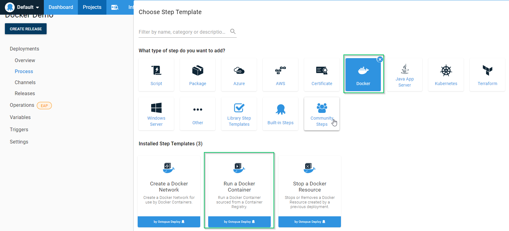

For this demo, we're going to be using the Microsoft SQL Server 2017 Docker image as our database server, so this will be the first container that we'll configure in our deployment

The form for a Docker container step is rather long, so the screen shots are going to be broken up into bits.  For the first part, give the step a name and what Role it will be depoloying to.  For this demonstration, I'm using a simple role of Docker.  In a Production scenario, these roles would be more meaningful such as OctoPetShop-Web-Container.

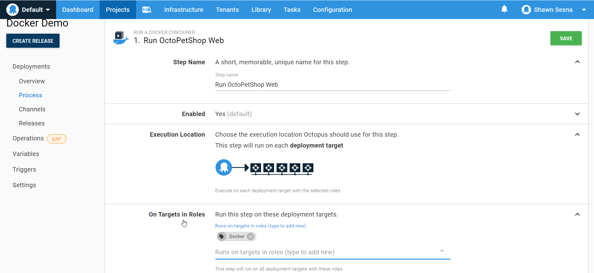

Choose our Docker Hub external feed and choose the microsoft/mssql-server-linux image (tip: type mssql in the search box to find the image).

Choose the Network Type of Bridge

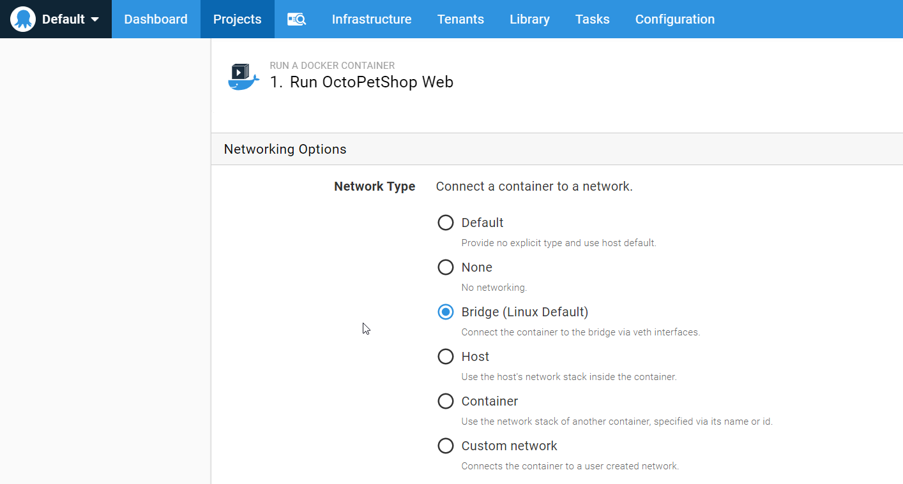

To make our database server accessible, we need to add a port mapping.  Specify the default SQL Serve port of 1433

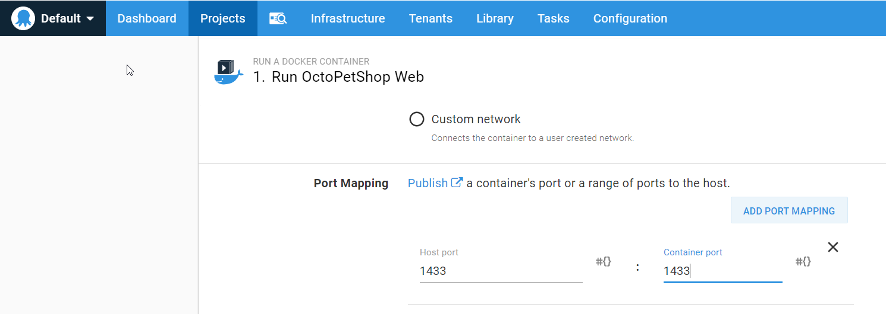

We can scroll down to Additional Arguments.  This image needs a couple of Environment Variables passed to it, SA_PASSWORD and ACCEPT_EULA.

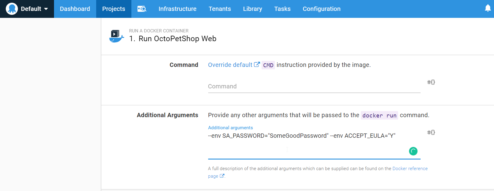

And that's it for this container!  Click SAVE to commit the step to the process.

I'll point out the specifics for the remaining containers

#### OctoPetShop Web
- Docker Image: octopussamples/octopetshop-web
- Network type: Host
- Additional Arguments: --env ProductServiceBaseUrl=http://localhost:5011/ --env ShoppingCartServiceBaseUrl=http://localhost:5012

#### OctoPetShop Product Service
- Docker Image: octopussamples/octopetshop-productservice
- Network Type: Bridge
- Port Mapping: 5011:5011
- Additional Arguments: --env OPSConnectionString="Data Source=#{Octopus.Machine.Hostname};Initial Catalog=OctoPetShop; User ID=sa; Password=SomeGoodPassword"

#### OctoPetShop Shopping Cart Service
- Docker Image: octopussamples/octopetshop-shoppingcartservice
- Network Type: Bridge
- Port Mapping: 5012:5012
- Additional Arguments: --env OPSConnectionString="Data Source=#{Octopus.Machine.Hostname};Initial Catalog=OctoPetShop; User ID=sa; Password=SomeGoodPassword"

#### OctoPetShop Database
- Docker Image: octopussamples/octopetshop-database
- Network Type: Host
- Additional Arguments: --env DbUpConnectionString="Data Source=localhost;Initial Catalog=OctoPetShop; User ID=sa; Password=SomeGoodPassword"

With all of our steps defined, we can create a release and deploy!

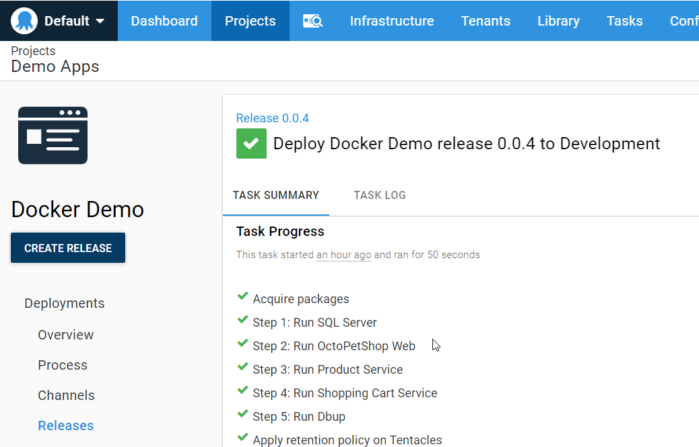

Now if we navigate to the server we just deployed to, we should see our OctoPetShop application running!  As with the previous demos, OctoPetShop redirects to https with a self-signed certificate so you'll most likely get a warning about it being unsafe.  In this case, it's OK to ignore and continue.

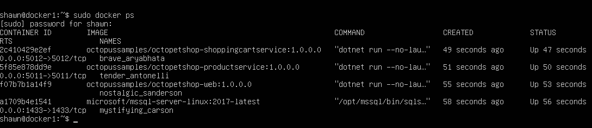

## Completing the CI/CD pipeline
So far we've done the CI and the CD portions, but we've not yet connected them together.  To fit these pieces together, we'll need to go back to our TeamCity server.

### Install the Octopus Deploy Plugin
We'll first need to go to https://plugins.jetbrains.com/plugin/9038-octopus-deploy-integration and download the Octopus Deploy plugin.

Once that has been downloaded, go to Administration -> Plugins List in our TeamCity server.  From here, we'll click on the `Upload plugin zip` button to add the plugin 

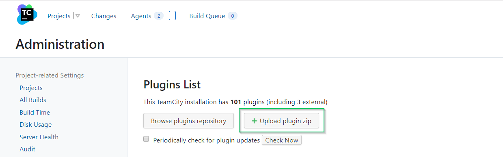

This will add some steps that we can use within our build definition to interact with Octopus Deploy.

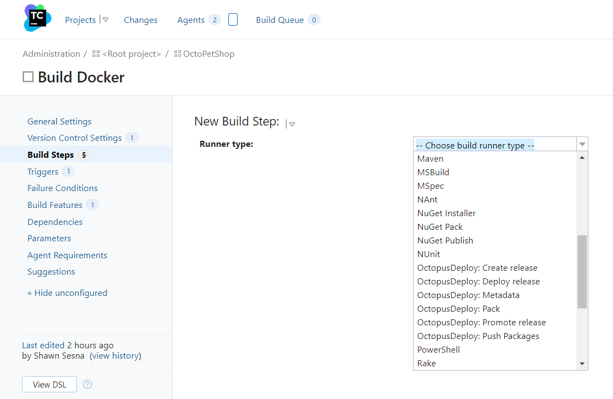

### Add Create Release step
Let's add a new step to our build definition, OctopusDeploy: Create release

Now, when we run a build, it will automatically create a release in Octopus Deploy!

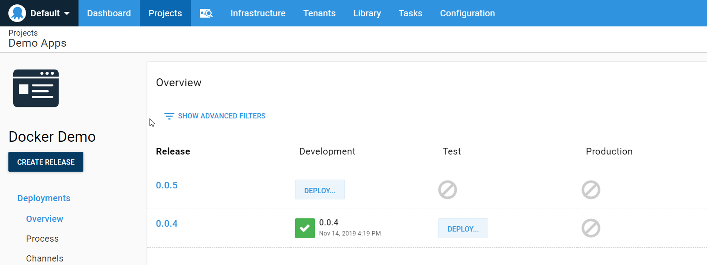

If we wanted to, we could add the automatic deployment of that release to Development directly from the build definition!

## Conclusion
This post walked you through how to create a CI/CD pipeline for Docker container images using TeamCity and Octopus Deploy.  Stay tuned for the next installment of Beyond Hello World where I'll expand on this concept by automating a deployment of OctoPetShop to Kubernetes!
