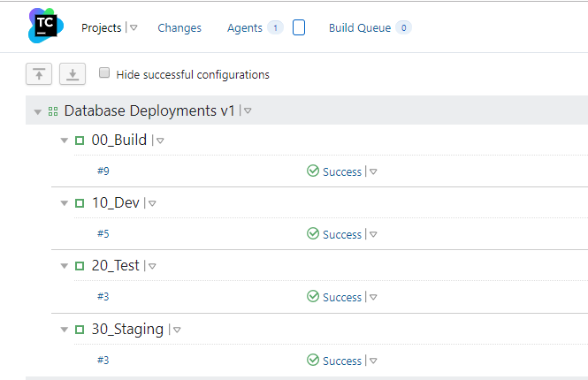

 
It took several iterations to implement the ideal automated database deployment process using TeamCity, Redgate, and Octopus Deploy.  The iterations were a result of learning the tooling and listening to feedback.  In this article, I walk you through iterations of the automated database deployment process.

This article is the final in a series.  Here are the links to the other articles, in case you missed them.  

- [How to design an automated database deployment process](/blog/2019-11/designing-db-deployment-process/index.md).
- [Designing automated database deployments process case study](/blog/2019-11/use-case-for-designing-db-deployment-process/index.md).

All of our database deployment posts can be found [here.](https://octopus.com/database-deployments)

!toc

## General overview

All this work was done at a company I previously worked for.  That company had four environments.

- Development
- Test
- Staging
- Production

Developers, Database Developers, and Lead Developers all had sysadmin rights on `Development` and `Test`.  They had read-only rights on `Staging` and `Production`.  Only the DBAs had sysadmin rights to all environments.

Prior to automated database deployments, delta scripts for `Staging` and `Production` were generated by Database Developers or Lead Developers.  The delta scripts would be saved on a file share for the DBAs.  The DBAs ran the scripts in the appropriate environment.

There were several flaws in this process.
- Two different processes, one for `Development` and `Test` and another for `Staging` and `Production`.
- Manual generation of scripts.
- Manually running each script in each environment.
- Unique delta scripts per environment.
- Unique delta scripts meant it was difficult or nearly impossible to test.
- No mention of keeping track of changes and what needed to be deployed.
- Shared development environment.
- Reviews didn't happen until it was time to go to `Staging`.
- As a result, "All hands on deck" during `Production` deployments.

The tooling we used when this started was:
- TFS for source control (some teams were piloting Git).
- TFS for build server (some teams were piloting TeamCity).
- No deployment server.
- No database deployment tools (this is where Redgate's tooling came in).

## Automated database deployments v1

The first attempt at automating database deployments was designed to fit within the existing process.  I detailed the reasons why in my [previous article](/blog/2019-11/use-case-for-designing-db-deployment-process/index.md).  Thankfully, I was on one of the teams piloting Git and TeamCity.  However, the DBAs made it very clear, TeamCity would not have permission to deploy to `Staging` and `Production`.

Looking at the documentation for [Redgate's Team City Plug-in](https://documentation.red-gate.com/display/SCA3/Use+the+TeamCity+plugin+with+a+SQL+Change+Automation+Project) shows it supports three functions:

- Build a Package.
- Sync that package with a database.
- Test that package.

For the build a package process to work, the database has to be placed into source control using [Redgate's SQL Source Control](https://documentation.red-gate.com/soc).  Also, Redgate has a [CLI version](https://documentation.red-gate.com/sc14/using-the-command-line) of their schema compare tool.

One thing I should have done was resolve all the deltas between each environment.  Different users and role membership are expected.  Missing tables, different stored procedures, and other schema changes, not so much. After they are resolved, pick an environment to put into source control as your baseline.

The deltas need to be resolved one of three ways:
- The change was missed, go ahead and apply it.
- The change is intentional and should never be included in source control (backup table or testing table).  You can [leverage filters](https://www.codeaperture.io/2016/10/14/using-sql-source-control-to-filter-out-unwanted-items/) to exclude those items.
- The difference is environmental, such as users and role membership.  In that case, you want to look at [the documentation](https://documentation.red-gate.com/sc13/using-the-command-line/options-used-in-the-command-line#Optionsusedinthecommandline-IgnorePermissions) to see which switches you need to include.  

Knowing that, my plan of attack was:

0. Resolve all the deltas.
1. Put what is in `Development` into source control.  Going forward, all changes must be made in `Development` and checked into source control.
2. Have TeamCity build the package from source control.
3. Have TeamCity sync that package with `Development`.
4. Have TeamCity sync that package with `Test`.
5. Have TeamCity run the schema compare CLI to generate delta scripts for `Staging` and `Production`.

Steps 1 and 3 conflict with each other.  So let's skip that step. 

0. Resolve all the deltas.
1. Put what is in `Development` into source control.  Going forward, all changes must be made in `Development` and checked into source control.
2. Have TeamCity build the package from source control.
3. ~~Have TeamCity sync that package with `Development`.~~
4. Have TeamCity sync that package with `Test`.
5. Have TeamCity run the schema compare CLI to generate delta scripts for `Staging` and `Production`.

I'm not going to walk through how to put a database into source control.  I wrote [that article already](https://www.red-gate.com/hub/product-learning/sql-source-control/database-version-control-2).

I ended up with four TeamCity projects.

The `00_Build` project takes what is in source control and packages it.  

I am making use of TeamCity's [snapshot dependencies](https://www.jetbrains.com/help/teamcity/snapshot-dependencies.html) and artifact dependencies.  To leverage that, I need to mark the package created as an artifact.

`10_Dev` and `20_Test` follow the same process.  First, I needed to configure the dependencies on the build.  The dependencies include the snapshot dependencies and artifact dependencies.

Now that I have the package and the dependency configured, I can add the step to sync the `Test` database with the package.  Please note, to deploy the latest package, I am overriding the build number using the value from the `00_Build` project.  

The `30_Staging` build is very different.  First, I configure the dependencies just like before.

Instead of running the sync step, it runs a PowerShell script to generate the delta scripts for Staging and Production.

## Flaws with automated database deployments v1

Let's revisit the flaws with the existing process and see how we are doing after this effort.

There were several flaws in this process.
- Two different processes, one for `Development` and `Test` and another for `Staging` and `Production`. This is still happening.
- Manual generation of scripts. **Solved.**
- Manual running of each script in each environment. This is solved for `Test` only.
- Unique delta scripts per environment. This is still happening
- Unique delta scripts meant it was difficult or near impossible to test. This is still happening
- No mention of keeping track of changes and what needed to be deployed. **Solved.**
- Shared development environment. This is still happening
- Reviews didn't happen until it was time to go to `Staging`. This is still happening
- As a result, "All hands on deck" during `Production` deployments. This is less of a problem, but still happening

Also, I introduced a couple of new problems.

- Hours or days between when a script is generated by `30_Staging` and when it was run in `Staging` or `Production`.
- Hard to know what version is going to be used to generate the delta scripts when `30_Staging` ran.
- The latest changes only, you can't pick an older version.

## New process

In my previous article, I discussed how Redgate helped a working group at the company I was working for.  Let's review the process we came up with.

1. Developer/Database Developer/Lead Developer creates a branch.
2. All database changes and code changes are made on that branch.
3. Changes are completed and checked into the branch.
4. A merge request is created, which kicks off a build. The build verifies the changes are valid SQL.
5. Database Developer or Lead Developer reviews database changes in the merge request.  They provide feedback for fixes.
6. The branch is approved and merged.
7. The Build Server kicks off build.  Verifies the changes are valid SQL, and if they are, packages them up and pushes to Deployment Server.  Build Server tells Deployment Server to deploy to `Development`.
8. The Deployment Server deploys to `Development`.
9. Developer/Database Developer/Lead Developer tells Deployment Server to deploy to `Test`.
10. The Deployment Server deploys to `Test`.
11. Changes are verified in `Test`.
12. Developer/Database Developer/Lead Developer tells Deployment Server to deploy to `Staging`.  Deployment server uses database tooling to generate review script.
13. The Deployment Server notifies DBA of deployment request to `Staging`.  They review the changes and provide feedback for fixes.
14. DBAs approve changes to `Staging`.
15. The Deployment Server finishes deployment to `Staging`.
16. Changes are verified in `Staging`.  
17. A change request is submitted to the DBAs to promote a specific package in the deployment server to `Production`.
18. After hours, DBAs tell Deployment Server to deploy to `Production`.  Deployment server uses database tooling to generate review script.
19. DBAs review the script as a final sanity check.
20. The Deployment Server finishes deployment to `Production`.

## Automated database deployments v2

Octopus Deploy was added to v2 of automated database deployments.  TeamCity was simplified to two projects.

`00_Build` would build the package just like before.  `10_Dev` pushes that package and triggers a deployment in Octopus Deploy to `Development`.  [Our documentation](https://octopus.com/docs/packaging-applications/build-servers/teamcity#TeamCity-CreateAndPushPackageToOctopusCreatingandpushingpackagesfromTeamCitytoOctopus) does an excellent job of showing you how to do that.

After a bit of trial and error, the deployment process in Octopus Deploy became this:

The trial and error was around steps 1 and 4.  At first, I ran the same CLI script from TeamCity to generate the delta script to review.  That wasn't the same as what was being deployed.  Eventually, I learned about the `Create Database Release` and `Deploy from Database Release` step templates provided by Redgate.  

Using the Redgate provided step templates automatically generated and uploaded the delta scripts as [Octopus Artifacts](https://octopus.com/docs/deployment-process/artifacts).  DBAs could then download those files and review them when they were approving the deployment to `Staging` or `Production`.

The DBAs were more than happy to let Octopus Deploy deploy to `Staging` and `Production`.  They could review the scripts during the deployment.  And who reviewed the scripts was audited.  Besides, they were happy to see all it took was pushing a button.  As one DBA put it, "this is all stupid simple."

What sealed the deal was the ability to control who could push the deployment button.  All developers (including database developers and lead developers) could deploy to `Development`, `Test`, and `Staging`.

While the DBAs could deploy to `Production`, but they didn't have the right to change the deployment process.  Only Developers could do that.

While developers could deploy to `Staging`, the DBAs were the ones who approved the changes.

These security policies and manual interventions built a lot of trust in the process.

## Flaws with automated database deployments v2

Let's check back in with our issue list.

- Two different processes, one for `Development` and `Test` and another for `Staging` and `Production`. **Solved.**
- Manual generation of scripts. **Solved.**
- Manual running of each script in each environment. **Solved.**
- Unique delta scripts per environment. **Mitigated**, this is how the tool works.
- Unique delta scripts meant it was difficult or nearly impossible to test. **Mitigated** but much less of a chance causing errors since the same process is used.
- No mention of keeping track of changes and what needed to be deployed. **Solved.**
- Shared development environment. **Solved.**
- Reviews didn't happen until it was time to go to `Staging`. **Solved.**, Database Developers reviewed feature branch changes, and DBAs reviewed in `Staging`. As a result, "All hands on deck" during `Production` deployments. **Solved.**
- Hours or days between when a script is generated by `30_Staging` and when it was run in `Staging` or `Production`. **Solved.**
- Hard to know what version is going to be used to generate the delta scripts when `30_Staging` ran. **Solved.**
- The latest changes only, you can't pick an older version. **Solved.**

Fantastic, all the original problems, plus the problems with v1, were solved or mitigated.  But something interesting happened.  The process worked, and as the weeks went by, we started doing more and more deployments to `Production` and `Staging`.  

- As the process was written, the DBAs had to be on each `Production` deployment.  
- Developers had to wait until the DBAs finished reviewing their scripts in `Staging` prior to deployment.  The DBAs couldn't keep up.
- There was no test data in the developer's local databases; this resulted in them pushing unfinished changes to `Test`.  They'd then point their code to `Test` so they had data to test with.

## Automated database deployments v2.1 

The working group met, and we agreed to make the following changes to the process:

- DBAs will only approve changes in `Staging`.
- Approval in `Staging` will occur after the deployment occurs.
- DBAs only want to be notified if deployment to `Production` fails.
- DBAs want to see the delta script for `Production` during the staging deployment.  It won't be 100% the same, but it will be close enough for them to review. 
- Generate a backup of `Test` after each deployment.  Developers could then restore the backup on their instance to get the testing data.

The resulting process looked like this:

After those changes were in place, DBAs could leverage the `Deploy Later` functionality in Octopus Deploy.

## Conclusion

After going through this process, deployments to `Production` became a non-event.  The DBAs only had to jump online during `Production` deployments when something failed, which became rarer and rarer, but it took several iterations to get there.

What surprised me the most was how much everything changed from start to finish.  I'll be honest; if I came across a customer with the final database deployment process, I'd have a lot of questions.  But it makes sense in the context of the company that implemented it.  It meets their requirements.  Don't be surprised by the number of iterations you make and where you will eventually end up.  Every company is different.

Happy Deployments!

If you enjoyed this article and would like to see more posts on automated database deployments please [click here.](https://octopus.com/database-deployments)