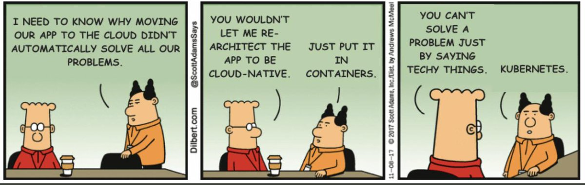

By now, you've most undoubtedly have heard the term Kubernetes, but just what is it other than the latest buzzword?  My last post covered how to create Docker images using [OctoPetShop](https://github.com/OctopusSamples/OctoPetShop) as an example.  In this post, I demonstrate how to run OctoPetShop on Kubernetes!

## What is Kubernetes?
Kubernetes is a container orchistration technology.  Machines that are running Kubernetes are referred to as `nodes`.  Nodes are what make up a Kubernetes `cluster`, though it is possible to have a cluster with a single node.  Nodes run containers in what is called a `pod`.


## Running OctoPetShop on Kubernetes
In order to run our OctoPetShop container images on Kubernetes, we need to create the YAML files to define the different resources required for our application.  Resource types are called `kind`, the kind for containers are called a `deployment`.  Below is an example deployment YAML file

```
apiVersion: apps/v1
kind: Deployment
metadata:
  name: octopetshop-web-deployment
spec:
  replicas: 1
  selector:
    matchLabels:
      component: web
  template:
    metadata:
      labels:
        component: web
    spec:
      containers:
        - name: web
          image: octopussamples/octopetshop-web
          ports:
            - containerPort: 5000
              name: http-port
            - containerPort: 5001
              name: https-port
          env:
            - name: ProductServiceBaseUrl
              value: http://octopetshop-productservice-cluster-ip-service:5011/
            - name: ShoppingCartServiceBaseUrl
              value: http://octopetshop-shoppingcart-cluster-ip-service:5012
```

### Anatomy of the YAML
#### apiVersion
Kubernetes provides an [API reference](https://kubernetes.io/docs/reference/#api-reference) to help determine which version to choose.  For kind deployment, apps/v1 is what you use.
#### kind
This tells Kubernetes what type of resource we are deploying
#### metadata - name
This is the unique name of our deployment
#### spec - replicas
The number of container instances to run
#### spec - selector - matchlabels
Selector - The selector field defines how Kubernetes objects find which pods to manage
Labels - Labels are key/value pairs that are attached to objects used to specify identifying attributes
#### template
The pods template specification
#### template - spec - containers
This section is an array of containers that this deployment will run.
Each container gets:

- Name: the name we give the container
- Image: the Docker Hub image to use for the container
- Ports: an array of the ports that the container will expose to the pod network
- Env: an array of environment variables for the container

Running that YAML on Kubernetes would create a pod running the octopetshop-web image in a container.  (See [OctoPetShop](https://github.com/OctopusSamples/OctoPetShop/tree/master/k8s) for the rest of the Deployment YAML files.)

At this point, we have our containers running in pods, but our pods are independent without any way to talk to each other


Each pod on a node has an internal IP address assigned by the node.  Within our containers we've specified port to expose to the pod, but those are still only within the pod and not exposed to the node.  To allow connectivity between pods on a node, we need to create a `service` for each pod.

### Services
There are a number of different services availabe via the API, we're going to focus on the specific services to allow our OctoPetShop applicaiton to function.  Our web front-end pod needs to the ability to talk to the Product service pod.  To make this possible, we need to create a `ClusterIP` service for the Product service pod.

```
apiVersion: v1
kind: Service
metadata:
  name: octopetshop-productservice-cluster-ip-service
spec:
  type: ClusterIP
  selector:
    component: productservice
  ports:
    - port: 5011
      targetPort: 5011
      name: http-port
    - port: 5014
      targetPort: 5014
      name: https-port
```

In the above YAML, we've created a service that maps a pod port to a container port to allow pod-to-container communication within the node.  It is important to note that this service does not expose the port at the node level, so external access is not possible.  

To allow external access to the node, we'll need to define either an `Ingress` or a `LoadBalancer` service.  In our case, we've chosen a LoadBalancer service to allow access to the web front-end.

```
apiVersion: v1
kind: Service
metadata:
  name: web-loadbalancer
spec:
  selector:
    component: web
  ports:
    - port: 80
      targetPort: 5000
      name: http-port
    - port: 5001
      targetPort: 5001
      name: https-port
  type: LoadBalancer
  externalIP: <IPAddress>
```
NOTE: when using a hosting provider such as Azure, the externalIP line can be ommitted as the hosting provider will automatically provision a public IP resource and connect it.

## Remaining pieces
There are a couple of remaning pieces to make our application fully functional; a database server and a database with some data.

### Database server
Microsoft has made a SQL Server 2017 image available via Docker hub.  Using that image, we can create a Deployment and a ClusterIP service for our database server.

### Database and data
Included in our solution for OctoPetShop is a Dbup project which contains the scripts that will both create and seed our database.  Dbup is a console application that executes and then stops, so we don't want to use a Deployment kind as Kubernetes will attempt to keep it running.  For this, we want to use a kind of `Job` which is specifically meant to terminate once they've completed.

```
apiVersion: batch/v1
kind: Job
metadata:
  name: octopetshop-dbup
spec:
  template:
    spec:
      containers:
        - name: dbup
          image: octopussamples/octopetshop-database
          env:
            - name: DbUpConnectionString
              value: Data Source=octopetshop-sqlserver-cluster-ip-service;Initial Catalog=OctoPetShop; User ID=sa; Password=SomePassword
      restartPolicy: Never
```

## OctoPetShop running in Kubernetes
Once all of the YAML has been run, the OctoPetShop application should be running!

:::warning
OctoPetShop is written to redirect to https, you will most likley receive a warning about the site not being secure.  This is normal and it is safe to proceed since we did not configure a certificate as part of our process
:::


## Conclusion
Before embarking on the journey to containerize OctoPetShop with the eventual goal of getting it running on Kubernetes, I viewed Kubernetes as pure voodoo.  Now that I've gone through the motion of containerizing an appliciation and getting it to run, I'm no longer afraid of Kubernetes.

The [OctoPetShop](https://github.com/OctopusSamples/OctoPetShop) GitHub repo contains all of the docker, docker-compose, and Kubernetes YAML files for the OctoPetshop application.