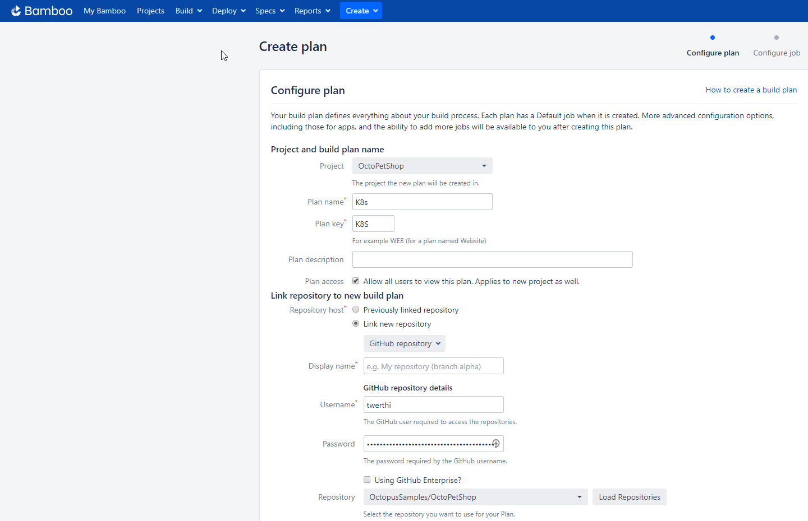
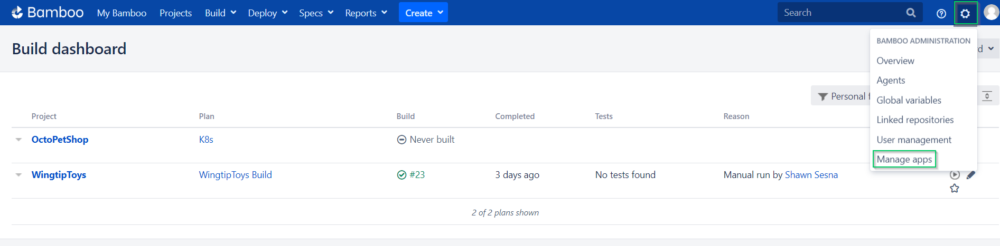
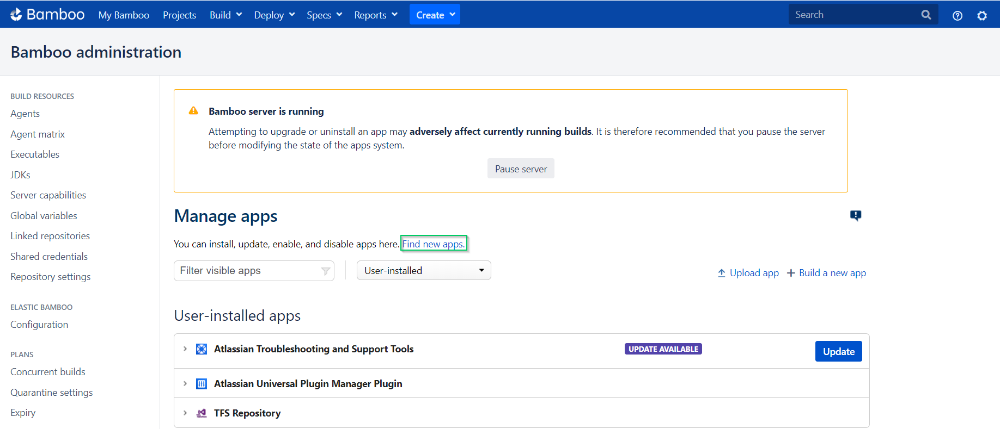
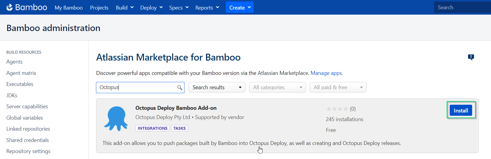

Welcome to another exciting edition of Beyond Hello World!  In this post, I will walk you through using Kubernetes in a Continuous Integration (CI)/Continuous Delivery (CD) pipeline!

## CI with Kubernetes
Kubernetes is a container orchestration technology, so there isn't anything that we need to build.  For this article, we'll be re-using the Docker images that we built in my previous post, [Beyond Hello World: Docker containers in a CI/CD pipeline](URL).  Don't worry if you haven't read that article, the images built in that post are available on Docker Hub so there's no need to go back and build them.

As explained in my post, [Beyond Hello World: Kubernetes for the uninitiated](URL), Kubernetes uses YAML to set up the different pods in a Kubernetes cluster.  While these aren't compiled, they should be stored within source control.  With your YAML files within source control, we can create builds for them that simply package them as a NuGet package, then push them to Octopus Deploy.  In an effort to learn more build technologies, I've chosen to create builds within Bamboo.

## Setting up Bamboo
For this article, I decided to step outside my comfort zone and connect my Bamboo instance to GitHub instead of my local Azure DevOps server.  Of course I ran into issues immediately since my organization requires two-factor authentication :)  Thankfully, Atlassian (makers of Bamboo) already had [documentation](https://confluence.atlassian.com/bamkb/two-factor-authentication-2fa-with-github-in-bamboo-871999141.html) on how to over come this.

After creating a Personal Access Token for my GitHub account, I was able to connect my Bamboo project to the remote repo

Next up was to install the Octopus Deploy plugin.  To do this, we navigate to Manage Apps under the Administration menu

From here, let's find the Octopus Deploy plugin, first click on Find New Apps

Search for Octopus and click Install

### Create our build
