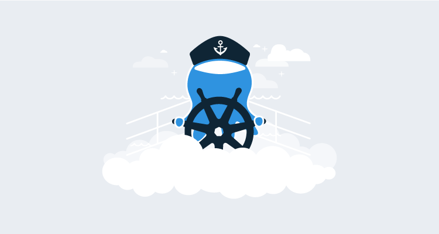

We’re publishing a series about our engineering journey with Octopus Cloud. It’s the story of our v1 launch of Octopus Cloud on AWS, our $100K/month AWS bills, MVP’s and testing customer demand, spending 6 months of engineering effort and then running the service at a loss, spending another 9 months rebuilding it from the ground-up, and of all the considerations we made when rebuilding Octopus Cloud v2, including switching from AWS to Azure, going all-in on Kubernetes, and more.

In this post, we look at the compute options available to reduce our costs, increase performance and how we eventually decided to move to Kubernetes, Linux, and .NET Core.

Posts in this series:
* [Reflections on the launch of Octopus Cloud 1.0](blog/2019-10/octopus-cloud-1.0-reflections/index.md)
* **Octopus Cloud v2 Compute Options: Why we bet on Kubernetes, Linux, and .NET Core**

---

Octopus Cloud launched in July 2018 as an MVP to test customer demand, and we gained some great insights post-launch. We found ourselves with the following:

- A cloud-based SaaS product for which there was strong demand.
- A pricing model where the revenue per customer didn’t come close to covering the AWS hosting costs.
- A non-optimized architecture that allocated a dedicated VM for each customer.

Octopus had always been designed to be hosted on the user’s own hardware, not as a multi-tenant co-hosted solution. So when architecting Octopus Cloud v1 there were many different paths available.  In accordance with the finest of engineering traditions, we started with the _Simplest Thing That Could Possibly Work_ approach, which in this case, was hosting each customer on a dedicated virtual machine.  This was a resounding success, and it removed many unknowns, leaving us with two clear problems to focus on...

- **Reduce costs:** Especially for low-use or dormant instances
- **Increase performance:** Improve provisioning times, and provide more options for highly utilized instances

What were the running costs per Octopus Cloud v1 customer?

The major components of the hosting costs for each v1 customer are (in approximate US dollars):

- Database: **$9**
- File Storage: **$23**
- Compute (VM): **$50**

This gives a total hosting cost of roughly **$82** US dollars per customer. What really hurt was the compute costs couldn’t be scaled down, so even a dormant trial cost the same as an actively used instance.

Our goal was to bring this below **$10** per customer for low-usage instances.

It’s worth mentioning at this point, Octopus was implemented as a full-framework .NET application, which requires Windows, the HTTP server runs as a self-hosted [NancyFX](http://nancyfx.org/) app, and part of our goal from the beginning was: _Do Not Fork Octopus_. We very much wanted to maintain a single code-base for our self-hosted and cloud products. Further, while we wanted to reduce costs, we also wanted to improve performance and availability. Our customers expect a fast and responsive experience, and we didn’t want to negatively impact that.

## The options

We will talk more about the database and file-storage components in future posts.  Today we’re going to focus on the compute costs.

Every option was on the table, but in hindsight, they can be grouped into a few general approaches:

1. [Single multi-tenant server](#single-multi-tenant-server).
2. [Windows process per customer](#windows-process-per-customer).
3. [Azure App Services](#azure-app-services).
4. [Kubernetes](#Kubernetes).

As we review the options, please keep in mind, these were our opinions formed based on our circumstances and constraints at the time. These findings are probably incorrect (or at best only correct for our specific set of inputs), and our decisions may have been different if we’d approached this at a different moment in time. Consider yourself disclaimered.

### Option 1: Single multi-tenant server {#single-multi-tenant-server}

We posed the hypothetical question:

_If we built Octopus from scratch today, as a cloud-hosted SaaS product, what would it look like?_

We would almost certainly build it as a multi-tenant solution; in other words, a single web application that could serve all customers.

This approach would have the major advantage of making hosting for the server very straight-forward as it would be just a regular web application.

Unfortunately, Octopus is much more than a web server: It’s also a task runner.

We could easily imagine modifying the Octopus HTTP server to be multi-tenanted. We could still have a database-per-customer and determine the connection string to use for each request. The task orchestration component would be trickier, but not impossible; however, this would require significant renovations.  

Polling Tentacles would be a complication. We won’t delve into the details in this post, but it’s enough to know that in addition to renovations, we’d have to demolish a few walls (and add a bathroom) to support polling Tentacles with this architecture.

And these renovations would have to occur while we continued to ship regular updates to the product. This would leave us with the diabolical choice between:

- Keeping the hosted architecture refactor on a separate, long-lived branch and then face the challenge of merging a long-lived branch with major architectural changes.
- Merging regularly and risk destabilizing our self-hosted customers.

If there was no alternative, we might have taken this route, and one day we still might. But we felt we could have our cake and eat it.  We believed we could drastically reduce our hosting costs with minimal risk to the core Octopus Deploy product.

### Option 2: Windows process per customer {#windows-process-per-customer}

With this approach, we would run each customer as a dedicated process on a Windows VM.  The process would host the Octopus Server API and task-runner components, and each customer would still have their own database.

The big advantage here is that very few changes would need to be made to the Octopus product. It would also offer us a lot of flexibility with hosting options (AWS, Azure, self-hosted, etc.).  

The big disadvantage of this approach is that we’d need to orchestrate these processes ourselves.  Some of the questions we’d need to answer with this solution are:

_When a new customer arrives, how do we decided which VM to execute their process on?_   

Would we just use a static number, for example, 10 instances per VM?  Would we consider CPU and memory usage?   

_How do we deal with the noisy neighbor problem?_

If a customer is using more resources than expected, and it’s impacting other users on the same machine, would we relocate them, and if so, where to?

_When customers leave do we infill those empty slots?_

Many people use cloud Octopus for trials, which are later abandoned. This would result in sparsely populated VMs if we didn’t reallocate, and over time, this would reduce the benefit of the project.

Of course, all these questions could be answered, but they would require writing and maintaining orchestration code that was not part of our core business. It’s unlikely this orchestration code would be cloud-agnostic, leaving us tied to a particular vendor.

### Option 3: Azure App Services {#azure-app-services}

What’s the optimal number of servers to wrangle?  Zero!  

We could host each customer as an Azure web app.

The _huge_ advantage of this approach was no VMs to manage.

The disadvantages of this approach… well, there are a few.
Similar to the _process-per-customer_ option, we would still have to orchestrate allocating users between Service Plans. Similar to the _multi-tenant_ option, we’d still have to re-architect the task orchestration and polling Tentacle pieces.

Oh, and of course, we were still on AWS, not Azure (spoiler alert for future posts: this was about to change).

There was also some concern we’d leave ourselves at the mercy of the Azure gods, and the dreaded vendor lock-in.  As unlikely as it might seem, what if Azure deprecated App Services? What if the pricing model changed significantly? If you run a handful of Azure Web Apps and the price rockets, that’s a bad day.  If you run many thousands of them…  

We discarded this option.

### Option 4: Kubernetes {#Kubernetes}

Being in the deployment tool business, we watch new technologies in this space with interest.  Over the past few years, we’d seen Kubernetes go from an interesting project few people outside of the devops world had ever heard of, to one of our most popular feature requests.  So in the background of making this decision on our own hosting platform, a small team within Octopus was busy implementing [support for Kubernetes in the product](https://octopus.com/blog/kubernetes-containers-update). Building integration into the product, of course, involved much exploring, evaluating, and generally playing with Kubernetes, and so a pleasant side-effect was that we had some experience internally with Kubernetes and advocates for considering it for our own needs.

But there was a significant roadblock: Octopus ran on Windows.  

Support for Windows nodes in k8s was available in beta form, which in reality meant it was undocumented and had possibly worked once on the machine of someone who had the Kubernetes source code open on another monitor.  An incredible feat of persistence resulted in the proof-of-concept team getting Octopus running on Windows in a Kubernetes cluster.  It suffices to say we did not feel we were walking a well-worn path, more like hacking our way through a jungle, never quite sure which direction we were traveling.  Also, the Windows nodes proved to be unstable, regularly dying unexpectedly.

We ruled out Kubernetes + Windows as a technology not mature enough to bet on.

We also ruled out containers on Windows in general.  As part of evaluating k8s, we also evaluated running Octopus containerized on Windows. Containers on Linux are elegant, and running a container on Linux results in only the containerized processes executing on the host. In contrast, running a container in Windows results in many systems services also being run.   

The running processes for a single container on Linux:

The running processes for a single container on Windows:

These services bring their own resource overheads and are just generally a bit yuk.   

The real deal-breaker was that while we performed these experiments, we inevitably ended up spelunking the internet, looking for resolutions to problems, other people’s experiences, etc. Too often, all we found was tumbleweeds.  We just didn’t get the sense that enough people were running production workloads on Windows containers to have developed that critical mass of experience.  

Linux was a different story; containers on Linux were a well-traveled road by this point, with good documentation and tooling. We had evidence that many of our customers were running production workloads on Kubernetes, but (and this was quite a but) this would require porting the Octopus Server to .NET Core and running it on Linux.  

## The decision

The final two contenders left standing were:

- Windows process per customer.
- Kubernetes (Linux and .NET Core).

Both required significant effort. A key difference was where that effort was directed.

For the _Windows Process Per Customer_ option, the effort would primarily be spent building the orchestration infrastructure to allocate and monitor Octopus server processes.

For the _Kubernetes (Linux and .NET Core)_ option, the effort would primarily be spent porting Octopus to .NET Core and ensuring it can run in a Linux-based container.

We didn’t spend a lot of time trying to compare the effort involved in the two approaches.  Firstly because, well, we suck at estimating effort just as much as everyone else.  More importantly, over time, the difference in implementation cost would be amortized away. What were we left with?

**Octopus would be built against .NET Core, run on Linux, be containerized, and orchestrated by Kubernetes.**

We decided the effort to port Octopus to .NET Core was effort we _wanted to spend_. In fact, we’d already begun the port, independent of this decision.

We could roll our own orchestration solution, but Kubernetes was built for the problem we were trying to solve. We’ve always preached using Octopus rather than trying to roll your own deployment automation, so you can spend the time saved on making your core software better.  This was a chance to heed our own advice.

It was also an exciting chance to drink our own champagne again. We could take advantage of the Kubernetes support we’d built into Octopus at a large scale.

## Conclusion

These decisions took place over a year ago at the time of writing, but for the past week or so, all new Octopus Cloud instances have been provisioned as a Linux container, running on AKS (Azure’s managed Kubernetes)!

At the time of writing:

- There have been 0 provisioning failures.
- The vast majority of instances were provisioned in less than thirty seconds.

It’s too early to evaluate the cost reduction, as we were cautious, and initially grossly over-provisioned the nodes.  Even considering that, per-customer costs have already been reduced by more than 50%.

The change has also ushered in some great performance improvements. It used to take 10+ minutes to provision a new Octopus instance but this has now been reduced to less than 30 seconds. We also made some other performance gains with Octopus Cloud instances that we’ll talk about in future posts, also in future posts in the series, we’ll take a detailed look at the .NET Core port, consider the options for which cloud provider (AWS, Azure, Google, etc.), and evaluate the overall success of the project.

We hope you enjoyed this peek behind the curtain.  Stay tuned.
