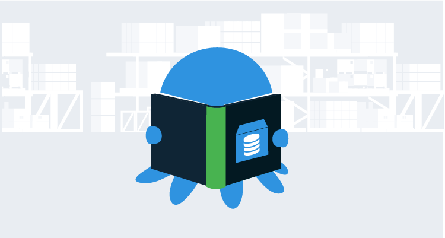

Prior to joining Octopus Deploy, I was the lead developer on the pilot team that automated database deployments and took deployments from 2 to 4 hours per deployment down to 10 minutes per deployment. When I started, I thought we’d automate the steps in our existing process, and I started implementing the tooling to do just that.  Little did I know, the entire process was going to change.

This article is a continuation of the previous article: [How to design an automated database deployment process](/blog/2019-11/designing-db-deployment-process/index.md), and if you like, you can jump ahead to the next article, where I provide a step-by-step guide for [implementing a database deployment process with Octopus Deploy](/blog/2019-11/implementing-db-deployment-process/index.md).

All of our database deployment articles can be found [here](https://octopus.com/database-deployments).

## In this article

!toc

## Quick overview of designing a database deployment process

In the event you skipped the [previous article](/blog/2019-11/designing-db-deployment-process/index.md), here is a TL;DR;

- Create a small team or work group to define the process.  Include representatives from each stage of deployment (developers, DBAs, etc.).  The work group should be no more than 4 to 6 people.
- Identify the pilot team or application to include in the work group.
- Kick off the work group with a 1 to 2 day meeting.
    - Write down the existing process, identify key people, pain points, and what needs to change.
    - Draft the ideal deployment process.
    - Research the tooling.
    - By the end of kick-off, the pilot team should know what needs to be implemented and what tools to use.
- The pilot team implements the new process.
    - Deploy all the way to production.
    - Iterate on the process.
    - After the process has been successful for a period of time, see if anyone would like to be an early adopter.
    - Iterate on the process with early adopter teams.
- General adoption.
    - Focus on building trust with the process.
    - Roll out to multiple teams.
    - Iterate when pain points are found.

## Forming the work group

One of the DBAs in the company summed it up best when they said, “Our database deployment process is the wild west.”  We had more developers joining the company every month, new teams were constantly forming, more code was being deployed every day, and the issues with database deployments had to stop.  

It was time to form a work group.

The DBAs and database architect all liked using Redgate’s tooling, so they reached out to Redgate for help.  Redgate agreed to help out in exchange for a case study.  They would fly out two people to meet with our work group for a couple of days.  As I write this, I am 99% sure they don’t do that all the time.  We might have caught them at the right moment in time.  

The DBAs identified the DBA who would represent them at the work group.  The final decision was the pilot team.  This is when I get involved, as my team was selected as the pilot team.

Being naive, I expected Redgate to help us implement their tooling within our existing process, so I set about doing that. However, the work group threw away about 75% of my work. That wasn’t a big deal; it was a good learning experience as it gave me a better fundamental understanding of how database deployment tools work, which helped me contribute to the kick-off meeting.

### Kick-off meeting

The database developer from my team, a DBA, a database architect, two Redgaters, and I met for two days.  The first day was focused on designing our ideal process.  The end goal was to have a process to deploy to `development`, `test`, `staging`, and all the way into `production`.

First, we walked through the existing process, which looked like this:

1. A developer makes a change in `test`.  All developers have sysadmin rights in `test`.  They should make their changes in `development` but `test` has all the data to verify their changes, so that’s the server their code points to.
2. The developer changes the connection in SSMS and makes a change to `development`.  All developers have sysadmin rights in `development`.
3. The database developer or lead developer runs [Redgate SQL Compare](https://www.red-gate.com/products/sql-development/sql-compare/) to generate a delta script between `test` and `staging`.  Any complex database changes (move columns, combine columns, etc.) are removed and manually scripted.  Scripts are saved to a shared folder.  Everyone except DBAs have read-only rights for `staging`.  The DBAs have to run the scripts.
4. DBAs are notified via email to run scripts in the shared folder on `staging`.  They run the scripts and send the output to the requester.
5. Multiple changes can be pushed to `staging` prior to going to `production`.  Because of that, a new Redgate SQL Compare delta script between `staging` and `production` is generated by the database developer or lead developer.  Just like before, any complex database changes (move columns, combine columns, etc.) are removed and manually scripted.  Scripts are saved to a shared folder.  Everyone except DBAs have read-only rights for `production`.
6. DBAs are notified via a change request to run a set of scripts in `production`.  They run the scripts, save the results to the change request system, which emails the requester.

We tackled these questions next:

1. Who are the people involved in the process? **Answer**: Developers, database developer, lead developer, and DBAs.
2. What permissions do they have? **Answer**: Developers, database developers, and lead developers all have sysadmin rights for `development` and `test`.  DBAs have sysadmin rights for `development`, `test`, `staging`, and `production`.
3. Why are they involved? **Answer**: Developers, lead developers, and database developers make the changes to `development` and `test`.  Database developers and lead developers create the delta scripts using Redgate SQL Compare.  DBAs deploy the delta scripts to `staging` and `production`.
4. Which environments have different processes? **Answer**: There are three processes, one for deployments to `development` and `test`, while `staging` and `production` have similar but slightly different process.  `Production` involves a change request system.    
5. Why are they different? **Answer**: Permissions and auditing; `staging` is refreshed from `production` periodically and is used for staging and final verification, so `staging` needs to be as close to `production` as possible to help eliminate surprises.  Any change to `production` requires a change request because that is what the auditors check.
6. What happens when the script fails to run? **Answer**: In `development` and `test`, the person who wrote the script ran the script, and they make the necessary adjustments and re-run it.  In `staging` and `production` the DBA notifies the requester of failure.  The requester debugs the script and makes the necessary tweaks.  They then ask the DBA to run the script again.
7. Why do scripts typically fail? **Answer**: Failures happen because each environment has different delta scripts. A schema change or migration script is missed.
8. Who reviews the scripts and when? **Answer**: The database developer or lead developer review the changes prior to going to `staging`.  Because of the different delta scripts, the DBAs review the scripts prior to going to `staging` as well as `production`.
9. Who needs to be involved with each deployment? **Answer**: Deployments to `development` and `test` only involve the person making the change.  Deployments to `staging` involve the requester, a database developer or lead developer, and the DBA.  Deployments to `production` need everyone because each environment has a unique delta script, and any issues require immediate fixing.
10. What isn’t working, and what needs to change? **Answer**: See below.

## What needed to change

The astute reader will notice a recurring theme in those answers.  

- Three different processes.
- Unique delta scripts per environment.
- Unique delta scripts meant it was difficult or nearly impossible to test.
- Shared development environment.
- Reviews didn’t happen until it was time to go to `staging`.
- “All hands on deck” during `production` deployments.
- No history of who made what changes, when they were made, or why they were made.
- Changes were manually tracked via a document.  
- No auditing in `development`, `test`, or `staging`.  A little bit of auditing for `production`.  

The application my team was responsible for had 700 tables.  All database access was done via stored procedures, including CRUD operations.  The database had roughly 5000 objects (tables, stored procedures, functions, etc.).  All development was done on the same database.  When we did a release, some changes were pushed, while other changes were excluded.  We kept track of which changes to include on a piece of paper.  This wasn’t 20 years ago; this was happening in 2014.

Those issues resulted in 2 to 4 hour `production` deployments, and we didn’t trust the process, which led to an intensive verification process.  The actual deployment could be done in 30 minutes, but the remaining 90 minutes were spent verifying the deployment.  This included QA, the business owner, business analyst, developers, lead developer, and a manager running various scenarios.  Even with all that effort, we still missed some random thing that only 0.5% of our users encountered.  

> Roughly 60% of the time, we had to do an emergency fix the next day due to a missed schema change.

## Draft of the ideal process

Drafting the ideal process took quite a bit of time.  This was caused by a lack of knowledge of what the tooling could provide.  At the time, we knew about source control, build servers, and Redgate tooling, but we were all unfamiliar with what deployment tooling could provide.  Thankfully, Redgate was there to help educate us.

First, we listed the various tools and the functionality they provide:

- Source control
    - It stores all the SQL scripts.
    - It is the truth center of changes.
    - Includes the ability to create branches for new features.
    - It provides the ability to review changes prior to merging.
- Database tooling
    - It provides a way to run scripts stored in source control on the destination database.
    - Includes some sort of *preview* functionality which can generate a file for people to review during deployments.  The file could be the actual delta script or an HTML file summarizing the changes.  
- Build server
    - Takes SQL scripts from source control and packages them.
    - It pushes packages to the deployment server.
    - It can monitor multiple branches and build for each branch.
- Deployment tool
    - Invokes database tooling to deploy database changes.
    - Uses database tooling *preview* functionality to create a file to be reviewed during deployments.
    - It provides auditing and approvals.
    - Used to deploy to all environments.
    - Has security features to allow for scenarios such as only allowing DBAs to deploy to `production`.

With the tooling responsibilities out of the way, we spent a great deal of time discussing a shared database model vs. a dedicated database model.  A dedicated database model means each developer runs the database server on their own machine. Using a shared database model, we found:

- Database changes were made, and code changes took an hour to several days to use the new database change.  Some of the time that stopped other developers and QA from using a specific feature or area in the application.
- There were two truth centers, source control and the shared database which all changes were made to and then saved to source control.  If there was a conflict between source control and the shared database, which won?
- We were unable to leverage branches effectively.  There can be 1 to N branches, but only one database.  
- Changes were made to a central database prior to review, but when should the review occur?
- Everyone used the same test data.  One person changing data affected multiple people on the team.

We decided to switch to dedicated databases.  In our case, it made a lot of sense. We knew how the tooling worked and where changes would be made.

It was time to outline the ideal process:

1. A developer/database developer/lead developer created a branch.
2. All database changes and code changes are made on that branch.
3. Changes are completed and checked into the branch.
4. A merge request is created, which kicks off a build. The build verifies the changes are valid SQL.
5. The database developer or lead developer reviews database changes in the merge request and provides feedback for fixes.
6. The branch is approved and merged.
7. The build server kicks off a build, verifies the changes are valid SQL, and if they are, packages them and pushes to the deployment server. The build server tells the deployment server to deploy to `development`.
8. The deployment server deploys to `development`.
9. A developer/database developer/lead developer tells the deployment server to deploy to `test`.
10. The deployment server deploys to `test`.
11. Changes are verified in `test`.
12. A developer/database developer/lead developer tells the deployment server to deploy to `staging`. The deployment server uses database tooling to generate the review file for the DBA to use for approval.
13. The deployment server notifies the DBA of the deployment request to `staging`.  They review the changes and provide feedback for fixes.
14. DBAs approve changes to `staging`.
15. The deployment server finishes deployment to `staging`.
16. Changes are verified in `staging` by the developer/database developer/lead developer.  
17. A change request is submitted to the DBAs to promote a specific package in the deployment server to `production`.
18. After hours, DBAs tell the deployment server to deploy to `production`.  The deployment server uses database tooling to generate the review file for the DBA to review.
19. DBAs review the file as a final sanity check.
20. The deployment server finishes deployment to `production`.
21. The team responsible for the application verifies the changes in `production`.  

## Tooling

When coming up with that process, we purposely avoided tooling.  Tooling wasn’t discussed until after we had a draft of the process.  First up was the tooling already being used:

- Build server: TeamCity was being piloted as a replacement for TFS 2012.
- Source control: Teams piloting TeamCity had moved to Git.
- Database deployments: Redgate’s SQL Change Automation (as it was called then).  
- Deployment server: None, although at the time, I thought the build server = deployment server.

TFS 2012 was on its way out, so it didn’t make sense to continue using it. My team was part of the group who switched over to Git and TeamCity.   

Redgate had flown out to help us.  We had a prototype working with their tooling.  We discussed SSDT and RoundhousE, but they failed for roughly the same reason.  95% of the people making the database changes did so in SQL Server Management Studio, and too many people forgot to migrate those changes over to SSDT or RoundhousE.  Our discussion, along with the process we designed, led to the following key requirements for the tooling:  

1. Can save database changes from SSMS.
2. Automatic detection of database changes.  
3. Majority of changes handled by the tool (add a column, delete a column, change stored procedure) with the ability to have complex changes manually written and stored (move column to a new table).

RoundhousE met 1 out of the 3 (can save database changes from SSMS), and SSDT met 1 out of the 3 (majority of complex changes handled by the tool).  It made sense for us to continue using Redgate with the pilot.

We didn’t have a deployment server, but after the Redgate folk explained the benefits and features of Octopus Deploy, we did a quick POC using TeamCity, Redgate, and Octopus Deploy.  The POC took about an hour to put together and showed a great deal of promise, so we decided to use Octopus Deploy for the pilot.

## Implementing the process

The agreed-upon process was put into place using the tooling.  Getting it going in `development` and `staging` took very little time.  We did run into a couple of hiccups we didn’t anticipate in the kick-off meeting:

- Permissions: What can the automated process do vs. what can’t it do.  We landed on preventing the process from creating new users and adding them to roles.  This way, someone couldn’t give themselves db_owner permissions in `production`.
- Resolving the delta between all environments: There were schema changes in `production` not on `development`.  The first time we tried to run the process in `production`, we almost wiped them out.  We quickly added that change into source control, rebuilt the package, and pushed it through the environments to `production`.  

After resolving those minor hiccups we were able to get the process deploying to `staging` and `production`.  

## Speeding up deployments

Immediately, the number of emergency fixes due to a missing schema change dropped to zero.  That alone was a massive win.  

Because of that, the amount of time we spent verifying started dropping.  

1. 30 minute deployment, 90 minute verification.
2. 25 minute deployment, 80 minute verification.
3. 20 minute deployment, 70 minute verification.
4. 15 minute deployment, 60 minute verification.
5. 10 minute deployment, 50 minute verification.
6. 5-8 minute deployment, 40 minute verification.
7. 5-8 minute deployment, 30 minute verification.

That, in turn, made us want to deploy more often.  Frequent deployments meant smaller changes.  Smaller changes meant less verification.  Less verification meant faster deployments.  Faster deployments meant we wanted to deploy more often.  The cycle continued until verifications took 5 to 8 minutes as well.

## Early adopters and iterations

A couple of other teams (out of 9 remaining teams) saw what we were doing, and they came on board as early adopters. Having three teams use the process identified pain points and what needed to improve:

- **Not deploying what was approved.** I wasn’t using the Redgate tooling correctly.  I used a command to generate a preview for approval.  Then I ignored that preview and used a different command to deploy the package directly.  1 out of every 30 deployments ended up having an unexpected change made.  With a bit of research, the correct commands were found and implemented.
- **Saving the preview file to a file share.** I didn’t know Octopus had the ability to save files as artifacts.  Artifacts can be downloaded by the approver from Octopus.  That was better than finding the right file in the file share.  A small tweak to the script fixed that.
- **DBAs being the bottleneck.** The three teams were deploying to `staging` so often the DBAs couldn’t keep up.  They also got tired of having to be online during deployments to approve the deployment to `production`.  We changed the process to generate two files when deploying to `staging`, one for `staging`, and one for `production`.  The deployment would occur on `staging`, and the DBAs approved everything after the fact.  We added a step to page them when a deployment failed in `production`.  
- **Developers not using their dedicated database.** There was no testing data in the developer’s database, so they pointed to `test` to test their changes.  We solved this by creating a backup of the database in `test` after each deployment.  Developers could restore that database to their local instance and have all the data they needed.  

:::success
No process is 100% perfect from the start.  Expect to iterate multiple times.
:::

## General adoption

Eventually, the time came for general adoption.  I was very surprised by the push back, specifically from the database developers.  So much of their time was spent generating deployment scripts they believed that was how they brought value to the team.  The fear was this process would automate them out of a job.  That wasn’t the case. The process was designed to eliminate all that wasted time generating and tweaking deployment scripts, which freed them up to focus on important things like database structure, performance, reviewing changes, and working on complex changes.  

Hindsight being what it is, I should have:

- Scheduled a meeting with the database developer and lead developer on the team to walk through the process.
- Scheduled another meeting for the two of them to get an application’s database into the process.
- Scheduled a final meeting for them to teach their team how to use the process, with me in the background to answer questions.

But I didn’t do that.  I combined all of that into one big meeting.  Live and learn.

## Conclusion

We had to change quite a bit to automate database deployments.  In the end, it was worth it.  Deployments to `production` became a non-event.  The last `production` deployment I did with that company involved myself, the business owner, and my manager.  We were online for 30 minutes. 25 of those minutes were spent telling funny stories and bad jokes.  The deployment went through with minimal fuss.  

In this article, I focused on how we designed our automate database deployment process.  I didn’t focus on what we actually did, but I'll cover that in the next article.  

Until next time, Happy Deployments!

If you enjoyed this article, great news, we have a whole series on [automated database deployments](https://octopus.com/database-deployments).
