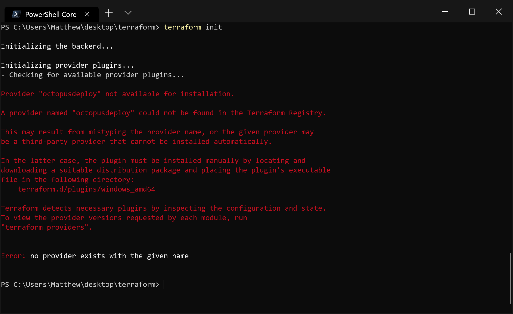
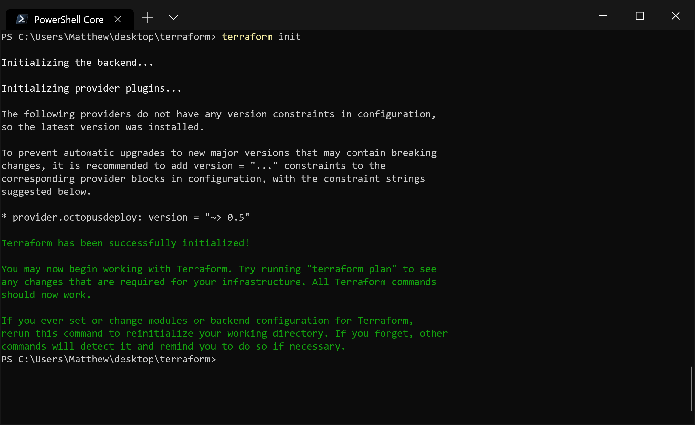

There is an [ongoing discussion](https://github.com/hashicorp/terraform/issues/15252) in the Hashicorp GitHub repository about the possibility of supporting custom plugin repositories for Terraform. As it stands today though only the official Terraform plugins will be downloaded on demand, and custom plugins need to be manually distributed.

In this post, we'll look at the three different ways to have custom plugins accessible from your Terraform templates.

## The sample project

To demonstrate loading a custom plugin, we'll create a very simple Terraform template that uses the [Octopus plugin](https://github.com/OctopusDeploy/terraform-provider-octopusdeploy).

To add a dependency on the Octopus provider, we have the following code in a file called `octopus.tf`:

```hcl
provider "octopusdeploy" {
  address = "${var.address}"
  apikey  = "${var.apikey}"
  space   = "${var.space}"
}
```

The variables are then defined in a file called `variables.tf`:

```hcl
variable "address" {
  default = "http://myserver"
}
variable "apikey" {
  default = "API-YOURAPIKEYGOESHERE"
}
variable "space" {
  default = "Default"
}
```

With these two files in a local directory, we run `terraform init`. The result is a failure because Terraform has no idea how to get the Octopus plugin.



*The init command fails without the plugin available.*

## Making the plugin globally available

The first option to resolve the error is to save the plugin file to `~\AppData\Roaming\terraform.d\plugins` in Windows or `~/.terraform.d/plugins` for Linux and MacOS.

You have to be careful about the filename. For Windows, the Octopus plugin will have the filename `terraform-provider-octopusdeploy_v0.5.0.exe`, and for Linux and MacOS, the filename will be `terraform-provider-octopusdeploy_v0.5.0` (replace `0.5.0` with the plugin version). Any other filename will result in an obscure error about the registry service being unreachable.


*An unexpected filename will generate this unhelpful error.*

But when you have the correct filename, the `init` command will complete successfully.



*With the correct filename, the init command succeeds.*

## Saving the plugin alongside the templates

The next option is to save the plugin in the `.terraform/plugins/<arch>` directory alongside the template files. The `<arch>` directory name matches one of those in the table below. Again the filename of the plugin must be `terraform-provider-octopusdeploy_v0.5.0.exe` for Windows and `terraform-provider-octopusdeploy_v0.5.0` for Linux and MacOS.

|OS|Arch|
|-|-|
|Windows 32 bit|`windows_386`|
|Windows 64 bit|`windows_amd64`|
|Linux 32 bit|`linux_386`|
|Linux 64 bit|`linux_amd64`|
|MacOS 64 bit|`darwin_amd64`|

## The plugin-dir option

The final option is to save the plugin executable in a folder of your choice and reference it using the `--plugin-dir` argument.

When you use the `--plugin-dir` argument, there is no special requirement for the directory name. Here I have called `terraform init --plugin-dir C:\Users\Matthew\Desktop\plugins\whatever` to prove that the directory name has no significance.


*The --plugin-dir option will take any directory that contains the correct plugin.*

## Conclusion

Until Terraform implements support for custom plugin repositories, end users will have to deploy the plugin executables themselves. Here we have seen that these plugins can be saved in:

* `~\AppData\Roaming\terraform.d\plugins` for Windows or `~/.terraform.d/plugins` for Linux and MacOS.
* `.terraform/plugins/<arch>` alongside the template files.
* Any directory referenced by the `--plugin-dir` option.
