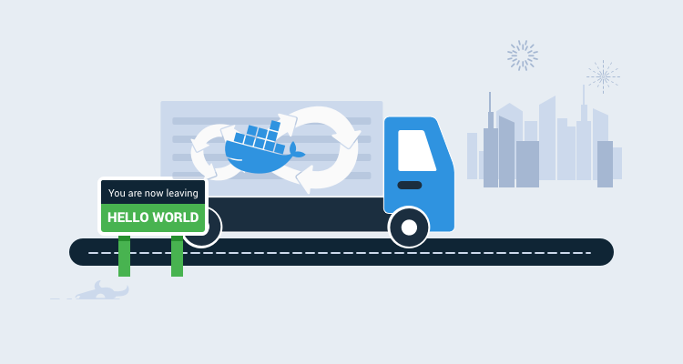
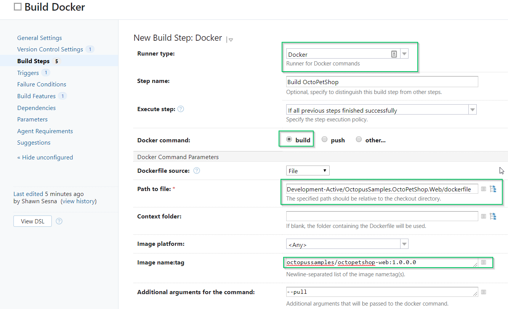
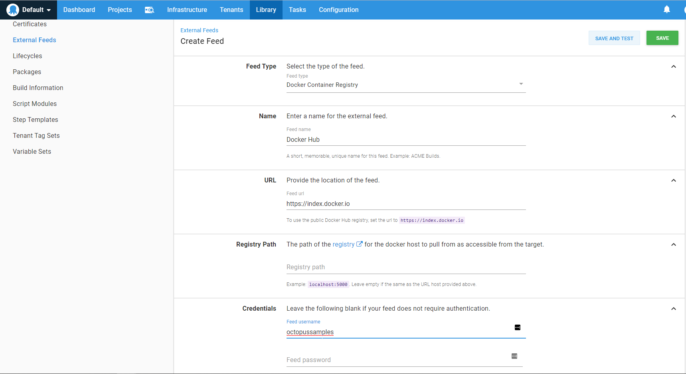
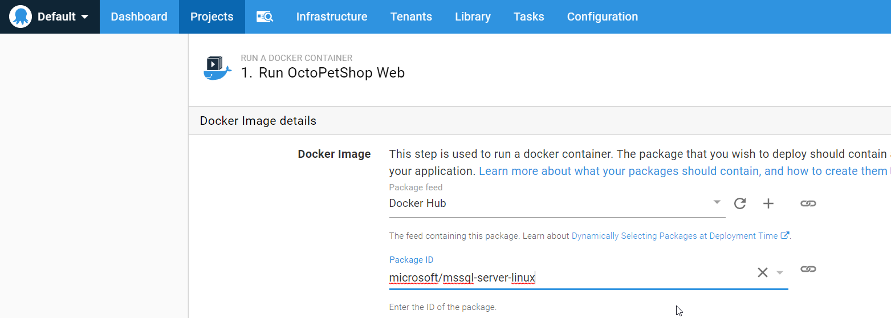

Docker and containers are excellent technologies to have in your DevOps tool-belt. The 'Beyond Hello World' blog series covers how to use them with a real-world application.

- [Containerizing a real-world web application](/blog/2019-12/containerize-a-real-world-web-app/index.md)
- **Building a real-world Docker CI/CD pipeline**

---

In the last post, I showed you how to containerize the [OctoPetShop](https://github.com/OctopusSamples/OctoPetShop) web application and produce Docker images for it. In this post, I take it further by configuring a complete docker CI/CD pipeline to automate the process. This covers the steps to configure continuous integration with JetBrain's TeamCity and configure continuous delivery with Octopus Deploy.

<h2>In this post</h2>

!toc

## Configuring docker continuous integration with JetBrain's TeamCity 

Continuous Integration happens on the build server.  The Continuous part is usually associated with some sort of event that triggers a build such as source code commits or a specific time of day.  For our build server, we’ll be performing the following tasks:

- Creating a project.
- Creating a build definition.
- Defining build steps.

### Adding the Docker build capability to the build agent

Most major build servers can build Docker images either with a built-in step or a downloadable plug-in.  For this demonstration, I used TeamCity as most of my experience is with Azure DevOps and I wanted to expand my horizons.

Rather than create a new virtual machine (VM), install and configure an OS, install the build agent, and finally install Docker, I chose a much nerdier path.  JetBrains, maker of TeamCity (amongst other products), provides a [Docker image for their build agent](https://hub.docker.com/r/jetbrains/teamcity-agent/). Not only do they have a build agent image, this image can also run Docker to do Docker builds (I chose option two under Running Builds Which Require Docker in the linked document above).

:::hint
**Hint**
My first attempt at running this ran into an issue where the agent container couldn’t resolve local DNS entries, but Robin Winslow's article, [Fix Docker’s networking DNS config](https://development.robinwinslow.uk/2016/06/23/fix-docker-networking-dns/), showed me a neat trick to fix that problem.

With the DNS issue resolved, the container started up and registered itself to my TeamCity server under the Unauthorized category of agents:

Clicking the **Authorize** button finalized the connection and the agent was available to perform builds.
:::

### Creating a TeamCity project

My first step was to create a new TeamCity project and connect my git repository to it. The [OctoPetShop](https://github.com/octopussamples/octopetshop) source code is available on GitHub but I used a local Azure DevOps instance to host mine.  This post assumes you already know how to [create a project](https://www.jetbrains.com/help/teamcity/creating-and-editing-projects.html) within TeamCity and focuses on the build and deploy process.

### Adding a connection to Docker Hub

To push our images to Docker Hub, we need to configure a connection to Docker Hub with an authorized user.

For this, we navigate to the **Connections** tab of our OctoPetShop project:

Click on **Add Connection**:

Choose **Docker Registry** from the drop-down and fill in the username and password.  Don’t forget to use **Test Connection** to make sure your credentials are valid:

With that bit of housekeeping out of the way, we can proceed with our build definition.

### Crafting the build definition
After the project has been created, we can create a new build definition that will perform our Docker build operation.  This build definition needs to perform the following steps:
- Build OctoPetShop web front-end.
- Build OctoPetShop product service.
- Build OctoPetShop shopping cart service.
- Build OctoPetShop database DbUp.
- Push the images to Docker Hub for use in deployment.

### Adding the Docker support Build Feature
We need to connect our Docker Hub connection to our build definition.  To do this, we click on the **Build Features** tab and **Add build feature**:

Choose **Docker Support** from the drop-down menu:

Check **Log in to the Docker registry before the build** and choose the connection we created for our project, and then click Save:

### Add build steps
Steps 1-4 are going to be identical, the only difference is the docker file that we’re going to build.  Click on the **Build Steps** tab, then click the **Add build step** button:

For the step, fill in the following:
- Runner type: `Docker`
- Docker command: `build`
- Path to dockerfile in the repo: i.e., `Development-Active/OctopusSamples.OctoPetShop.web/dockerfile`
- Image name:tag: i.e., `octopusexamples/octopetshop-web:1.0.0.0`

For docker images, it’s considered best practice to tag your image with the `DockerId/ImageName:version`.  It’s not uncommon to omit the `version` part of the tag, but whenever a new version of an image is uploaded to Docker Hub, it will automatically attach `latest` as the version if a version number is not specified.  Octopus Deploy uses SemVer when selecting package versions, which `latest` doesn’t follow.  In this example I’ve hardcoded `1.0.0.0` as the version number, but we could just as easily used a TeamCity Parameter to dynamically assign the version number.

We’ll add three more steps just like this one for product service, shopping cart service, and database.

The last step we’ll add is the step that pushes our built images (i.e. execute a Docker push command) to Docker Hub.  For this step, we’ll fill in the following:
- Runner type: `Docker`
- Docker command: `push`
- Image name:tag

For the push step, we specify all of the images that were built in steps 1-4 and push them in a single step.  Barring any typos, we should be able to execute a build successfully:

Congratulations!  We just finished the CI portion of this article.  The only thing left to do is to add a trigger so that when someone commits to source control, a build will automatically execute.

## Configuring docker continuous delivery with Octopus Deploy
For the CD portion of this article, we’ll use Octopus Deploy.  Within Octopus, we’ll do the following:
- Add Docker Hub as an external feed.
- Create a new project.
- Define our deployment steps.

### Adding Docker Hub as an external feed
We need to add Docker Hub as an external feed so that Octopus Deploy can pull our images from Docker Hub and deploy them to our server running Docker.

After you’ve logged into Octopus, click on the **Library** tab:

In the **Library** section, click on **External Feeds**, and then click the **ADD FEED** button:

On the **Create Feed** form, fill in the following:
- Feed Type: `Docker Container Registry`
- Name: `Docker Hub` (or whatever you want to call it)
- Username: `your-username`
- Password: `your-password`

Test the feed to make sure Octopus can log into Docker Hub:

With our external feed configured, we can now define our steps.

### Crafting the Octopus Deploy project

To create a new project, click on the **Projects** tab, and then click the **ADD PROJECT** button:

Give the project a name and click **SAVE**:

Similar to our build, the steps in Octopus are going to be largely the same with only minor differences.  I’ll walk you through the first step we’ll add to our process, and then point out the differences in the remaining steps.

On the **Process** tab of our project, click **ADD STEP**:

Choose the **Docker** category and the **Run a Docker Container** step:

For this demo, we’re going to use the Microsoft SQL Server 2017 Docker image as our database server, so this will be the first container we’ll configure in our deployment

The form for a Docker container step is rather long, so the screen shots are broken into parts.  For the first part, give the step a name and the Role it will be deploying to.  For this demonstration, I’m using a simple role of `Docker`, but in a Production scenario, the role would be something more meaningful like, `OctoPetShop-Web-Container`.

Choose our Docker Hub external feed and choose the `microsoft/mssql-server-linux` image.

:::hint
**Hint**
Type `mssql` in the search box to find the image):
:::

Choose the Network Type of `Bridge`:

To make our database server accessible, we need to add a port mapping.  Specify the default SQL Serve port of `1433`:

Scroll down to the **Variables** section and add the following Explicit Variable Mapping.  This image needs a couple of environment variables passed to it: `SA_PASSWORD` and `ACCEPT_EULA`.  Create a Project Variable of type Sensitive for the SA_PASSWORD:

And that’s it for this container. Click **SAVE** to commit the step to the process.

Here are the details for the remaining containers:

#### OctoPetShop Web
- Docker Image: `octopussamples/octopetshop-web`
- Network type: `Host`
- Explicit Variable Mapping:
    - `ProductServiceBaseUrl = http://localhost:5011/`
    - `ShoppingCartServiceBaseUrl = http://localhost:5012`

#### OctoPetShop product service
- Docker Image: `octopussamples/octopetshop-productservice`
- Network Type: `Bridge`
- Port Mapping: `5011:5011`
- Explicit Variable Mapping:
    - `OPSConnectionString = "Data Source=#{Octopus.Machine.Hostname}; Initial Catalog=OctoPetShop; User ID=sa; Password=#{Project.Database.SA.Password}`

#### OctoPetShop shopping cart service
- Docker Image: `octopussamples/octopetshop-shoppingcartservice`
- Network Type: `Bridge`
- Port Mapping: `5012:5012`
- Explicit Variable Mapping:
    - `OPSConnectionString =    "Data Source=#{Octopus.Machine.Hostname}; Initial Catalog=OctoPetShop; User ID=sa; Password=#{Project.Database.SA.Password}`

#### OctoPetShop database
- Docker Image: `octopussamples/octopetshop-database`
- Network Type: `Host`
- Explicit Variable Mapping:
    - `DbUpConnectionString = "Data Source=#{Octopus.Machine.Hostname}; Initial Catalog=OctoPetShop; User ID=sa; Password=#{Project.Database.SA.Password}`

With all of our steps defined, we can create a release and deploy it:

:::hint
**Hint**
For information on how to set up a Tentacle for Linux, see our [documentation](https://octopus.com/docs/infrastructure/deployment-targets/linux/tentacle) page.
:::

If we now navigate to the server we just deployed to, we should see our OctoPetShop application running.  As with the previous demos, OctoPetShop redirects to https with a self-signed certificate so you’ll most likely get a warning about it being unsafe.  In this case, it’s OK to ignore the warning and continue.

## Completing the docker CI/CD pipeline
So far we’ve done the CI and the CD portions, but we’ve not yet connected them together.  To fit these pieces together, we go back to our TeamCity server.

### Install the Octopus Deploy TeamCity plugin
First, we need to navigate to the [Octopus Deploy plugin](https://plugins.jetbrains.com/plugin/9038-octopus-deploy-integration) and download the Octopus Deploy plugin.

After that has been downloaded, go to {{Administration,Plugins List}} in our TeamCity server.  From here, we’ll click on the **Upload plugin zip** button to add the plugin:

This will add some steps that we can use within our build definition to interact with Octopus Deploy:

### Add Create Release step

Let’s add a new step to our build definition, OctopusDeploy: Create release:

Now, when we run a build, it will automatically create a release in Octopus Deploy:

If we wanted to, we could add the automatic deployment of that release to development directly from the build definition.

## Conclusion

This post showed it's possible to create a complete CI/CD pipeline for a real-world application using Docker containers. It covered how to automate a docker build pipeline with JetBrains TeamCity and how to configure docker continous delivery with Octopus Deploy. 
