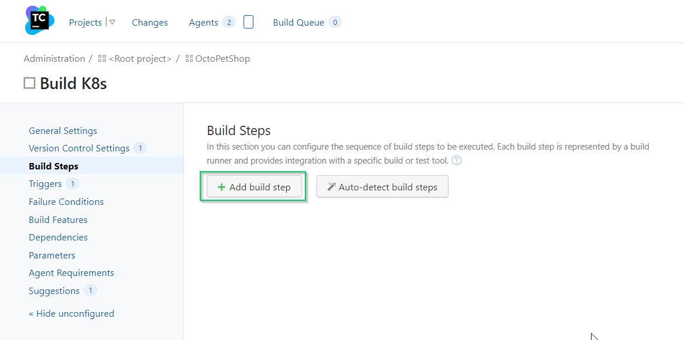

In the last post, I showed you how to set up a Kubernetes cluster using our OctoPetShop containers.

In this post, I configure the YAML files we created into a CI/CD pipeline.

## Create the build definition
Kubernetes doesn’t have anything that needs to be built, other than the Docker images it uses.  However, the YAML files that we created can be placed in source control and versioned so using a build server is still relevant.  Our [OctoPetShop](https://github.com/OctopusSamples/OctoPetShop) repo contains a k8s folder where we've placed all of the YAML files necessary to create our cluster, we'll use this as our source.  We'll be using TeamCity again as our build server for consistency.

### Setting the version number
In the Docker CI/CD post, we hardcoded our version number to 1.0.0.0 for our containers.  In this post, we're going to create unique version numbers for each build of our YAML files.  For simplicity, I'm going to set the version number to four digit year, two digit month, two digit day of month, and the revision (yyyy.MM.dd.r).

Add a PowerShell step to our build definition



Enter the following PowerShell to set the version number

```PS
Write-Host "##teamcity[buildNumber '$(Get-Date -Format "yyyy.MM.dd").%build.counter%']"
```


This will allow us to use `%build.number%` in subsequent steps to specify version numbers.


### Tweaking the YAML
The YAML in our repo has the password for the SA account of our SQL Server in plain text.  Let's take advantage of the Octopus Deploy Substitute Variables in Files feature and have it replace the password with a variable from or Octopus Deploy project.  To do this, we'll need to put the placeholder in the YAML file.  For example, open the octopetshop-database-job.yaml, change the password section of the connection string to look like this

```
apiVersion: batch/v1
kind: Job
metadata:
  name: octopetshop-dbup
spec:
  template:
    spec:
      containers:
        - name: dbup
          image: octopussamples/octopetshop-database
          command: [ "dotnet", "run", "--no-launch-profile" ]
          env:
            - name: DbUpConnectionString
              value: Data Source=octopetshop-sqlserver-cluster-ip-service;Initial Catalog=OctoPetShop; User ID=sa; Password=#{Project.SA.Password}
      restartPolicy: Never
```

Repeat this process for 
- octopetshop-productservice-deployment.yaml
- octopetshop-shoppingcartservice-deployment.yaml
- octopetshop-sql-deployment.yaml


### Packing up the YAML
Using the Octopus Deploy Pack step, we can package up all of the YAML for our deployment into a NuGet package.


### Pushing the package to Octopus Deploy
With the Octopus Depoloy Push step, we can ship our NuGet package to Octopus Deploy!

:::hint
For demonstration purposes, we're using the built0-in NuGet repository for Octopus Deploy.
:::


And that's all, folks!  Our build definition will now package up all the YAML files for our deployment and ship them over the our Octopus Deploy server!  Now comes the Continuous Delivery part :)

## Configure continuous delivery with Octoups Depoloy
With our YAML files package in Octopus Deploy, we can create our deployment process.  In this section we'll be doing the following:
- Create a new project
- Define our deployment steps

### Create the Octopus Deploy project
