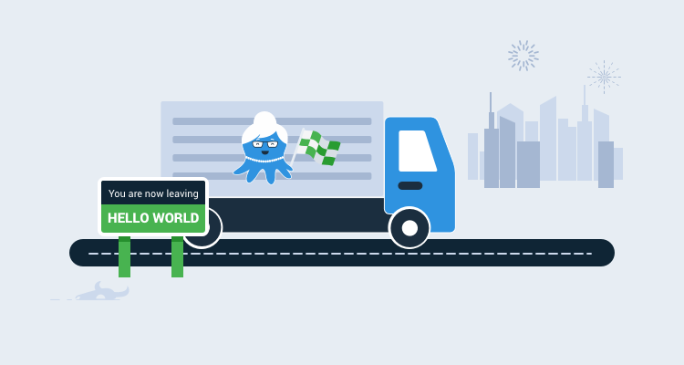
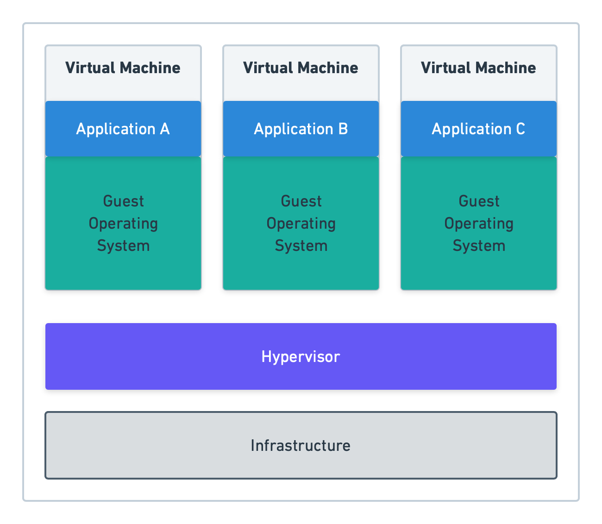
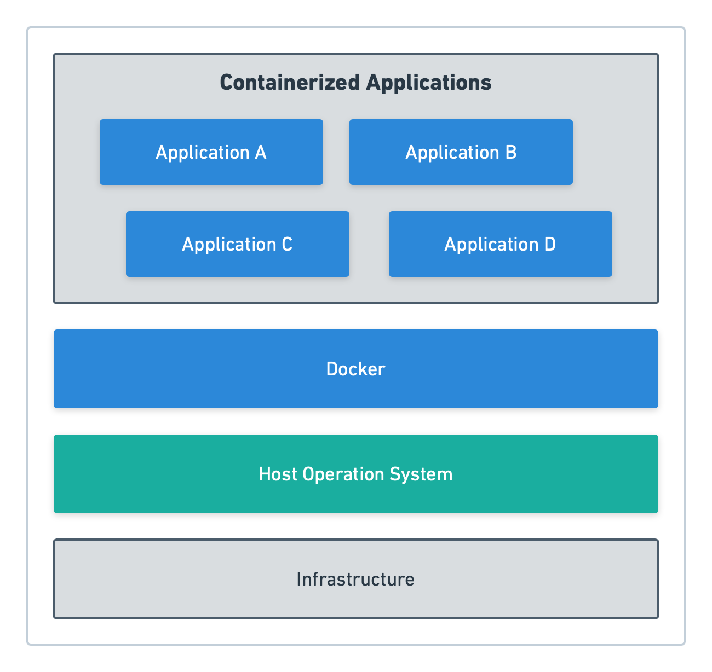
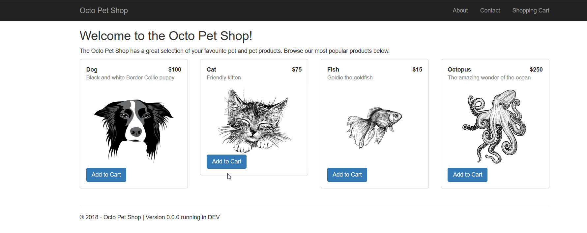

Docker containers and Kubernetes are excellent technologies to have in your DevOps tool-belt. This **Beyond Hello World** blog series covers how to use them with a real-world application.

- **Containerize a real-world web application**
- [Build a real-world Docker CI/CD pipeline](/blog/2019-12/build-a-real-world-docker-cicd-pipeline/index.md)
- [Kubernetes for the uninitiated](/blog/2020-01/kubernetes-for-the-uninitiated/index.md)
- [Building a real-world Kubernetes CI/CD pipeline](/blog/2020-01/build-a-real-world-kubernetes-cicd-pipeline/index.md)

---

Designing your application to run in a container has become quite popular, but where do you start, and how do you take an existing application and make it container compatible?  

In this post, I aim to demystify what it means to containerize your application.

## What is a container, and what is containerization?

Similar to virtual machines (VMs), containers have their own RAM, CPU, and filesystem.  However, containers rely on the host operating system (OS) for a lot of their base functionality, which makes them lightweight and portable.  Where a VM requires its own OS and all of the specialized components for an application to be installed, a container bundles the required components for the application to function into what is known as an `image`.  These images are completely self-contained and immutable, meaning they cannot be modified during their life.  If an update needs to be made to a container, any running instances must be destroyed before being replaced by the new version of the container.  This can be a problem if the container needs to retain any data (such as a database); however, there are ways to persist data when a container is destroyed.

## What is Docker, and how does it compare with virtual machines?

The most popular container technology is Docker.  Docker is an engine installed on either Windows or Linux that uses OS-level virtualization to run containers. At the time of this writing, containers are built for either Windows or Linux and are not cross-platform.

To illustrate the differences between virtual machines and containers, consider the following diagrams. First, let’s look at virtual machine (hypervisor) architecture.

NOTE: A hypervisor is the technology that runs VMs such as Windows Hyper-V or VMWare ESXi.



In the above diagram, each virtual machine and the hypervisor have their own OS, working somewhat independently (other than the VMs requiring the hypervisor to function.)  The applications are then deployed to the VM and served up using virtual hardware: networking, RAM, CPU, etc...

With Docker, the hypervisor is eliminated, and the containers run directly off the host OS through the Docker engine:



### Docker Desktop
[Docker Desktop](https://www.docker.com/products/docker-desktop) is a free tool you can download from Docker to use for local development.  Docker Desktop creates a VM on your local machine that you can use to interact with the Docker engine from your host machine (i.e., the Docker host).  Along with the Docker engine, Docker Desktop allows you to:
- Switch between Windows and Linux containers.
- Run Docker compose.
- Run a local version of Kubernetes.

## Create a Dockerfile

A Docker file contains the instructions Docker needs to build a container image.  In most cases, images are built from a base image and contain the bare minimum components to run your container, such as the .NET Core SDK.  

Let’s use [OctoPetShop](https://github.com/OctopusSamples/OctoPetShop) as an example. OctoPetShop is a sample application that is written in .NET Core and contains three main components:
- A web front-end.
- A product web service.
- A shopping cart web service.  

It also uses a database, but we’ll cover that later in this post.

To build the OctoPetShop front-end as a container, we define a dockerfile like this:

```
FROM mcr.microsoft.com/dotnet/core/sdk:2.1

RUN mkdir /src
WORKDIR /src
ADD . /src
RUN dotnet restore
RUN ["dotnet", "build", "--configuration", "release"]

EXPOSE 5000
EXPOSE 5001

ENV ASPNETCORE_URLS="http://+:5000;https://+:5001"
ENV ASPNETCORE_ENVIRONMENT="Production"

ENTRYPOINT [ "dotnet", "run", "--no-launch-profile" ]
```

It’s important to note that each line within a dockerfile builds a new image, using the previous command’s image as the base.

Let’s take a closer look at each line in the dockerfile example.

```
FROM mcr.microsoft.com/dotnet/core/sdk:2.1
```

The `FROM` section of a dockerfile example tells Docker what the base image is.  For the OctoPetShop front-end (as well as the product service, shopping cart service, and database), the base image is `mcr.microsoft.com/dotnet/core/sdk:2.1` which contains the .NET Core SDK.  These base images are downloaded from the public repository [Docker Hub](https://hub.docker.com).  When building Docker images, Docker first downloads the base image to disk and then caches it.

The first part of the image name, `mcr.microsoft.com`, is the username of the repository the image belongs to.  The next part, `/dotnet/core/`, is the folder path within the repository, where the SDK image resides.  The final part, `:2.1`, is the tag name for the image SDK.  This tag is how the SDK image is differentiated from other images of the same name and location.

```
RUN mkdir /src
```

`RUN` is the instruction we’re telling Docker to perform.  For this line, we tell Docker to create a new directory (mkdir) called src.

```
WORKDIR
```

Like `RUN`, `WORKDIR` is another instruction.  `WORKDIR` sets the working directory other commands will be run from.

```
ADD . /SRC
```

The `ADD` instruction copies files and folders into the container image.  On this line, we instruct Docker to copy all of the files and folders in the current directory into the /src directory we created previously.

```
RUN dotnet restore
```

This instruction runs the `dotnet restore` command, which will download any missing NuGet references our application needs for building.

```
RUN ["dotnet", "build", "--configuration", "release"]
```

Any instruction that needs more than one argument requires the arguments are placed inside an array.  Here we run the `dotnet build` command, which compiles our application within the image itself.

```
EXPOSE 5000 and EXPOSE 5001
```

The `EXPOSE` instruction is used to open ports to the container.  For the OctoPetShop web front-end, we open ports 5000 and 5001.

```
ENV ASPNETCORE_URLS="http://+:5000;https://+:5001" and ENV ASPNETCORE_ENVIRONMENT="Production"
```

`ENV` is short for *environment variable*.  We need to tell our Kestrel server which address/ports to listen on. The address/port can be overwritten using the environment variable `ASPNETCORE_URLS`.  We can also overwrite the environment name with `ASPNETCORE_ENVIRONMENT`.

```
ENTRYPOINT [ "dotnet", "run", "--no-launch-profile" ]
```

The `ENTRYPOINT` command runs when the container starts.  Just like our `RUN` command, if the command requires multiple arguments, they need to be encapsulated inside an array.

:::warning
**ENTRYPOINT vs CMD**
Docker has another command that is similar to `ENTRYPOINT` called `CMD` that can often cause confusion. `ENTRYPOINT` configures a container to be run as an executable, whereas `CMD` sets a default command and/or parameters that can be overwritten from the command-line when the container runs.
:::

## Build your web application as an image with Docker build
The command to build your application into an image is `docker build`.  When you run a Docker build, you need to tell Docker where the dockerfile is.  If the dockerfile exists in the current directory, you run the build command `docker build .`.  It is common practice to tag your build with your Docker username/application name.  To tag your build, simply add the `-t username/application name` to the build command:

```
docker build . -t octopussamples/octopetshop-web
```  

When issuing a Docker build command for the OctoPetShop front-end, you will receive the following output (GUIDs will be different):

```
Sending build context to Docker daemon  4.439MB
Step 1/11 : FROM mcr.microsoft.com/dotnet/core/sdk:2.1
 ---> bf77a711b92c
Step 2/11 : RUN mkdir /src    
 ---> Using cache
 ---> e590281bfd90
Step 3/11 : WORKDIR /src      
 ---> Using cache
 ---> 3a5646783c8c
Step 4/11 : ADD . /src        
 ---> Using cache
 ---> 5ca49131b227
Step 5/11 : RUN dotnet restore
 ---> Using cache
 ---> 2c231113eef0
Step 6/11 : RUN ["dotnet", "build", "--configuration", "release"]
 ---> Using cache
 ---> a2bbe5911620
Step 7/11 : EXPOSE 5000
 ---> Using cache
 ---> 759d97686c25
Step 8/11 : EXPOSE 5001
 ---> Using cache
 ---> d973bb954156
Step 9/11 : ENV ASPNETCORE_URLS="http://+:5000;https://+:5001"
 ---> Using cache
 ---> f32adcc6f8a1
Step 10/11 : ENV ASPNETCORE_ENVIRONMENT="Production"
 ---> Using cache
 ---> 3168d6f82375
Step 11/11 : ENTRYPOINT [ "dotnet", "run", "--no-launch-profile" ]
 ---> Using cache
 ---> fc176971f626
Successfully built fc176971f626
Successfully tagged octopussamples/octopetshop-web:latest
```

We’ve just successfully containerized the OctoPetShop front-end!  

## Build web services and database projects as Docker images with Docker build
OctoPetShop contains two web services and a database project that we need to containerize into Docker images. The process to containerize these components mirrors the one for the front-end, and you can find dockerfile example files in the [OctoPetShop repo](https://github.com/OctopusSamples/OctoPetShop).

The database project uses [DbUp](https://dbup.github.io/) and contains scripts (database migrations) to both create our database and seed it with data. The only thing missing is a database server.  Luckily for us, Microsoft makes a container image for SQL Server 2017: `microsoft/mssql-server-linux:2017-latest`.

## Run your containerized application with Docker run
Now that we have all of the components neatly within containers, we need to get them up and running.  To start our containers, we use the `docker run <image>` command.  Any ports that were opened with the `EXPOSE` instruction need to be mapped to the host ports for the containers to be accessible.  This is done using the `-p` switch for the Docker run command and can be specified more than once if you need to map multiple ports for a container.  The `-e` switch will pass in environment variables to the container.  

Our OctoPetShop web front-end needs to know the address to the back-end services of the product service and the shopping cart service.  These values are stored within the appsettings.json file of our application; however, we’ve coded the application to override those if environment variables are present.

To get our entire solution working (including running the database server as a container), we run the following commands:

```
docker run -p 1433:1433 -e SA_PASSWORD="SomeGoodPassword" -e ACCEPT_EULA="Y" -d microsoft/mssql-server-linux:2017-latest

docker run -p 5010:5000 -p 5001:5001 -d -e ProductServiceBaseUrl=http://localhost:5011 -e ShoppingCartServiceBaseUrl=http://localhost:5012 -d octopussamples/octopetshop-web

docker run -p 5011:5011 -e OPSConnectionString="Data Source=172.17.0.2;Initial Catalog=OctoPetShop; User ID=sa; Password=SomeGoodPassword" -d octopussamples/octopetshop-productservice

docker run -p 5012:5012 -e OPSConnectionString="Data Source=172.17.0.2;Initial Catalog=OctoPetShop; User ID=sa; Password=SomeGoodPassword" -d octopussamples/octopetshop-shoppingcartservice

docker run -e DbUpConnectionString="Data Source=172.17.0.2;Initial Catalog=OctoPetShop; User ID=sa; Password=SomeGoodPassword" -d octopussamples/octopetshop-database
```

The IP address of `172.17.0.2` is the address the SQL Server container is assigned.

With our containers running, we can navigate to http://localhost:5000.  OctoPetShop automatically redirects to an https address (using port 5001) and uses a self-signed certificate.  You will most likely be presented with a warning that it’s insecure. In this case, we can safely ignore the warning.  When the page loads, you should see:



## Run your containerized application with Docker compose
Running Docker commands one-by-one can get quite tedious.  To solve this, Docker created Docker compose.  With a single Docker compose YAML file, you can build all of your containers, set up their ports, create a local network for them to use, and define the environment variables for each.  In the following YAML code, we set up all of our containers similar to the Docker run commands above.  Instead of mapping host ports to container ports, we create a Docker network called `container_net`.  With the container_net network, the only ports that need to be mapped to the host are web front-end ports (5000 and 5001), leaving the rest accessible only to the other containers:

```yaml
version: '3'
services:
  sql-server:
    container_name: sql-server-db
    image: mcr.microsoft.com/mssql/server:2019-latest
    ports:
      - "1433:1433"
    environment:
      SA_PASSWORD: "SomeGoodPassword"
      ACCEPT_EULA: "Y"
  productservice:
    environment:
      - OPSConnectionString=Data Source=sql-server;Initial Catalog=OctoPetShop; User ID=sa; Password=SomeGoodPassword
    build:
      dockerfile: dockerfile
      context: ./OctopusSamples.OctoPetshop.Productservice
    ports:
      - '5011:5011'
      - '5014:5014'
    depends_on: 
      - "database"
  octopetshop:
    environment:
      - ProductServiceBaseUrl=http://productservice:5011/
      - ShoppingCartServiceBaseUrl=http:/shoppingcartservice:5012
    build:
      dockerfile: dockerfile
      context: ./OctopusSamples.OctoPetShop.Web
    ports:
      - '5000:5000'
      - '5001:5001'
    depends_on: 
      - "shoppingcartservice"
      - "productservice"
  shoppingcartservice:
    environment:
      - OPSConnectionString=Data Source=sql-server;Initial Catalog=OctoPetShop; User ID=sa; Password=SomeGoodPassword
    build:
      dockerfile: dockerfile
      context: ./OctopusSamples.OctoPetShop.ShoppingCartService
    ports:
      - '5012:5012'
      - '5013:5013'
    depends_on: 
      - "database"
  database:
    environment:
      - DbUpConnectionString=Data Source=sql-server;Initial Catalog=OctoPetShop; User ID=sa; Password=SomeGoodPassword
    build:
      dockerfile: dockerfile
      context: ./OctopusSamples.OctoPetShop.Database
    depends_on: 
      - "sql-server" 
```

Unlike the previous method of using Docker run for each of our containers, we can start our entire solution by running `docker-compose up`, which is much less typing.  Running Docker compose will also show us the output from the containers as they’re running:

```
Starting octopetshop_database_1            ... done                                                                     Starting octopetshop_octopetshop_1         ... done                                                                     Recreating sql-server-db                   ... done                                                                     Starting octopetshop_shoppingcartservice_1 ... done                                                                     Starting octopetshop_productservice_1      ... done                                                                     Attaching to octopetshop_octopetshop_1, octopetshop_shoppingcartservice_1, octopetshop_productservice_1, sql-server-db, octopetshop_database_1
database_1             | Master ConnectionString => Data Source=192.168.1.4;Initial Catalog=master;User ID=sa;Password=********************
shoppingcartservice_1  | Hosting environment: Production
shoppingcartservice_1  | Content root path: /src
shoppingcartservice_1  | Now listening on: http://[::]:5012
shoppingcartservice_1  | Now listening on: https://[::]:5013
shoppingcartservice_1  | Application started. Press Ctrl+C to shut down.
octopetshop_1          | Hosting environment: Production
octopetshop_1          | Content root path: /src
octopetshop_1          | Now listening on: http://[::]:5000
octopetshop_1          | Now listening on: https://[::]:5001
octopetshop_1          | Application started. Press Ctrl+C to shut down.
productservice_1       | Hosting environment: Production
productservice_1       | Content root path: /src
productservice_1       | Now listening on: http://[::]:5011
productservice_1       | Now listening on: https://[::]:5014
productservice_1       | Application started. Press Ctrl+C to shut down.
sql-server-db          | 2019-11-07 11:44:15.07 Server      Setup step is copying system data file 'C:\templatedata\master.mdf' to '/var/opt/mssql/data/master.mdf'.
2019-11-07 11:44:15.14 Server      Did not find an existing master data file /var/opt/mssql/data/master.mdf, copying the missing default master and other system database files. If you have moved the database location, but not moved the database files, startup may fail. To repair: shutdown SQL Server, move the master database to configured location, and restart.
2019-11-07 11:44:15.14 Server      Setup step is copying system data file 'C:\templatedata\mastlog.ldf' to '/var/opt/mssql/data/mastlog.ldf'.
2019-11-07 11:44:15.15 Server      Setup step is copying system data file 'C:\templatedata\model.mdf' to '/var/opt/mssql/data/model.mdf'.
2019-11-07 11:44:15.16 Server      Setup step is copying system data file 'C:\templatedata\modellog.ldf' to '/var/opt/mssql/data/modellog.ldf'.
2019-11-07 11:44:15.17 Server      Setup step is copying system data file 'C:\templatedata\msdbdata.mdf' to '/var/opt/mssql/data/msdbdata.mdf'.
2019-11-07 11:44:15.21 Server      Setup step is copying system data file 'C:\templatedata\msdblog.ldf' to '/var/opt/mssql/data/msdblog.ldf'.
2019-11-07 11:44:15.29 Server      Microsoft SQL Server 2017 (RTM-CU13) (KB4466404) - 14.0.3048.4 (X64)
        Nov 30 2018 12:57:58
        Copyright (C) 2017 Microsoft Corporation
        Developer Edition (64-bit) on Linux (Ubuntu 16.04.5 LTS)
2019-11-07 11:44:15.29 Server      UTC adjustment: 0:00
2019-11-07 11:44:15.29 Server      (c) Microsoft Corporation.
2019-11-07 11:44:15.29 Server      All rights reserved.
2019-11-07 11:44:15.29 Server      Server process ID is 4120.
2019-11-07 11:44:15.30 Server      Logging SQL Server messages in file '/var/opt/mssql/log/errorlog'.
2019-11-07 11:44:15.30 Server      Registry startup parameters:
         -d /var/opt/mssql/data/master.mdf
         -l /var/opt/mssql/data/mastlog.ldf
         -e /var/opt/mssql/log/errorlog
2019-11-07 11:44:15.31 Server      SQL Server detected 1 sockets with 1 cores per socket and 2 logical processors per socket, 2 total logical processors; using 2 logical processors based on SQL Server licensing. This is an informational message; no user action is required.
2019-11-07 11:44:15.31 Server      SQL Server is starting at normal priority base (=7). This is an informational message only. No user action is required.
2019-11-07 11:44:15.31 Server      Detected 1600 MB of RAM. This is an informational message; no user action is required.
2019-11-07 11:44:15.31 Server      Using conventional memory in the memory manager.
2019-11-07 11:44:15.46 Server      Buffer pool extension is already disabled. No action is necessary.
2019-11-07 11:44:15.61 Server      InitializeExternalUserGroupSid failed. Implied authentication will be disabled.
2019-11-07 11:44:15.62 Server      Implied authentication manager initialization failed. Implied authentication will be disabled.
2019-11-07 11:44:15.63 Server      Successfully initialized the TLS configuration. Allowed TLS protocol versions are ['1.0 1.1 1.2']. Allowed TLS ciphers are ['ECDHE-ECDSA-AES128-GCM-SHA256:ECDHE-ECDSA-AES256-GCM-SHA384:ECDHE-RSA-AES128-GCM-SHA256:ECDHE-RSA-AES256-GCM-SHA384:ECDHE-ECDSA-AES128-SHA256:ECDHE-ECDSA-AES256-SHA384:ECDHE-ECDSA-AES256-SHA:ECDHE-ECDSA-AES128-SHA:AES256-GCM-SHA384:AES128-GCM-SHA256:AES256-SHA256:AES128-SHA256:AES256-SHA:AES128-SHA:!DHE-RSA-AES256-GCM-SHA384:!DHE-RSA-AES128-GCM-SHA256:!DHE-RSA-AES256-SHA:!DHE-RSA-AES128-SHA'].
2019-11-07 11:44:15.66 Server      The maximum number of dedicated administrator connections for this instance is '1'
2019-11-07 11:44:15.66 Server      Node configuration: node 0: CPU mask: 0x0000000000000003:0 Active CPU mask: 0x0000000000000003:0. This message provides a description of the NUMA configuration for this computer. This is an informational message only. No user action is required.
2019-11-07 11:44:15.67 Server      Using dynamic lock allocation.  Initial allocation of 2500 Lock blocks and 5000 Lock Owner blocks per node.  This is an informational message only.  No user action is required.
2019-11-07 11:44:15.68 Server      In-Memory OLTP initialized on lowend machine.
2019-11-07 11:44:15.75 Server      Database Instant File Initialization: enabled. For security and performance considerations see the topic 'Database Instant File Initialization' in SQL Server Books Online. This is an informational message only. No user action is required.
ForceFlush is enabled for this instance.
2019-11-07 11:44:15.76 Server      Query Store settings initialized with enabled = 1,
2019-11-07 11:44:15.77 Server      Software Usage Metrics is disabled.
2019-11-07 11:44:15.78 spid7s      Starting up database 'master'.
ForceFlush feature is enabled for log durability.
2019-11-07 11:44:15.95 spid7s      The tail of the log for database master is being rewritten to match the new sector size of 4096 bytes.  3072 bytes at offset 418816 in file /var/opt/mssql/data/mastlog.ldf will be written.
2019-11-07 11:44:16.13 spid7s      Converting database 'master' from version 862 to the current version 869.
2019-11-07 11:44:16.15 spid7s      Database 'master' running the upgrade step from version 862 to version 863.
2019-11-07 11:44:16.20 spid7s      Database 'master' running the upgrade step from version 863 to version 864.
2019-11-07 11:44:16.28 spid7s      Database 'master' running the upgrade step from version 864 to version 865.
2019-11-07 11:44:16.31 spid7s      Database 'master' running the upgrade step from version 865 to version 866.
2019-11-07 11:44:16.34 spid7s      Database 'master' running the upgrade step from version 866 to version 867.
2019-11-07 11:44:16.36 spid7s      Database 'master' running the upgrade step from version 867 to version 868.
2019-11-07 11:44:16.39 spid7s      Database 'master' running the upgrade step from version 868 to version 869.
2019-11-07 11:44:16.74 spid7s      Resource governor reconfiguration succeeded.
2019-11-07 11:44:16.75 spid7s      SQL Server Audit is starting the audits. This is an informational message. No user action is required.
2019-11-07 11:44:16.77 spid7s      SQL Server Audit has started the audits. This is an informational message. No user action is required.
2019-11-07 11:44:16.84 spid7s      SQL Trace ID 1 was started by login "sa".
2019-11-07 11:44:16.87 spid19s     Password policy update was successful.
2019-11-07 11:44:16.88 spid7s      Server name is '88ca920a03ae'. This is an informational message only. No user action is required.
2019-11-07 11:44:16.89 spid22s     Always On: The availability replica manager is starting. This is an informational message only. No user action is required.
2019-11-07 11:44:16.90 spid7s      Starting up database 'msdb'.
2019-11-07 11:44:16.90 spid22s     Always On: The availability replica manager is waiting for the instance of SQL Server to allow client connections. This is an informational message only. No user action is required.
2019-11-07 11:44:16.91 spid11s     Starting up database 'mssqlsystemresource'.
2019-11-07 11:44:16.91 spid11s     The resource database build version is 14.00.3048. This is an informational message only. No user action is required.
2019-11-07 11:44:16.93 spid11s     Starting up database 'model'.
2019-11-07 11:44:17.12 spid7s      The tail of the log for database msdb is being rewritten to match the new sector size of 4096 bytes.  512 bytes at offset 306688 in file /var/opt/mssql/data/MSDBLog.ldf will be written.
2019-11-07 11:44:17.20 spid7s      Converting database 'msdb' from version 862 to the current version 869.
2019-11-07 11:44:17.21 spid7s      Database 'msdb' running the upgrade step from version 862 to version 863.
2019-11-07 11:44:17.21 spid19s     A self-generated certificate was successfully loaded for encryption.
2019-11-07 11:44:17.22 spid11s     The tail of the log for database model is being rewritten to match the new sector size of 4096 bytes.  2048 bytes at offset 75776 in file /var/opt/mssql/data/modellog.ldf will be written.
2019-11-07 11:44:17.23 spid19s     Server is listening on [ 'any' <ipv4> 1433].
2019-11-07 11:44:17.24 Server      Server is listening on [ 127.0.0.1 <ipv4> 1434].
2019-11-07 11:44:17.24 Server      Dedicated admin connection support was established for listening locally on port 1434.
2019-11-07 11:44:17.26 spid19s     SQL Server is now ready for client connections. This is an informational message; no user action is required.
2019-11-07 11:44:17.28 spid11s     Converting database 'model' from version 862 to the current version 869.
2019-11-07 11:44:17.29 spid11s     Database 'model' running the upgrade step from version 862 to version 863.
2019-11-07 11:44:17.33 spid7s      Database 'msdb' running the upgrade step from version 863 to version 864.
2019-11-07 11:44:17.38 spid11s     Database 'model' running the upgrade step from version 863 to version 864.
2019-11-07 11:44:17.39 spid7s      Database 'msdb' running the upgrade step from version 864 to version 865.
2019-11-07 11:44:17.41 spid11s     Database 'model' running the upgrade step from version 864 to version 865.
2019-11-07 11:44:17.42 spid7s      Database 'msdb' running the upgrade step from version 865 to version 866.
2019-11-07 11:44:17.44 spid11s     Database 'model' running the upgrade step from version 865 to version 866.
2019-11-07 11:44:17.44 spid7s      Database 'msdb' running the upgrade step from version 866 to version 867.
2019-11-07 11:44:17.47 spid11s     Database 'model' running the upgrade step from version 866 to version 867.
2019-11-07 11:44:17.48 spid7s      Database 'msdb' running the upgrade step from version 867 to version 868.
2019-11-07 11:44:17.52 spid11s     Database 'model' running the upgrade step from version 867 to version 868.
2019-11-07 11:44:17.53 spid7s      Database 'msdb' running the upgrade step from version 868 to version 869.
2019-11-07 11:44:17.59 spid11s     Database 'model' running the upgrade step from version 868 to version 869.
2019-11-07 11:44:17.75 spid11s     Polybase feature disabled.
2019-11-07 11:44:17.75 spid11s     Clearing tempdb database.
2019-11-07 11:44:18.16 spid11s     Starting up database 'tempdb'.
2019-11-07 11:44:18.35 spid11s     The tempdb database has 1 data file(s).
2019-11-07 11:44:18.38 spid22s     The Service Broker endpoint is in disabled or stopped state.
2019-11-07 11:44:18.38 spid22s     The Database Mirroring endpoint is in disabled or stopped state.
2019-11-07 11:44:18.39 spid22s     Service Broker manager has started.
2019-11-07 11:44:18.77 spid51      Starting up database 'OctoPetShop'.
2019-11-07 11:44:18.92 spid51      Parallel redo is started for database 'OctoPetShop' with worker pool size [1].
2019-11-07 11:44:18.94 spid51      Parallel redo is shutdown for database 'OctoPetShop' with worker pool size [1].
database_1             | Created database OctoPetShop
2019-11-07 11:44:19.12 spid7s      Recovery is complete. This is an informational message only. No user action is required.
2019-11-07 11:44:19.14 spid17s     The default language (LCID 0) has been set for engine and full-text services.
database_1             | Beginning database upgrade
database_1             | Checking whether journal table exists..
database_1             | Journal table does not exist
database_1             | Executing Database Server script 'OctopusSamples.OctoPetShop.Database.scripts.0001-create-tables.sql'
database_1             | Checking whether journal table exists..
database_1             | Creating the [SchemaVersions] table
database_1             | The [SchemaVersions] table has been created
database_1             | Executing Database Server script 'OctopusSamples.OctoPetShop.Database.scripts.0002-seed-data.sql'
database_1             | Upgrade successful
database_1             | Success!
octopetshop_database_1 exited with code 0
```

## Incorporate containers into a CI/CD pipeline

Thus far, we’ve done everything on the command line and not in any sort of automated fashion (other than Docker compose).  The next logical step is to hand off the building and uploading of our container images to a build server.  Popular build servers such as Microsoft [Azure DevOps](https://dev.azure.com), JetBrains [TeamCity](https://www.jetbrains.com/teamcity/), [Jenkins](https://jenkins.io), and Atlassian [Bamboo](https://www.atlassian.com/software/bamboo) all have steps either built-in or available in a downloadable plugin that will build your Docker images and push them to a repository.  Once in the repository, you can use continuous delivery software such as Azure DevOps Pipelines or Octopus Deploy to automate the deployment of the images to either machines running the Docker engine or Kubernetes clusters.

## Conclusion
Running applications as containers was pure magic to me before I went through the exercise of creating containers for OctoPetShop.  This experience has given me the confidence to proceed with running OctoPetShop in a Kubernetes cluster!  Stay tuned for that post soon.
