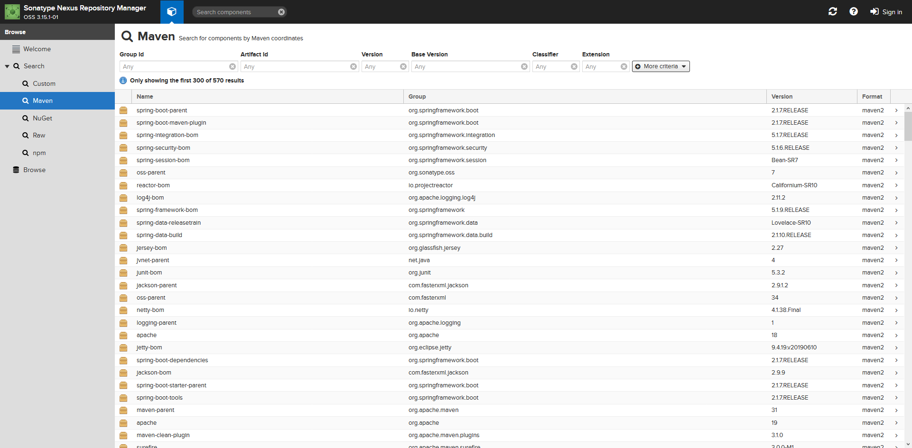

As a free and open source build server, Jenkins is [used by millions](https://www.cloudbees.com/press/jenkins-community-announces-record-growth-and-innovation-2017), so most developers have either used or at least heard about Jenkins. Like most build servers, Jenkins is typically installed on a server to consume source code, execute a build process on build agents, and either deploy or publish the resulting artifact.

Conceptually this model of a build server was easy for me to understand, and it applies to most of the popular solutions available today like Team City, Azure DevOps, Bamboo, etc. So when working with [Jenkins X](https://jenkins-x.io/about/) for the first time, naturally, I tried to understand it with the same conceptual model. This turned out to be a mistake.

I genuinely struggled to understand what Jenkins X was, but after some trial and error, I went back and reread the [Jenkin X About Page](https://jenkins-x.io/about/what/). Two sentences buried deep in the text are critical to understanding Jenkins X:

> Jenkins X is opinionated.

> The critical thing to note is that you need to clear your mind from any Jenkins experience you might already have.

Internalizing these two statements is essential to appreciating what Jenkins X is. With that in mind, let’s take a high-level look at Jenkins X.

## It starts with the Kubernetes cluster

In a literal sense, Kubernetes is a container orchestrator. You describe the containers you want to run, how they communicate with each other, what resources they need, and Kubernetes does the hard work of executing everything. Typically, Kubernetes hosts long-running applications like web servers that continually wait for requests, and one of the great features of Kubernetes is that it will monitor these long-running processes and restart them if they fail.

This traditional view of Kubernetes is the first thing you have to forget. To understand Jenkins X, think of Kubernetes more like a cloud operating system.

You use `apt-get` to install an application in Linux, in the same way, Kubernetes can install applications using [Helm](https://helm.sh/).

Just as you would run short-lived commands to build your applications and Docker images with the `docker` CLI, Kubernetes can build software and Docker images with [Skaffold](https://github.com/GoogleContainerTools/skaffold).

And as you would host Docker images or other image artifact repositories like [Nexus](https://www.sonatype.com/nexus-repository-sonatype) as services to be booted with the OS, you can deploy these same applications to Kubernetes.

Jenkins X treats your Kubernetes cluster as an environment in which to run builds, as a way of hosting artifact repositories, as an install target for Helm charts, and finally, as a place to deploy and run your built applications.

By installing Jenkins X, you will have a self-contained Kubernetes cluster complete with a selection of hand picked and custom configured services ready to start building and deploying applications.

## This extends to your local development environment

I'm used to my local development environment being completely separate from the central build server. To get my code into the build server, I typically push it to a central GIT repository, go to the CI server, point a project at the GIT repo, configure the build and then kick it off.

If my CI server offered a CLI tool, it was exclusively for managing the CI server. Such tools don't have any concept of the code I am working on.

Again, forget everything you have learned with traditional CI servers. Jenkins X has opinions about how your code is built and deployed and is not shy about configuring everything for you.

To have your exiting code built by Jenkins X, you run `jx import`. Running this command will add several files to your project including `jenkins-x.yml` (which is the [Jenkins X pipeline](https://jenkins-x.io/architecture/jenkins-x-pipelines/)), `Dockerfile` (which builds the [Docker image](https://docs.docker.com/engine/reference/builder/)), `skaffold.yaml` (which is the [Skaffold project configuration](https://skaffold.dev/docs/references/yaml/)) and a `charts` directory (which provide the [Helm chart template](https://helm.sh/docs/chart_template_guide/)).

Jenkins X then places all the code into a GIT repository, pushes it, and starts the build.

As you can see from the output below, Jenkins X is tying together a number of different tools and services to create a repeatable build process:

```
PS C:\Users\Matthew\Downloads\ThymeleafSpring> jx import
WARNING: No username defined for the current Git server!
? Do you wish to use mcasperson as the Git user name: Yes
The directory C:\Users\Matthew\Downloads\ThymeleafSpring is not yet using git
? Would you like to initialise git now? Yes
? Commit message: Initial import

Git repository created
selected pack: C:\Users\Matthew\.jx\draft\packs\github.com\jenkins-x-buildpacks\jenkins-x-kubernetes\packs\maven
? Which organisation do you want to use? mcasperson
replacing placeholders in directory C:\Users\Matthew\Downloads\ThymeleafSpring
app name: thymeleafspring, git server: github.com, org: mcasperson, Docker registry org: kubernetes-demo-198002
skipping directory "C:\\Users\\Matthew\\Downloads\\ThymeleafSpring\\.git"
Using Git provider GitHub at https://github.com
? Using organisation: mcasperson
? Enter the new repository name: ThymeleafSpring
Creating repository mcasperson/ThymeleafSpring
Pushed Git repository to https://github.com/mcasperson/ThymeleafSpring
Creating GitHub webhook for mcasperson/ThymeleafSpring for url http://hook.jx.35.194.232.107.nip.io/hook

Watch pipeline activity via:  jx get activity -f ThymeleafSpring -w
Browse the pipeline log via:  jx get build logs mcasperson/ThymeleafSpring/master
You can list the pipelines via: jx get pipelines
When the pipeline is complete: jx get applications

For more help on available commands see: https://jenkins-x.io/developing/browsing/
```

## The build and deploy ties it all together

If there is one benefit to traditional CI servers, it is that because you set everything up by hand, you have a fair idea of how code flows from the source code repository to the final deployment.

Because Jenkins X has done so much of the work for us, it can be hard to appreciate what actually happens as part of a build. So let’s have a look at some of the work that goes on behind the scenes.

As part of the Kubernetes cluster initialization, Jenkins X installed the Nexus repository manager. After our build has completed, we can see the Java dependencies that our application relied on are now cached locally. This cache means any subsequent builds will complete much faster.



Another service installed by Jenkins X is ChartMuseum, which is a Helm repository. By downloading the `index.yaml` file we can see that Jenkins X has created and published a Helm chart to this internal repository:

```
curl http://chartmuseum.jx.35.194.232.107.nip.io/index.yaml
apiVersion: v1
entries:
  jenkinx-spring-demo:
  - apiVersion: v1
    appVersion: 0.0.1
    created: "2019-08-28T19:25:22.445582847Z"
    description: A Helm chart for Kubernetes
    digest: 9e048b78247da2a28562771742454484dbaf35b10d14a0c0a668c3ba826d02c4
    icon: https://raw.githubusercontent.com/jenkins-x/jenkins-x-platform/master/images/java.png
    name: jenkinx-spring-demo
    urls:
    - charts/jenkinx-spring-demo-0.0.1.tgz
    version: 0.0.1
generated: "2019-08-28T19:32:00Z"
```

Jenkins X also took care of publishing the Docker image to a local container registry. Because we ran Jenkins X in a Google Cloud Kubernetes cluster, Jenkins X defaulted to using the Google Container Registry. However, had that service not been available, Jenkins X would have installed a Docker registry in the Kubernetes cluster.


Finally, we can see that the Helm chart has been deployed in the cluster, and the ingress rules have been created by [exposecontroller](https://jenkins-x.io/faq/technology/#whats-is-exposecontroller), resulting in our application being exposed with a custom hostname.


## Conclusion

When you first encounter Jenkins X, it can be hard to understand exactly what it is. If there is one take away from this post, it is to forget everything you know about CI servers and to appreciate Jenkin X on its own terms.

Far from being simply a way of running builds, Jenkins X provides a complete build ecosystem and opinionated workflows that start with preparing your local code structure and end with a deployed Kubernetes application.

Appreciating Jenkins X requires a mental shift from the way most developers interact with a development pipeline, but the benefits are a well structured workflow and tightly configured toolchain.
