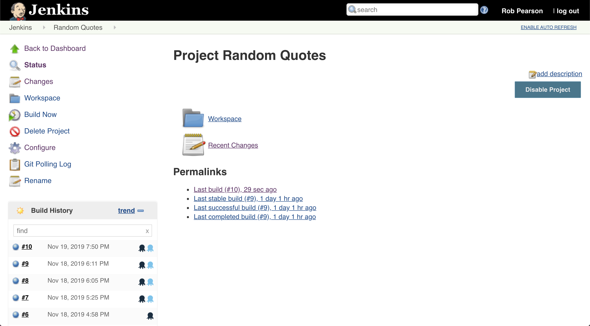

<iframe width="560" height="315" src="https://www.youtube.com/embed/TODO" frameborder="0" allowfullscreen></iframe>

We're excited to launch our official Jenkins plugin to make it painless to integration Jenkins builds with Octopus deployments. Octopus has had a Jenkins community plugin for years maintained by [Brian Adriance](https://github.com/badriance) and other contributors. Octopus has worked with Brian to take over the plugin and make it officially support by our team. We're indebted to the effort from Brian and other contributors since the project started in 2015. This brings great advantages as we're able to keep the plugin up-to-date and add great new features to it. 

:::success
**Jenkins vs Octopus Deploy**

We're regularly asked about [Jenkins vs Octopus Deploy](/blog/2019-12/jenkins-vs-octopus-deploy/index.md) but we feel like they work better together so we've shared our thoughts on the topic.
:::

This release brings the Jenkins plugin to feature parity with our [TeamCity](https://plugins.jetbrains.com/plugin/9038-octopus-deploy-integration/), [Azure DevOps](https://marketplace.visualstudio.com/items?itemName=octopusdeploy.octopus-deploy-build-release-tasks) and [Bamboo Server](https://marketplace.atlassian.com/apps/1217235/octopus-deploy-bamboo-add-on?hosting=server&tab=overview) plugins. It brings integration capability includeing our work item and build information featureset.

* **[Painless integration of your Jenkins builds and Octopus deployments](/blog/2019-12/jenkins-vs-octopus-deploy/index.md#painless-integration)**
* **[Better visibility - see what’s new in production](/blog/2019-12/jenkins-vs-octopus-deploy/index.md#see-whats-new-in-production)**. Octopus can intelligently calculate what has changed since your last deployment. This functionality gives you the power to see ‘What’s New’ in production or any other environment.
* **[Generate and share releases notes automatically](/blog/2019-12/jenkins-vs-octopus-deploy/index.md#generate-and-share-share-release-notes-automatically)**. Octopus can now generate release notes when deploying to your environments like dev, test, or production. Share them with your team, managers, or executives via email, Slack, and more.

---

See release details including new features and fixes. Our work item tracking enables you to see which features, bug fixes, and updates an Octopus release contains.

See what’s new in production. Octopus can intelligently calculate what has changed since your last deployment. This functionality gives you the power to see ‘What’s New’ in production or any other environment.

Share release notes with your team and managers. Octopus can now generate release notes when deploying to your environments like dev, test, or production. Share them with your team, managers, or executives via email, Slack, and more.

Learn how to install or update the extension.

### Build Information

### Release Notes

Shipping  

## Upgrading

As usual the [steps for upgrading Octopus Deploy](https://octopus.com/docs/administration/upgrading) apply. Please see the [release notes](https://octopus.com/downloads/compare?to=2019.11.0) for further information. Self-Hosted Octopus customers can [download](https://octopus.com/downloads/2019.11.0) the latest release now. For Octopus Cloud, you will start receiving the latest bits next week during your maintenance window. 

## Wrap up

That’s it for this release. We're thrilled that our suite of supported build server plugins now includes: 

- Jenkins
- JetBrains TeamCity
- Microsoft Azure DevOps
- Bamboo

 Feel free to leave us a comment, and let us know what you think! Happy deployments!
