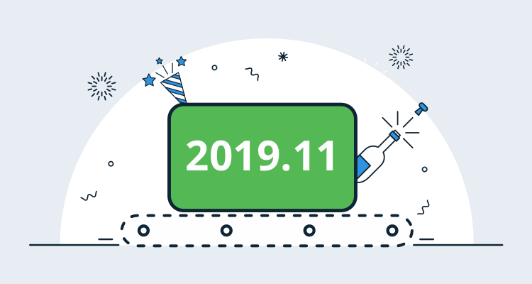

**Octopus Deploy 2019.11** is now available, this release introduces our Operations Runbooks feature and other numerous small improvements driven by customer feedback. 

We shipped [early access to Runbooks](/blog/2019-10/octopus-release-2019.10/index.md) in Octopus 2019.10 and we wrote about [why teams should care about them](/blog/2019-10/introducing-operations-runbooks/index.md). We’re excited to share that Runbooks has reached release to web (RTW) status. This means we’ve removed the early access feature toggle and we’re proud to ship a complete solution to help teams automate their operations tasks.

<h2>In this post</h2>

!toc

## Operations Runbooks

Our first-class Operations Runbook platform automates routine maintenance and emergency operations tasks, including infrastructure provisioning, database management, and website failover and restoration.

Our Operations Runbooks feature is now ready for production and includes the following:

* A familiar configuration process for anyone who has configured a deployment process.
* The ability to execute runbooks directly against infrastructure on-demand or on a schedule (nightly, weekdays, once a month, etc.) as per your team’s needs.
* Runbooks can be parameterized with prompted variables.
* You can make changes to your runbooks and only publish them after they have been safely tested.
* Runbooks are managed and executed by Octopus, so this means there’s a complete audit trail that can be reviewed at a later date, making it easy to see what happened, when and why, and if anything needs to be changed.
* You can give your entire team permission to execute your runbooks, without assigning everybody on the team permissions for the infrastructure the runbooks will execute against.

[Learn more](https://octopus.com/docs/deployment-process/operations-runbooks)

## Improvements driven by customer feedback

Our team continually adds updates and bug fixes driven by customer feedback and support tickets. We want to highlight some of these changes in this release:

* **Simpler Octopus dashboard configuration**, making it clearer to understand what is filtered.
* **Added support to test Azure DevOps issue tracker connectivity**. This change can help when configuring build server integration and work item tracking.
* **Space selection is no longer visible if a user only has 1 space** and they don’t have permission to add more.
* **Added support to upgrade a subset of Tentacles**. This applies to groups of Tentacles/Workers in an environment or worker pool rather than all deployment targets.
* Added support to **Redeploy previous successful deployments** so it’s easier to rollback other releases.
* **Swagger API documentation is far more accurate**, making it easier for teams to integrate with the Octopus API.
* **Improved performance to the Tenants page**. The Tenants page now renders much faster when customers have hundreds and thousands of tenants.
* **Improved supportability**. We’ve improved logging for automatic deploys and dynamic infrastructure provisioning to help teams understand what happens if things go wrong.

## Breaking Changes

The [Octopus API has changed](https://github.com/OctopusDeploy/Issues/issues/4925) as a part of this release, versions of Octopus.Client before 8.0.0 can not create scheduled triggers on an Octopus Server where the version is older than 2019.11.0.

## Upgrading

As usual, the [steps for upgrading Octopus Deploy](https://octopus.com/docs/administration/upgrading) apply. Please see the [release notes](https://octopus.com/downloads/compare?to=2019.11.0) for further information. Self-Hosted Octopus customers can [download](https://octopus.com/downloads/2019.11.0) the latest release now. For Octopus Cloud, you will start receiving the latest bits shortly during your maintenance window.

## Wrap up

This release is our final release of 2019, and we’re looking forward to 2020. Keep an eye on our [roadmap](https://octopus.com/roadmap) as we’re updating it regularly.

Happy deployments!
