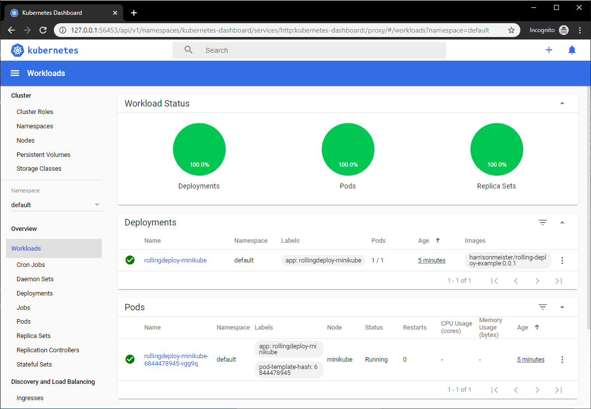
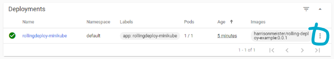
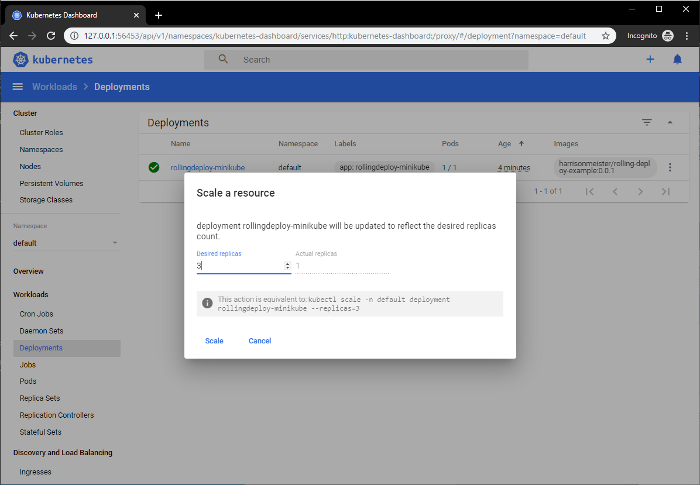
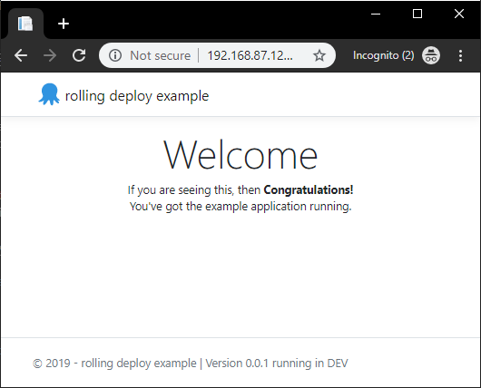
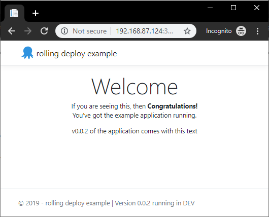
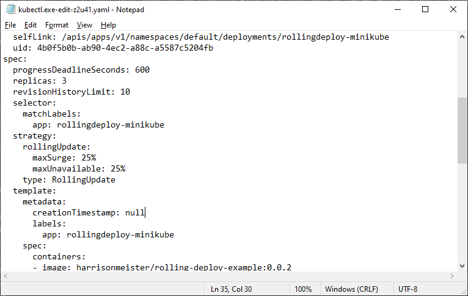

When tasked with deploying a new version of your application, such as a web site, I've often seen the approach where the entire site has been taken offline to accommodate the update. 
If the majority of your customers are asleep, then that's probably acceptable. But what happens if your customers are using your applications 24-7? 

Today, users expect applications to be available all of the time and there are a few deployment patterns you can use to achieve zero-downtime. In this post, I'll discuss one of these patterns in more depth; Rolling deployments, and provide you with some practical examples of how to do this using a number of different tools.

<h2>In this post</h2>

!toc

## What are rolling deployments?

A rolling deployment is a deployment pattern (also known as an incremental, batched or ramped deployment) where new software is delivered, usually to a small subset of deployment targets at a time, until all of the targets have the updated version of software rolled out.

A typical process looks something like this:

 1. With 4 nodes running `v1.0` of your application, drain the first 2 nodes to be updated, and take them out of the load-balancer pool. Leave the remaining 2 nodes online to serve traffic.


 2. Stop the `v1.0` application from running, then deploy the new `v2.0` version of the application. Optionally, also verify that the deployment was successful by running tests on your newly deployed application. All the while, still maintaining 2 nodes running `v1.0` of your appplication.

 

3. Once the first 2 nodes have updated successfully, proceed with draining any additional nodes still running `v1.0` of your application, whilst your new `v2.0` version is now online serving traffic.

 

 4. Stop the `v1.0` application on the remaining nodes from running, deploy the new `v2.0` version. Again, optionally verify the deployment was successful.

 
 
 5. Finally, once `v2.0` of your application has been deployed successfully to all 4 of your nodes, your rolling deployment is complete!


This incremental approach is often favoured in web applications which sit behind a load balancer, as most load balancers support a concept known as `Connection draining`. This is simply allowing connections to a service to finish naturally, as well as preventing any new connections to be established. 

By performing this action, instances which are selected to be updated, can be removed from the available pool after they have finished their work, whilst a number remain online serving traffic.

:::hint Although the scenario above describes a web application rolling deployment, it's possible to achieve rolling deployments for other types of application, providing they are built in a way which supports ending their process safely.
:::

For example, Octopus Deploy's [High Availability](https://octopus.com/docs/administration/high-availability) configuration also has a [drain](https://octopus.com/docs/administration/high-availability/managing-high-availability-nodes#ManagingHighAvailabilityNodes-Drain) option, which prevents any new tasks from executing, and finishes up any tasks it's currently executing until idle. Features like draining allow for the safe termination of a process, which can then be updated and brought back online. 

## Why are they useful?

So why use rolling deployments over other patterns (canary, blue/green)? Well, rolling deployments offer the following benefits:

### Incremental update
 
New versions of your application are rolled-out incrementally. This allows you to verify that it's working, for example, by running health checks or tests before moving on to the next batch of updates.

In the event that you need to initiate a rollback, you can also do this in a safe, controlled manner.

### Keeping the lights on

Whilst you go about updating a small number of your application instances, the rest continue to serve requests. This means there is no downtime for your application, as it's available for your users throughout the deployment.

### Parallelism

You can usually control the number of concurrent instances that are deployed to at any one time. Further deployments won't start until a previous deployment has finished.

:::hint
You can use the `Window size` option within an Octopus rolling deployment to control how many deployment targets can be deployed to at once.
:::

## Rolling deployment patterns in Practise

To demonstrate the different approaches for rolling deployments, we have a very simple .NET Core 3.1 application which will display a web page. 

The HTML for the section I'm interested in is shown below

```html
<div class="text-center">
    <h1 class="display-4">Welcome</h1>
    <p>If you are seeing this, then <strong>Congratulations!</strong> <br/> You've got the example application running. </p>
    
    @if(Settings.Value.AppVersion == "0.0.2") {
        <p>v0.0.2 of the application comes with this text </p>
    }
    @if(Settings.Value.AppVersion == "0.0.3") {
        <p>But don't miss out on v0.0.3 of the application which comes with this text! </p>
    }
</div>
```

We'll make changes to the ``AppVersion`` and roll this out using different tools. The code for the application is available on [GitHub](https://github.com/OctopusSamples/rolling-deploy-sampleapp) and has been published as the image [harrisonmeister/rolling-deploy-example](https://hub.docker.com/r/harrisonmeister/rolling-deploy-example).

### Docker rolling application updates

_TODO: Brief intro to Docker_

#### Docker containerised application

I am doing this exercise using [Docker Desktop](https://docs.docker.com/docker-for-windows/install) for Windows. For the sake of simplicity, I am running it predominantly from the command line. But there are production-ready setups to automate this, which feature the definition of your services in a [Docker Compose](https://docs.docker.com/compose/compose-file/) file.

:::hint
If you are new to Docker, my colleague Shawn has written an excellent series on [containers](https://octopus.com/blog/containerize-a-real-world-web-app).
:::

Firstly, to see the Docker image of this running standalone, we'll run it locally with the following command:

```ps
docker run -p 5001:5001 harrisonmeister/rolling-deploy-example:0.0.1
```

Unsurprisingly, running this Docker image locally displays the web page:


To deploy more than one instance of our container, we need to create a Docker [service](https://docs.docker.com/engine/reference/commandline/service) which uses [Docker Swarm](https://docs.docker.com/engine/swarm) as its orchestrator under the hood.

:::warning
**Docker Kubernetes Orchestrator**
Docker also supports Kubernetes as an orchestator when deploying containers using the Docker [stack](https://docs.docker.com/engine/reference/commandline/stack) command, but it's not possible to specify the orchestrator when using `service create`.
:::

So let's see what our command to create a service looks like:

```ps
docker service create --name rolling-deploy-svc --replicas 3 --publish published=5001,target=5001 --update-delay 10s --update-parallelism 1 harrisonmeister/rolling-deploy-example:0.0.1
```

There's quite a lot going on in that command, so let's unpick what we are asking of Docker here:
- The `--name` is pretty self explanatory. 
- The `--replicas` flag controls the number of containers we want (3).
- The `--publish published=5001,target=5001` specifies we want the service to be accessed on port 5001, using Swarm's [routing mesh](https://docs.docker.com/engine/swarm/ingress/#publish-a-port-for-a-service) which acts essentially like a software load-balancer.
- The `--update-delay` configures the time delay (10s) between updates to a service task.
- The `--update-parallelism` controls the maximum number of tasks that Docker will schedule simultaneously (1).
- Lastly, we specify the image to use: `harrisonmeister/rolling-deploy-example:0.0.1`

:::hint
**Hint**
When running ``service create`` for the first time, you may receive a warning, just as I did of: `This node is not a swarm manager`. To fix this, either run `docker swarm init` or `docker swarm join` to connect your local node to swarm.
:::

Executing this results in our service being deployed to Docker Swarm with 3 instances:

```
wxi1w4m7crknaz1f800kr9ztt
overall progress: 3 out of 3 tasks
1/3: running   [==================================================>]
2/3: running   [==================================================>]
3/3: running   [==================================================>]
verify: Service converged 
```

We can also check our service has the correct update configuration by running the command:

```ps
docker service inspect rolling-deploy-svc --pretty
```

The result of this shows we have our desired `UpdateConfig` 

```
ID:             wxi1w4m7crknaz1f800kr9ztt
Name:           rolling-deploy-svc
Service Mode:   Replicated
 Replicas:      3
Placement:
UpdateConfig:
 Parallelism:   1
 Delay:         10s
 On failure:    pause
 Monitoring Period: 5s
 Max failure ratio: 0
 Update order:      stop-first
RollbackConfig:
 Parallelism:   1
 On failure:    pause
 Monitoring Period: 5s
 Max failure ratio: 0
 Rollback order:    stop-first
ContainerSpec:
 Image:         harrisonmeister/rolling-deploy-example:0.0.1@sha256:a81de2d040159c8c88ee4b67ac1345fdfc7cfdb4c4f09d43d26c4cae94f884e7
 Init:          false
Resources:
Endpoint Mode:  vip
Ports:
 PublishedPort = 5001
  Protocol = tcp
  TargetPort = 5001
  PublishMode = ingress
```

#### Docker Rolling Update in action

Now we can update the container image for `harrisonmeister/rolling-deploy-example` to `v0.0.2` by running the following command:

```ps
docker service update rolling-deploy-svc --image harrisonmeister/rolling-deploy-example:0.0.2
```

Docker runs the update to each container, 1 task at a time just as we have configured it to:

```
overall progress: 0 out of 3 tasks 
1/3: running   [=============================================>     ]
2/3:
3/3:
```

Once the first task is complete, it moves onto task 2:

```
overall progress: 1 out of 3 tasks 
1/3: starting  [==================================================>]
2/3: ready     [=====================================>             ]
3/3: 
```

Until all of the tasks to update the containers to `v0.0.2` is complete:

```
overall progress: 3 out of 3 tasks 
1/3: running   [==================================================>]
2/3: running   [==================================================>]
3/3: running   [==================================================>]
verify: Service converged
```

Then browsing to the website shows the text which applies for `v0.0.2`


As you can see, it doesn't take much setup to get rolling deployments working in Docker!

### Kubernetes Rolling updates

Rolling deployments in Kubernetes is called [Rolling Updates](https://kubernetes.io/docs/reference/generated/kubectl/kubectl-commands#rolling-update). 

A Pod's instances will be updated incrementally with new ones. It supports both a max number or percentage of pods to be unavailable during an update, as well as a max number of new Pods that can be created. In addition to this Kubernetes has a handy built-in feature to allow updates to be reverted to a previous version.

The Kubernetes [tutorial](https://kubernetes.io/docs/tutorials/kubernetes-basics/update/update-intro/) on updates includes a nice diagram showing how it works:


#### Kubernetes cluster setup

I will be demonstrating using [Minikube](https://minikube.sigs.k8s.io/). Minikube runs a single-node Kubernetes cluster inside a Virtual Machine (VM). It's useful for people like me who want to try out Kubernetes or do some development with it.

Before you install Minikube, it's worth noting that there are some prerequisites for Windows:

- Windows 8 or above
- A hypervisor, like Hyper-V or VirtualBox
- Hardware virtualization support enabled in your BIOS
- At least 4GB of RAM

After installing Minikube, the first thing to do is to start it up:

```ps
minikube start --vm-driver=hyperv
```

On first initialisation, it will download the VM boot image and create a machine using your chosen Hypervisor, in my case Hyper-V:

```
* Downloading VM boot image ...
    > minikube-v1.5.1.iso.sha256: 65 B / 65 B [--------------] 100.00% ? p/s 0s
    > minikube-v1.5.1.iso: 143.76 MiB / 143.76 MiB [-] 100.00% 18.41 MiB p/s 8s
* Creating hyperv VM (CPUs=2, Memory=2000MB, Disk=20000MB) ...
* Preparing Kubernetes v1.16.2 on Docker '18.09.9' ...
* Downloading kubeadm v1.16.2
* Downloading kubelet v1.16.2
* Pulling images ...
* Launching Kubernetes ...
* Waiting for: apiserver
*Done! kubectl is now configured to use "minikube"
! C:\Program Files\Docker\Docker\Resources\bin\kubectl.exe is version 1.14.8, and is incompatible with Kubernetes 1.16.2. You will need to update C:\Program Files\Docker\Docker\Resources\bin\kubectl.exe or use 'minikube kubectl' to connect with this cluster
```

:::warning
**Docker Desktop and kubectl**
You'd be forgiven if you missed the error at the end of the command output above. 

Having installed Docker Desktop for Windows on my local machine first, it bundled an earlier version of kubectl, `1.14.8` with it. Next, when I installed Minikube, it required a later version: `1.16.2`. 

After a quick Google, I found the kubectl install [documentation](https://kubernetes.io/docs/tasks/tools/install-kubectl/#install-kubectl-on-windows) which even warns you about this issue:

> Note: Docker Desktop for Windows adds its own version of kubectl to PATH. If you have installed Docker Desktop before, you may need to place your PATH entry before the one added by the Docker Desktop installer or remove the Docker Desktop’s kubectl.

I fixed the error by adding my `PATH` entry before the one added by Docker Desktop.
:::

Once we have Minikube installed and running, let's go ahead and create a Kubernetes Deployment using our existing image `rolling-deploy-example`, and expose it on port 5001 as before, using the `--port` flag

:::hint

**Kubernetes Deployments**

Google describes Kubernetes [Deployments](https://cloud.google.com/kubernetes-engine/docs/concepts/deployment) as items which:

> represent a set of multiple, identical Pods with no unique identities. A Deployment runs multiple replicas of your application and automatically replaces any instances that fail or become unresponsive. In this way, Deployments help ensure that one or more instances of your application are available to serve user requests. Deployments are managed by the Kubernetes Deployment controller.
:::

#### Kubernetes containerised application setup

To set up our Deployment for our application, we run the following command:

```ps
kubectl create deployment rollingdeploy-minikube --image=harrisonmeister/rolling-deploy-example:0.0.1
```

The output from this command confirms our Deployment has been successfully created:

```
deployment.apps/rollingdeploy-minikube created
```

Next up, we need to gain access to our Deployment on port `5001`, so we run the `expose` command:

```ps
kubectl expose deployment rollingdeploy-minikube --type=NodePort --port=5001
```

The output confirms the command worked

```
service/rollingdeploy-minikube exposed
```

Although the `rollingdeploy-minikube` Pod will have been created, it might not be available immediately. We can check it's status by using the Kubernetes [dashboard](https://kubernetes.io/docs/tasks/access-application-cluster/web-ui-dashboard/) provided in Minikube:

```
minikube dashboard
```
This will enable and open the dashboard on your local machine. 

```
* Enabling dashboard ...
* Verifying dashboard health ...
* Launching proxy ...
* Verifying proxy health ...
* Opening http://127.0.0.1:55436/api/v1/namespaces/kubernetes-dashboard/services/http:kubernetes-dashboard:/proxy/ in your default browser...
```
You can use it to deploy containerized applications, manage and interact with your cluster resources. For example, you can initiate a rolling update.



In order to perform a rolling update we need more than one replica of our application. We can scale our Deployment from the dashboard, by clicking on the three ellipsis on the right hand side of the **Deployments** section:



For our Kubernetes application, I update the **Desired Replicas** to 3 replicas so I can perform a rolling update and then hit **Scale**.



:::hint
**Equivalent kubectl commands**
You may have noticed that the dashboard handily provides the equivalent command to run for our action. For scaling our resource, that is:

```
kubectl scale -n default deployment rollingdeploy-minikube --replicas=3 
```
:::

Once the Pods have been provisioned by the Kubernetes engine, we can confirm this by querying the Pod's status directly by running:

```ps
kubectl get pod
```

The result of this will show us the status of the Pod (Names may be different):

```
NAME                                      READY   STATUS    RESTARTS   AGE
rollingdeploy-minikube-6844478945-jnz8r   1/1     Running   0          71s
rollingdeploy-minikube-6844478945-tvl9b   1/1     Running   0          71s
rollingdeploy-minikube-6844478945-vgg9q   1/1     Running   0          71s
```

To verify our application is working, we can ask minikube for the url to the `Deployment` we created at the start:

```ps
minikube service --url=true rollingdeploy-minikube
```

The url for the service will then be displayed for us by minikube:

```
http://192.168.87.124:31861
```

:::hint
Note: The IP address will be different when running this on your own machine. A random port will also be assigned by Minikube.
:::

Opening the url in a browser, and we can see that we have `v0.0.1` of our application running in minikube:



#### Kubernetes Rolling Update in action

Let's go ahead and instruct Kubernetes to update our 3 pods with `v0.0.2` of our image `harrisonmeister/rolling-deploy-example` by running the following command:

```ps
kubectl set image deployment/rollingdeploy-minikube rolling-deploy-example=harrisonmeister/rolling-deploy-example:0.0.2 --record
```

If all is well, you will get an output similar to this:

```
deployment.apps/rollingdeploy-minikube image updated
```

Next, we can check the progress of our rollout by running::

```
kubectl rollout status deployment.v1.apps/rollingdeploy-minikube
```

This will provide a live progress of the rollout until its complete, and it is indicating that it is updating 1 Pod at a time:

```
Waiting for deployment "rollingdeploy-minikube" rollout to finish: 1 out of 3 new replicas have been updated...
Waiting for deployment "rollingdeploy-minikube" rollout to finish: 1 out of 3 new replicas have been updated...
Waiting for deployment "rollingdeploy-minikube" rollout to finish: 1 out of 3 new replicas have been updated...
Waiting for deployment "rollingdeploy-minikube" rollout to finish: 2 out of 3 new replicas have been updated...
Waiting for deployment "rollingdeploy-minikube" rollout to finish: 2 out of 3 new replicas have been updated...
Waiting for deployment "rollingdeploy-minikube" rollout to finish: 2 out of 3 new replicas have been updated...
Waiting for deployment "rollingdeploy-minikube" rollout to finish: 1 old replicas are pending termination...
Waiting for deployment "rollingdeploy-minikube" rollout to finish: 1 old replicas are pending termination...
deployment "rollingdeploy-minikube" successfully rolled out
```

Kubernetes Deployments ensure that only a certain number of Pods are down while they are being updated. It does this by creating a new Pod and destroying the old ones after it has completed.

:::hint
**Default Pod Update control**

By default, Kubernetes ensures that at there are at least 75% of the desired number of Pods available.
In addition, another default is to create no more than 25% of the overall desired amount of Pods.
:::

Opening the url in a browser, and we can now see that we have `v0.0.2` of our application running in minikube:



The Deployment's rollout was triggered here as `set image` caused an update to the underlying Deployment Pod's [Template](https://kubernetes.io/docs/concepts/workloads/pods/pod-overview/#pod-templates). A Template is a specification document which describes the way a [Replication Controller](https://kubernetes.io/docs/concepts/workloads/controllers/replicationcontroller/) should create an actual pod.

We can see what the Template looks like for our application by running:

```ps
kubectl edit deployment.v1.apps/rollingdeploy-minikube
```

This will open up the template file in a text editor, and on my machine that's Notepad:



You can edit this file interactively. Changing the Deployment Pod's template (the section within `.spec.template`) will result in triggering the Deployment's rollout. 

:::hint
**Note:**
Other updates to a Deployment, like the scaling we did earlier doesn't result in a rollout being triggered.
:::

It felt like there was a little more to the setup for a rolling deployment with Kubernetes than with Docker, but once configured, it worked excellently.

#### Kubernetes Deployment Rollback

A Successful rolling deployment is obviously what we all hope for, but it's inevitable that at some point, you'll need to initiate a rollback, either part of the way through a rollout itself, or some time after.

With Kubernetes, all of a Deployment's rollout history is kept in the system by default. That means, you can rollback anytime you want.

:::warning
 **Hint:**
 Whislt it's possible to change the amount of history that's stored for a Deployment's rollout (by modifying the revision history limit), it's not generally recommended. This limits your ability to rollback a deployment.
:::

To see the rollout history for our deployment, we can run:

```ps
kubectl rollout history deployment.v1.apps/rollingdeploy-minikube
```

This will display all of the changes to our `rollingdeploy-minikube` Deployment:

```
REVISION  CHANGE-CAUSE
1         <none>
2         kubectl.exe set image deployment/rollingdeploy-minikube rolling-deploy-example=harrisonmeister/rolling-deploy-example:0.0.2 --record=true
```

We can choose to revert back to the previously deployed version `v0.0.1` by running:

```ps
kubectl rollout undo deployment.v1.apps/rollingdeploy-minikube
```

If that succeeds, you should see the following:

```
deployment.apps/rollingdeploy-minikube rolled back
```

We can confirm we have rolled back, either by looking back in the dashboard, or running the `describe` command:

```ps
kubectl describe deployment
```

The output is as follows:
```
Name:                   rollingdeploy-minikube
Namespace:              default
CreationTimestamp:      Tue, 10 Dec 2019 17:38:29 +0000
Labels:                 app=rollingdeploy-minikube
Annotations:            deployment.kubernetes.io/revision: 3
Selector:               app=rollingdeploy-minikube
Replicas:               3 desired | 3 updated | 3 total | 3 available | 0 unavailable
StrategyType:           RollingUpdate
MinReadySeconds:        0
RollingUpdateStrategy:  25% max unavailable, 25% max surge
Pod Template:
  Labels:  app=rollingdeploy-minikube
  Containers:
   rolling-deploy-example:
    Image:        harrisonmeister/rolling-deploy-example:0.0.1
    Port:         <none>
    Host Port:    <none>
    Environment:  <none>
    Mounts:       <none>
  Volumes:        <none>
Conditions:
  Type           Status  Reason
  ----           ------  ------
  Available      True    MinimumReplicasAvailable
  Progressing    True    NewReplicaSetAvailable
OldReplicaSets:  <none>
NewReplicaSet:   rollingdeploy-minikube-6844478945 (3/3 replicas created)
```

Alternatively you can choose a specific revision to revert to by running:

```ps
kubectl rollout undo deployment.v1.apps/rollingdeploy-minikube --to-revision=1
```

### Azure DevOps?

_TODO?_

### Octopus Rolling deploy

_TODO_

## A word on the database

The elephant in the room I haven't discussed yet, is the database. Performing rolling deployments which involve some persistent storage such as a database can sometimes be tricky, though not impossible. The devil is in the detail.
If you want to perform rolling deployments with database changes involved, then I'd recommend deploying the database first. You'd also want to ensure any changes you make to your database are backwards compatible with previous versions of code you have deployed.

We have a series of posts on [database deployments](http://octopus.com/database-deployments) that go into more detail on this.

## Wrapping up

No matter which tool you are using, rolling deployments is just one pattern available in your toolset to optimise deployment of your software. But with an incremental approach, it allows you to keep your applications online whilst slowly rolling out newer versions of your software, making it a favourite of mine for minimal disruption.

Feel free to leave a comment, and let us know what you think about rolling deployments!
