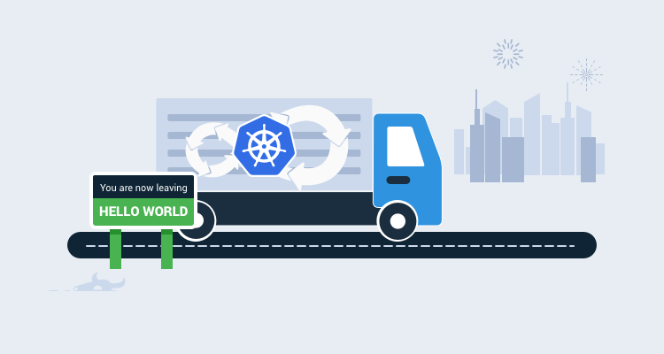

In the last post, I showed you how to set up a Kubernetes cluster using our OctoPetShop containers.

In this post, I configure the YAML files we created into a CI/CD pipeline.

## Create the build definition
Kubernetes doesn’t have anything that needs to be built, other than the Docker images it uses.  However, the YAML files that we created can be placed in source control and versioned so using a build server is still relevant.  Our [OctoPetShop](https://github.com/OctopusSamples/OctoPetShop) repo contains a k8s folder where we've placed all of the YAML files necessary to create our cluster, we'll use this as our source.  We'll be using TeamCity again as our build server for consistency.

### Setting the version number
In the Docker CI/CD post, we hardcoded our version number to 1.0.0.0 for our containers.  In this post, we're going to create unique version numbers for each build of our YAML files.  For simplicity, I'm going to set the version number to four digit year, two digit month, two digit day of month, and the revision (yyyy.MM.dd.r).

Add a PowerShell step to our build definition


Enter the following PowerShell to set the version number

```PS
Write-Host "##teamcity[buildNumber '$(Get-Date -Format "yyyy.MM.dd").%build.counter%']"
```

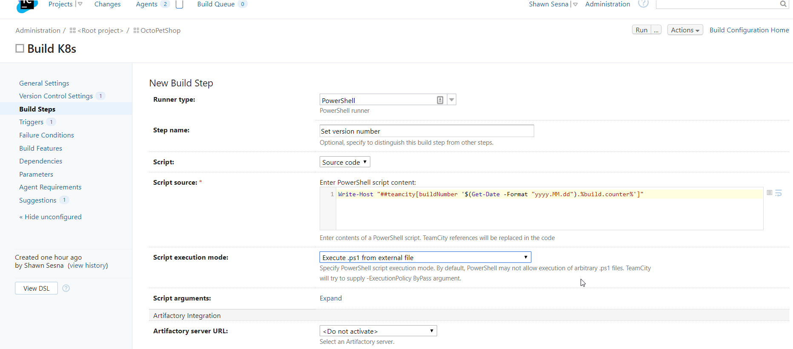

This will allow us to use `%build.number%` in subsequent steps to specify version numbers.

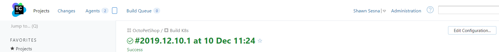

### Tweaking the YAML
The YAML in our repo has the password for the SA account of our SQL Server in plain text.  Let's take advantage of the Octopus Deploy Substitute Variables in Files feature and have it replace the password with a variable from or Octopus Deploy project.  To do this, we'll need to put the placeholder in the YAML file.  For example, open the octopetshop-database-job.yaml, change the password section of the connection string to look like this

```
apiVersion: batch/v1
kind: Job
metadata:
  name: octopetshop-dbup
spec:
  template:
    spec:
      containers:
        - name: dbup
          image: octopussamples/octopetshop-database
          command: [ "dotnet", "run", "--no-launch-profile" ]
          env:
            - name: DbUpConnectionString
              value: Data Source=octopetshop-sqlserver-cluster-ip-service;Initial Catalog=OctoPetShop; User ID=sa; Password=#{Project.SA.Password}
      restartPolicy: Never
```

Repeat this process for 
- octopetshop-productservice-deployment.yaml
- octopetshop-shoppingcartservice-deployment.yaml
- octopetshop-sql-deployment.yaml

If you are going to be running on a local K8s instance, it may be necessary to specify the external IP address in the octopetshop-loadbalancer.yaml file (hosted solutions such as Azure or AWS will usually connect it automatically for you).  Add an externalIPs component to the YAML file and set it to a placeholder:

```
apiVersion: v1
kind: Service
metadata:
  name: web-loadbalancer
spec:
  selector:
    component: web
  ports:
    - port: 5000
      targetPort: 5000
      name: http-port
    - port: 5001
      targetPort: 5001
      name: https-port
  type: LoadBalancer
  externalIPs:
  - #{Project.Kubernetes.LoadBalancer.ExertnalIp}
```

### Packing up the YAML
Using the Octopus Deploy Pack step, we can package up all of the YAML for our deployment into a NuGet package.


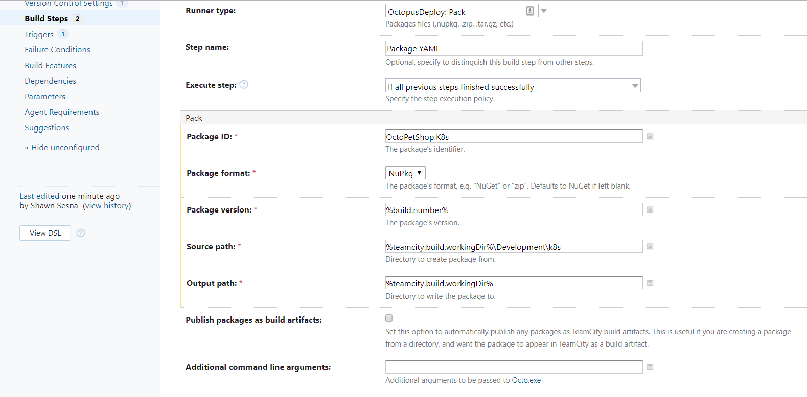

### Pushing the package to Octopus Deploy
With the Octopus Depoloy Push step, we can ship our NuGet package to Octopus Deploy!

:::hint
For demonstration purposes, we're using the built-in NuGet repository for Octopus Deploy.
:::

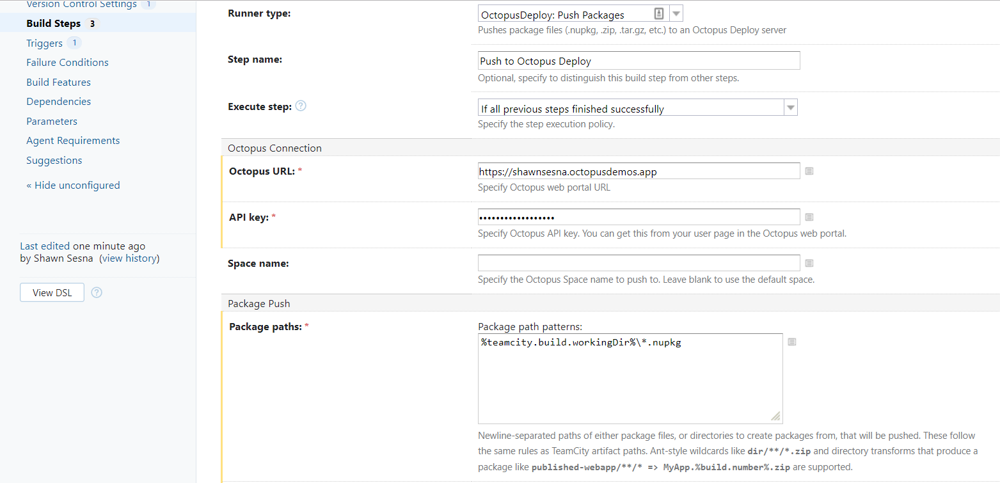

And that's all, folks!  Our build definition will now package up all the YAML files for our deployment and ship them over the our Octopus Deploy server!  Now comes the Continuous Delivery part :)

## Configure continuous delivery with Octoups Depoloy
With our YAML files package in Octopus Deploy, we can create our deployment process.  In this section we'll be doing the following:
- Create a new project
- Define our deployment steps

### Create the Octopus Deploy project
To create a new project, cluck on the **Projects** tab, and click the **ADD PROJECT** button:


Give the project a name, and click **SAVE**


Let's add some steps to our project.  On the **Process** tab of your project, click **ADD STEP**:

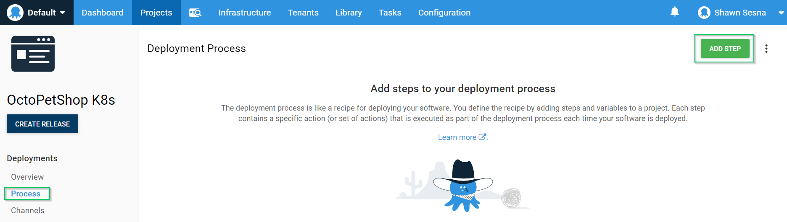

The steps in our process are going to be nearly identical with the only difference being the file specified.  I'll walk you through the first one

Add a Deploy raw Kubernetes YAML step to our process


This first step will deploy the SQL Server Cluster IP Service.  Deploying to Kubernetes is done via API, this means that all of tasks need to be handled by Workers versus traditional Deployment Targets.  You'll need to make sure a version of kubectl is installed on the Workers to make this work.

For YAML Source, choose File inside a package, specify the package and the file within the package


If you're deploying to a namespace, be sure to fill in that section of the form.

That's it for this step!  The rest of the steps are exactly the same with the only difference being the file name.  Once you're done, you should have something like this:

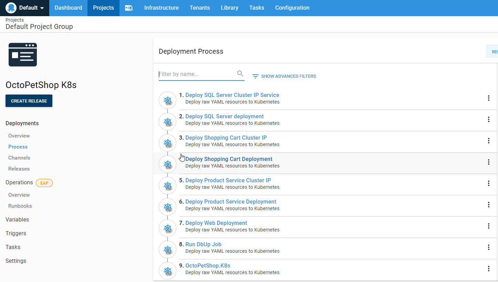

Okay, we're almost done!  All we have left to do is put in our project variables.  Click on the Variables tab on the left-hand side

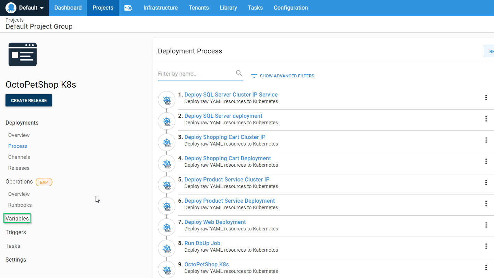

Create a new variable called Project.SA.Password and make it sensitive

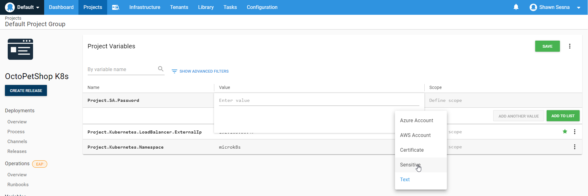

Give it a value that conforms to the password complexity requirements of SQL Server 2017.

The last part to do before we're ready to create a release is to change the release numbering to match our build version.  This will allow us to tie a release directly to the build that created it.  To do this, click on the Settings tab


Expand the Release Versioning section


Choose Use the version number from an included package, then select our OctoPetShop.K8s package

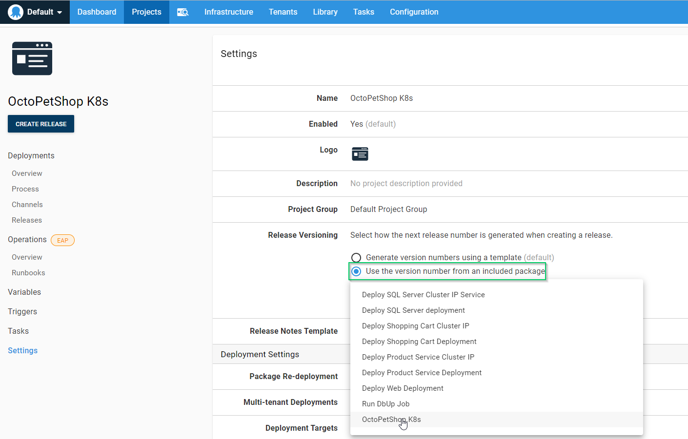

We are now ready to create a release!  So ... let's do it!  Click the **CREATE RELEASE** button!

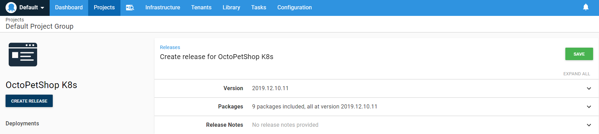

Nothing to change on this page, just click **SAVE** then 

Click **DEPLOY** for the Development environment

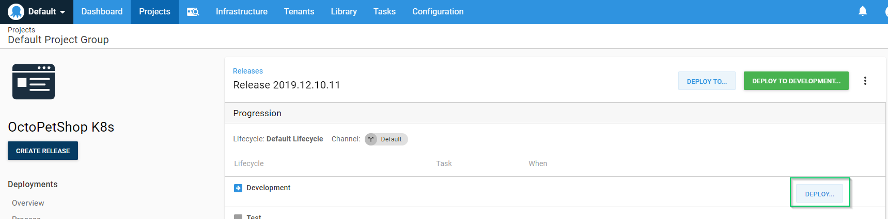

Finally, cofirm we want to deploy by clicking **DEPLOY**

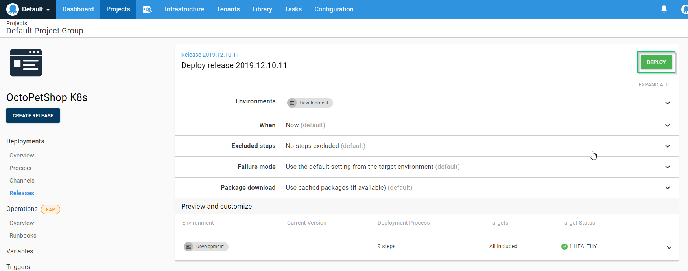

When the deployment is complete, you should see something like this


With the deployment, we can navigate to our server to see our application!  

:::hint
Our .NET Core application will redirect to SSL, if you get a warning about the site being insecure, it's OK in this case.
:::

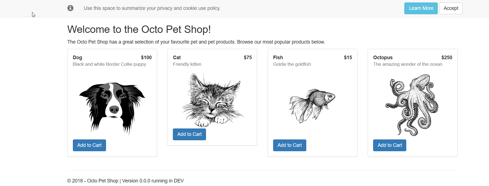

## Continuous Delivery only alternative
So far, our process has relied on us creating the YAML to define our Kubernetes cluster.  With Octopus Deploy, there is an alternate way of deploying to Kubernetes that doesn't involve using a build server or knowing YAML!

The Deploy Kubernetes containers step template contains a form that we can define all of the properties necessary for our Kubernetes cluster without having to write a single line of YAML.

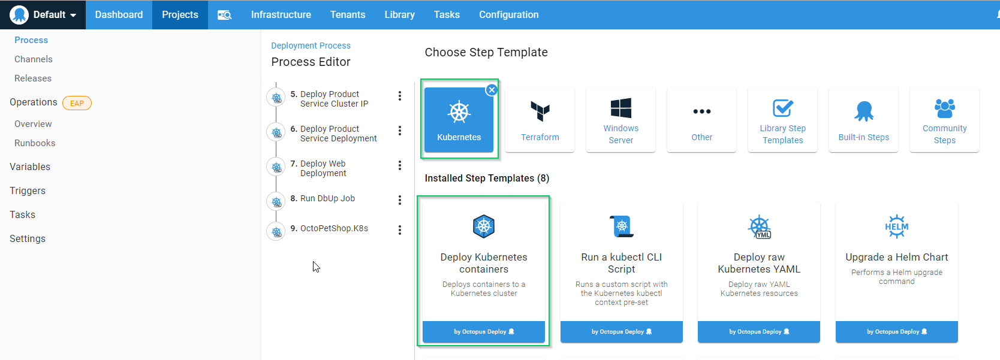

This form is quite extensive and will allow you to create everything you need for your Kubernetes cluster such as

- ClusterIP Services
- Ingress Services
- Deployments
- Service Port mappings
- Config mappings
- Secrets
- Volumes
- Containers
- Container Environment Variables
- Container Port Mappings
- and much more!


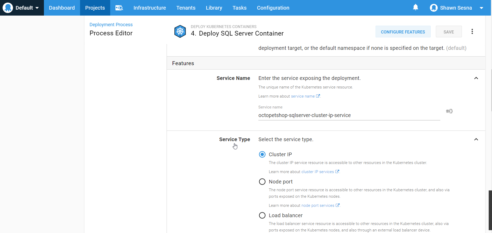


This approach will allow us to skip the CI portion alltogether and focus on the CD portion of our pipeline for Kubernetes.

:::hint
The form method dynamically writes the YAML at deploy-time, you'll need to make sure that the version of kubectl installed on the Worker uses the same API format as the version of Kubernetes you're deploying to.  In my case, I was using MicroK8s on Ubuntu 18.04 which didn't seem to reference the same API version
:::

## Conclusion
In this post I demonstrated how to use Kubernetes in a CI/CD pipeline.  I also demonstrated a method of deploying to Kubernetes that only uses the CD portion of the pipeline.