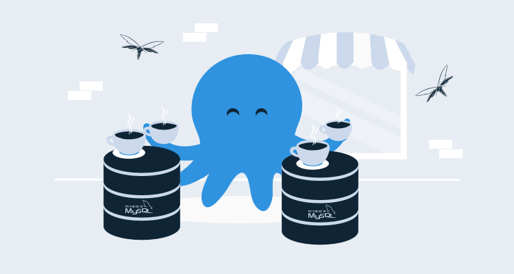

In this post, I walk through how to build and deploy a Java-based web application that uses a MySQL backend database.

## Setting up the build server

For this demonstration, I used Azure DevOps as my build server.  When people think of Azure DevOps, they immediately think .NET/.NET Core, not Java.  However, the Microsoft build server comes with both Maven and ANT build tasks built-in to their task library.

Wait, that seems... too easy.

You’d be right to be suspicious, though the tasks exist, they don’t actually work without a little configuration. Luckily for us, it’s all rather straight-forward.

### Java on the build agent
To build Java, you need the Java Development Kit (JDK) on your build agent, which can be downloaded from [OpenJDK](https://openjdk.java.net/).  If you’re a Windows user like me, there are two additional steps necessary to make Java functional:

- Create the JAVA_HOME Environment Variable and set it to the root of your Java installation (i.e., c:\Program Files\Java).
- Add the \bin folder to the Path Environment Variable (i.e., c:\Program Files\Java\JavaVersion\bin).

### Maven on the build agent
The next thing we need to do is install Maven on our build agent.  Maven doesn’t have an installer, it’s a .zip file that needs to be extracted and placed on the build agent. Similar to Java, we need to configure the Environment Variables:

- Create MAVEN_HOME and point it to the location where Maven was extracted (i.e., c:\maven).
- Add the \bin folder to the Path Environment Variable (i.e., c:\maven\bin).

### Add the Maven capability
If you‘re creating a new build agent, this step might not be necessary, part of the agent installation scans the machine for capabilities and will automatically add Maven if it’s found.  If you’re using an existing agent, you need to go into Azure DevOps (ADO) and add the capability to the agent manually.

Navigate to the Agent Pools section of ADO.  Select the agent you want to modify and click **Capabilities**:


Click the **Add capability** button and add the following (see the screenshot for the values I used):

- JAVA_HOME
- maven
- MAVEN_HOME


Now, your ADO instance can build Maven projects.

:::hint
The steps for configuring ADO to build ANT projects are nearly identical to these.  Replace Maven with ANT for the build agent and capability sections.
:::

## The sample application
For this demonstration, I’m using the [Pet Clinic](https://github.com/spring-petclinic/spring-framework-petclinic) sample application, originally developed to demonstrate the capabilities of the Spring framework.  Pet Clinic was already configured to be built with Maven and also has the ability to use MySQL as a database backend.  Out of the box, Pet Clinic is completely functional, so naturally we had to modify it.

### Tweaking the POM
There were some tweaks I needed to make to the POM.XML (Maven Project Object Model) file to make it work for this post:

- Make the `<version>` attribute dynamic using a variable.
- Switch the active profile to MySQL.
- Alter the `jdbc.url` of the MySQL profile to use variables.
- Alter the `finalName` attribute.
- Update the `cssDestinationFolder` attribute.

#### Making the version number dynamic
The version number in the original project was hardcoded, but I wanted to make this a dynamic value based on the build number.  This is easily accomplished with variables which are inserted into the Maven build process. Locate `<version>5.2.1</version>` in the POM.xml file and change it to `<version>${project.versionNumber}</version>`.

:::hint
The variable name `project.versionNumber` is the name I chose, but you can name it whatever you want.
:::

#### Change the active database profile to MySQL
The author(s) of this repo did a fantastic job of making this application support multiple database backends: HyperSQL, MySQL, and PostgreSQL.  The default is set to the HyperSQL profile (HSQLDB).  To change it to MySQL was simply a matter of moving the `<activation>` XML node from the HSQLDB profile to the MySQL profile.  

To do this:

1. Locate the `<profiles>` XML node in the POM.XML file.
2. Locate the `<profile>` node that has a child node of `<id>HSQLDB</id>`.  Directly underneath the `<id>` node is an `<activation>` node.  
3. Move the `<activation>` node to the MySQL node.  

The resulting MySQL node should look like this:

```
<profile>
    <id>MySQL</id>
    <activation>
        <activeByDefault>true</activeByDefault>
    </activation>            
    <properties>
        <db.script>mysql</db.script>
        <jpa.database>MYSQL</jpa.database>
        <jdbc.driverClassName>com.mysql.jdbc.Driver</jdbc.driverClassName>
        <jdbc.url>jdbc:mysql://${databaseServerName}/${databaseName}?useUnicode=true</jdbc.url>
        <jdbc.username>root</jdbc.username>
        <jdbc.password></jdbc.password>
    </properties>
    <dependencies>
        <dependency>
            <groupId>mysql</groupId>
            <artifactId>mysql-connector-java</artifactId>
            <version>${mysql-driver.version}</version>
            <scope>runtime</scope>
        </dependency>
    </dependencies>
</profile>
```

#### Alter the jdbc.url of the My profile to use variables

When the Maven project is compiled, the properties of the active database profile are copied into the `/WEB-INF/classes/spring/datasource-config.xml` file within the resulting .war archive.  The `datasource-config.xml` is the file that is used for the connection string to the database for this application.  In the above code sample, we changed the connection string for the server and database to use the variables `databaseServerName` and `databaseName`:

```
<jdbc.url>jdbc:mysql://${databaseServerName}/${databaseName}?useUnicode=true</jdbc.url>
```

#### Alter the finalName attribute
The `finalName` attribute of the POM.XML is the name the .war archive will be given when the project is packaged.  The default `finalName` is `petclinic`:

```
<finalName>petclinic</finalName>
```
When built, this results in a filename of petclinic.war.  Octopus Deploy uses [Semantic Versioning](https://semver.org/), which has a version number embedded in the file name.  The `version` attribute of the POM.XML file will work perfectly for this as we’ve already made it dynamic.  Update your `<finalName>` attribute to:

```
<finalName>petclinic.web.${project.version}</finalName>
```

I added the `.web.` part to more easily identify which component this is within Octopus Deploy.

#### Update cssDestinationFolder attribute
As I went through the exercise of getting this to work on my local system, I came across a nasty surprise when I changed the `finalName` attribute of the POM; none of the css made it into to final product.  After some troubleshooting, I found the action that copies the css into the application uses the `finalName` value for the path to copy to.  To fix it, I updated the `<cssDestinationFolder>` attribute from:

```
<cssDestinationFolder>${project.build.directory}/petclinic/resources/css</cssDestinationFolder>
```
to:
```
<cssDestinationFolder>${project.build.directory}/petclinic.web.${project.version}/resources/css</cssDestinationFolder>
```
:::hint
If your application renders the following image your `<cssDestinationFolder>` is incorrect:


:::

### Updating datasource-config.xml

With this example application, I learned it ran the included database scripts whenever it was deployed.  After a bit of digging, I found I could comment out some XML in the datasource-config.xml file that would stop this.  I still need the database scripts, I just don’t want them to execute every time the application is deployed.  More on this later.

Navigate to `/src/main/resources/spring/datasource-config.xml` and comment out the Database initializer section.  It should look like this:

```
    <!-- Database initializer. If any of the script fails, the initialization stops. -->
    <!-- As an alternative, for embedded databases see <jdbc:embedded-database/>. -->
    <!--
    <jdbc:initialize-database data-source="dataSource">
        <jdbc:script location="${jdbc.initLocation}"/>
        <jdbc:script location="${jdbc.dataLocation}"/>
    </jdbc:initialize-database>
    -->
```
## Adding a Flyway project
[Flyway](https://flywaydb.org) is a migrations-based database deployment tool.  In a nutshell, it’s a command-line utility that you include in your project, that uses a specific folder structure to execute SQL scripts in a specified order.  The Flyway download is essentially the project you will add to your project source control.

### Adding the .sql scripts to Flyway
Within the Java application source, copy the .sql files located in `src/main/resources/db/mysql` to the `/sql` folder of your Flyway project.  Then, rename the files to conform with how [Flyway works](https://flywaydb.org/getstarted/how).  For instance:

- V1__initDb.sql
- V1_1__populateDb.sql

And that’s it!

## Creating the build definition
Now that we’ve done the prerequisite work of installing Maven on the build agent, tweaked a couple of files, and added Flyway, we can create our build definition.

### Adding the Maven task
Create a new build definition, this demonstration uses the classic editor instead of the YAML approach:

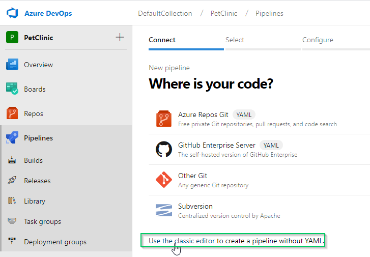

Start with an empty job:


Add the Maven build task:


Fill in the task input fields:

- Display name:
    - This value doesn’t matter.
- Maven POM file:
    - If your `pom.xml` is not in the root folder, use the ellipses (…) to locate it.
- Goal(s):
    - `clean package dependency:purge-local-repository`
- Options:
    - `-Dproject.versionNumber=$(Build.BuildNumber) -DdatabaseServerName=$(DatabaseServerName) -DdatabaseName=$(DatabaseName) -DskipTests=$(SkipTests)`

:::hint
The dependency:purge-local-repository goal may not be necessary, but I like to clean my sources folder when building.
:::


Navigate to Variables and create the following:
- DatabaseName: `#{Project.MySql.Database.Name}`
- DatabaseServerName: `#{Project.MySql.Database.ServerName}`
- SkipTests: `true`

If you’re not familiar with the #{} syntax used for the variable value, Octopus Deploy uses this for variable replacement.

Skipping the tests was necessary as the tests attempt to connect to the database backend.  Since we are making them variables for our deployment process, the connection attempt will fail and fail the build entirely:

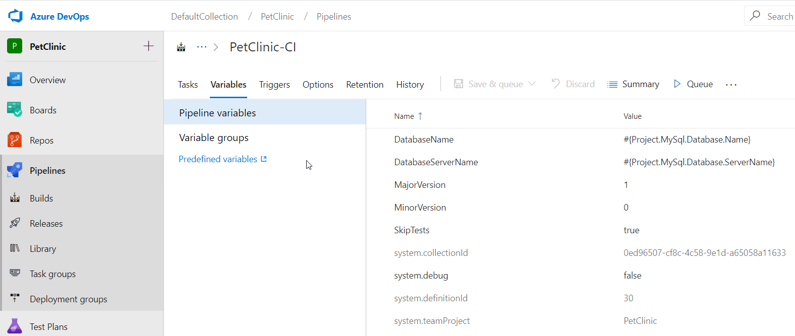

You’ll note that there are two additional variables defined; `MajorVersion` and `MinorVersion`.  I use these variables to create my Build Number format within ADO.  To set this, click the Options tab and fill in the Build number format, I used `$(MajorVersion).$(MinorVersion).$(Year:yy)$(DayOfYear).$(Date:Hmmss)`:


This is the value ADO references for `$(Build.BuildNumber)` which we feed into the `project.VersionNumber` variable we are passing into the Maven build task.

That’s it for the Maven task. `.war` is a supported file type for the built-in package repository in Octopus Deploy, so there’s no need to package the Java application.

### Packaging the Flyway project
As previously mentioned, Flyway is a command-line utility, so there’s no building the project.  The only thing we need to do is package it so that Octopus Deploy can do something with it.  For this, we can use any task that creates a ZIP or NuGet package.  This demonstration uses the Octopus Deploy plugin, Package application task:  

- Package ID: `petclinic.flyway`
- Package Format: `NuPkg`
- Package Version: `$(Build.BuildNumber)`
- Source Path: `$(Build.SourcesDirectory)\flyway`
- Output Path: `$(build.stagingdirectory)`

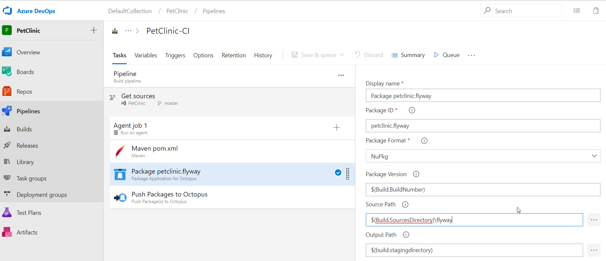


### Pushing to Octopus Deploy
The last part of our build process is pushing the packages that we created to our Octopus Deploy server.  Add a Push to Octopus Deploy task:

- Space: Select your space.
- Package:
 - `$(Build.SourcesDirectory)\target\*.war`
 - `$(build.artifactstagingdirectory)\*.nupkg`


 

 That’s it for your build definition.

## Creating the Octopus Deploy project

In the Octopus Deploy web portal, click the Projects tab, then click **ADD PROJECT**:

 

Give the project a name then click **SAVE**.  Optionally, you can select which project group to put it in and which Lifecycle to use:


### Variables

After we click **SAVE**, we’re taken directly into our brand new project. Click on Variables to define some of our variables, as we need them to exist first before we define our process:


On the Variables screen, we create the following variables:
- `Project.MySql.Database.Name`
- `Project.MySql.Database.ServerName`
- `Project.MySql.Database.User.Name`
- `Project.MySql.Database.User.Password`

Namespacing your variables is considered a best practice for Octopus Deploy; it helps users identify where the variable is coming from and what it’s used for.

#### Project.MySql.Database.Name
This variable is one of the variables we set up with our build process using the #{} syntax.  We’ll cover how the variable is replaced soon.  For now, give this variable the value of your database name.  In my case, I used `petclinic`.

#### Project.MySql.Database.ServerName
It is often the case that the database server is different as you go from one environment to another.  This variable will use the value that is scoped to the environment being deployed to.

#### Project.MySql.Database.User.Name
As the name suggests, this is the User Name for the database connection.

#### Project.MySql.Database.User.Password
This is the password for the user account for the database connection:

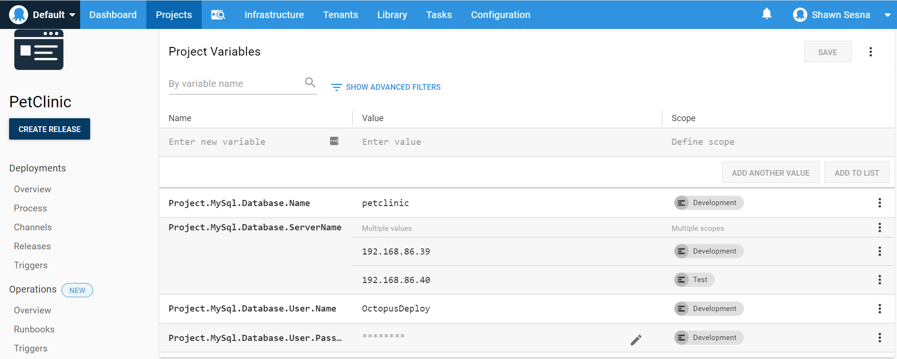

### Process
With our variables defined, let’s create our process.  Click on the **Process** button:


#### Add Deploy Package Step
On the Process screen, click the **ADD STEP** button:

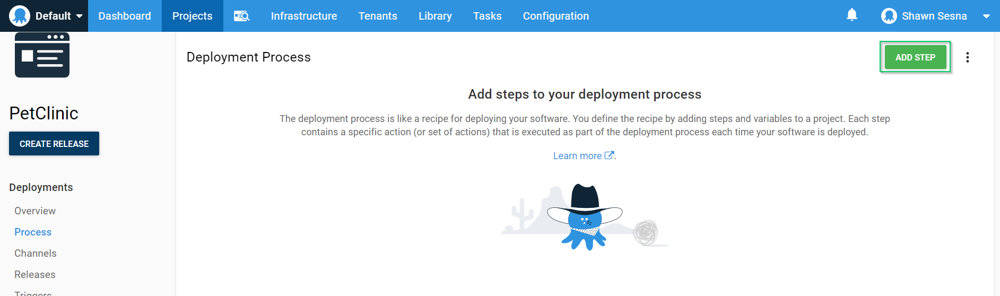

Choose the **Package** category and the **Deploy a Package** step:

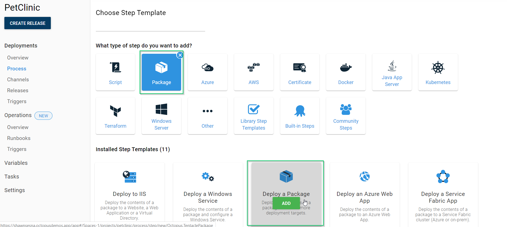

Fill in the properties of the step:
- Step Name: `Deploy Flyway package`.
- On Targets Roles: `PetClinic-Db` (this is what I named the role).
- Package: `petclinic.flyway`.

This is what the step looks like after you click **SAVE**:

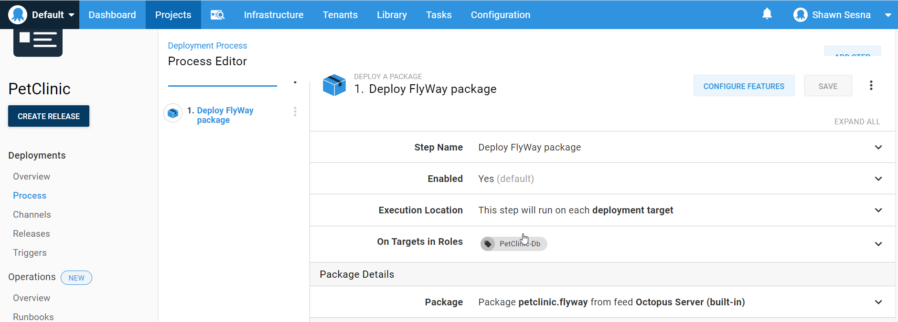

##### Variable replacement (Optional)
If you’ve placed any #{} variable placeholders in any of your .sql scripts (I did), you’ll need to configure this step to perform the variable replacement.

Click the **CONFIGURE FEATURES** button:


Select **Substitute Variables in Files**:

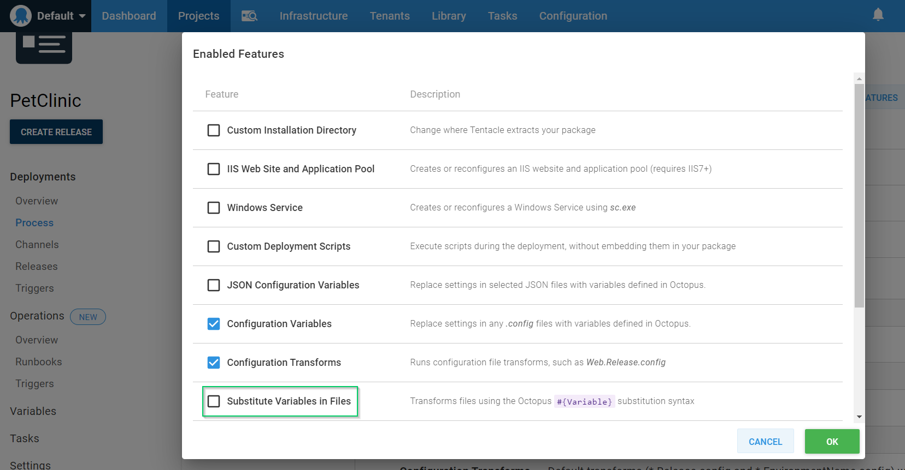

Click **OK**, then scroll down and expand the Substitute Variables in Files section.  For **Target files**, enter the value `sql/*.sql` and click **SAVE**:


#### Add the Flyway Migrate step
This step is available on the Community Step Template Library.

As before, click the **ADD STEP** button.  When the window comes up, type in flyway to filter the steps. Mouse-over Flyway Migrate and click **Install and Add**:


You’ll be prompted to Install and Add, click **SAVE**:


Fill in the required properties of the step template:
- On Targets in Roles: `PetClinic-Db` (this is what I named the role).
- Flyway package step: Use the drop down to select the **Deploy Flyway package** step.
- Target -url: `jdbc:mysql://#{Project.MySql.Database.ServerName}/#{Project.MySql.Database.Name}?useUnicode=true`
- Target -user: `#{Project.MySql.Database.User.Name}`
- Target -password: `#{Project.MySql.Database.User.Password}`

Since this is a sensitive variable, we need to click the Bind icon to set it to use a variable:


That’s it for this step, click **SAVE**.

::: hint
At the time of writing, the Deploy a Package step and the Flyway migrate step must be executed on a target.  However, a worker friendly version of a Flyway Migrate step is under review.
:::

#### Deploying the website step
Octopus Deploy has built-in steps for the two most popular web servers for Java-based applications, Tomcat and JBOSS/Wildfly.  This demonstration makes use of the Wildfly step.

As before, click **ADD STEP**, then filter by Wildfly.  Choose the **Deploy to Wildfly or EAP** step template:

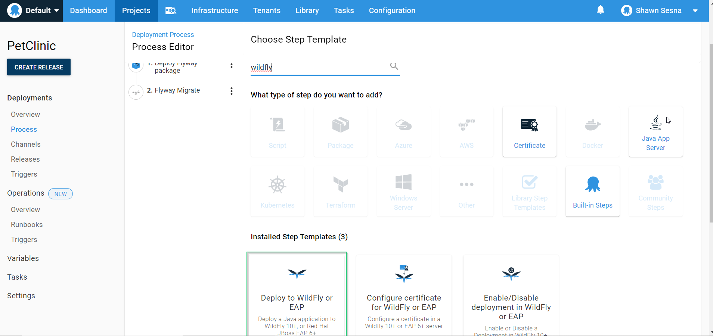

Fill in the details for the step template:
- Step Name: `Deploy Petclinic Web`
- On Targets in Roles: `Petclinic-Web`
- Package ID: `petclinic.web`
- Management host or IP: `#{Octopus.Machine.Hostname}` (this is a system variable that uses the hostname of the machine being deployed to.)
- Management user: `[Your management user]`
- Management password: `[Password for management account]`
- Deployment name: `PetClinic.war`


There’s one last thing to configure for the Wildfly step, replace the #{} variables in the datasource-config.xml.  Click the **CONFIGURE FEATURES** button and select the **Substitute Variables in Files** as we did in the **Deploy a Package** step. In the **Target files** section, enter the following value
`WEB-INF/classes/spring/datasource-config.xml`.

:::hint
Use of `/` instead of `\` is to support Linux deployment targets and still works for Windows targets.
:::

That’s it. Let’s create our first release.

## Deployment time
We’re now ready to deploy our application.  Click the **CREATE RELEASE** button:

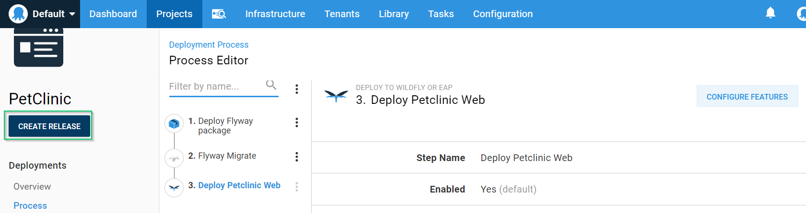

Click **SAVE**:

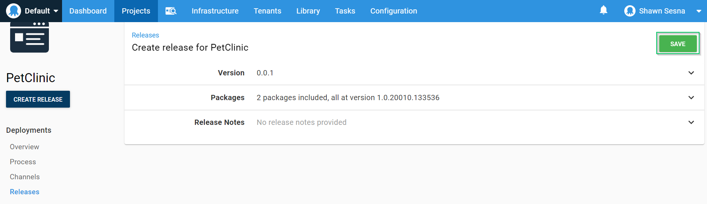

Click **DEPLOY TO DEVELOPMENT** (replace DEVELOPMENT with whatever you named your environment):

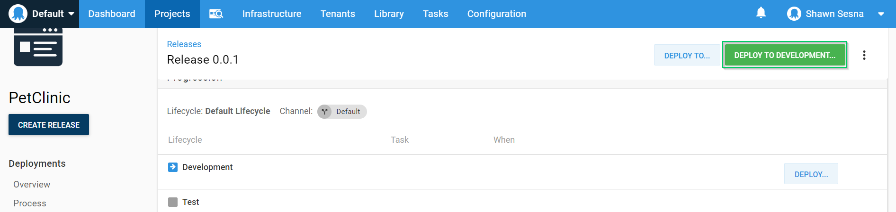

Click **DEPLOY**:


When finished, you should have a screen that looks like this:

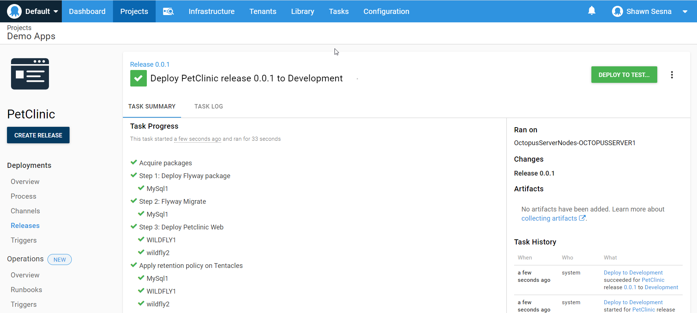

Note the deployment to the web server got deployed to two servers, Wildfly1 (Windows) and Wildfly2 (Linux).

Click the **TASK LOG** tab to see more detailed information about our deployment:

Flyway:
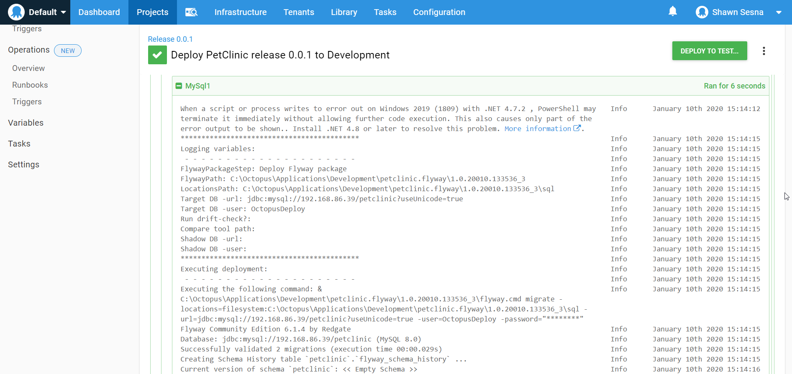

Wildfly:
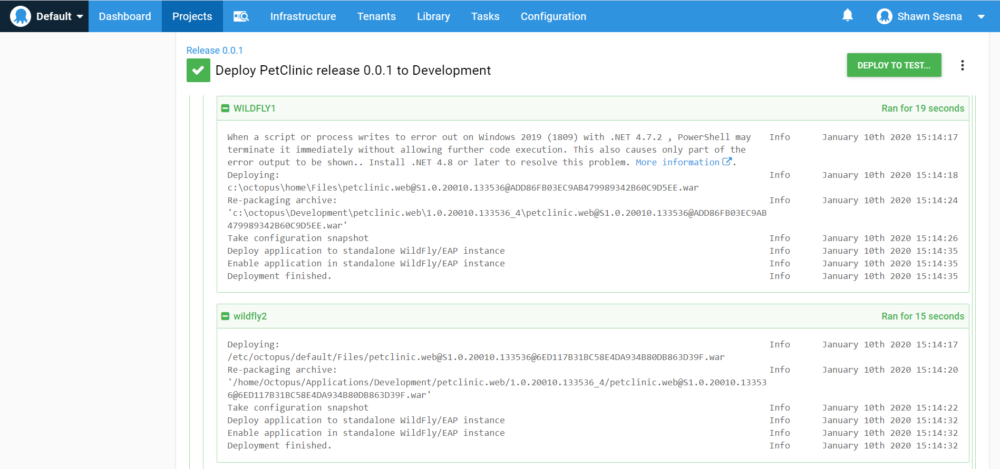

PetClinic:


## Conclusion
In this post, we configured a CI/CD pipeline to build and deploy a Java-based web application using Flyway to manage the MySQL database!

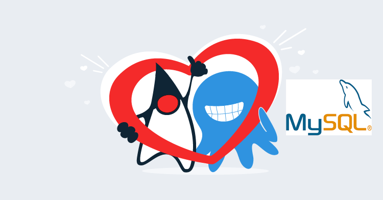
