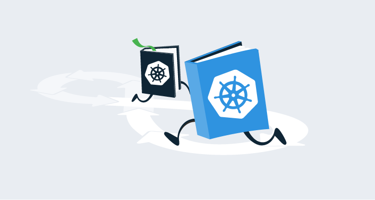
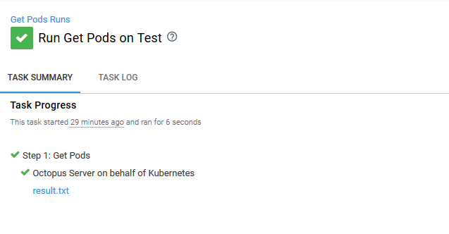

Operations Runbooks in Octopus put the Ops in DevOps. This post is part of a series:

- [Operations Runbooks overview](/blog/2020-01/operations-runbooks/index.md)
- **DevOps, Runbooks and kubectl**
- [Chaos engineering and runbooks](/blog/2020-01/chaos-engineering-and-runbooks/index.md)
- [Linting your Kubernetes cluster with Clusterlint and runbooks](/blog/2020-01/clusterlint-with-runbooks/index.md)

--- 

It is safe to say the sentiment that [Devs shouldn’t have to learn Docker, K8s, or 30 other things to deploy an app](https://www.theregister.co.uk/2018/02/22/ibm_java_cto_john_duimovich_interview/) is something more than a few of us agree with.

Let’s be honest, Kubernetes isn’t easy. But there are ways to make supporting it less painful. The new Runbooks feature in Octopus lets you script the same processes that have been powering Octopus deployments for years, to manage routine maintenance and emergency ops tasks across your environments without creating deployments.

In this blog post, we’ll look at a simple runbook and highlight the advantages of creating reusable runbooks over manual scripting and ad-hoc debugging.

## A simple runbook

Listing Kubernetes pods to see their status is a common first step when supporting a Kubernetes cluster. This sounds easy enough, and it’s tempting to think this process is nothing more than running `kubectl get pods`. But with runbooks it is possible to enrich this diagnostic procedure. Below is an example of a **Get Pods** script you might create as part of a runbook:

```PowerShell
$arguments = @("get", "pods")

if ($Format -ieq "YAML") {$arguments += @("-o", "yaml")}
if ($Format -ieq "JSON") {$arguments += @("-o", "json")}

$result = & Start-Process `
	-FilePath 'kubectl.exe' `
    -ArgumentList $arguments `
    -NoNewWindow `
    -Wait `
    -RedirectStandardOutput "result.txt"

Get-Content "result.txt"

New-OctopusArtifact "result.txt"

# Add some intelligence to guide the troubleshooter
$notRunning = & kubectl get pods -o json |
	ConvertFrom-JSON |
    Select -ExpandProperty items |
    Where-Object {$_.status.phase -ne "Running"}

if ($notRunning.Count -ne 0) {
	Write-Host "The following pods are not in a Running state. These are worth investigating further."
	$notRunning |
    ForEach-Object {Write-Host "$($_.metadata.name) is not running."}
}
```

We start the script by building up an array of arguments to be passed to `kubectl`. The base arguments are `get pods`, but depending on the value of a prompted variable called `Format` we can also get the details of the pods in JSON or YAML. The response from the call to `kubectl` is saved to a file called `result.txt`.

The `New-OctopusArtifact` Cmdlet takes the file and saves it as an Octopus artifact, which is then available from the task summary after the process has completed.



The script then calls `kubectl` again, this time looking for pods that are not in the running state. Any pods found are listed in the output.

This script is not particularly complex or clever, but it does highlight a number of benefits to using runbooks.

## No local tooling required

At the very least interacting with a Kubernetes cluster requires the `kubectl` command-line tool to be installed. Depending on the cluster, you may also need additional authentication executables to be available.

In my experience the *support laptop* is something that sits under a desk, whether in the office or at the home of the person on call that week. If things have been done right, the laptop is rarely used and updated even less frequently. This is a problem when you consider the range of command-line tools used for interacting with Kubernetes, some of which (like `helm`) can be particularly fickle when it comes to versioning.

By executing `kubectl` and other Kubernetes CLI tools from a runbook, you no longer need to install local tools. All you need is a web browser, and the Octopus server (or workers) configured with the required tools.

## No additional permissions required

If you are following best security practices, your Kubernetes cluster will not have a single administrator account, but instead, limited service accounts for each functional area in the cluster. The passwords for these accounts will be refreshed frequently to limit the potential damage of any leaked credentials.

But how do you share these credentials with your support team?

Using runbooks removes the burden from the end user to maintain infrastructure credentials. Each Kubernetes target can have as much or as little access to the cluster as needed, and Octopus permissions can limit who can run which runbooks on which targets.

## Enrich scripts with business intelligence

`kubectl` is a big hammer that can do almost anything on a Kubernetes cluster if you have the required permissions. But it will never have the business intelligence that is specific to your use case.

In the example script above, we have specifically queried Kubernetes for pods that are in a non-running state. To Kubernetes, a non-running pod is just a possible state a pod can be in, but in your business this might be the first thing to look for when troubleshooting.

This kind of business knowledge is all too often hard won during long nights on support, and then shared through war stories between individuals. But with a runbook it can be baked into a standard process for anyone to see.

## Detailed audit trails

Priority number one during an outage is getting a cluster back online. But the next day is then spent trying to reverse engineer the root cause of the issue.

Why were those particular pods restarted? What was in the log files? How many resources were the pods using before they were deleted? All too often the answers to these questions are lost when the local terminal running `kubectl` is closed.

With runbooks, the result of each query is captured in a log file, and the history of each action is captured in an audit log. You can also ensure that a `kubectl delete pod` is *always* preceded by a `kubectl logs` or `kubectl describe pod`, making the state of a deleted pod easy to review the next day.

## A common context

Best practice for continuous deployments involves pushing changes through environments. High availability means spreading your production infrastructure across availability zones or regions, deploying across multiple cloud providers, or having hybrid on-premises/cloud infrastructure.

Octopus has long supported multiple cloud providers and on-premises deployments, capturing that topology with targets and environments. Runbooks leverage that same context, allowing tasks to be executed across your existing infrastructure without redefining it.

## Conclusion

In a world where it can feel like you need to learn 30 different things to deploy an application, Octopus strives to provide you with a single **Deploy** button. With Runbooks, the same battle-tested processes that drive Octopus deployments are now available for DevOps support and maintenance tasks.
