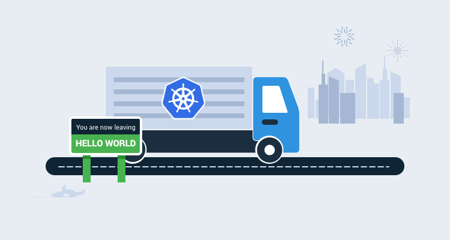
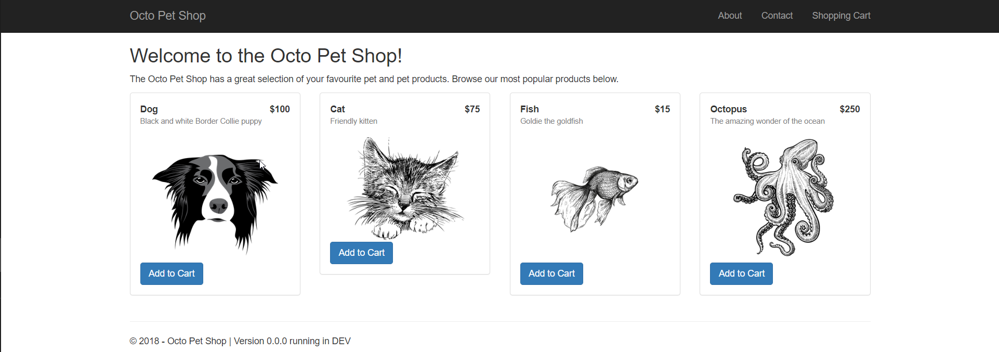

Docker containers and Kubernetes are excellent technologies to have in your DevOps tool-belt. This **Beyond Hello World** blog series covers how to use them with a real-world application.

- [Containerize a real-world web application](/blog/2019-12/containerize-a-real-world-web-app/index.md)
- [Build a real-world Docker CI/CD pipeline](/blog/2019-12/build-a-real-world-docker-cicd-pipeline/index.md)
- **Kubernetes for the uninitiated**
- [Build a real-world Kubernetes CI/CD pipeline](/blog/2020-01/build-a-real-world-kubernetes-cicd-pipeline/index.md)

---

By now, you’ve undoubtedly heard the term Kubernetes, but is it just the latest buzzword or is there more to it?  In this post, I cover what Kubernetes (or k8s for short) is and demonstrate how to run [OctoPetShop](https://github.com/OctopusSamples/OctoPetShop), a real-world web application on k8s.

:::success
There are eight letters between the K and the S in Kubernetes, hence k8s.
:::

## What is Kubernetes?

Kubernetes is a container orchestration technology. Conceptually, Kubernetes architecture is pretty straight-forward. Machines that are running Kubernetes are referred to as `nodes`.  Nodes make up a Kubernetes `cluster`, though it is possible to have a cluster with a single node.  Nodes run containers in what is called a `pod`.


## Docker Desktop and Kubernetes

My [previous post](/blog/2019-12/containerize-a-real-world-web-app/index.md) used Docker Desktop for local development of Docker containers, but Docker Desktop also contains an implementation of Kubernetes, which makes local development and testing a breeze.

## Create the OctoPetShop Kubernetes components

In order to run our OctoPetShop container images on Kubernetes, we need to create the YAML files to define the different resources required for our application.  Resource types are called `kind`, and the kind for containers is called a `deployment`.  

The OctoPetShop application has three main components:
- A web front-end.
- A product service.
- A shopping cart service.

In addition to those components, OctoPetShop also needs a database server and database to function.  For OctoPetShop, we need to create the following deployments:
- Web front-end.
- Product service.
- Shopping cart service.
- Microsoft SQL Server.

### Kubernetes Deployments

Below is the deployment YAML file for the front-end:

```
apiVersion: apps/v1
kind: Deployment
metadata:
  name: octopetshop-web-deployment
spec:
  replicas: 1
  selector:
    matchLabels:
      component: web
  template:
    metadata:
      labels:
        component: web
    spec:
      containers:
        - name: web
          image: octopussamples/octopetshop-web
          ports:
            - containerPort: 5000
              name: http-port
            - containerPort: 5001
              name: https-port
          env:
            - name: ProductServiceBaseUrl
              value: http://octopetshop-productservice-cluster-ip-service:5011/
            - name: ShoppingCartServiceBaseUrl
              value: http://octopetshop-shoppingcart-cluster-ip-service:5012
```

### Anatomy of the Kubernetes YAML file

 - **apiVersion**: Kubernetes provides an [API reference](https://kubernetes.io/docs/reference/#api-reference) to help determine which version to choose.  For kind *deployment*, `apps/v1` is the correct choice.
 - **kind**: This tells Kubernetes what type of resource we are deploying.
 - **metadata - name**: This is the unique name of our deployment.
 - **spec - replicas**: The number of container instances to run.
 - **spec - selector - matchlabels**:
   - **selector**: The selector field defines how Kubernetes objects find which pods to manage.
   - **labels**: Labels are key/value pairs that are attached to objects used to specify identifying attributes.
 - **template**: The pod’s template specification.
 - **template - spec - containers**:  This section is an array of containers that this deployment will run.

Each container gets:

- **Name**: The name we give the container.
- **Image**: The Docker Hub image to use for the container.
- **Ports**: An array of the ports that the container will expose to the pod network.
- **Env**: An array of environment variables for the container.

:::success
See [OctoPetShop](https://github.com/OctopusSamples/OctoPetShop/tree/master/k8s) for the rest of the Deployment YAML files.
:::

Deployments will create the pods for our application, but we still need a way for them to communicate.


Each pod on a node has an internal IP address assigned by the node.  Within our containers, we’ve specified the port to expose to the pod, but those are still only within the pod and not exposed to the node.  To allow connectivity between pods on a node, we need to create a `service` for each pod.

### Kubernetes Services
There are a number of different services available via the API, but we’re going to focus on the specific services that allow our OctoPetShop application to function.  Our web front-end pod needs the ability to talk to the product service and shopping cart service pods. The product service and shopping cart service pods need to be able to communicate to the SQL Server pod. To make this possible, we need to create a `ClusterIP` service for the product service, shopping cart service, and the SQL Server pods.  Below is the YAML to create the ClustIP service for the product service:

```
apiVersion: v1
kind: Service
metadata:
  name: octopetshop-productservice-cluster-ip-service
spec:
  type: ClusterIP
  selector:
    component: productservice
  ports:
    - port: 5011
      targetPort: 5011
      name: http-port
    - port: 5014
      targetPort: 5014
      name: https-port
```

In the above Kubernetes YAML, we’ve created a service that maps a pod port to a container port to allow pod-to-container communication within the node. This service does not expose the port at the node level, so external access is not possible.  It’s important to note the metadata name, as the name will create a DNS entry so that the service can be referenced by DNS name.  In our previous web front-end YAML, we declared an environment variable for the product service URL, which contained octopetshop-productservice-cluster-ip-service as the DNS entry.  The ClusterIP service for the product service is where that came from.

### Allow external access
To allow external access to the node, we need to define either an `Ingress` or a `LoadBalancer` service.  In our case, we’ve chosen a LoadBalancer service to allow access to the web front-end:

```
apiVersion: v1
kind: Service
metadata:
  name: web-loadbalancer
spec:
  selector:
    component: web
  ports:
    - port: 80
      targetPort: 5000
      name: http-port
    - port: 5001
      targetPort: 5001
      name: https-port
  type: LoadBalancer
  externalIP: <IPAddress>
```

:::warning
**Warning**
When using a hosting provider such as Azure, the externalIP line can be omitted as the hosting provider automatically provisions a public IP resource and connects it.
:::

### Kubernetes Jobs
Included in our solution for OctoPetShop is a DbUp project which contains the scripts that will both create and seed our database.  DbUp is a console application that executes and then stops, so we don’t want to use `kind: Deployment`, as Kubernetes will attempt to keep it running.  For this, we want to use `kind: Job` which is specifically meant to terminate after it has completed:

```
apiVersion: batch/v1
kind: Job
metadata:
  name: octopetshop-dbup
spec:
  template:
    spec:
      containers:
        - name: dbup
          image: octopussamples/octopetshop-database
          env:
            - name: DbUpConnectionString
              value: Data Source=octopetshop-sqlserver-cluster-ip-service;Initial Catalog=OctoPetShop; User ID=sa; Password=SomePassword
      restartPolicy: Never
```

## Kubectl
Kubectl is the command-line program used for Kubernetes.

### Start OctoPetShop in Kubernetes
To run a Kubernetes YAML file, you run the command `kubectl apply -f <YAMLFile>`.  However, it is possible to specify a folder instead of an individual file.  This is the main reason the OctoPetShop repo has all of the Kubernetes YAML files stored in the k8s folder.  If you’ve cloned the repo, you can run `kubectl apply -f k8s` to get the entire cluster running with one command:

```
PS C:\GitHub\OctoPetShop> kubectl apply -f k8s
job.batch/octopetshop-dbup created
service/web-loadbalancer created
service/octopetshop-productservice-cluster-ip-service created
deployment.apps/octopetshop-productservice-deployment created
service/octopetshop-shoppingcart-cluster-ip-service created
deployment.apps/octopetshop-shoppingcartservice-deployment created
deployment.apps/sqlserver-deployment created
service/octopetshop-sqlserver-cluster-ip-service created
service/octopetshop-web-cluster-ip-service created
deployment.apps/octopetshop-web-deployment created
```

### Check Kubernetes pod status

The apply command shows us that it ran the YAML files but not much else.  To check the status of our pods, we run the command `kubectl get pods`:

```
PS C:\GitHub\blog> kubectl get pods
NAME                                                         READY   STATUS      RESTARTS   AGE
octopetshop-dbup-9kt54                                       0/1     Completed   0          2m55s
octopetshop-productservice-deployment-6f955ff576-4nwtw       1/1     Running     0          2m55s
octopetshop-shoppingcartservice-deployment-9f94574f9-t96ck   1/1     Running     0          2m55s
octopetshop-web-deployment-7b6d499d69-f9jsp                  1/1     Running     0          2m55s
sqlserver-deployment-784d755db-8vbwk                         1/1     Running     0          2m55s
```

This command shows us how many pods are running and how many pods should be running.  In our case, we specified our replicas as 1, so there should only be 1 instance in our pods.  You’ll note that the octopetshop-dbup pod has 0 of 1 pods ready.  Since we defined the octopershop-dbup with `kind: Job`, this is normal as it is supposed to terminate after it has run.

### Display logs
Unlike docker compose, running the kubectl apply command didn’t show any output from the pods or containers.  When a pod fails, it’s useful to know why.  Let’s change the password for our octopetshop-dbup job so that it fails:

```
apiVersion: batch/v1
kind: Job
metadata:
  name: octopetshop-dbup
spec:
  template:
    spec:
      containers:
        - name: dbup
          image: octopussamples/octopetshop-database
          command: [ "dotnet", "run", "--no-launch-profile" ]
          env:
            - name: DbUpConnectionString
              value: Data Source=octopetshop-sqlserver-cluster-ip-service;Initial Catalog=OctoPetShop; User ID=sa; Password=ThisPasswordIsWrong
      restartPolicy: Never
```
If we run the `kubectl apply -f k8s` command, we’ll see something like the following:

```
PS C:\GitHub\OctoPetShop> kubectl get pods
NAME                                                         READY   STATUS    RESTARTS   AGE
octopetshop-dbup-76cxk                                       1/1     Running   0          5s
octopetshop-dbup-bjsj8                                       0/1     Error     0          35s
octopetshop-dbup-mt9lk                                       0/1     Error     0          25s
octopetshop-dbup-rm97t                                       0/1     Error     0          49s
octopetshop-productservice-deployment-6f955ff576-bvc88       1/1     Running   0          49s
octopetshop-shoppingcartservice-deployment-9f94574f9-mkr7h   1/1     Running   0          49s
octopetshop-web-deployment-7b6d499d69-975kg                  1/1     Running   0          49s
sqlserver-deployment-784d755db-7dh95                         1/1     Running   0          49s
```

Kubernetes attempted to run the job octopetshop-dbup three times, but they all failed.  After three retry attempts, Kubernetes will stop attempting to run the pod.  To troubleshoot the issue, we can run `kubectl logs jobs/octopetshop-dbup` to display the output from the container:

```
PS C:\GitHub\OctoPetShop> kubectl logs job/octopetshop-dbup
Found 3 pods, using pod/octopetshop-dbup-rm97t
Master ConnectionString => Data Source=octopetshop-sqlserver-cluster-ip-service;Initial Catalog=master;User ID=sa;Password=*********************

Unhandled Exception: System.Data.SqlClient.SqlException: A connection was successfully established with the server, but then an error occurred during the pre-login handshake. (provider: TCP Provider, error: 0 - Success)
   at System.Data.SqlClient.SqlInternalConnectionTds..ctor(DbConnectionPoolIdentity identity, SqlConnectionString connectionOptions, Object providerInfo, Boolean redirectedUserInstance, SqlConnectionString userConnectionOptions, SessionData reconnectSessionData, Boolean applyTransientFaultHandling)
   at System.Data.SqlClient.SqlConnectionFactory.CreateConnection(DbConnectionOptions options, DbConnectionPoolKey poolKey, Object poolGroupProviderInfo, DbConnectionPool pool, DbConnection owningConnection, DbConnectionOptions userOptions)
   at System.Data.ProviderBase.DbConnectionFactory.CreatePooledConnection(DbConnectionPool pool, DbConnection owningObject, DbConnectionOptions options, DbConnectionPoolKey poolKey, DbConnectionOptio   at System.Data.ProviderBase.DbConnectionPool.CreateObject(DbConnection owningObject, DbConnectionOptions userOptions, DbConnectionInternal oldConnection)
   at System.Data.ProviderBase.DbConnectionPool.UserCreateRequest(DbConnection owningObject, DbConnectionOptions userOptions, DbConnectionInternal oldConnection)
   at System.Data.ProviderBase.DbConnectionPool.TryGetConnection(DbConnection owningObject, UInt32 waitForMultipleObjectsTimeout, Boolean allowCreate, Boolean onlyOneCheckConnection, DbConnectionOptions userOptions, DbConnectionInternal& connection)
   at System.Data.ProviderBase.DbConnectionPool.TryGetConnection(DbConnection owningObject, TaskCompletionSource`1 retry, DbConnectionOptions userOptions, DbConnectionInternal& connection)
   at System.Data.ProviderBase.DbConnectionFactory.TryGetConnection(DbConnection owningConnection, TaskCompletionSource`1 retry, DbConnectionOptions userOptions, DbConnectionInternal oldConnection, DbConnectionInternal& connection)
   at System.Data.ProviderBase.DbConnectionInternal.TryOpenConnectionInternal(DbConnection outerConnection, DbConnectionFactory connectionFactory, TaskCompletionSource`1 retry, DbConnectionOptions userOptions)
   at System.Data.SqlClient.SqlConnection.TryOpen(TaskCompletionSource`1 retry)
   at System.Data.SqlClient.SqlConnection.Open()
   at SqlServerExtensions.SqlDatabase(SupportedDatabasesForEnsureDatabase supported, String connectionString, IUpgradeLog logger, Int32 timeout, AzureDatabaseEdition azureDatabaseEdition, String collation)
   at OctopusSamples.OctoPetShopDatabase.Program.Main(String[] args) in /src/Program.cs:line 16
```

## Run OctoPetShop in Kubernetes

After the YAML has successfully run, the OctoPetShop application should be running. Navigate to http://localhost:5000.

:::warning
OctoPetShop is written to redirect to https, and you will most likely receive a warning about the site not being secure.  This is normal, and it’s safe to proceed since we did not configure a certificate as part of our process.
:::



## Conclusion
Before embarking on the journey to containerize OctoPetShop with the eventual goal of getting it running on Kubernetes, I viewed Kubernetes as a complex monster.  Now that I’ve gone through the motion of containerizing an application and getting it to run, I still think that, but getting an application to run on it isn’t really that hard.

The [OctoPetShop](https://github.com/OctopusSamples/OctoPetShop) GitHub repo contains all of the docker, docker-compose, and Kubernetes YAML files for the OctoPetshop application.
