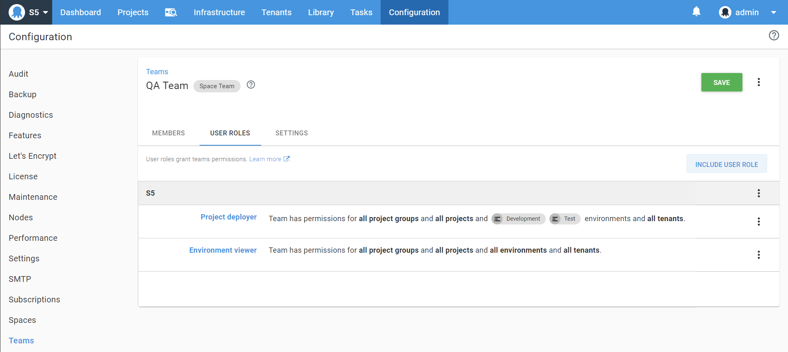
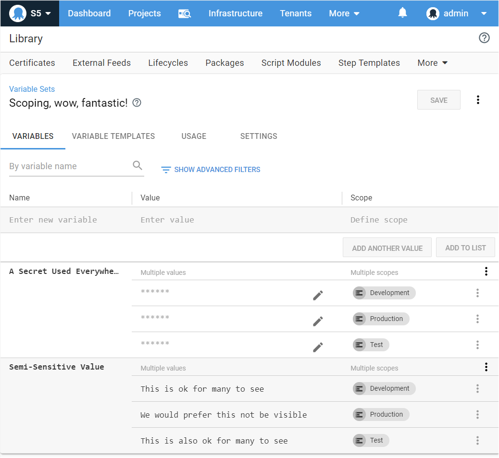

[Library variable sets](https://octopus.com/docs/deployment-process/variables/library-variable-sets) in Octopus are a much loved and useful feature, they make it possible to define variables for use with multiple projects.

They were always designed to be global and, as many customers grew their Octopus usage, this surfaced some complications that we are addressing.

To deliver a major step forward in consistent and configurable access to variables housed in library variable sets we need to make a breaking change to how two permissions (`LibraryVariableSetView` and `LibraryVariableSetEdit`) work and behave.

## TL;DR
 - You will be able to scope library variable set view and edit permissions to environments and tenants
 - A breaking behavior change to  `LibraryVariableSetView` and `LibraryVariableSetEdit` will be introduced. This may impact you if you have automated configuring permissions, please read on to find out more.

## Background

When library variable sets were introduced, along with the permissions `LibraryVariableSetView` and `LibraryVariableSetEdit`, the Octopus world was simpler. A choice was made to tightly couple the behavior of these two permissions to a third permission `EnvironmentView`.

This decision restricted the ability for consistent granular control of the these two permissions, and many customers have requested we make improvements in this area.

But making changes to permissions has always been a challenge. Octopus cannot see how customers have configured their permissions. We also do our best not to make breaking changes in Octopus. So we are extra cautious with this type of change.

## Improving variable set access

With the introduction of this change in Octopus Server version 2020.1.2, you will be able to grant granular access to what users can view and edit in library variable sets, independent of the environments they can view. This change delivers a good step forward to increase the capability of library variable sets.

The decoupling of `LibraryVariableSetView` and `LibraryVariableSetEdit` from `EnvironmentView` gives these permissions the capabilities similar to `VariableView` and `VariableEdit` (they’re all grown up now).

The scoping that will be supported on `LibraryVariableSetView` and `LibraryVariableSetEdit` is `Environments` and `Tenants`. Going forward you can scope variables in a library variable set to [deployment targets](https://octopus.com/docs/infrastructure/deployment-targets), and if those targets are tenanted the access will also be enforced for users with tenant scoped `LibraryVariableSetView` and `LibraryVariableSetEdit`. Environment scoping will function as it previously did for view, but this change extends environment scoping to `LibraryVariableSetEdit`.

### Examples

`LibraryVariableSetView` and `LibraryVariableSetEdit` permissions will respond to scoping similar to `VariableView` and `VariableEdit`. You can now more finely control variables within a library variable set, independent to the environments a user can see.

Suppose we have a user in the "QA Team" with the ability to see all the current environments: development, test and production. This is granted to them via the "environment viewer" role which does not have scoping applied. They are also granted the "project deployer" role which contains `LibraryVariableSetView` this restricts their ability to see library variables in any set to only those scoped to Development and Test, excluding Production:

With a full set of variables in a library variable set like this for use across all the environments:

We can see the user who has access to an environment called Production in other areas of the application, now cannot see the variables defined for it:

## Impact and Migration

In order to preserve the current access levels for such users, Octopus needs to adjust user roles and introduce new teams on your installation.

We believe most customers will not be negatively impacted by this. As part of developing and testing this, we have spoken to some customers with large instances.

This change highlighted an undesired misconfiguration for some (see below to see if this impacts you). These customers have acted on the gap in their permissions and made a suitable change to their team set up. This migration will not result in a change for them since they took this earlier access-rights adjusting step.

### Does this impact me?

If you have configured custom user roles, and those roles contain `LibraryVariableSetView` and `LibraryVariableSetEdit` but do not also contain `EnvironmentView`, you may be affected.

Here are some example scenarios to work out if this will impact you.

#### Affected Examples

We will migrate user access in these cases:

  1. You have defined a `Custom User Role` and it contains `LibraryVariableSetView` or `LibraryVariableSetEdit`, you have used this role to define the permissions for a set of users, and no other roles are granting those users access. In this scenario, prior to this  change in Octopus Server 2020.1.2, `LibraryVariableSetView` did not work as expected, because the users lacked `EnvironmentView`.
  2. You are using a User Role that has `LibraryVariableSetView` or `LibraryVariableSetEdit` with different scoping to what the user is scoped to on the `EnvironmentView` permission. In this scenario, we must apply the same scoping they currently have on `EnvironmentView` to `LibraryVariableSetView` and `LibraryVariableSetEdit`.

#### Not Affected Examples

No permission migration changes will take place if the following is true:

  1. You have defined a number of custom users roles (or modified built-in roles), but everywhere you have selected `LibraryVariableSetView` or `LibraryVariableSetEdit` you also have selected `EnvironmentView`.
  2. You have defined a custom user role (or modified a built-in role) with `LibraryVariableSetView` or `LibraryVariableSetEdit` and it lacks `EnvironmentView`, but for all teams where that first user role is used, you have also selected another user role that grants `EnvironmentView` and scoping choices match across both.

### How can I check my instance?

If you suspect you may have users configured with access like this, use the {{Configuration > Test Permissions}} page to verify users have `LibraryVariableSetView` but lack `EnvironmentView`.

You can also run this [LinqPad](https://www.linqpad.net/) [script in our API repo](https://github.com/OctopusDeploy/OctopusDeploy-Api/blob/master/Octopus.Client/LINQPad/CheckMigratoinRequirementsForLvsChange.linq) to help determine the level of migration required.

### How will this migration work?

This migration will take place during the Octopus server start up. If you would like to see what has changed, please review the [server log file](https://octopus.com/docs/support/log-files).

## Breaking Change

This is a breaking change.

If you relied on the existing behavior of how `LibraryVariableSetView` and `LibraryVariableSetEdit` worked, they will behave differently, and you’ll need to modify any automation you have granting this kind of access.

## Contact Us

If you have questions about this, please contact Octopus Support. We can help you with confidence to work out if this will have any impact on you and steps you can take to improve your permission configuration before you upgrade to this version.
