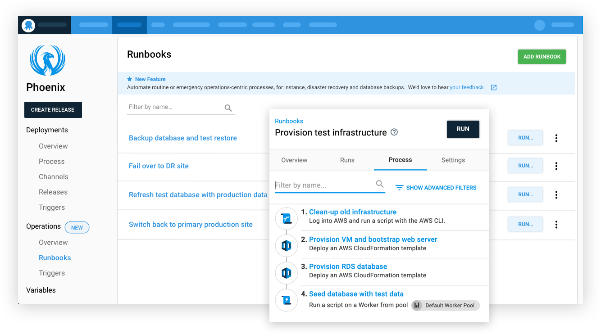
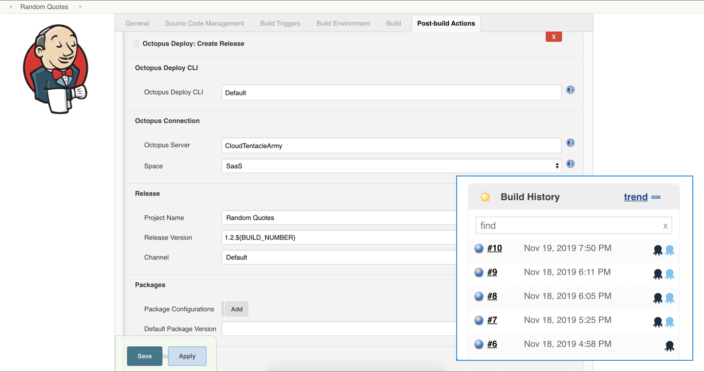

Octopus Deploy `2019.12 LTS` is now available for teams running Octopus Deploy self-hosted, and we recommend this release for these customers. Our [long-term support (LTS) program](https://octopus.com/docs/administration/upgrading/long-term-support) includes releases with six months of support, including critical bug fixes and security patches. The LTS releases do not include any new features, minor enhancements, or minor bug fixes that are released after this release; those will be rolled up into the next LTS release.

<a href="https://octopus.com/downloads" class="btn btn-primary btn-lg">Download now</a>

The following table shows our current LTS releases. Octopus 2019.6 is no longer supported, and we recommend customers on that release upgrade to one of the newer releases.

| Release               | Long term support           |
| --------------------- | --------------------------- |
| Octopus 2019.12       | Yes                         |
| Octopus 2019.9        | Yes                         |
| Octopus 2019.6        | Expired                     |

Keep reading to learn about what’s in this release and any breaking changes.

<h2>In this post </h2>

!toc

## Operations Runbooks

Our runbook platform was built to help teams automate routine maintenance and emergency operations tasks like infrastructure provisioning, database management, and website failover and restoration. 

This LTS release includes support for Operations Runbooks, which includes:

* A familiar configuration process for anyone who has configured a deployment process.
* The ability to execute runbooks directly against infrastructure on-demand or on a schedule (nightly, weekdays, once a month, etc.) as per your team’s needs. 
* Runbooks can be parameterized with prompted variables.
* You can make changes to your runbooks with confidence, and only publish them after they have been safely tested.
* Runbooks are managed and executed by Octopus, so this means there’s a complete audit trail that can be reviewed at a later date, making it easy to see what happened, when and why, and if anything needs to be changed.
* You can give your entire team permission to execute your runbooks, without assigning everybody on the team permissions for the infrastructure the runbooks will execute against.

[Learn more](https://octopus.com/docs/deployment-process/operations-runbooks)

## Jenkins plugin

This release also includes our official Octopus Deploy Jenkins plugin, which has shipped and is now available to install or update (if you’re currently running the community plugin) from the Jenkins’ plugin repository. This plugin builds upon the fantastic community plugin maintained by [Brian Adriance](https://github.com/badriance) and other contributors.

With this release, you can now integrate your Jenkins builds with Octopus deployments including the following tasks:

Build steps:
* Package application
* Push packages to Octopus
* Push build information to Octopus

Post-build actions:
* Create release
* Deploy release

It also gives you better visibility into your CI/CD pipeline, and it can help you improve the communication of your releases.

NOTE: This release of the plugin does not support Jenkins Pipelines, but it is on our radar.

[Learn more](https://octopus.com/blog/octopus-jenkins-plugin)

## PowerShell Core support

We’ve added PowerShell Core support, enabling teams to write cross-platform scripts using Microsoft’s modern automation framework.

On Windows platforms, Octopus will use Windows PowerShell by default, with the option to use PowerShell Core if desired. You can customize this by configuring the PowerShell edition for steps that support custom scripts.

On Linux platforms, Octopus will automatically execute PowerShell scripts with PowerShell Core if it’s installed.

[Learn more](https://octopus.com/docs/deployment-examples/custom-scripts/powershell-core)

## Improved build information and work item tracking

Octopus 2019.4 introduced build information and work item tracking. This is a popular feature, but we received feedback the package metadata functionality was hard to find and understand. As a result, we’ve promoted this functionality to a top-level feature called **Build Information** within the Octopus Library, making it more accessible and much easier to understand. We’ve updated our suite of build server plugins to reflect the name change.

We also added deployment change templates to complement the existing release notes templates, enabling teams to customize the display to suit their needs.

[Learn more](https://octopus.com/docs/packaging-applications/build-servers/build-information)

## Other improvements

Our team continually adds updates and bug fixes driven by customer feedback and support tickets. We want to highlight some of these changes in this release:

* **Simpler package-based step templates**, making it easier to create step templates with packages and let teams bind against these parameters.
* **Easier Octopus dashboard configuration**, making it clearer to understand what is filtered.
* **Added support to test Azure DevOps issue tracker connectivity**. This change can help when configuring build server integration and work item tracking.
* **Space selection is no longer visible if a user only has one space** and they don’t have permission to add more.
* **Added support to upgrade a subset of Tentacles**. This applies to groups of Tentacles/Workers in an environment or worker pool rather than all deployment targets.
* Added support to **redeploy previous successful deployments**, so it’s easier to rollback to previous releases.
* **Swagger API documentation is far more accurate**, making it easier for teams to integrate with the Octopus API.
* **Improved performance to the Tenants page**. The Tenants page now renders much faster when customers have hundreds or thousands of tenants.
* **Improved supportability**. We’ve improved logging for automatic deploys and dynamic infrastructure provisioning to help teams understand what happens if things go wrong.

## Breaking changes

This release includes the following breaking changes:

**PowerShell Core**

PowerShell Core support has introduced a change where running PowerShell scripts against non-Windows targets no longer silently ignores `.ps1` files. Octopus will now attempt to execute `.ps1` files on deployment targets. If PowerShell Core is installed on those targets, this may change the behavior of your deployments. If PowerShell Core is not installed on those targets, the deployment will fail.

**Build Information**

Our build information change involved renaming resources from the API through to the database. This is generally backward compatible; however, anyone using our GitHub issue tracker will need to ensure they upgrade their Octopus Server if they upgrade their [Azure DevOps extension](https://marketplace.visualstudio.com/items?itemName=octopusdeploy.octopus-deploy-build-release-tasks), [TeamCity plugin](https://plugins.jetbrains.com/plugin/9038-octopus-deploy-integration), or [Bamboo plugin](https://marketplace.atlassian.com/apps/1217235/octopus-deploy-bamboo-add-on).

**Octopus API and Octopus.Client**

The [Octopus API has changed](https://github.com/OctopusDeploy/Issues/issues/4925) as part of this release, versions of Octopus.Client before 8.0.0 can not create scheduled triggers on an Octopus Server where the version is older than 2019.11.0.

## Wrapping up

Octopus Server 2019.12 is now available, and you can depend on it. Happy long-term deployments!
