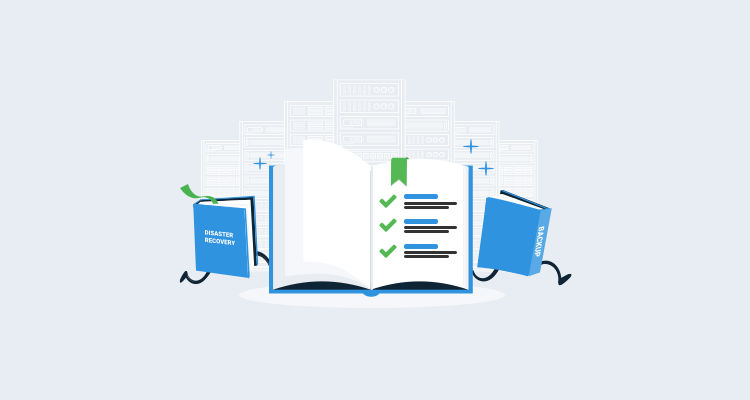

BLUF

<h2>In this post </h2>

!toc

## What is a runbook? 

## Routine maintenance

### Recycle IIS App Pool

Stock standard question. 

### Restart Docker Container

As per #topic-linux

### File clean-up

## Emergency scenarios

### Website failover

### Run a database administration script of some sort

## Wrapping up

Reiterate BLUF
