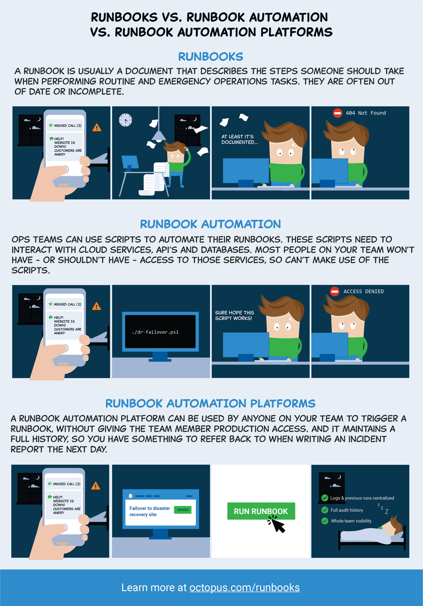

<iframe width="560" height="315" src="https://www.youtube.com/embed/Uc5TFqswJkM" frameborder="0" allowfullscreen></iframe>

Operations Runbooks in Octopus put the Ops in DevOps. This post is part of a series:

- **Operations Runbooks overview**
- [DevOps, runbooks and kubectl](/blog/2021-09/devops-runbooks-and-kubectl/index.md)
- [Chaos engineering and runbooks](/blog/2021-09/chaos-engineering-and-runbooks/index.md)
- [Linting your Kubernetes cluster with Clusterlint and runbooks](/blog/2022-q2/clusterlint-with-runbooks/index.md)

---

We recently shipped Operations Runbooks for [Octopus Cloud](https://octopus.com/cloud) and [self-hosted](https://octopus.com/downloads) customers running Octopus 2019.11.0 or newer. Runbooks are the Ops in DevOps and automate routine maintenance and emergency operations (incident response) tasks, such as:

- Infrastructure provisioning
- Database management
- Website failover and restoration
- Server maintenance

In this blog post, we answer the question, what is a runbook, why Octopus is useful for runbook automation, and share some runbook examples where they can really help.

<h2>In this post </h2>

!toc

## What is a runbook?

Traditionally, a runbook is a document that lists IT processes that need to be executed to keep your applications running smoothly. Most teams have something like this. They’re often in the form of Word docs, wiki pages, or service management systems. It’s common for people to print them out and tick off the steps as they walk through them.

Teams use runbooks for two core reasons:

1. Routine operations tasks, like database administration and service maintenance.
2. Emergencies and incident response like website failovers and unplanned infrastructure outages.

Runbook automation is a way to improve on traditional runbook documentation by automating the steps to execute operations procedures and resolve incidents. This combination of runbook documentation and runbook automation brings many benefits:

* Runbooks capture and share knowledge across teams, and they are well suited to teams in a DevOps world. Developers, operations folks, as well as on-call staff. Expert domain knowledge not required.
* Runbook automation is fast and reduces human error. Traditionally, runbooks are written processes, and while docs are good, automation is better. Scripts are testable, repeatable, and they can be improved over time.
* Reduced friction and incident resolution time. In emergency scenarios, runbook automation reduces the friction to resolving problems in a fast and efficient manner.

## Why use Octopus for runbook automation?

It’s already possible to document and script operations processes, so why use Octopus Operations Runbooks?

* **Runbooks and deployment processes sit side-by-side.** Runbooks in Octopus are designed to automate operations tasks, and they can share configuration settings, secrets, step templates, scripts, and more. Runbooks are lightweight automated processes that are executed against your infrastructure without going through a deployment lifecycle (i.e., dev, test, production).
* **Octopus is already aware of your infrastructure.** Runbooks leverage the infrastructure that your applications are deployed to, so there’s nothing new to configure, reducing the friction to getting started running operations processes.
* **Security, permissions, and auditing.** Runbooks are managed and executed by Octopus, giving you a complete audit trail that can be reviewed in retrospectives, making it easy to see what happened, when and why, and if anything needs to be changed. Octopus enables teams to control who can execute which runbooks in what environments with advanced security and permissions.
* **Better emergency management and reduced incident resolution time.** With Octopus Runbooks, no local tooling is required, no additional permissions are needed, and you have a detailed audit log of everything. On-call team members can quickly execute runbooks without worrying about dependencies or infrastructure.
* **Discoverability and visibility.** Octopus creates a central location for teams to manage, control, audit, schedule, and execute runbooks. You can see when a runbook was last executed, you can see the changes to the runbook, and you can run the same runbook against different environments. Team members can easily find a runbook, and click a big green button to run it. Everyone can see the output from the last run and whether it succeeded or not.
* **World-class scheduling and execution.** Execute runbooks on-demand or schedule them at any frequency.

## Runbook scenarios

I want to highlight some scenarios where runbooks shine.

### Runbook example: web application and web service recovery

<iframe width="560" height="315" src="https://www.youtube.com/embed/VuSHB0Re9Mo" frameborder="0" allowfullscreen></iframe>

It’s common for web applications and services to have problems due to a vast range of issues. These could be memory leaks or unexplained performance issues. In the Windows Server world, the problems are commonly resolved by recycling the IIS web server app pool, and in the Linux world, it’s common to reload NGINX or restart the docker container hosting the application. This doesn’t address the underlying issue, but it enables the teams to resolve the problem so they can work on a proper fix. Sometimes, this happens so sporadically, executing a runbook is the long term solution.

In Octopus, it’s straightforward to build a runbook process (runbook example) to automate this process:
- Web server step template or custom script (PowerShell, Bash or Python).
- Slack or email notification.

This is a very common runbook example.

### Runbook example: database administration

<iframe width="560" height="315" src="https://www.youtube.com/embed/dAYx8fMV4to" frameborder="0" allowfullscreen></iframe>

Database management is often a slow process that requires emailing your database administration team (DBA) to get things done. It is common for DBAs to distrust developers or operations folks. Databases are a critical part of modern applications, and there are a plethora of database tasks that can be requested, including:

* Database backups.
* Refreshing test databases with sanitized production data.
* Rebuilding indexes to resolve slow queries.
* Revoking permissions when an employee leaves the company.

These processes are ideal for runbook automation. Building these runbooks in Octopus in collaboration with database administrators is a great way to build trust and reduce the number of DBA requests for routine maintenance.  

In Octopus, it’s easy to configure runbook processes (runbook example) for any of these tasks with the following steps:
- SQL step template or custom script (PowerShell, Bash or Python).
- Slack or email notification.

This project could be consider a runbook template as it could be cloned for different tasks.

## Conclusion

Operations Runbooks has shipped, and it helps teams keep their applications running smoothly. Runbooks in Octopus brings many benefits from its history of release management and deployment automation. They help teams automate operations tasks like routine maintenance and recover when things go wrong.
