When deploying new versions of modern software, like web applications and services, it’s still common for some teams to take their entire website down while they *do deployments*.

If the majority of your customers only use your application during business hours, then this big-bang approach is probably acceptable, but what happens if your customers are using your applications 24-7?

Today, users expect applications to be available all the time, and there are a few deployment patterns you can use to achieve zero-downtime. In this post, I’ll discuss one of these patterns in more depth; rolling deployments. I’ll also provide you with some practical examples of how to implement rolling deployments with different tooling.

<h2>In this post</h2>

!toc

## What are rolling deployments?

A rolling deployment is a deployment pattern (also known as an incremental deployments, batched deployments, or ramped deployment) where new software is delivered, usually to one or more deployment targets at a time, until all of the targets have the updated version of the software rolled out.

A typical process looks something like this:

1. With two nodes running `v1.0` of your application, drain the first node to be updated, take it out of the load-balancer pool, and leave the remaining node online to serve traffic:

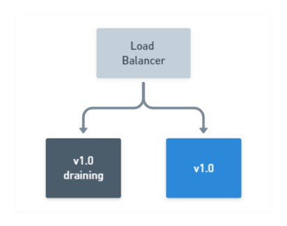

2. Stop the `v1.0` application from running on the drained node, then deploy the new `v1.1` version. *Optionally*, verify the deployment was successful by running tests on your newly deployed application. All the while, maintaining at least one node running `v1.0` of your application:

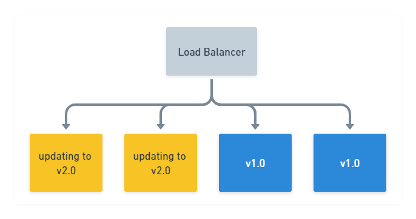

3. After the first node has updated successfully, proceed with draining the remaining node still running `v1.0` of your application, while your new `v1.1` version is now online serving traffic:

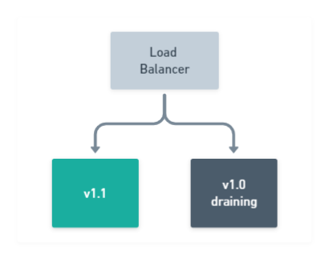

4. Stop the `v1.0` application on the remaining node from running, deploy the new `v1.1` version. Again, optionally verify the deployment was successful:

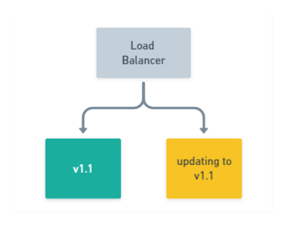

5. Finally, after `v1.1` of your application has been deployed successfully to all of your nodes, your rolling deployment is complete!

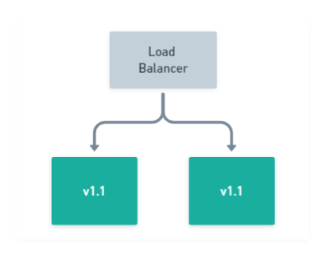

If you want to ramp up your rolling deployment and deliver a new version to more than one node simultaneously, say two for example, then it would look like this:

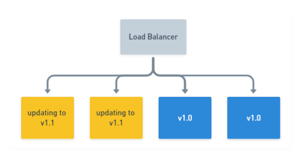

This incremental approach is often favored in web applications which sit behind a load balancer, as most load balancers support a concept known as **Connection draining**. This allows connections to a service to finish naturally and prevents new connections from being established.

By performing this action, instances which are selected to be updated, can be removed from the available pool after they have finished their work, while others remain online serving traffic.

:::hint
Although the scenario above describes a web application rolling deployment, it’s possible to achieve rolling deployments for other types of applications, providing they are built in a way that supports ending their process safely.
:::

For example, Octopus Deploy’s [High Availability](https://octopus.com/docs/administration/high-availability) configuration also has a [drain option](https://octopus.com/docs/administration/high-availability/managing-high-availability-nodes#ManagingHighAvailabilityNodes-Drain), which prevents any new tasks from executing, and finishes up any tasks it’s currently executing until idle. Features like draining, allow for the safe termination of a process, which can then be updated and brought back online.

## Why are they useful?

So why use rolling deployments over other patterns such as canary or blue/green? Well, rolling deployments offer the following benefits:

### Incremental update

New versions of your application are rolled-out incrementally. This allows you to verify it’s working, for example, by running health checks or tests before moving on to the next batch of updates.

In the event that you need to initiate a rollback, you can also do this in a safe and controlled manner.

### Keeping the lights on

While you go about updating a small number of your application instances, the rest continue to serve requests. This means there is no downtime for your application, and it’s available for your users throughout the deployment.

### Parallelism

You can usually control the number of concurrent instances that are deployed to at any one time. Further deployments won’t start until a previous deployment has finished.

:::hint
You can use the **Window size** option within an Octopus rolling deployment to control how many deployment targets can be deployed to at once.
:::

## Rolling deployment patterns in practice

To demonstrate the different approaches to rolling deployments, we have a very simple .NET Core 3.1 application which will display a web page.

The HTML for the section I’m interested in is shown below:

```html
<div class="text-center">
    <h1 class="display-4">Welcome</h1>
    <p>If you are seeing this, then <strong>Congratulations!</strong> <br/> You've got the example application running. </p>

    @if(Settings.Value.AppVersion == "0.0.2") {
        <p>v0.0.2 of the application comes with this text </p>
    }
    @if(Settings.Value.AppVersion == "0.0.3") {
        <p>But don't miss out on v0.0.3 of the application which comes with this text! </p>
    }
</div>
```

The code for the application is available on [GitHub](https://github.com/OctopusSamples/rolling-deploy-web-example) and has a [Tag](https://github.com/OctopusSamples/rolling-deploy-web-example/releases) corresponding to the three different `AppVersion` values. A Docker image has also been published as [octopusdeploy/rolling-deploy-web-example](https://hub.docker.com/r/octopusdeploy/rolling-deploy-web-example).

I wanted to see just how easy it would be to perform a rolling deploy of this application using some popular technologies and tools, so I’ll demonstrate rolling deployments with:

 - [Docker](#Docker-rolling-application-updates)
 - [Kubernetes](#Kubernetes-Rolling-updates)
 - [Octopus](#Rolling-deployments-with-Octopus)

### Docker rolling application updates

Docker has become the de facto container technology to use in the last few years. It will come as no surprise therefore, that it natively supports rolling deployments with its concept of a Docker [service](https://docs.docker.com/engine/swarm/how-swarm-mode-works/services). Typically, a service is a small piece of a much larger architectural picture and is popular with microservices.

Services support a number of different options, including a rolling update policy as well as the ability to rollback.

#### Docker containerized application

I’m running Docker on an [Ubuntu](https://ubuntu.com/download/server) server and using our pre-built container image. There are a couple of ways to install Docker on Ubuntu:

1. Use the Ubuntu repository by running: `sudo apt-get install docker.io`.
1. Use the Official [Docker guide](https://docs.docker.com/install/linux/docker-ce/ubuntu/#install-docker-engine---community).

I opted for the Ubuntu repository as it seemed quicker and easier, but your mileage may vary. Whichever method you choose, it’s worth ensuring you meet the installation [prerequisites](https://docs.docker.com/install/linux/docker-ce/ubuntu/#prerequisites).

For the sake of simplicity, I’ll be interacting with Docker in an SSH terminal session to my Linux box. There are production-ready setups to automate this, which feature the definition of your services in a [Docker Compose](https://docs.docker.com/compose/compose-file/) file, including sections to control automatic updates and rollback settings.

:::warning
**Permissions requirement:**
Most of the commands in this demonstration make use of [sudo](https://www.linux.com/tutorials/linux-101-introduction-sudo/). By default, the Docker daemon runs as the root user and requires elevated permissions to execute commands. If you prefer not to use `sudo` when executing your commands, be sure to follow the Docker [post-install](https://docs.docker.com/install/linux/linux-postinstall/) instructions.
:::

Firstly, to see the Docker image of this running standalone, we’ll run it with the following command:

```bash
markh@ubuntu01:~$ sudo docker run -d -p 5001:5001 octopusdeploy/rolling-deploy-web-example:0.0.1
```

Unsurprisingly, running this Docker image displays the web page:

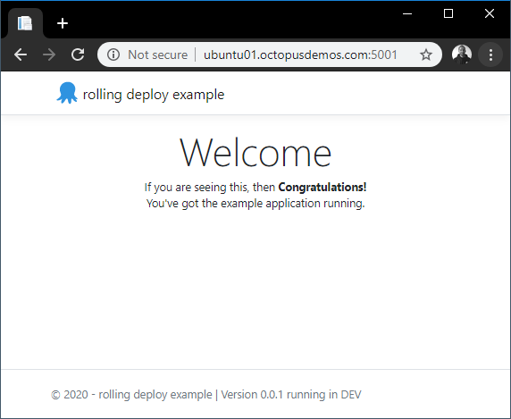

:::hint
I don’t explain how to build a container image in this post. If you are new to Docker, my colleague Shawn has written an excellent series on how to containerize a [real world application](https://octopus.com/blog/containerize-a-real-world-web-app), instead of another “Hello World” example.
:::

**Container clean-up**

A quick-tidy up is needed next. To delete the container we created using the `run` command above, we need to stop it, and then remove it using the `rm` command. We can do this in a condensed one-liner:

```bash
sudo docker rm $(sudo docker stop $(sudo docker ps -a -q --filter ancestor=octopusdeploy/rolling-deploy-web-example:0.0.1 --format="{{.ID}}"))
```

This locates our container by the image name `octopusdeploy/rolling-deploy-web-example:0.0.1` and passes that to the `stop` command, and finally passes that to the `rm` command.

To deploy more than one instance of our container, we need to create our Docker service. This uses [Docker Swarm](https://docs.docker.com/engine/swarm) as its orchestrator under the hood.

:::hint
**Docker Kubernetes orchestrator**
Docker also supports Kubernetes as an orchestrator when deploying containers using the Docker [stack](https://docs.docker.com/engine/reference/commandline/stack) command, but it’s not possible to specify the orchestrator when using `service create`.
:::

So let’s see what our command to create a service looks like:

```bash
markh@ubuntu01:~$ sudo docker service create --name rolling-deploy-svc --replicas 3 --publish published=5001,target=5001 --update-delay 10s --update-parallelism 1 octopusdeploy/rolling-deploy-web-example:0.0.1
```

There’s quite a lot going on in that command, so let’s unpick what we are asking of Docker here:

- The `--name` is self explanatory.
- The `--replicas` flag controls the number of containers we want (3).
- The `--publish published=5001,target=5001` specifies the service to be accessed on port 5001, using Swarm’s [routing mesh](https://docs.docker.com/engine/swarm/ingress/#publish-a-port-for-a-service) which acts essentially like a software load-balancer.
- The `--update-delay` configures the time delay (10s) between updates to a service task.
- The `--update-parallelism` controls the maximum number of tasks that Docker will schedule simultaneously (1).
- Lastly, we specify the image to use: `octopusdeploy/rolling-deploy-web-example:0.0.1`.

:::warning
**Hint:**
When running `service create` for the first time, you may receive a warning, just as I did: `This node is not a swarm manager`. To fix this, run either of the following commands:
 - `sudo docker swarm init`: This will initialize your current node as a swarm manager.
 - `sudo docker swarm join`: This will connect your local node to swarm.
:::

Executing this results in our service being deployed to Docker Swarm with three instances:

```
wxi1w4m7crknaz1f800kr9ztt
overall progress: 3 out of 3 tasks
1/3: running   [==================================================>]
2/3: running   [==================================================>]
3/3: running   [==================================================>]
verify: Service converged
```

We can also check our service has the correct update configuration by running the `service inspect` command:

```bash
markh@ubuntu01:~$ sudo docker service inspect rolling-deploy-svc --pretty

ID:             bh03s0yjzkevzkkwvu8q2h0jj
Name:           rolling-deploy-svc
Service Mode:   Replicated
 Replicas:      3
Placement:
UpdateConfig:
 Parallelism:   1
 Delay:         10s
 On failure:    pause
 Monitoring Period: 5s
 Max failure ratio: 0
 Update order:      stop-first
RollbackConfig:
 Parallelism:   1
 On failure:    pause
 Monitoring Period: 5s
 Max failure ratio: 0
 Rollback order:    stop-first
ContainerSpec:
 Image:         octopusdeploy/rolling-deploy-web-example:0.0.1@sha256:4da10d630025bf268b855b0b4afafa7334769ab6d0b3e75e11a3f11949708552
 Init:          false
Resources:
Endpoint Mode:  vip
Ports:
 PublishedPort = 5001
  Protocol = tcp
  TargetPort = 5001
  PublishMode = ingress
```

The result of this shows we have our desired `UpdateConfig` which will update one task at a time.

#### Docker service update

Now we can update the container image for `octopusdeploy/rolling-deploy-web-example` to `v0.0.2` by running the `service update` command:

```bash
markh@ubuntu01:~$ sudo docker service update rolling-deploy-svc --image octopusdeploy/rolling-deploy-web-example:0.0.2
```

Docker runs the update to each container, one task at a time just as we have configured it to:

```
overall progress: 0 out of 3 tasks
1/3: running   [=============================================>     ]
2/3:
3/3:
```

After the first task is complete, it moves onto task two:

```
overall progress: 1 out of 3 tasks
1/3: starting  [==================================================>]
2/3: ready     [=====================================>             ]
3/3:
```

Until all the tasks to update the containers to `v0.0.2` are complete:

```
overall progress: 3 out of 3 tasks
1/3: running   [==================================================>]
2/3: running   [==================================================>]
3/3: running   [==================================================>]
verify: Service converged
```

Browsing to the website now shows the text which applies for `v0.0.2`:

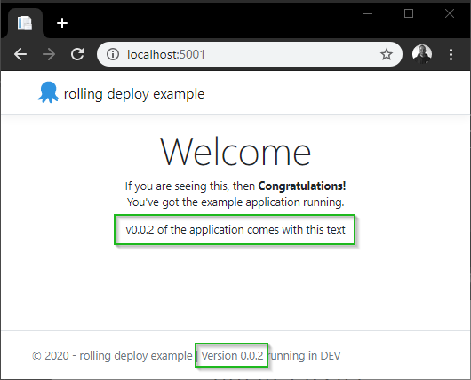

#### Docker service rollback

Just as it’s straight-forward to roll-out, it’s also possible to manually rollback with a simple command in Docker.

Firstly, we will update to our final version `v0.0.3` of the application by running:

```bash
markh@ubuntu01:~$ sudo docker service update rolling-deploy-svc --image octopusdeploy/rolling-deploy-web-example:0.0.3
```

We verify the new `v0.0.3` version by running the `service inspect` command, passing in a `--format` parameter for only the output we want to see:

```bash
markh@ubuntu01:~$ sudo docker service inspect --format='{.Spec.TaskTemplate.ContainerSpec.Image}}' rolling-deploy-svc

octopusdeploy/rolling-deploy-web-example:0.0.3@sha256:151a8f2aaed0192bf9f22eaeff487d546e6ff8fec4d0691e6697dede743b187c
```

Because Docker Swarm knows the versions we deployed, we can revert to the previous one (`v0.0.2`) using the `rollback` command:

```bash
markh@ubuntu01:~$ sudo docker service rollback rolling-deploy-svc

rolling-deploy-svc
rollback: manually requested rollback
overall progress: rolling back update: 3 out of 3 tasks
1/3: running   [>                                                  ]
2/3: running   [>                                                  ]
3/3: running   [>                                                  ]
verify: Service converged
```

Once successfully rolled back, it has confirmed the service is running.

:::hint
**Hint:**
 As I didn’t specify any parameters to the `rollback` command, Docker will by default, rollback one task at a time with no delays between each one. You can specify different values by passing the following to the command:

 - `--rollback-parallelism`
 - `--rollback-delay`

 The Docker [documentation](https://docs.docker.com/engine/reference/commandline/create/#options) has a full list of parameters you can use.
:::

We can verify the rollback was successful using the same command to inspect the service as before:

```bash
markh@ubuntu01:~$ sudo docker service inspect --format='{.Spec.TaskTemplate.ContainerSpec.Image}}' rolling-deploy-svc

octopusdeploy/rolling-deploy-web-example:0.0.2@sha256:4843a91ba84ace97cb11a6e3f68827a8c28a628d509159910c868f9ad02c3053
```

This results in the expected `v0.0.2` version in the output.

:::warning
**Database rollbacks**
When a service in Docker utilizes a database for storage, it’s important to have a strategy in place to deal with a service rollback, particularly if the database is within a container. Docker won’t rollback database changes for you automatically, and that could leave your database and application in an incompatible state. The Docker [storage](https://docs.docker.com/storage/) documentation provides some guidance on the different options for storage in a container.
:::

#### Docker service clean-up

Finally, to remove our Docker service we just run the `rm` command:

```
markh@ubuntu01:~$ sudo docker service rm rolling-deploy-svc
```

#### Docker summary

As you can see, it doesn’t take much setup to get rolling deployments working in Docker. Coupled with its support for rollbacks makes it an attractive option to consider.

### Kubernetes rolling updates

Rolling deployments in Kubernetes is called [rolling updates](https://kubernetes.io/docs/reference/generated/kubectl/kubectl-commands#rolling-update).

A pod’s instances will be updated incrementally with new ones. It supports both a max number or percentage of pods to be unavailable during an update, as well as a max number of new pods that can be created. In addition to this, Kubernetes has a handy built-in feature to allow updates to be reverted to a previous version.

:::hint
To find out more about Kubernetes, my colleague Shawn continued his container series focussing on [Kubernetes](https://octopus.com/blog/kubernetes-for-the-uninitiated).
:::

The Kubernetes [tutorial](https://kubernetes.io/docs/tutorials/kubernetes-basics/update/update-intro/) on updates includes a nice diagram showing how it works:

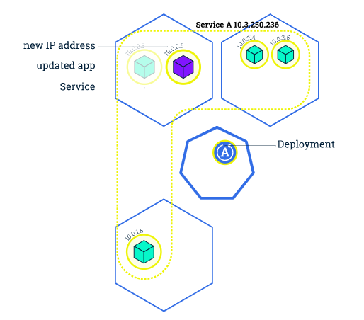

#### Kubernetes cluster setup

Just as before, I’ll re-use our pre-built container image for this demonstration, this time using [MicroK8s](https://microk8s.io/). I’ll also interact with it primarily in an SSH terminal session.

Canonical, the authors, describe MicroK8s as:

> a single package of k8s for 42 flavours of Linux. Made for developers, and great for edge, IoT and appliances.

It’s useful for people like me who want to try out Kubernetes or do some development with it.

One of the benefits of MicroK8s is that it doesn’t require any type of Virtual Machine as with other Kubernetes choices (such as [Minikube](https://minikube.sigs.k8s.io/)).

Before you install MicroK8s, it’s worth noting that there are some prerequisites:

- Ubuntu 18.04 LTS or 16.04 LTS (or other OS that supports `snapd`).
- At least 20G free disk space.
- 4GB of RAM.
- An internet connection.

To install MicroK8s, we run the [snap](https://docs.snapcraft.io/installing-snapd) `install` command:

```bash
markh@ubuntu01:~$ sudo snap install microk8s --classic

microk8s v1.17.0 from Canonical✓ installed
```

:::hint
**Full install output**
If you want to see the full install output from `snap`, run the `snap changes` command:

```bash
markh@ubuntu01:~$ snap changes

ID   Status  Spawn               Ready               Summary
1    Done    today at 10:17 UTC  today at 10:17 UTC  Initialize system state
2    Done    today at 10:17 UTC  today at 10:17 UTC  Initialize device
3    Done    today at 14:38 UTC  today at 14:38 UTC  Install "microk8s" snap
```

From this, you can then run the command `snap change 3`, where `3` is the value from the `ID` column above for the installation of MicroK8s. This will give you a line breakdown of the install steps.
:::

**Kubernetes deployments**

Now we have MicroK8s installed and running, let’s go ahead and create a Kubernetes deployment using our existing image `rolling-deploy-web-example` and set it to listen on port 5001.

Google describes Kubernetes [deployments](https://cloud.google.com/kubernetes-engine/docs/concepts/deployment) as items which:

> represent a set of multiple, identical Pods with no unique identities. A Deployment runs multiple replicas of your application and automatically replaces any instances that fail or become unresponsive. In this way, Deployments help ensure that one or more instances of your application are available to serve user requests. Deployments are managed by the Kubernetes Deployment controller.

This sounds perfect for a rolling deployment.

#### Kubernetes containerized application setup

To set up our deployment for our application, we will use the [kubectl](https://kubernetes.io/docs/reference/kubectl/kubectl/) binary which is packaged with MicroK8s. This is the command-line interface (CLI) for managing Kubernetes. It’s specially prefixed with `microk8s.` to avoid any naming conflicts with any other instances of Kubernetes you may have running. If we run the `create deployment` command:

```bash
markh@ubuntu01:~$ sudo microk8s.kubectl create deployment rollingdeploy-microk8s --image=octopusdeploy/rolling-deploy-web-example:0.0.1

deployment.apps/rollingdeploy-microk8s created
```

MicroK8s will create our deployment and confirm it has been successfully created.

Next, we’ll set the application pods to listen on port `5001`. To do that, we run the [expose](https://kubernetes.io/docs/reference/generated/kubectl/kubectl-commands#expose) command:

```bash
markh@ubuntu01:~$ sudo microk8s.kubectl expose deployment rollingdeploy-microk8s --type=NodePort --port=5001

service/rollingdeploy-microk8s exposed
```

##### Kubernetes dashboard

Although the `rollingdeploy-microk8s` pod has been created, it might not be available immediately. We can check its status by looking at our service using the Kubernetes [dashboard](https://kubernetes.io/docs/tasks/access-application-cluster/web-ui-dashboard/), which is included as an [add-on](https://microk8s.io/docs/addon-dashboard) in MicroK8s.

Attempting to access the dashboard remotely requires you to jump through a few hoops. After the add-on was enabled, I found the simplest way was to create a proxy from my machine to the server by running the `kubectl proxy` command:

```bash
markh@ubuntu01:~$ sudo microk8s.kubectl proxy --accept-hosts=.* --address=0.0.0.0

Starting to serve on [::]:8001
```

From there you can access the dashboard on port `8001`, but you’ll need either a `Kubeconfig` file or `Token` to login. See the MicroK8s [Dashboard add-on](https://microk8s.io/docs/addon-dashboard) for further details.

:::warning
Note: You can skip the login by setting the `--enable-skip-login` argument for the dashboard container, but this isn’t advised as it goes against security best practices.
:::

Once open, you can use the dashboard to deploy containerized applications, manage and interact with your cluster resources.

In order to perform a rolling update, first we need more than one replica of our application. We can scale our deployment directly from the dashboard by clicking on the three ellipsis on the right hand side of the **Deployments** section:

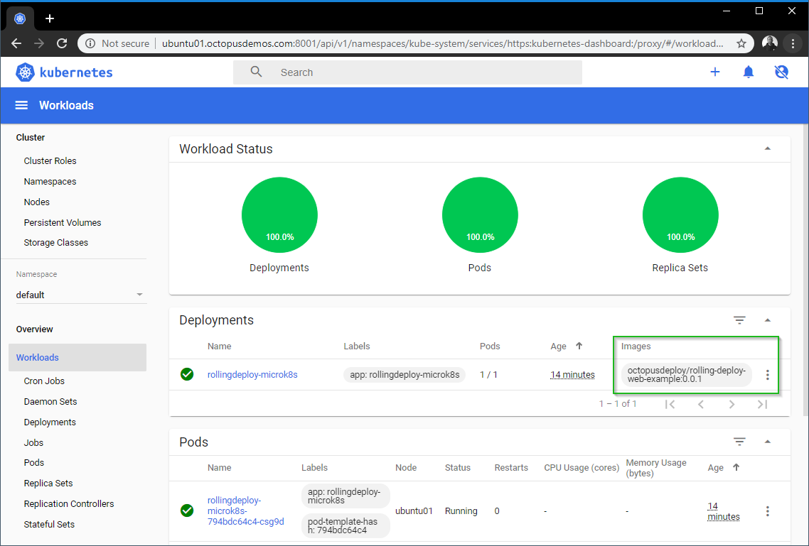

For our Kubernetes deployment, I updated the **Desired Replicas** to 3 so I can perform a rolling update and then hit **Scale**:

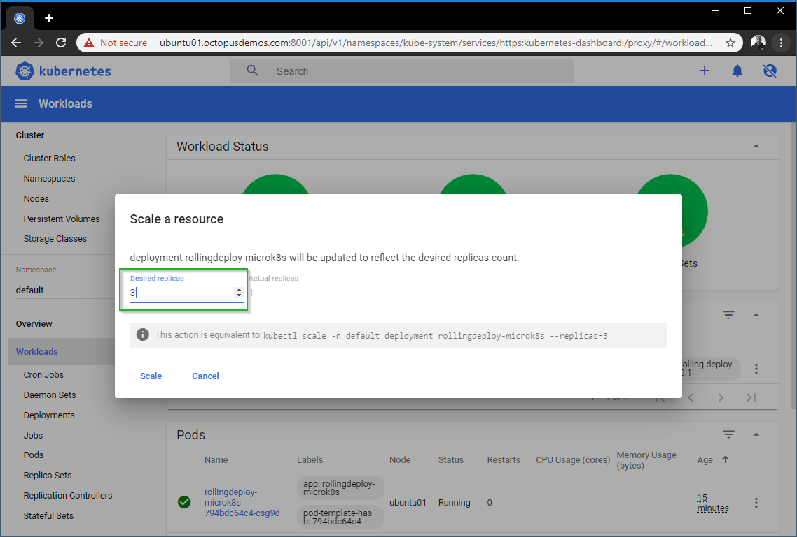

:::hint
**Equivalent kubectl commands**
You may have noticed the dashboard provides the equivalent command to run for our action. For scaling our resource, that is:

```bash
sudo microk8s.kubectl scale -n default deployment rollingdeploy-microk8s --replicas=3
```
:::

After the pods have been provisioned, we can confirm this by querying the pod’s status directly by running the `get pod` command (names may vary):

```bash
markh@ubuntu01:~$ sudo microk8s.kubectl get pod

NAME                                      READY   STATUS    RESTARTS   AGE
rollingdeploy-microk8s-794bdc64c4-fv7zt   1/1     Running   0          76s
rollingdeploy-microk8s-794bdc64c4-t6mh5   1/1     Running   0          76s
rollingdeploy-microk8s-794bdc64c4-trr6f   1/1     Running   0          76s
```

To verify our application is working, we need to find the port that has been exposed by Kubernetes to the deployment we created at the start by running `get service`:

```bash
markh@ubuntu01:~$ sudo microk8s.kubectl get service rollingdeploy-microk8s

NAME                     TYPE       CLUSTER-IP      EXTERNAL-IP   PORT(S)          AGE
rollingdeploy-microk8s   NodePort   10.152.183.39   <none>        5001:32334/TCP   1m
```

In my case, the port is `32334` so my URL to access my service is:

```
http://ubuntu01.octopusdemos.com:32334
```

:::hint
**Note:**
The port may be different when running this on your own machine. A random port, in the range 30000-32767 (by default) will  be assigned by Kubernetes as we chose a `NodePort` type when we ran the `expose` command earlier.
:::

Open the URL in a browser, and we can see that we have `v0.0.1` for our application running in Microk8s:

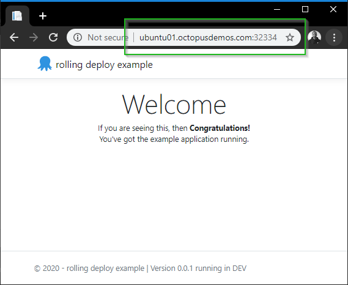

#### Kubernetes rolling update

Let’s go ahead and instruct Kubernetes to update our three pods with `v0.0.2` of our image `octopusdeploy/rolling-deploy-web-example` by running the `set image` command:

```bash
markh@ubuntu01:~$ sudo microk8s.kubectl set image deployment/rollingdeploy-microk8s rolling-deploy-web-example=octopusdeploy/rolling-deploy-web-example:0.0.2 --record

deployment.apps/rollingdeploy-microk8s image updated
```

Next, we can watch the live progress of our rollout until its complete by running the `rollout status` command:

```bash
markh@ubuntu01:~$ sudo microk8s.kubectl rollout status deployment.v1.apps/rollingdeploy-microk8s

Waiting for deployment "rollingdeploy-microk8s" rollout to finish: 1 out of 3 new replicas have been updated...
Waiting for deployment "rollingdeploy-microk8s" rollout to finish: 1 out of 3 new replicas have been updated...
Waiting for deployment "rollingdeploy-microk8s" rollout to finish: 1 out of 3 new replicas have been updated...
Waiting for deployment "rollingdeploy-microk8s" rollout to finish: 2 out of 3 new replicas have been updated...
Waiting for deployment "rollingdeploy-microk8s" rollout to finish: 2 out of 3 new replicas have been updated...
Waiting for deployment "rollingdeploy-microk8s" rollout to finish: 2 out of 3 new replicas have been updated...
Waiting for deployment "rollingdeploy-microk8s" rollout to finish: 1 old replicas are pending termination...
Waiting for deployment "rollingdeploy-microk8s" rollout to finish: 1 old replicas are pending termination...
deployment "rollingdeploy-microk8s" successfully rolled out
```

You can see it indicated it was updating one Pod at a time.

Kubernetes deployments ensure that only a certain number of pods are down while they are being updated. It does this by creating a new pod and destroying the old ones after it has completed.

:::hint
**Default pod update control**

By default, Kubernetes ensures there are at least 75% of the desired number of pods available.
In addition, another default is to create no more than 25% of the overall desired number of pods.
:::

Open the URL in a browser, and we can see we have `v0.0.2` of our application running in Microk8s:

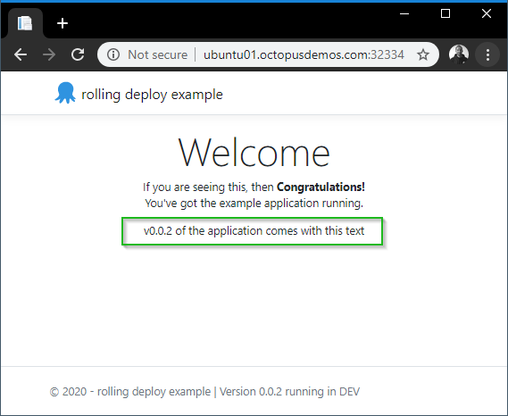

The deployment’s rollout was triggered here, as `set image` caused an update to the underlying deployment pod’s [template](https://kubernetes.io/docs/concepts/workloads/pods/pod-overview/#pod-templates). A template is a specification document that describes the way a [replication controller](https://kubernetes.io/docs/concepts/workloads/controllers/replicationcontroller/) should create an actual pod.

We can see what the template looks like for our application by running `edit`:

```bash
markh@ubuntu01:~$ sudo microk8s.kubectl edit deployment.v1.apps/rollingdeploy-microk8s
```

This opens the template file in a text editor. For me, that’s in the terminal itself. You can edit this file interactively. Changing the deployment pod’s template (the section within `.spec.template`) will result in triggering the deployment’s rollout:

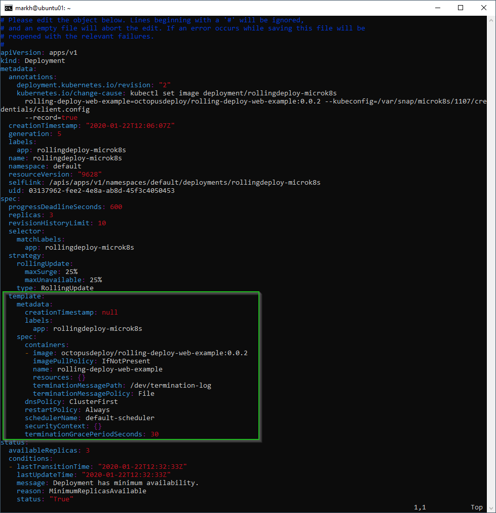


:::hint
**Hint:**
Other updates to a deployment, like the scaling we did earlier, don’t result in a rollout being triggered.
:::

#### Kubernetes deployment rollback

A successful rolling deployment is obviously what we all hope for, but it’s inevitable that at some point, you’ll need to initiate a rollback, either part of the way through a rollout itself or some time after.

With Kubernetes, all of a deployment’s rollout history is kept in the system by default. That means, you can rollback anytime you want.

:::warning
 **Note:**
 It’s possible to change the amount of history that’s stored for a deployment’s rollout (by modifying the revision history limit), but it’s not generally recommended as this limits your ability to rollback a deployment.
:::

To see the rollout history for our deployment we run the `rollout history` command:

```bash
markh@ubuntu01:~$ sudo microk8s.kubectl rollout history deployment.v1.apps/rollingdeploy-microk8s

deployment.apps/rollingdeploy-microk8s
REVISION  CHANGE-CAUSE
1         <none>
2         kubectl set image deployment/rollingdeploy-microk8s rolling-deploy-web-example=octopusdeploy/rolling-deploy-web-example:0.0.2 --kubeconfig=/var/snap/microk8s/1107/credentials/client.config --record=true
```

We can choose to revert back to the previously deployed `v0.0.1` version by running `rollout undo`:

```bash
markh@ubuntu01:~$ sudo microk8s.kubectl rollout undo deployment.v1.apps/rollingdeploy-microk8s

deployment.apps/rollingdeploy-microk8s rolled back
```

:::hint
**Hint:**
You can also choose to revert to a specific revision of your application by running:

```
markh@ubuntu01:~$ sudo microk8s.kubectl rollout undo deployment.v1.apps/rollingdeploy-microk8s --to-revision=1
```

Where the `--to-revision` parameter has the revision you wish to go back to.

The Kubernetes [documentation](https://kubernetes.io/docs/reference/generated/kubectl/kubectl-commands#-em-undo-em-) has a full list of parameters you can use.
:::

We can confirm we have rolled back, either by looking back in the dashboard, viewing the application in a browser, or by running the `describe` command:

```bash
markh@ubuntu01:~$ sudo microk8s.kubectl describe deployment

Name:                   rollingdeploy-microk8s
Namespace:              default
CreationTimestamp:      Wed, 22 Jan 2020 13:19:30 +0000
Labels:                 app=rollingdeploy-microk8s
Annotations:            deployment.kubernetes.io/revision: 3
Selector:               app=rollingdeploy-microk8s
Replicas:               3 desired | 3 updated | 3 total | 3 available | 0 unavailable
StrategyType:           RollingUpdate
MinReadySeconds:        0
RollingUpdateStrategy:  25% max unavailable, 25% max surge
Pod Template:
  Labels:  app=rollingdeploy-microk8s
  Containers:
   rolling-deploy-web-example:
    Image:        octopusdeploy/rolling-deploy-web-example:0.0.1
    Port:         <none>
    Host Port:    <none>
    Environment:  <none>
    Mounts:       <none>
  Volumes:        <none>
Conditions:
  Type           Status  Reason
  ----           ------  ------
  Available      True    MinimumReplicasAvailable
  Progressing    True    NewReplicaSetAvailable
OldReplicaSets:  <none>
NewReplicaSet:   rollingdeploy-microk8s-794bdc64c4 (3/3 replicas created)
Events:
```

This shows us the `Image` is set to `octopusdeploy/rolling-deploy-web-example:0.0.1` as we expected.

:::warning
**Database rollbacks**
As with Docker, it’s important to understand what will happen with any databases you have when you initiate a Kubernetes rollback. Google has a great [article](https://cloud.google.com/blog/products/databases/to-run-or-not-to-run-a-database-on-kubernetes-what-to-consider) discussing running databases on Kubernetes in more depth.
:::

#### Kubernetes deployment clean-up

To remove all of the resources associated with our Kubernetes deployment, we use the `delete` command:

```bash
markh@ubuntu01:~$ sudo microk8s.kubectl delete services,deployment rollingdeploy-microk8s -n default

service "rollingdeploy-microk8s" deleted
deployment.apps "rollingdeploy-microk8s" deleted
```

#### Kubernetes summary

It felt like there was a little more to the setup for a rolling deployment with Kubernetes than with Docker, particularly to gain access to the dashboard, but after it was all configured, it worked excellently.

### Rolling deployments with Octopus

Octopus has supported the concept of rolling deployments since [Octopus 2.0](https://octopus.com/blog/new-in-2.0/rolling-deployments).

With the use of child steps, we can set-up our deployment process for the `rolling-deploy-web-example` application in Octopus.

After creating a new project, we configure a rolling deployment with three steps:

 - A script to remove the node from the load balancer.
 - Deployment of the web application.
 - A script to add the node back into the load balancer.

 To achieve an incremental release in Octopus, we need to make our **Window size** lower than the total number of deployment targets. In my example, I set this to `1`, as you can see below:

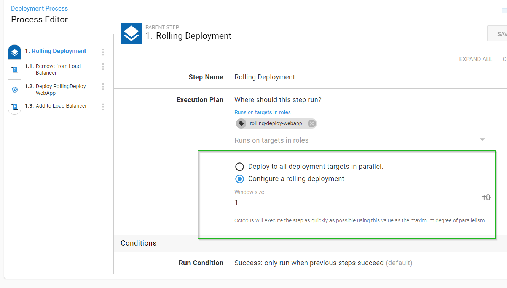

I have two deployment targets configured with the [target role](https://octopus.com/docs/octopus-concepts/target-roles): `rolling-deploy-webapp`.

When I deploy the release to the `Test` environment, Octopus deploys to one deployment target at a time, as I configured in my deployment process earlier:

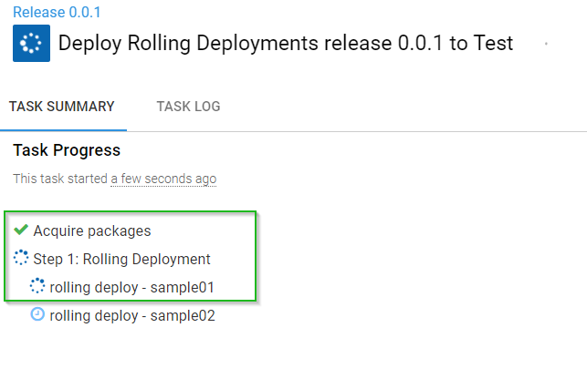

And that’s all there is to it! Check out our [docs](https://octopus.com/docs/deployment-patterns/rolling-deployments) for a complete reference on rolling deployments in Octopus.

:::success
**Sample Octopus project**
You can view this Octopus project setup in our [samples](https://g.octopushq.com/PatternRollingSampleAzureWebApp) instance.
:::

## A word on databases

Usually one of the main sticking points with rolling deployments is the database. Performing rolling deployments which involve some kind of persistent storage can be tricky, though not impossible. The devil is always in the detail.

If you want to perform rolling deployments which includes database changes, I recommend deploying the database first. You also want to ensure any changes you make to your database are backward compatible with previous versions of code you have deployed.

Lastly, it’s definitely a good idea to test your rollback strategy *frequently*.

:::hint
We have an excellent series of posts on [database deployments](https://octopus.com/database-deployments) that discuss this topic and more.
:::

## Conclusion

No matter which tooling you use, rolling deployments is just one pattern available to optimize deployment of your software. But with an incremental approach, it allows you to keep your applications online while rolling out newer versions of your software in a controlled manner, often with native support for rollbacks, making it a firm favorite of mine for minimal disruption.

:::hint
**CI/CD pipeline guides**
If you need any additional help configuring your CI/CD pipeline, we have created the [Octopus Guides](https://octopus.com/docs/guides) which include step-by-step instructions to setup CI/CD pipelines for various technology stacks, including Docker and Kubernetes.
:::

Feel free to leave a comment, and let us know what you think about rolling deployments!
