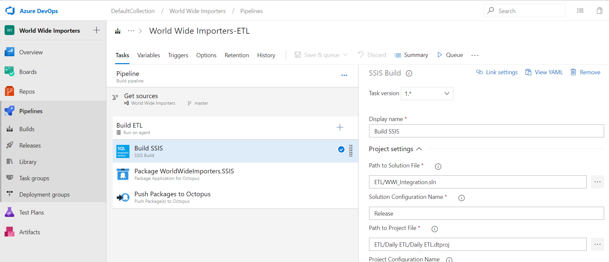
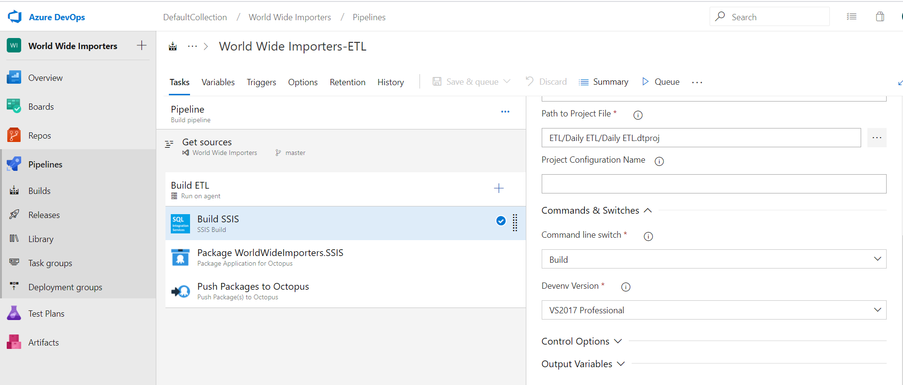
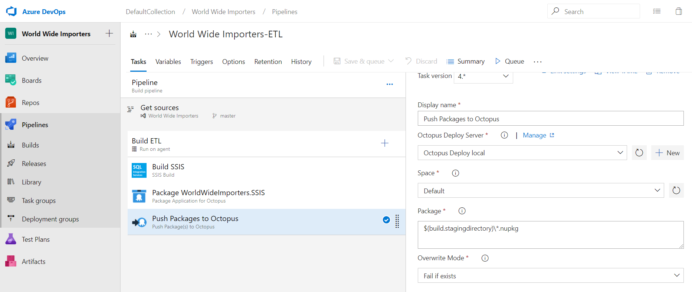
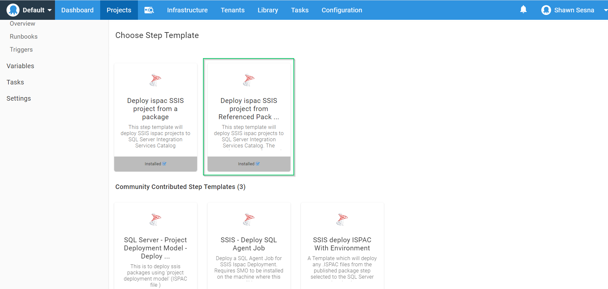
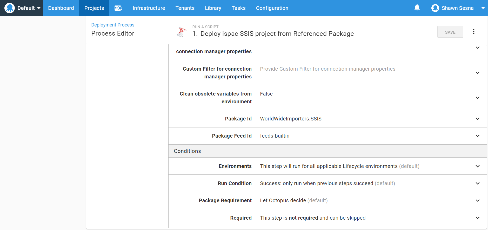
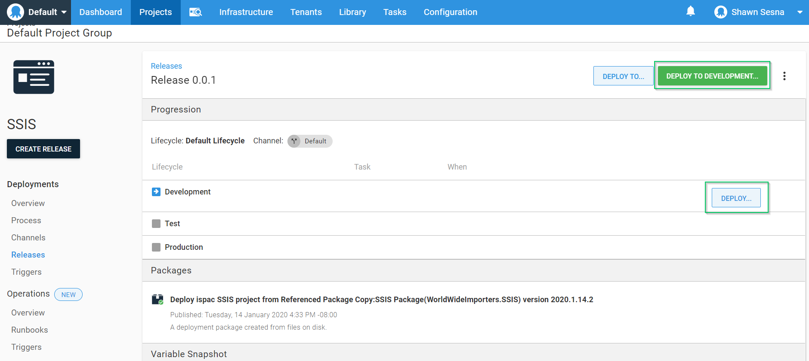

When you think of automating application deployments, what usually comes to mind is automating the deployment web code, containers, and or database.  In this series, I'll demonstrate how to automate supporiting components such as SQL Server Integration Services (SSIS) packages and SQL Server Reporting Services (SSRS) reports.

Extract Transform and Load (ETL) processes are typically deployed by a Database Administrator (DBA) or an Integrations specialist.  In lower level environments, it's not unusual to allow developers to deploy directly to the SSIS server, but when it comes to higher level, such as Production, they're usually done manually.  The DBAs sometimes have scripts they can run to deploy, but it's usually not included in the same tooling as automated application deployments.  With Octopus Deploy, it is possible to add your ETL deployments to your deployment stack!

## Building the SSIS package
To include our SSIS package in the deployment process, we first need to build the project to produce the artifact for deployment.  None of the popular build servers are able to build SSIS out of the box and will require some configuration.  The steps will be roughly the same.

:::hint
Your SSIS project **must** be in the Project Deployment Model, the Package Deployment Model will not work with this solution.
:::

### Configuring the build agent
MSBuild does not know how to build SSIS project types.  In order to perform a build, we'll need to do some configuration to the buil agent(s).

#### Visual Studio
To build SSIS projects, we will need to install Visual Studio on our build agent(s).  The Community edition of Visual Studio should be enough.

:::warning
Consult the EULA of the Community edition to make sure it is OK to use for you or your organization.
:::

#### SQL Server Data Tools
Once we have Visual Studio on our build agent(s), we need to install an extension called SQL Server Data Tools (SSDT).  When that has been installed, our build agent(s) should now have the ability to build .dtsproj projects!

### Build SSIS task
Out-of-the-box, most if not all build servers do not have a task to build SSIS by default.  This will require us to install or configure custom task to perform the build.

#### Azure Devops/Team Foundation Server
The Marketplace for Azure DevOps (ADO) or Team Foundation Server (TFS) has several tasks that the community has created.  If you're using ADO/TFS, I would suggest using this one:


#### TeamCity
TeamCity doesn't have a plugin available to perform the build.  Pavel Hofman has a great [blog post](https://blog.codetitans.pl/post/howto-setup-ssis-project-to-build-via-teamcity/) on how to configure building SSIS projects on TeamCity.

#### Jenkins
Similar to TeamCity, Jenkins does not have any plugins available to perform a Visual Studio build.  However, performing similar steps to the TeamCity solution should yield the same results.

### Building the project
In this post, we'll be using Azure DevOps to perform our build.

#### Build task
Fill in the build task details




#### Packaging the artifact
Once the SSIS project has been built, it will produce an .ispac file, which contains the necessary components for deployent.  .ispac isn't a standard archive like .zip or .nupkg, so we'll need to have an additional step that packages it up to a supported format.  For ADO, TeamCity, and Jenkins, Octopus Deploy has plugins or extensions that contains steps that can do this.


#### Pushing the artifact to a repository
Once the .ispac file has been packaged, we need to package it up and send it to a repository, such as:

- Octopus Deploy built-in repository
- Artifactory
- Nexus
- ADO/TFS repository



## Octopus Deploy
Now that we have the package ready, we can create and configure out Octopus Deploy project!

### Create the project
To create our project, click on Projects and **ADD PROJECT**


#### Add SSIS deployment step
The only step templates for deploying SSIS packages are in the Community Step Library.  Click on **ADD STEP**


Filtering by SSIS will show the available SSIS step templates available.  For this demonstration, I'll be using `Deploy ispac SSIS project from Referenced Package`.  This template will allow us to depoy using a Worker instead of having to install an agent on the SSIS server.



#### Fill in the step details
This step allows us to run the step on either a deployment target or a worker.  For this demonstration, we're going to be using a worker so we don't have to install a tentacle on the SSIS server itself.  Expand the `Execution Location` section and select `Run once on a worker`.


Now fill in the parameters:

- Database server name (\instance): The name of the SSIS server to connect to.  (i.e. SSISServer1 or SSISServer1\Instance1)
- SQL Authentication Username (optional): The SQL Account username, leave blank to use Integrated Authentication
- SQL Authentication Password (optional): The password to the SQL Account, leave blank to use Integrated Authentication
- Enable SQL CLR: The SSISDB feature of SQL Server requires that the SQL CLR be enabled.  If the feature isn't already enabled, set this to true
- Catalog name: The name of the catalog for SSISDB, it is recommended not to change this value.  This is only needed if the SSISDB feature has not already been installed
- Catalog Password: The password for the SSISDB catalog.  This is only needed if the SSISDB feature has not already been installed
- Folder name:  Name of the folder to place the SSIS project within the SSISDB catalogue
- Project name: The name of the SSIS project.  This name must match exactly the name of the project within Visual Studio
- Use Environment: Set to true if you want to use Environment Variables in SSISDB
- Environment name: The name of the Environment to use
- Reference project parameters to environment variables: Set to true to link Project variables to environment variables
- Reference package parameters to environment variables: Set to true to link package variables to environment variables 
- Use fully qualified variable names: When true the package variables names must be represented in `dtsx_name_without_extension.variable_name`
- Use Custom Filter for connection manager properties: Custom filter should contain the regular expression for ignoring properties when setting will occur during the auto-mapping
- Custom Filter for connection manager properties: Regular expression for filtering out the connection manager properties during the auto-mapping process. This string is used when `UseCustomFilter` is set to true
- Package Id: Id of the package used for deployment
- Package Feed Id: The Id of the feed where the package resides

Images are of the saved step




With the form filled out, we can now deploy our package!

### Deploy
Let's create our Release.  Click on the **CREATE RELEASE** button in your project


Click **SAVE**


Select environment to deploy to



Then confirm deployment


And walla!  Our package has been deployed!


#### Deployment log
If you've referenced project parameters to environment variables, you'll note something like the following in the deployment log

```
- Adding environment variable CM.WWI_Source_DB.ConnectionString 
**- OctopusParameters collection is empty or CM.WWI_Source_DB.ConnectionString not in the collection -**
```
This message indicates that you've referenced a project parameter to an environment variable, but the variable CM.WWI_Source_DB.ConnectionString was not found in the Octopus Deploy project variables.  What this means is that you can create an Octopus Deploy project variable with the same name to control the value as to goes from environment to environment, just like an application!

:::hint
Creating the variables by hand can sometimes be time consuming.  See my [importing variables from SSISDB](https://octopus.com/blog/get-variables-from-ssisdb) post to automate variable creation
:::

#### Viewing the results
Let's take a look at our SSISDB using SQL Server Management Studio (SSMS)


Opening the Environment, we'll see our variables have been created


## Conclusion
In this post I demonstrated how to deploy SSIS packages using Octopus Deploy.  Using this method, you can now include supporting application components using the same tooling.

