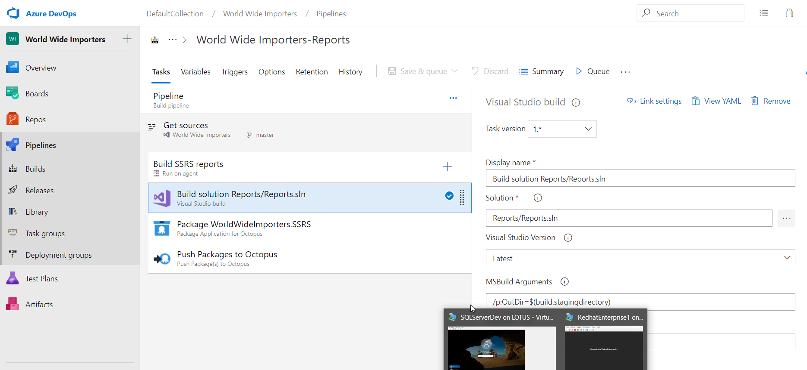

Collecting and storing data are often the main functions of web applications.  The collected data needs to be analyzed and shown in graphical format to help make decisions.  This usually takes the form of a report.  In this part of my series, I will demonstrate how to include SQL Server Reporting Services (SSRS) reports using Octopus Deploy.

## Building the project
As of Visual Studio 2017, MSBuild can build .rtpproj files.  Projects that are created in older versions of Visual Studio will need to configure the build agents similar to my [SSIS post](the url) in order to build the project.

### Adding the build task
To build an SSRS project, simply add any MSBuild type task to your build definition.  For my build definition, I chose a Visual Studio build task, which invokes MSBuild.

### Packing the artifacts
When the SSRS project is built, it places the built reports into the `bin` folder.  In this case, they are in `Reports/Reports/bin/release`  We'll need to package these reports into either a .zip or a .nupkg for deployment.  For this post, we'll choose the .nupkg format.

### Pushing the artifacts
Now that we have the artifacts all packaged up, we can push them to our Octopus Deploy server.

And that's all we need for our build definition!

## Octopus Deploy
Now that we have the our artifacts in Octopus Deploy, we can create our project for deployment

### Creating the project

