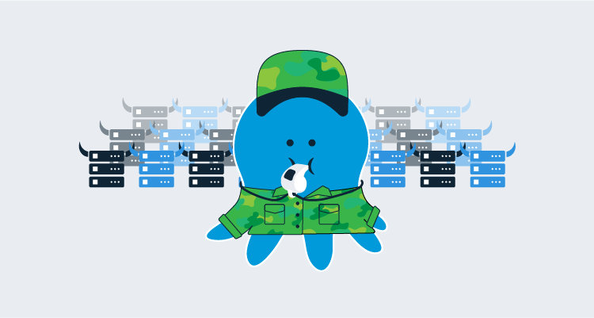

The advent of Infrastructure as Code (IaC) has been a tremendous leap forward, especially within the cloud space.  The ability to programmatically define how infrastructure should look has led to environmental consistency and more predictable application behavior.

Cloud providers have embraced Infrastructure as Code, providing customized IaC implementations to provision and configure resources on their offerings.  Unfortunately, this means you have to learn multiple tools to work with the different providers; for example, Amazon Web Services (AWS) CloudFormation or Microsoft Azure Resource Manager (ARM) templates. HashiCorp created Terraform to solve this problem, a single tool to work with multiple providers.  

In this post, I show you how to dynamically create workers for Octopus Deploy using Terraform and AWS autoscaling.

:::hint
Workers in Octopus enable you to shift deployment work onto other machines running in pools. This can greatly reduce the work performed on your Octopus server, freeing it to execute more deployments more readily. Worker pools can improve scalability by enabling dedicated pools of machines that can be utilized by multiple projects and teams. Examples of this include utilizing workers with database deployments, deployments to cloud infrastructure like Azure, AWS and Kubernetes (K8s) etc.
:::

## What is AWS autoscaling?
AWS autoscaling is the ability to spin up or tear down resources based on specified criteria.  A common use-case for autoscaling is an eCommerce web site.  As demand increases, more servers are created to handle the load.  When load subsides, the additional resources can be de-provisioned automatically.  This allows eCommerce to keep a minimal amount of servers in operation, and keep the hosting costs down.

In this post, we are using AWS autoscaling to dynamically add more workers to enable teams to execute their deployments as efficiently as possible.

## Using Terraform to provision our cloud infrastructure
Using declarative configuration files, Terraform can create new resources, manage existing ones, or destroy ones that are no longer necessary.

With Terraform, we have the ability to define all of our resources within a single file, or logically separate them.  For this post, we’ll separate our files so they’re easy to work with.  

We’ll make use of eight files:

- autoscaling.tf
- autoscalingpolicy.tf
- backend.tf
- installTentacle.sh
- provider.tf
- securitygroup.tf
- vars.tf
- vpc.tf

### autoscaling.tf

This file contains the resource declarations for creating the AWS autoscaling groups and the launch configurations for our workers.  I’ve created two launch configurations, one for Windows and one for Linux.  Each launch configuration executes a script that automatically installs and configure the Octopus Deploy Tentacle software, then connects it as a worker to our Octopus Deploy server.  To illustrate how scripts can be connected to launch configurations, the Linux launch configuration reads a file (installTentacle.sh) which contains the commands, whereas the Windows launch configuration has the script inline.  For both Windows and Linux, we are configuring Polling Tentacles.

:::hint
The .tf files in this demonstration uses Terraform v0.11 syntax.  At the time of this writing, Octopus Deploy does not support use of Terraform v0.12 without explicitly setting the [`Octopus.Action.Terraform.CustomTerraformExecutable`](https://octopus.com/docs/deployment-examples/terraform-deployments/apply-terraform#special-variables) variable.
:::

```terraform

resource "aws_launch_configuration" "dynamic-linux-worker-launchconfig" {
    name_prefix = "dynamic-linux-worker-launchconfig"
    image_id = "${var.LINUX_AMIS}"
    instance_type = "t2.micro"

    security_groups = ["${aws_security_group.allow-octopusserver.id}"]

    # script to run when created
user_data = "${file("installTentacle.sh")}"

}

resource "aws_launch_configuration" "dynamic-windows-worker-launchconfig" {
    name_prefix = "dynamic-windows-worker-launchconfig"
    image_id = "${var.WINDOWS_AMIS}"
    instance_type = "t2.micro"

    security_groups = ["${aws_security_group.allow-octopusserver.id}"]

    user_data = <<-EOT
<powershell>
Set-ExecutionPolicy Bypass -Scope Process -Force; [System.Net.ServicePointManager]::SecurityProtocol = [System.Net.ServicePointManager]::SecurityProtocol -bor 3072; iex ((New-Object System.Net.WebClient).DownloadString('https://community.chocolatey.org/install.ps1'))

$OctopusName = (Invoke-RestMethod http://169.254.169.254/latest/meta-data/hostname)

choco install octopusdeploy.tentacle -y

& "C:\Program Files\Octopus Deploy\Tentacle\Tentacle.exe" create-instance --config "c:\octopus\home"

& "C:\Program Files\Octopus Deploy\Tentacle\Tentacle.exe" new-certificate --if-blank

& "C:\Program Files\Octopus Deploy\Tentacle\Tentacle.exe" configure --noListen True --reset-trust --app "c:\octopus\applications"

Write-Host "Running register with..."

& "C:\Program Files\Octopus Deploy\Tentacle\Tentacle.exe" register-worker --server "#{Project.Octopus.Server.Url}" --apiKey "#{Project.Octopus.Server.ApiKey}"  --comms-style "TentacleActive" --server-comms-port "#{Project.Octopus.Server.PollingPort}" --workerPool "#{Project.Octopus.Server.WorkerPool}" --policy "#{Project.Octopus.Server.MachinePolicy}" --space "#{Project.Octopus.Server.Space}" --name $OctopusName

Write-Host "Finished register with..."

& "C:\Program Files\Octopus Deploy\Tentacle\Tentacle.exe" service --install

& "C:\Program Files\Octopus Deploy\Tentacle\Tentacle.exe" service --start


</powershell>

  EOT
}

resource "aws_autoscaling_group" "dynamic-linux-worker-autoscaling" {
    name = "dynamic-linux-worker-autoscaling"
    vpc_zone_identifier = ["${aws_subnet.worker-public-1.id}", "${aws_subnet.worker-public-2.id}", "${aws_subnet.worker-public-3.id}"]
    launch_configuration = "${aws_launch_configuration.dynamic-linux-worker-launchconfig.name}"
    min_size = 2
    max_size = 3
    health_check_grace_period = 300
    health_check_type = "EC2"
    force_delete = true

    tag {
        key = "Name"
        value = "Octopus Deploy Linux Worker"
        propagate_at_launch = true
    }
}

resource "aws_autoscaling_group" "dynamic-windows-worker-autoscaling" {
    name = "dynamic-windows-worker-autoscaling"
    vpc_zone_identifier = ["${aws_subnet.worker-public-1.id}", "${aws_subnet.worker-public-2.id}", "${aws_subnet.worker-public-3.id}"]
    launch_configuration = "${aws_launch_configuration.dynamic-windows-worker-launchconfig.name}"
    min_size = 2
    max_size = 3
    health_check_grace_period = 300
    health_check_type = "EC2"
    force_delete = true

    tag {
        key = "Name"
        value = "Octopus Deploy Windows Worker"
        propagate_at_launch = true
    }
}
```
### autoscalingpolicy.tf
This file contains the policy and trigger definitions to both scale up and scale down our EC2 instances:

```terraform
# scale up alarm

resource "aws_autoscaling_policy" "linux-worker-cpu-policy" {
  name                   = "linux-worker-cpu-policy"
  autoscaling_group_name = "${aws_autoscaling_group.dynamic-linux-worker-autoscaling.name}"
  adjustment_type        = "ChangeInCapacity"
  scaling_adjustment     = "1"
  cooldown               = "300"
  policy_type            = "SimpleScaling"
}

resource "aws_cloudwatch_metric_alarm" "linux-worker-cpu-alarm" {
  alarm_name          = "linux-worker-cpu-alarm"
  alarm_description   = "linux-worker-cpu-alarm"
  comparison_operator = "GreaterThanOrEqualToThreshold"
  evaluation_periods  = "2"
  metric_name         = "CPUUtilization"
  namespace           = "AWS/EC2"
  period              = "120"
  statistic           = "Average"
  threshold           = "30"

  dimensions = {
    "AutoScalingGroupName" = "${aws_autoscaling_group.dynamic-linux-worker-autoscaling.name}"
  }

  actions_enabled = true
  alarm_actions   = ["${aws_autoscaling_policy.linux-worker-cpu-policy.arn}"]
}

# scale down alarm
resource "aws_autoscaling_policy" "linux-worker-cpu-policy-scaledown" {
  name                   = "linux-worker-cpu-policy-scaledown"
  autoscaling_group_name = "${aws_autoscaling_group.dynamic-linux-worker-autoscaling.name}"
  adjustment_type        = "ChangeInCapacity"
  scaling_adjustment     = "-1"
  cooldown               = "300"
  policy_type            = "SimpleScaling"
}

resource "aws_cloudwatch_metric_alarm" "linux-worker-cpu-alarm-scaledown" {
  alarm_name          = "linux-worker-cpu-alarm-scaledown"
  alarm_description   = "linux-worker-cpu-alarm-scaledown"
  comparison_operator = "LessThanOrEqualToThreshold"
  evaluation_periods  = "2"
  metric_name         = "CPUUtilization"
  namespace           = "AWS/EC2"
  period              = "120"
  statistic           = "Average"
  threshold           = "5"

  dimensions = {
    "AutoScalingGroupName" = "${aws_autoscaling_group.dynamic-linux-worker-autoscaling.name}"
  }

  actions_enabled = true
  alarm_actions   = ["${aws_autoscaling_policy.linux-worker-cpu-policy-scaledown.arn}"]
}

resource "aws_autoscaling_policy" "windows-worker-cpu-policy" {
  name                   = "windows-worker-cpu-policy"
  autoscaling_group_name = "${aws_autoscaling_group.dynamic-windows-worker-autoscaling.name}"
  adjustment_type        = "ChangeInCapacity"
  scaling_adjustment     = "1"
  cooldown               = "300"
  policy_type            = "SimpleScaling"
}

resource "aws_cloudwatch_metric_alarm" "windows-worker-cpu-alarm" {
  alarm_name          = "windows-worker-cpu-alarm"
  alarm_description   = "windows-worker-cpu-alarm"
  comparison_operator = "GreaterThanOrEqualToThreshold"
  evaluation_periods  = "2"
  metric_name         = "CPUUtilization"
  namespace           = "AWS/EC2"
  period              = "120"
  statistic           = "Average"
  threshold           = "30"

  dimensions = {
    "AutoScalingGroupName" = "${aws_autoscaling_group.dynamic-windows-worker-autoscaling.name}"
  }

  actions_enabled = true
  alarm_actions   = ["${aws_autoscaling_policy.windows-worker-cpu-policy.arn}"]
}

# scale down alarm
resource "aws_autoscaling_policy" "windows-worker-cpu-policy-scaledown" {
  name                   = "windows-worker-cpu-policy-scaledown"
  autoscaling_group_name = "${aws_autoscaling_group.dynamic-windows-worker-autoscaling.name}"
  adjustment_type        = "ChangeInCapacity"
  scaling_adjustment     = "-1"
  cooldown               = "300"
  policy_type            = "SimpleScaling"
}

resource "aws_cloudwatch_metric_alarm" "windows-worker-cpu-alarm-scaledown" {
  alarm_name          = "windows-worker-cpu-alarm-scaledown"
  alarm_description   = "windows-worker-cpu-alarm-scaledown"
  comparison_operator = "LessThanOrEqualToThreshold"
  evaluation_periods  = "2"
  metric_name         = "CPUUtilization"
  namespace           = "AWS/EC2"
  period              = "120"
  statistic           = "Average"
  threshold           = "5"

  dimensions = {
    "AutoScalingGroupName" = "${aws_autoscaling_group.dynamic-windows-worker-autoscaling.name}"
  }

  actions_enabled = true
  alarm_actions   = ["${aws_autoscaling_policy.windows-worker-cpu-policy-scaledown.arn}"]
}
```

### backend.tf
When executing Terraform from your local machine, the state files are stored locally.  Octopus Deploy will not keep the state files after the apply has been performed so it’s necessary to store our state files on external storage.  This file tells Terraform to use an AWS S3 bucket to store the state files:

```terraform
terraform {
    backend "s3" {
        bucket = "#{Project.AWS.S3.Bucket}"
        key = "#{Project.AWS.S3.Key}"
        region = "#{Project.AWS.Region}"
    }
}
```

### installTentacle.sh
This is the bash script file referenced in the autoscaling.tf launch configuration for the Linux variant.  This contains the commands necessary to download, install, and configure the Octopus Deploy Tentacle software as well as connecting it to our Octopus Deploy server:

```bash
#!/bin/bash
serverUrl="#{Project.Octopus.Server.Url}"
serverCommsPort="#{Project.Octopus.Server.PollingPort}"
apiKey="#{Project.Octopus.Server.ApiKey}"
name=$HOSTNAME
configFilePath="/etc/octopus/default/tentacle-default.config"
applicationPath="/home/Octopus/Applications/"
workerPool="#{Project.Octopus.Server.WorkerPool}"
machinePolicy="#{Project.Octopus.Server.MachinePolicy}"
space="#{Project.Octopus.Server.Space}"

sudo apt-key adv --fetch-keys "https://apt.octopus.com/public.key"
sudo add-apt-repository "deb https://apt.octopus.com/ stretch main"
sudo apt-get update
sudo apt-get install tentacle

sudo /opt/octopus/tentacle/Tentacle create-instance --config "$configFilePath" --instance "$name"
sudo /opt/octopus/tentacle/Tentacle new-certificate --if-blank
sudo /opt/octopus/tentacle/Tentacle configure --noListen True --reset-trust --app "$applicationPath"
echo "Registering the worker $name with server $serverUrl"
sudo /opt/octopus/tentacle/Tentacle register-worker --server "$serverUrl" --apiKey "$apiKey" --name "$name"  --comms-style "TentacleActive" --server-comms-port $serverCommsPort --workerPool "$workerPool" --policy "$machinePolicy" --space "$space"
sudo /opt/octopus/tentacle/Tentacle service --install --start
```

### provider.tf
The provider.tf informs Terraform which provider we are using.  In our case, that’s AWS:

```terraform
provider "aws" {
  region     = "${var.AWS_REGION}"
}
```

### securitygroup.tf
When dealing with cloud providers, security groups are firewall rules.  The securitygroup.tf file contains the ingress and egress rules for our EC2 instances.  In this case, ports 22 and 3389 are opened for debugging purposes and can be omitted:

```terraform
resource "aws_security_group" "allow-octopusserver" {
  vpc_id      = "${aws_vpc.worker_vpc.id}"
  name        = "allow-octopusserver"
  description = "Security group that allows traffic to the worker from the Octpus Server"
  egress {
    from_port   = 0
    to_port     = 0
    protocol    = "-1"
    cidr_blocks = ["0.0.0.0/0"]
  }

  ingress {
    from_port = 22
    to_port = 22
    protocol = "tcp"
    cidr_blocks = ["0.0.0.0/0"]
  }

  ingress {
    from_port = 3389
    to_port = 3389
    protocol = "tcp"
    cidr_blocks = ["0.0.0.0/0"]
  }

  tags = {
    Name = "allow-octopusserver"
  }
}
```

### vars.tfs
This file contains the different variables used within our Terraform scripts.  Within this file, we’ve defined which Amazon Machine Image (AMI) to use for our EC2 instances.  The AMI values are hardcoded in this file, but they could be easily replaced with variables from Octopus Deploy using the [Octostache syntax](https://github.com/OctopusDeploy/Octostache) like the `AWS_REGION` variable.  This file defines the following variables:

- `AWS_REGION`: the AWS region we’re using.
- `LINUX_AMIS`: the AMI for our Linux EC2 instances.
- `WINDOWS_AMIS`: the AMI for our Windows EC2 instances.
- `PATH_TO_PRIVATE_KEY`: path to the private key associated with the AWS key pair used for logging into our instances (used for debugging, not included).
- `PATH_TO_PUBLIC_KEY`: path to the public key associated with the AWS key pair used for logging into our instances (used for debugging, not included).

```terraform
variable "AWS_REGION" {
  default = "#{Project.AWS.Region}"
}

variable "LINUX_AMIS" {
  default =  "ami-084a6c14d8630bb68"
}

variable "WINDOWS_AMIS"{
  default = "ami-087ee25b86edaf4b1"
}

variable "PATH_TO_PRIVATE_KEY" {
  default = "mykey"
}

variable "PATH_TO_PUBLIC_KEY" {
  default = "mykey.pub"
}
```

### vpc.tf
This file contains the necessary resources for creating a Virtual Private Cloud (VPC) in AWS.  It contains the definitions for:

- VPC
- Subnets
- Internet Gateway
- Route table
- Route table associations

```terraform
# Internet VPC
resource "aws_vpc" "worker_vpc" {
  cidr_block           = "10.0.0.0/16"
  instance_tenancy     = "default"
  enable_dns_support   = "true"
  enable_dns_hostnames = "true"
  enable_classiclink   = "false"
  tags = {
    Name = "worker_vpc"
  }
}

# Subnets
resource "aws_subnet" "worker-public-1" {
  vpc_id                  = "${aws_vpc.worker_vpc.id}"
  cidr_block              = "10.0.1.0/24"
  map_public_ip_on_launch = "true"
  availability_zone       = "${var.AWS_REGION}a"

  tags = {
    Name = "worker-public-1"
  }
}

resource "aws_subnet" "worker-public-2" {
  vpc_id                  = "${aws_vpc.worker_vpc.id}"
  cidr_block              = "10.0.2.0/24"
  map_public_ip_on_launch = "true"
  availability_zone       = "${var.AWS_REGION}b"

  tags = {
    Name = "worker-public-2"
  }
}

resource "aws_subnet" "worker-public-3" {
  vpc_id                  = "${aws_vpc.worker_vpc.id}"
  cidr_block              = "10.0.3.0/24"
  map_public_ip_on_launch = "true"
  availability_zone       = "${var.AWS_REGION}c"

  tags = {
    Name = "worker-public-3"
  }
}

resource "aws_subnet" "worker-private-1" {
  vpc_id                  = "${aws_vpc.worker_vpc.id}"
  cidr_block              = "10.0.4.0/24"
  map_public_ip_on_launch = "false"
  availability_zone       = "${var.AWS_REGION}a"

  tags = {
    Name = "worker-private-1"
  }
}

resource "aws_subnet" "worker-private-2" {
  vpc_id                  = "${aws_vpc.worker_vpc.id}"
  cidr_block              = "10.0.5.0/24"
  map_public_ip_on_launch = "false"
  availability_zone       = "${var.AWS_REGION}b"

  tags = {
    Name = "worker-private-2"
  }
}

resource "aws_subnet" "worker-private-3" {
  vpc_id                  = "${aws_vpc.worker_vpc.id}"
  cidr_block              = "10.0.6.0/24"
  map_public_ip_on_launch = "false"
  availability_zone       = "${var.AWS_REGION}c"

  tags = {
    Name = "worker-private-3"
  }
}

# Internet GW
resource "aws_internet_gateway" "worker-gw" {
  vpc_id = "${aws_vpc.worker_vpc.id}"

  tags = {
    Name = "worker"
  }
}

# route tables
resource "aws_route_table" "worker-public" {
  vpc_id = "${aws_vpc.worker_vpc.id}"
  route {
    cidr_block = "0.0.0.0/0"
    gateway_id = "${aws_internet_gateway.worker-gw.id}"
  }

  tags = {
    Name = "worker-public-1"
  }
}

# route associations public
resource "aws_route_table_association" "worker-public-1-a" {
  subnet_id      = "${aws_subnet.worker-public-1.id}"
  route_table_id = "${aws_route_table.worker-public.id}"
}

resource "aws_route_table_association" "worker-public-2-a" {
  subnet_id      = "${aws_subnet.worker-public-2.id}"
  route_table_id = "${aws_route_table.worker-public.id}"
}

resource "aws_route_table_association" "worker-public-3-a" {
  subnet_id      = "${aws_subnet.worker-public-3.id}"
  route_table_id = "${aws_route_table.worker-public.id}"
}
```

And there you have it!  All of the Terraform scripts necessary to create our AWS autoscaling worker army.  All that’s left is to package these files up into either a .zip or .nupkg using a build server or the Octopus CLI.  After the package has been created and uploaded to our Octopus server, we can include it in our deployment process.

## Octopus Deploy
Setting up the Terraform files was by far the hardest part of this entire process.  The steps for creating the deployment within Octopus Deploy are quite short.  For our purposes, we only need two environments, `Spinup` and `Teardown`.

### Environments
To create our environments, navigate to {{ Infrastructure > Environments > ADD ENVIRONMENT }}:

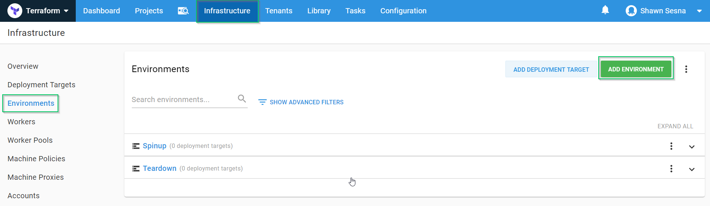

Create the following:
- `Spinup`
- `Teardown`

For this demonstration, we use the Default lifecycle.  It may be necessary to create a new lifecycle for this project if others already exist.

### AWS account
To work with AWS, we need an account with the necessary rights to create our resources.  After that has been created in AWS, we need to add this account to Octopus Deploy.  To do this, we’ll click {{Infrastructure > Accounts > ADD ACCOUNT}}:

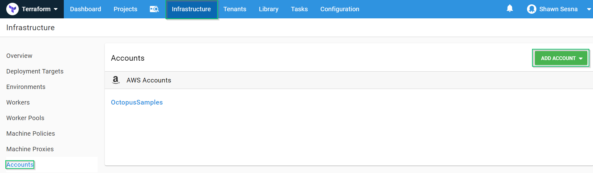

Choose AWS Account:

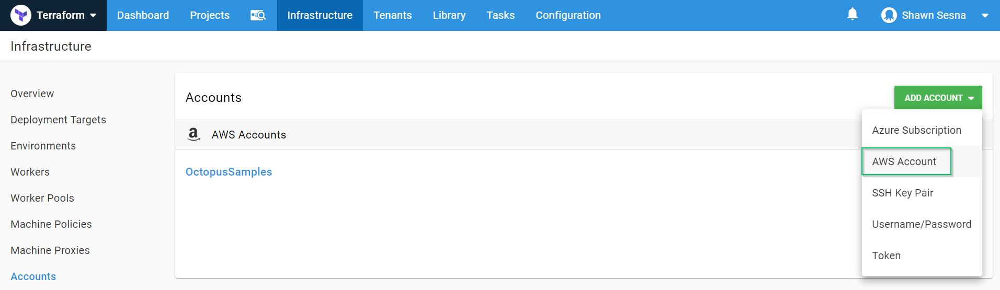

Fill in the Access and Secret keys.  Be sure to click **SAVE AND TEST** to make sure your account works correctly:

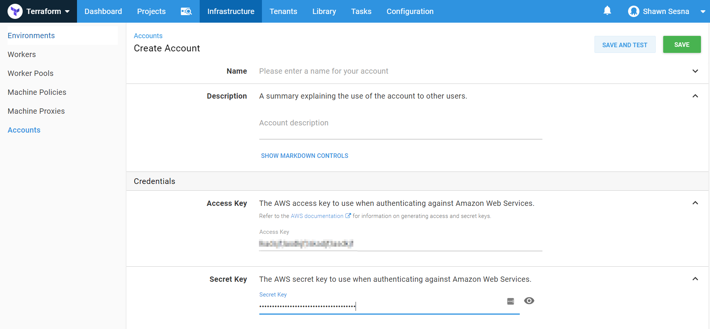

### Worker pool
For this post, we’re going to place our dynamic workers into their own pool.  To do this, we first create the pool.

Navigate to {{Infrastructure > Worker Pools > ADD WORKER POOL}}:

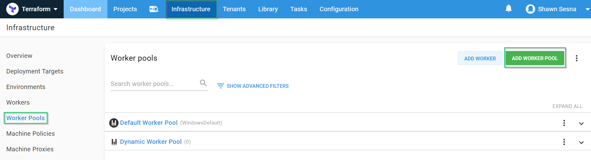

Give the worker pool a name and click **SAVE**:

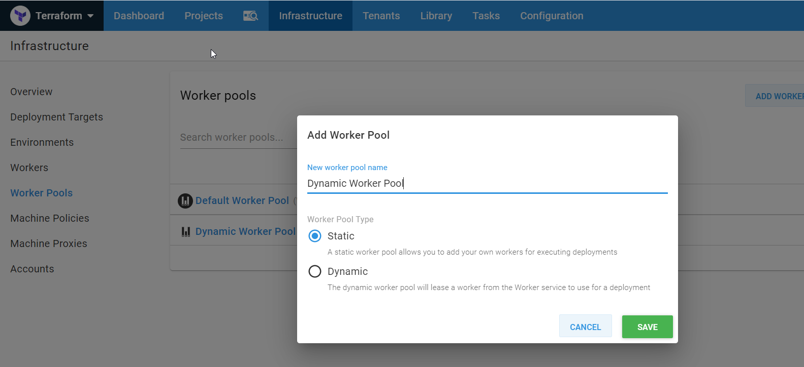

### Project
With the environments created, we can create our project to create our workers.

Click {{Projects > ADD PROJECT}}:

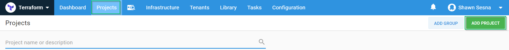

After you give it a name and click **SAVE**, you’ll be taken to your brand new project.

#### Variables
The Terraform scripts we created above had Octostache variables that need to be replaced at deploy-time.  To define our variables, click the **Variables** tab and create the following variables (I name-spaced my variables to more easily identify where they came from):

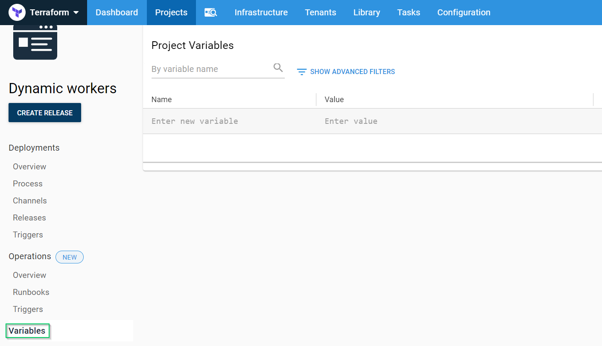

- `Project.AWS.Account`: The AWS Account we created above.
- `Project.AWS.Region`: The region in AWS we’re using.
- `Project.AWS.S3.Bucket`: The bucket that we’re going to store our state files in.
- `Project.AWS.S3.Key`: The key that will store our state.
- `Project.Octopus.Server.ApiKey`: The API Key that will be used when connecting the worker to the Octopus server (sensitive).
- `Project.Octopus.Server.MachinePolicy`: The name of the Machine Policy the worker will be attached to.
- `Project.Octopus.Server.PollingPort`: The port that the Octopus server uses for Polling Tentacles.
- `Project.Octopus.Server.Space`: The name of the space the worker will be attached to (leave blank for default).
- `Project.Octopus.Server.Url`: The Octopus server URL.
- `Project.Octopus.Server.WorkerPool`: The name of the worker pool the worker will join.

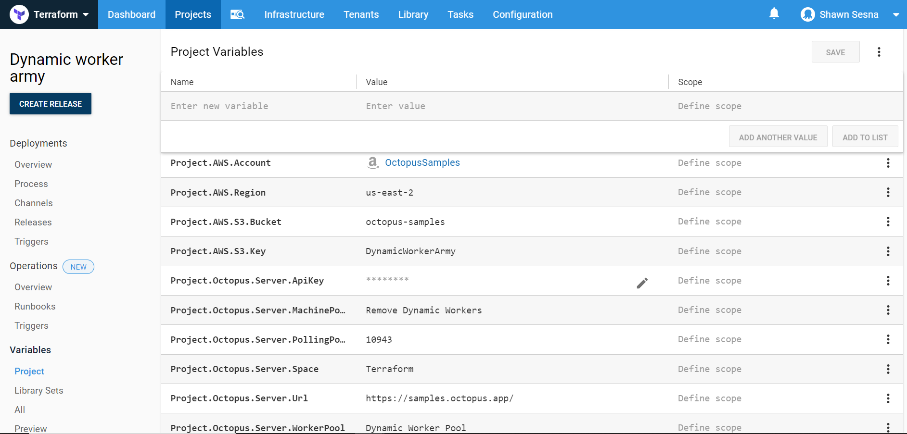

#### Steps
Our deployment process will consist of two steps; a Terraform Apply step, and a Terraform Destroy step.

##### Terraform Apply template

Click {{ Process > ADD STEP }}:

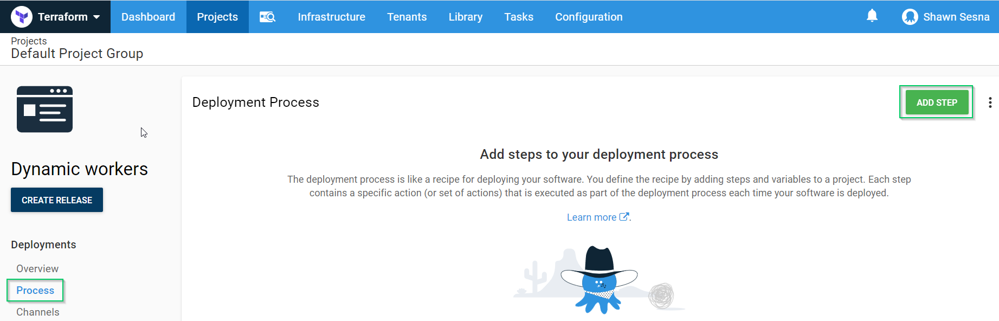

Click the Terraform Category and choose the Apply a Terraform template:

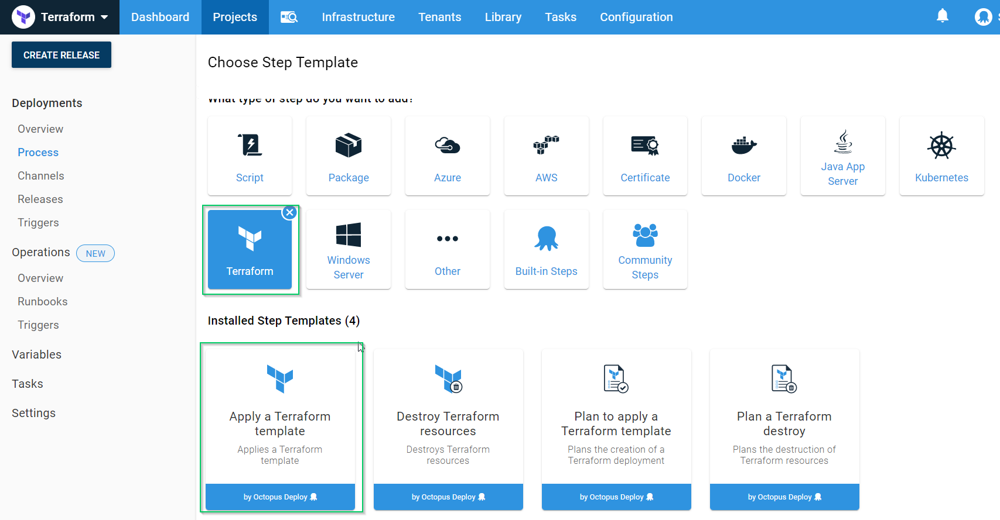

Give the step a name and have it execute on a worker in the Default pool:

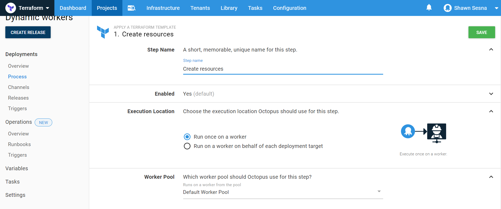

Enable Account Integration, choose the AWS account and specify the region:

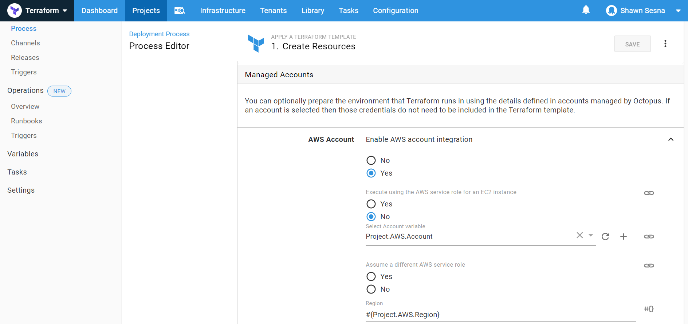

Select the package that contains your Terraform files.  Uncheck the Replace variables in default Terraform files.  In the Target files section, add two entries:
- \*.tf
- \*.sh

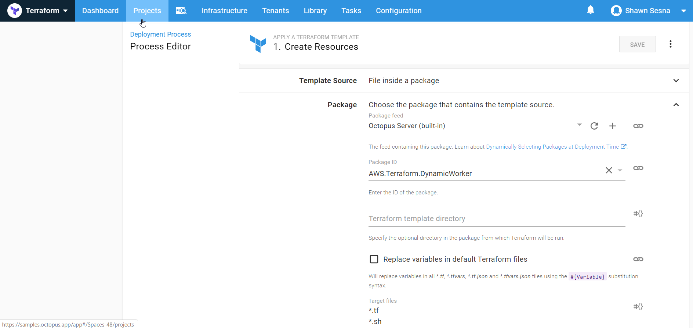

Under Conditions, have this step only execute in the `Spinup` environment:

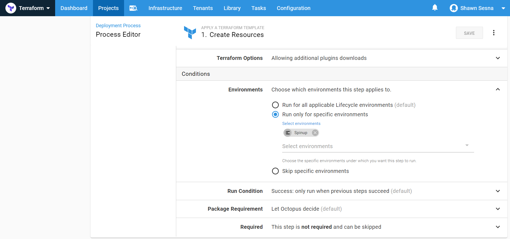

That’s it for the Apply a Terraform template step.

##### Terraform Destroy template
To help conserve costs, we can tear down the resources we’ve created when we know they will not be used, such as the end of the work day.  In this demonstration, we’ve chosen to do this as part of our deployment, however, we could easily implement this as a scheduled [runbook](https://octopus.com/docs/operations-runbooks/).

Click **ADD STEP**, choose the Terraform category, then choose Destroy Terraform resources:

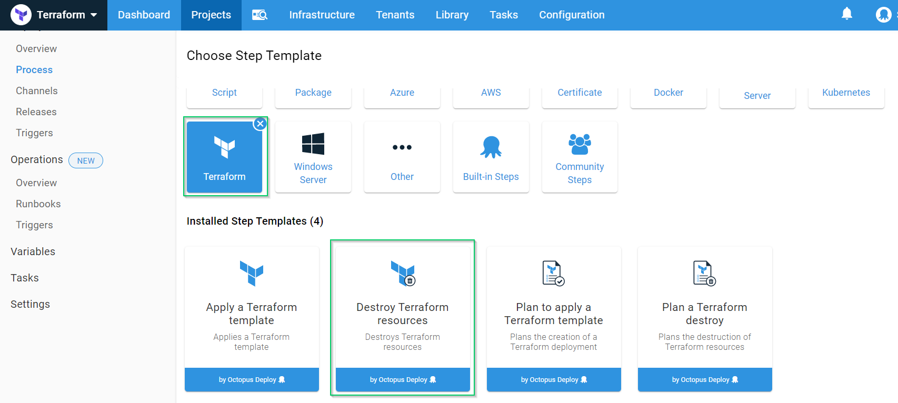

Fill in the same values for this as we did for the Apply Terraform template with the exception of which environment to run in.  For the Destroy step, we only want it to run in the `Teardown` environment.

That’s all!  We’re now ready to create our release and deploy our Terraform template.

### Applying the template
Click the **CREATE RELEASE** button:

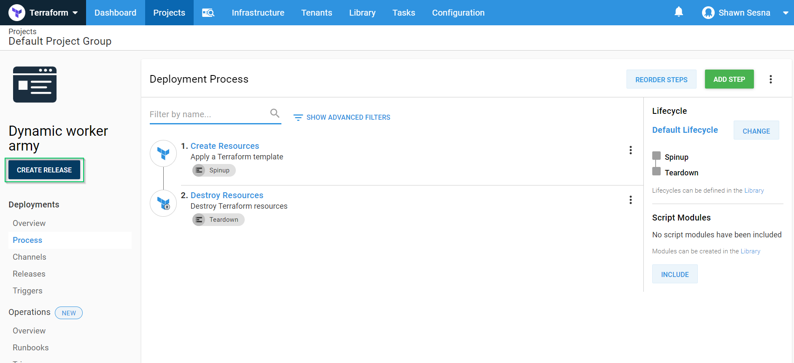

Click **SAVE**:


Click either **DEPLOY TO SPINUP** or the **DEPLOY** button on the line for the `SpinUp` environment:

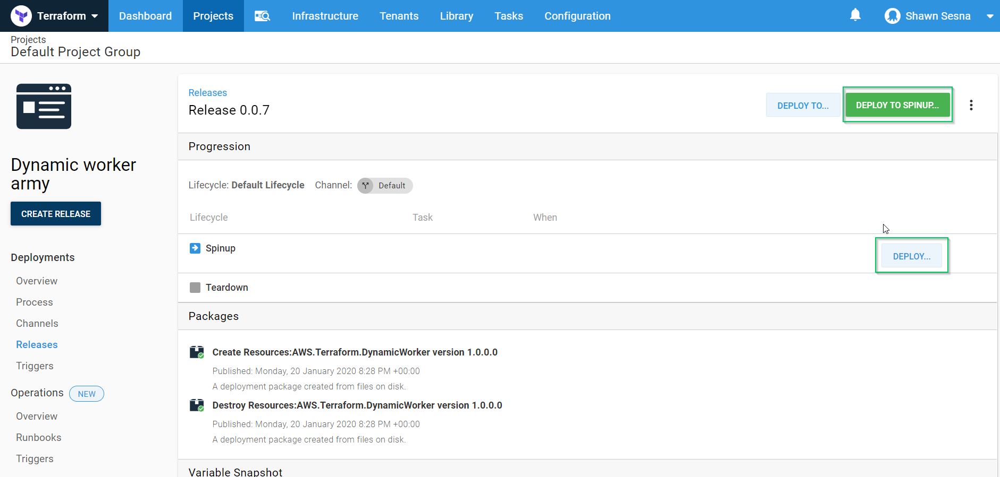

Finally, click **DEPLOY**:


After the deployment has finished, you will see four workers in your Dynamic Worker Pool.

:::hint
Linux workers will show up sooner than Windows workers.  If at first, you don’t see four workers, give it a little more time for the Windows workers to finish provisioning.
:::

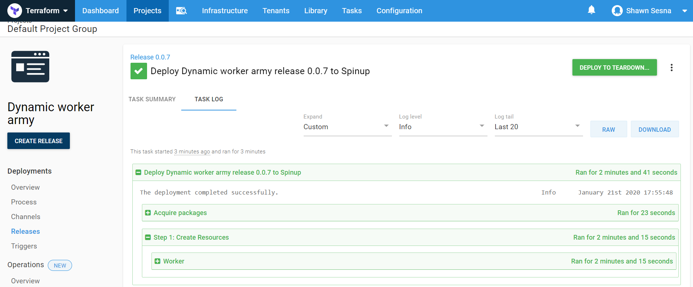

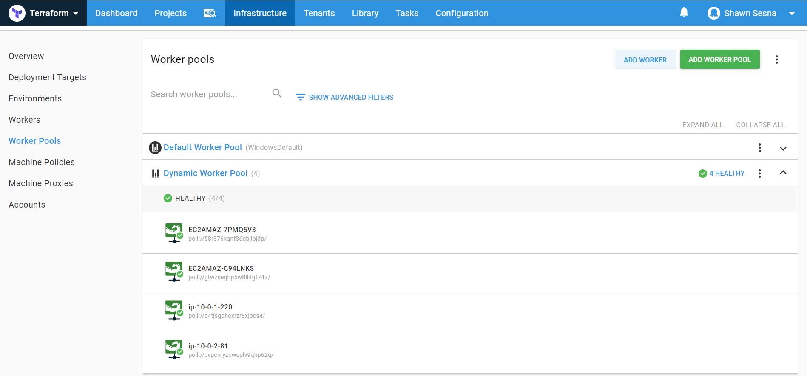

## Conclusion
In this post, I walked you through creating some Terraform configuration files that will generate AWS autoscaling groups to dynamically create Octopus Deploy worker infrastructure scaling based on demand.
