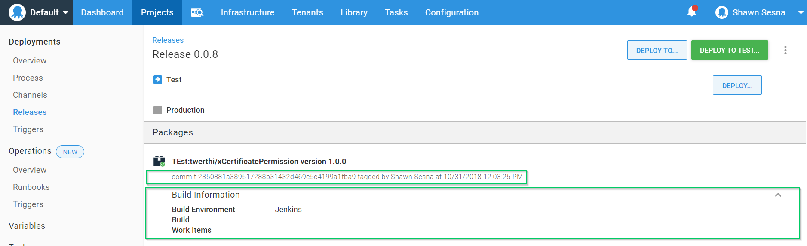

Octopus Deploy has done a fantastic job of integrating with popular build servers such as Azure DevOps, Jenkins, and TeamCity.  The available plugins allow for packaging artifacts, pushing the artifacts to Octopus, creating releases, and even initiating deployments!  Along with these great features is the ability to include release notes and commit information with the build, referred to as `build information`.  While this is cool, what about the other build technologies where there aren't plugins available such as CircleCI (rumor has it that there is an Orb in development) or where there isn't even a build server such as using GitHub as a feed?  There's an API for that!  Since Octopus Deploy is written API-first, we are able to utilize the API to programatically submit build information!

## GitHub as an example
Let's use GitHub as an example of how we can use the API to submit build information when there isn't a build server in the mix.  My [xCertificatePermission](https://github.com/twerthi/xCertificatePermission) repo has a release created with a version of 1.0.0.  Since there wasn't a build server involved in creating this release, there isn't a plugin for me to use to push the build information from GitHub to Octopus Deploy for this release.

### Use the API
As previously mentioned, Octopus Deploy is written API-first, so I can use the `/api/build-information` API to push the build information into Octopus Deploy!  On the System Variables documentation page, there is a [section specifically for Build Information](https://octopus.com/docs/projects/variables/system-variables#release-package-build-information) which shows the basic information that can be included with the API call.  Additionally, the Swagger documentation shows us a little more information as to what the payload should look like

```
{
  "Id": "string",
  "PackageId": "string",
  "Version": "string",
  "BuildEnvironment": "string",
  "BuildNumber": "string",
  "BuildUrl": "string",
  "Branch": "string",
  "VcsType": "string",
  "VcsRoot": "string",
  "VcsCommitNumber": "string",
  "VcsCommitUrl": "string",
  "IssueTrackerName": "string",
  "WorkItems": [
    {
      "Id": "string",
      "LinkUrl": "string",
      "Source": "string",
      "Description": "string"
    }
  ],
  "Commits": [
    {
      "Id": "string",
      "LinkUrl": "string",
      "Comment": "string"
    }
  ],
  "IncompleteDataWarning": "string",
  "Created": "2020-02-20T05:28:07.028Z",
  "LastModifiedOn": "2020-02-20T05:28:07.028Z",
  "LastModifiedBy": "string",
  "Links": {
    "additionalProp1": "string",
    "additionalProp2": "string",
    "additionalProp3": "string"
  }
}
```

Unfortunately, both of these resources do not paint a complete picture as to how to set up the payload for the API call.

### Example JSON
What's missing from the examples is the `OctopusBuildInformation` hash table which encapsulates some of the other properties for the payload.  For my xCertificatePermission example, here's what the payload would actually look like:

```PS
$jsonBody = @{ 
    PackageId = "twerthi/xCertificatePermission"
    Version = "1.0.0"
    OctopusBuildInformation = 
        @{
            BuildEnvironment = "Jenkins"
            VcsCommitNumber = "2350881a389517288b31432d469c5c4199a1fba9"
            VcsType = "Git"
            VcsRoot = "https://github.com/twerthi/xCertificatePermission.git"
        }
    

   } | ConvertTo-Json -Depth 10
```

As you can see, the BuildEnvironment, VcsCommitNumber, VcsType, and VcsRoot elements are actually embedded within OctopusBuildInformation.  With the well-formed JSON, we can invoke the API:

```PS
$OctopusServerUrl = "https://YourServerUrl"
$ApiKey = "API-XXXXXXXXXXXXXXXXXXXXXXXXXX"

$Headers = @{"X-Octopus-ApiKey"="$ApiKey"}

Invoke-RestMethod -Method Post -Uri "$OctopusServerUrl/api/build-information" -Headers $Headers -Body $jsonBody
```

With the build information pushed to Octopus Deploy, it now shows up in the Release along with the commit hash



## Conclusion
In this post I showed you how to use the API to submit Build Information to Octopus Deploy.