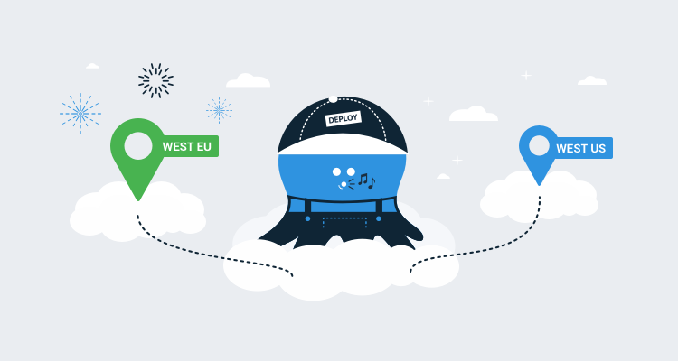

`tl;dr` Octopus Cloud is now available in the following regions:

* Azure West US 2 (Washington, USA).
* Azure West Europe (Netherlands) - **New!**

## Octopus Cloud hosting regions

Octopus Cloud originally launched running on Amazon Web Services (AWS) in a single AWS region, West-US located in Portland, Oregon, USA

In 2019, we [rearchitected](/blog/2019-10/octopus-cloud-1.0-reflections/index.md) Octopus Cloud to improve it’s performance and reduce the running costs. As a part of this shift, we moved from AWS to Microsoft’s Azure platform, and we had a new default hosting region of Azure West US 2 located in Washington, USA. We are now expanding our supported regions to include Azure West Europe located in the Netherlands.

## Migrating existing customers

We're happy to migrate any existing customers to this new region. If you have a preference for where your instance is hosted, please contact us and we'll work with you to move to the new region.

## Conclusion

Octopus Cloud is now available in two regions and we’ll continue to add more as per customer demand.
