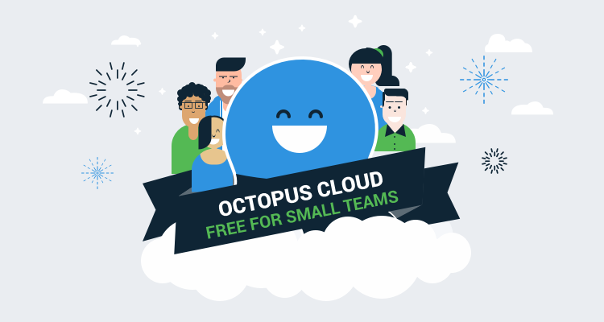

Octopus Deploy has always been a tool for developers, built by developers. At the time of Octopus v1 there was a lack of good tooling to help developers deploy their programs to Windows and IIS, a frustration felt by Paul Stovell, our CEO and founder. As a result, Octopus Deploy was created not as a tool to be sold to developers, but as something that really solved their unique problems.

Fast forward 10 years and that idea is still our north star - Octopus should be a thing that is bought, not sold. We want people to use Octopus because it’s the best tool in its class; because it makes their lives easier, and solves their problems. We often come back to the question “what would we want, if we were the customer?” (and we are the customer, because we use Octopus internally for pretty much everything).

## Away with trials

Knowing that we want customers to buy Octopus simplifies our trial process a lot. We know that once people fully adopt Octopus as the deployment link of their toolchain, they will keep adding more projects and targets. This means we end up with lots of paying customers who love the product, and actively use it.

It therefore follows that allowing time- or feature-limited trials just restricts the process for new users to really adopt Octopus. 30 days isn’t always long enough to get your pipeline reconfigured, and sometimes you might want to try out advanced features like High Availability, or tenants without being restricted.

## Octopus is now free for up to 10 targets

“Let’s just make Octopus free for up to 10 targets, without any restrictions” was the conversation-starter in September 2019. No time-limit, no feature-limit, no limit on “evaluation purposes only” or “open source only” - use it for whatever you want, however long you want, and enjoy it. The only limit is 10 targets, which is now also our smallest tier. We felt that 10 targets was generous enough to make everyone really successful using Octopus for the first time.
Now you can run an Octopus server with High Availability, tenants, spaces, workers, runbooks and all the amazing features, totally for free!

## What about Octopus Cloud?

We’ve experimented with a few different ways to manage our cloud offering, but have found that maintaining parity between Server and Cloud is important. We want the choice between Server and Cloud to be more about “where do you want to host your Octopus” than anything else. Therefore it makes sense for Octopus Cloud to also be free for 10 targets! The same rules apply: no feature restrictions, just a limit of 10 targets and the cost is free.

## What if I’m paying for a license or cloud instance already? Can I still use the Free versions?

Absolutely! When you log in to your Octopus Account you will be able to generate a Server Free license, or create a new Cloud Free instance. You can have up to 2 free licenses/instances in your account, even if you already have one or more paid licenses or instances.

## Conclusion

Having our deployments and runbooks automated gives us a great sense of consistency and confidence. We hope that by making Octopus free for anyone to use we can share some of that confidence, and all focus on building great software.

Cheers to that 🍻
