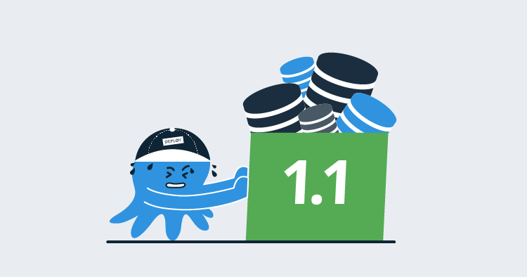

This is the first post in a series about database deployment automation.

For me, the database is the most nerve-racking part of any deployment.  Deploying code is far less stressful.  If something isn’t right, the code can be rolled back. By the time it reaches production, there should be zero surprises if it’s the same code that was tested in dev, QA, and pre-production.

Databases are not as flexible.  Imagine there’s an error in a database script, and the names of all users get deleted.  There isn’t a good way to roll that back.  A backup could be restored, but when was that backup taken, and have any users been in the system since that backup?  What data will be lost if the backup is restored?

## The problems with manual database deployments

Before working at Octopus Deploy, I was a lead developer on a loan origination system for a large financial institution in the United States.  At any given moment, hundreds of millions of dollars of loans were in flight.  These were large loans that required many individuals to work on them.  Each person might spend anywhere from fifteen minutes to an hour on a loan.  A financial officer could spend half an hour entering customer’s financials, and an underwriter could spend an hour researching the customer and placing notes and conditions on the loan.  Needless to say, restoring a database backup was the last resort.  Telling people they have to re-enter the information can only happen so many times before they would want to hunt me down.

We had automated code deployments, but the database delta scripts were manually created by a database developer before the deployment.  It was common for them to spend one or two full business days putting the scripts together.  That manual creation also meant very little testing could occur.  When the script ran in production, it was most likely the first time it had ever been run.  We also used tools like Redgate’s SQL Compare and tested on restored backups when possible, but that could only do so much.

Due to the risk, deployments could only occur after hours, which meant evenings or weekends, but it did mean we could take backups for rollbacks. In addition to the dev team doing the deployment, we also had a DBA and operations person online. The operations person had to wait for the DBA to run all of the scripts, which could take a second or twenty minutes to finish.  

The risks and difficulty around scheduling meant we could only deploy major releases once a quarter, with minor bug fixes done in between.  After a major release, we typically had several bug fix releases, usually because some schema change was missed.  Deploying once a quarter meant a lot of changes were put in all at once.  Verification of the changes took a long time, and it was common for each release to take two or three hours.

Database schema changes were missed because there was no source of truth for the database.  An index might exist in pre-production but not QA, so which environment was right?  When was that index added?  Who added it?  To compound this, the database had close to 6,000 objects in it (mostly CRUD stored procedures).  The database developer had to resort to manually keeping track of all the changes.  80% of the time, the database developer made the change, and the other 20% a developer made the change. If the database developer was out that day, we tried to remember to email them the change, but think about all the changes you made to your code in the last quarter.  Do you remember all of them?  

In a nutshell, we had all this automation, except on the most crucial part of the application.  The exact same code was tested multiple times as it moved through environments.  A unique database delta script was manually created per environment.  There was no source of truth for the database schema, and the DBAs were pulling out their hair, trying to keep everything running.

To summarize our challenges:

- The environments were all different.
- Custom scripts were created per environment.
- Database Objects existed in one environment and not the other.
- Deployments took hours.
- _Big bang_ quarterly releases with multiple bug fix releases.
- Manually tracking changes.

Database change control was the wild west.  

## Database deployment automation
Something had to give. Database changes had to go into source control, and those scripts needed to be packaged and automatically run during deployments.  After a lot of discussion, research, and testing, we landed on a tool.  The tool itself isn’t important.  What was important is that we automated the database deployments.

The impact was noticeable almost immediately.

Having the database in source control allowed us to see when somebody made a change.  We could tie it back to stories, we knew why a change was made, and we set it up so that changes that weren’t in source control were deleted. If an index was in QA but not in source control, we deleted it.  It was a little harsh, but it guaranteed the database schema matched what was in source control.

Emergency fixes that were due to a random view or stored procedure being missed dropped to almost zero.  We set up a manual intervention step in Octopus Deploy, which allowed us to view and approve the database delta scripts prior to deploying.  What everyone really liked about the manual intervention step was the ability to cancel a deployment in the event of an unexpected database change appearing in the delta script.  Having that in place helped everyone, developers, QA, and DBAs trust the process.   

Confidence in the deployments started increasing.  Soon we were doing deployments once a month.  Then once a week.  Features could be delivered to the user as soon as they passed verification by QA and a business owner.  A bug could be reported, and the fix could be in the user’s hands as soon as it passed verification.  We were releasing so frequently the number of changes per release decreased significantly, and deployments went from taking two to three hours down to five to twenty minutes.

Putting it all in Octopus Deploy had the side benefit of giving the DBAs and operations team their nights and weekends back.  Now they could schedule deployments, and they only had to go online if something went wrong.

## A blog series
This post is the first in a series where I walk you through the process of setting up database lifecycle management (DLM) and database deployment automation. The goal of the series is to provide you with some real-world examples using a variety of database deployment tools.  In addition to that, we will discuss some common pitfalls you will run across.

---

!include <database-deployment-automation-posts>
