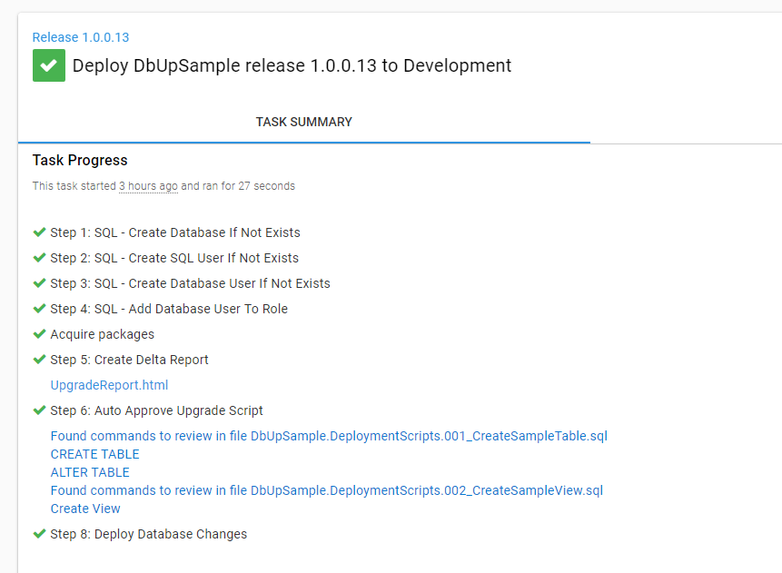
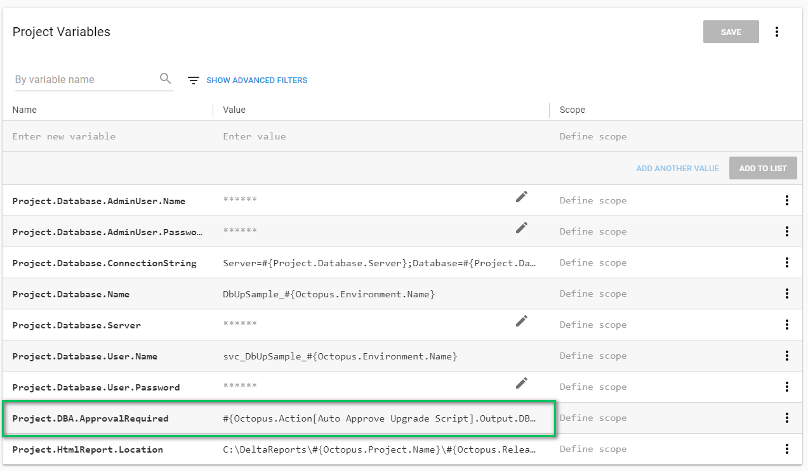
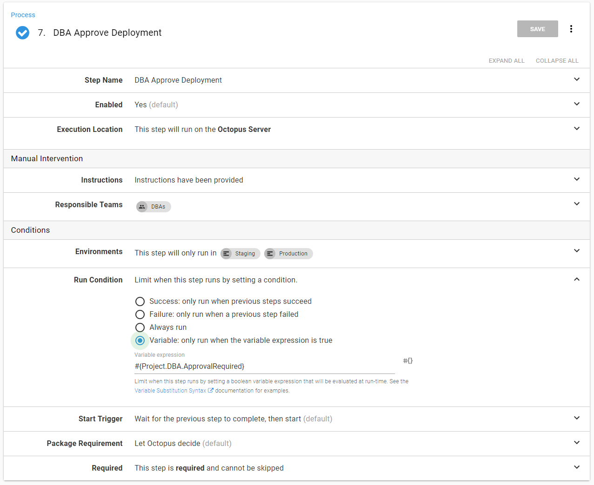

In this post, I’ll show you how to set up automatic approvals, so your DBAs don’t have to manually approve every deployment.

Having DBAs approve changes when you first start implementing database deployment automation is an important part of the process as they catch things that could fail in product and would be difficult to rollback, but it also helps them build trust in the process. However, there comes a point when it’s no longer useful to have the DBAs approve every change.

## When should a DBA get involved?

A DBA should only review changes when they need to.

That sounds simple enough, but it’s much harder to execute.  When I worked with DBAs in the past, they have said something along the lines of, “I want any standards violations to cause a failure. They shouldn’t even be deployed; I don’t need to see them. On the other hand, I want to see scripts that make specific schema changes where I might get paged at two in the morning."

To achieve that, we can implement a multi-layer approach.  The first layer will occur on the build server; it will run the tooling necessary to check for standard violations, for instance, the tooling can check for naming conventions, that every table has a primary key, that no cursors are being used in stored procedure, and so on.  There are many tools to help enforce SQL standards.  This includes static analysis tools like [SQL Enlight](https://ubitsoft.com/) as well as writing database unit tests using tSQLt.  There are pros and cons to each tool, but doing a deep dive into those tools is out of scope for this article.  The important thing is, by the time a package gets to Octopus Deploy, we will know the scripts meet our standards.

The second layer will occur in Octopus Deploy.  Automated tooling can only catch so much. It is possible to write a SQL script that meets all the standards and requirements but is still poorly written and will cause significant problems.  For example, you can’t have a rule to fail any build when a drop table command is found in a script.  You’d never be able to clean up old or unused tables.  

The final piece of the puzzle is determining which for environments DBA should perform the manual interventions.  Production is too late.  By that time, commitments have been made, and expectations have been set with users.  Stopping a deployment to production so a DBA can review a script doesn’t make sense.  What happens if they find an issue?  

Having a DBA approve deployments to a lower environment, such as development doesn’t make sense either.  That would generate too much noise for the DBAs, especially when builds occur after each check-in.  

My recommendation is to have a manual intervention in a QA, Testing, Staging, or UAT environment.  Pick an environment low enough that a DBA can offer suggestions or reject a deployment, but high enough that they aren’t constantly sent requests. Test different approaches as it may take a while to dial-in to the right environment.

## Auto approval process in Octopus Deploy

For the automated approval process, we will use [output variables](https://octopus.com/docs/deployment-process/variables/output-variables) and [run conditions](https://octopus.com/docs/deployment-process/conditions#run-condition).  The process will have a PowerShell script (or a series of PowerShell scripts) that inspect the delta report.  If the PowerShell script or scripts notice something interesting in the delta report, then a manual intervention will be triggered.

For this article, I want my script to:

- Auto approve if there are no changes.
- Check for Add Table, Drop Table, Drop Column, Drop View, Drop User, Add User, Alter User, Add User to Role, Create View, Create Select Stored Procedure, and Merge Statements, and require a review if any are found.
- Auto approve everything else.

The nice thing about SQL is

There are only so many schema alteration statements that can be made in SQL, which means we can use a regular expression to parse the delta report.  

When I started this process, I forgot about pre-deployment and post-deployment scripts, which are key.  They would always be there.


This leads to an interesting decision.  When checking for no changes, what exactly should it be looking for?  You will notice the full name of the file is included in the report.  For example, `DbUpSample.BeforeDeploymentScripts.001_CreateSampleSchemaIfNotExists.sql` and `DbUpSample.PostDeploymentScripts.001_RefreshViews.sql.`  That leads to a couple of options.  I can modify the code to exclude PreDeployment and PostDeployment scripts.  Or, I can write my check for changes to look for files that match. `DbUpSample.DeploymentScripts.*.sql.`  Personally, I like the idea of including all the scripts for a DBA to review, not just the deployment scripts.  In my experience, complete visibility builds trust in the deployment process.  Hiding scripts, or not including them, is a good way to destroy that trust.  That being said, that is my personal preference, and it is up to you and your DBAs to choose how to accomplish this.

### Updated database deployment automation process

As I stated earlier, I want this to be a PowerShell script that will leverage output variables.  I added that script to the process to run right after the upgrade report is generated:


I opted to have the upgrade script and auto-approval step run in all environments.  The upgrade script will generate an artifact.  The auto approval step will use the [Write-Highlight](https://octopus.com/docs/deployment-examples/custom-scripts#Customscripts-Logging) functionality provided by Octopus Deploy.  By doing that, every environment will have an upgrade report and a list of changes in the deployment summary.



The PowerShell script includes this line at the very end to set an output variable:

```PS
Set-OctopusVariable -name "DBAApprovalRequired" -value $approvalRequired
```

The syntax to access that output variable is a little much, `Octopus.Action[Auto Approve Upgrade Script].Output.DBAApprovalRequired.`  I added a variable to my project to make that a little easier to find.  Also, if I decide to change the name, I only have to change it in one spot:



The final piece is changing the run condition on the manual intervention step to only run when that value is true:



Let’s test this.  I created a release that has changes that need to be reviewed.  The manual intervention step didn’t fire in development or testing, but it does fire in staging:


As another test, I redeployed the same release to staging.  DBUp sees that all the scripts have been run.  There is nothing to approve, and the manual intervention step is skipped:


As much as I would love to generate a community step template for everyone to use, every company is different, and I’d rather show you the script I put together.  Hopefully, you can take something from it, modify it for your own usage, and add that to your step template library:

```PS
$OctopusURL = # YOUR OCTOPUS BASE URL
$APIKey = # YOUR API KEY
$SpaceId = $OctopusParameters["Octopus.Space.Id"]
$DeploymentId = $OctopusParameters["Octopus.Deployment.Id"]
$CommandsToLookFor = "Create Table,Alter Table,Drop Table,Drop View,Create View,Create Function,Drop Function,sp_addrolemember,sp_droprolemember,alter role,Merge"
$FilePrefixToLookFor = "DbUpSample.DeploymentScripts."
$ArtifactFileName = "UpgradeReport.html"
$sqlFile = ".+\.sql"

$header = @{ "X-Octopus-ApiKey" = $APIKey }

$artifactUrl = "$OctopusUrl/api/$SpaceId/artifacts?take=2147483647&regarding=$DeploymentId&order=asc"
Write-Host "Getting the artifacts for this deployment from $artifactUrl"
$artifactResponse = (Invoke-WebRequest $artifactUrl -Headers $header).content | ConvertFrom-Json
$artifactList = $artifactResponse.Items
$fileToCheck = $null

foreach ($artifact in $artifactList)
{
    # The name of the file is UpgradeReport.html, look for that
    $fileName = $artifact.Filename

    if ($fileName -eq $ArtifactFileName)
    {
        Write-Host "Artifact containing the upgrade report found, downloading"
        $artifactId = $artifact.Id
        $artifactContentUrl = "$OctopusUrl/api/$SpaceId/artifacts/$artifactId/content"
        Write-Host "Pulling the content from $artifactContentUrl"
        $fileToCheck = Invoke-WebRequest $artifactContentUrl -Headers $header
        Write-Host "Finished downloading the file $fileName"
        break;
    }
}

if ($fileToCheck -eq $null)
{
    Write-Host "No file found, there should be a file, requiring approval"
    Set-OctopusVariable -name "DBAApprovalRequired" -value $true   
    Exit 0

    # No file, no checking
}
else
{
    Write-Host "File has been found, going to look through it now"
}
if ($filetocheck.rawcontent -like "$fileprefixtolookfor")
{
   Write-Highlight "No deployment scripts found, auto approving"
   Set-OctopusVariable -name "DBAApprovalRequired" -value $false
   Exit 0
}

Write-Host "Pulling all scripts from the report to check"
$scriptList = $fileToCheck.ParsedHtml.getElementsByTagName("div") | where {$_.className -eq "card"}
$commandsToCheck = $CommandsToLookFor -split ","
$approvalRequired = $false

foreach ($item in $scriptList)
{
    $rawHtml = $item.innerText
    $foundFileName = $rawHtml -match "$sqlFile"
    $fileName = $Matches[0]
    $foundCommandWarnings = $false

    foreach ($command in $commandsToCheck)
    {
        $foundCommand = $rawHtml -match "$command"

        if ($foundCommand)
        {
            $approvalRequired = $true

            if ($foundCommandWarnings -eq $false)
            {
                Write-Highlight "Found commands to review in file $fileName"
                $foundCommandWarnings = $true
            }

            foreach ($h in $Matches.Keys) {
                Write-Highlight "$($Matches.Item($h))"
            }
        }
    }
}

if ($approvalRequired -eq $false){
    Write-Highlight "All scripts look good, auto approving"
}
Set-OctopusVariable -name "DBAApprovalRequired" -value $approvalRequired
```

One caveat to my script, I am parsing the HTML using PowerShell.  Behind the scenes, PowerShell is using Internet Explorer, and I got errors informing me that wasn’t available because the initial setup hadn’t been run for the user.  I got around it by running the initial setup on the machine.  But still, that is annoying.  

## Conclusion

[Output variables](https://octopus.com/docs/deployment-process/variables/output-variables) and [run conditions](https://octopus.com/docs/deployment-process/conditions#run-condition) are a powerful feature in Octopus Deploy.  They allow you to add logic to your deployment process.  Auto approving database deployments is one example.

---

!include <database-deployment-automation-posts>
