Automating database deployments provides a quantum leap in continuous delivery.  I cannot believe the number of problems solved by automating database deployments.  Whether it’s adding a new table, modifying a stored procedure or creating an index. Whatever it is, I no longer have to determine the delta between environments.

Despite all the advantages, one common scenario keeps coming up; running ad-hoc queries on the database server.  The most common use case I’ve seen fixing data. Typically, the data gets in a strange state when a user does something unexpected.  In some cases, the root issue won’t be fixed (it doesn’t happen often enough), or the issue won’t be fixed for another week or so, but the data needs fixing right now.  

When I’ve run across this scenario in the past, the process is:

1. A developer creates the script to fix the data.
2. They send that script to a DBA or somebody who has the necessary rights to change data.
3. The person who has the rights, runs the script.  
4. The developer is notified the script was run.

This process has a lot of flaws.  At some point in my career, I’ve been either the developer or the person running the script, and it’s not an enjoyable process:

1. The person running the script is not an expert in the system.  The vast majority of the time a cursory glance is done on the script before running it.
2. The people who have the necessary rights could’ve gone home for the day, gone out to lunch, or be in a meeting.  The script might not be run for several hours.  In some cases, the data must be fixed right away.  
3. Notifying the developer is a manual process, meaning the script might have been run, but the notification hasn’t been sent yet.
4. Most companies don’t give junior developers rights to make changes to production.  The people who can run the script have other, and frankly, more important responsibilities.  They might be really focused on something and being interrupted breaks their flow.
5. If the requests are done via email or slack nothing is audited, and email is where documentation goes to die.  

Octopus Deploy can do so much more than deploy software.  A lot of new functionality has been added to make Octopus Deploy a more complete DevOps tool.  In this post, I walk you through a process to automate running ad-hoc queries.

My reason for using Octopus Deploy (aside, from the fact I work here) is because it can provide the following to this process:

- Auditing: Octopus Deploy can tell you who made the request, who approved the request, and when this all happened.  
- Artifacts: Using the artifact functionality built into Octopus Deploy, it’s possible to store and capture the exact script that was run, however, if someone changes the script after the fact on the file-share, there is no way to know that.
- Approvals: In some cases, it’s important to have another set of eyes look at the script. Octopus Deploy can be set up to conditionally approve scripts based on a set of criteria.
- Automation: No more manually sending emails.  No more manually sending confirmations.  No more opening up SSMS and running the script.
- Repeatable: The same process will be used across all environments to run the scripts.

## Use cases
For the purposes of this blog post. here are the use cases:

- As a developer, I need to run an ad-hoc query to add an index to see if that resolves a performance issue.  If it does, then add that index into the database definition and push it through all environments.
- As a DBA, I need to run an ad-hoc query to create a SQL Login.
- As a support engineer, I need to run an ad-hoc query to grant select rights to a developer.
- As a business analyst, I need to clean up a data issue for a user.

## Requirements
With the use cases in mind, here are the requirements for the process:

- Octopus Deploy.
- No source control.  A lot of DBAs, support engineers, and business analysts are not familiar with source control tooling.  
- Automated.  When the scripts are ready, they should be run within five minutes without having to fill out a form or notify anyone.
- Analysis of the script, if the script contains certain keywords, then a human should review the script prior to running it.
- Work in for any environment.  We want to encourage people to run this for any environment.  Even dev.

## Setup

### Tentacles

Our [database deployment documentation](https://octopus.com/docs/deployment-examples/sql-server-databases) recommends you install Tentacles on a **jump box** sitting between Octopus Deploy and the database server.  When using integrated security those Tentacles are running under service accounts that have permissions to handle deployments.  These Tentacles will handle normal deployments.

You have a few options for setting up an ad-hoc process and permissions:

1. Continue to use the deployment Tentacles but give them elevated rights to perform additional tasks.  
2. Create a new set of service accounts with elevated permissions, and create new Tentacles for those new service accounts.
3. A combination of option 1 and option 2.  Create two pipelines.  One for data fixes, the other for other changes.  The data fixes run through the regular deployment targets, but the other changes run through a new set of deployment targets with new service accounts.  

### Lifecycle

This process allows people to run scripts directly in production.  Using a default lifecycle of dev to test to pre-production to production doesn’t make very much sense.  Create a new lifecycle to allow for deployments to any environment.  I called mine Script Lifecycle:

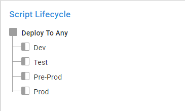

You achieve this by creating a single phase and adding all the environments to that phase:

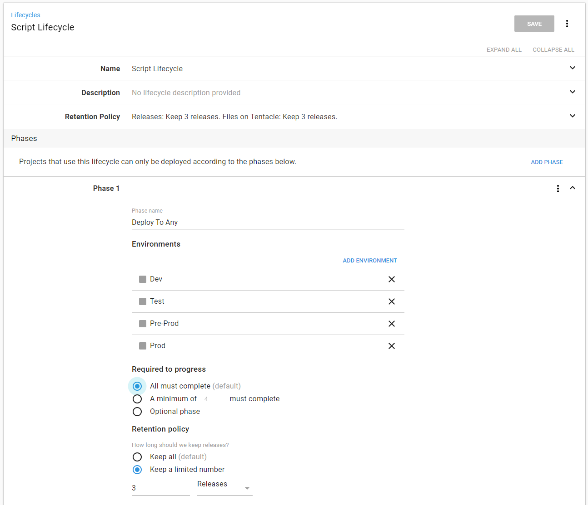

## Projects and process

For this process, I created a number of step templates.  I don’t want to submit those to the community library because they aren’t generic enough, but you can find them in our [GitHub samples repository](https://github.com/OctopusSamples/AdHoc-SQLQueries).

### Ingesting scripts

I will write a database script for this use case:

_As a business analyst, I need to clean up a data issue for a user._

A couple of questions come to mind:

1. Q: What environment? A: Production.
2. Q: What SQL Server? A: 127.0.0.1.
3. Q: What database on the SQL Server? A: RandomQuotes_Dev.
4. Q: Who is submitting the script? A: Bob Walker.

Okay, we know the answers, how do we get those from our brain to Octopus Deploy?  For this, I will use a YAML file called MetaData that contains all that information:

```
---
DatabaseName: RandomQuotes_Dev
Server: 127.0.0.1
Environment: Dev
SubmittedBy: Bob.Walker@octopus.com
...
```

The next question is how will that YAML file and the SQL Scripts be sent to Octopus Deploy to run?  To make this as easy as possible for the people submitting a script, I will make use of a hot folder.  I wrote a PowerShell script which will:

1. Look for any new directories in the hot folder.
2. Use Octo.exe to package the folder.
3. Push the package to Octopus Deploy.
4. Create a new release.
5. Use the MetaData.yaml file to determine which environment to deploy to.
6. Move the folder to a processed location so the scripts aren’t run again.

I could set up a scheduled task to run on the server.  But there is no real visibility to that task.  If it starts failing, I won’t know that it fails until I RDP onto that server.  

Rather than go through that nightmare, I set up a new project in Octopus Deploy called "AdHoc Queries Build Database Package."  It has a single step in the process, run the PowerShell script to build the database package.  Make note of the LifeCycle, and it is only running on a dummy environment that I called `SpinUp`:


It has a trigger that creates a new release every five minutes and run this process:

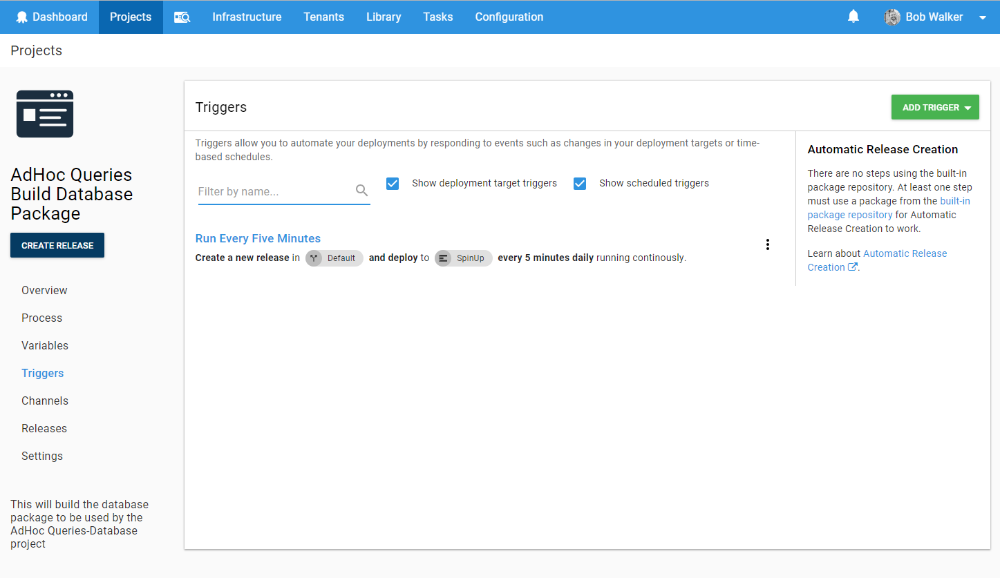

In the event, I want to extend this process to support other types of scripts, I made it a step template:


The eagle-eyed reader will see the parameter `Octopus` project.  That is the project which runs the scripts.  

### Running the scripts

In order to meet the above requirements, I wanted the process to do the following:

1. Download the package onto the Jump Box.
2. Grab all the files in the package and add them as artifacts (in the event they need to be reviewed).
3. Perform some basic analysis on the scripts.  If any of the scripts are not using a transaction, or use the keywords _Drop_ or _Delete_, then I want to trigger a manual intervention.
4. Notify when manual intervention is needed.  My preferred tool is slack.
5. Run the scripts.  
6. If the scripts fail, send a failure notification.
7. If the scripts are successful, send a success notification.


The download package step is very straightforward.  Download the package to the server.  Don’t run any configuration transforms.  Don’t replace any variables.  Just deploy the package:

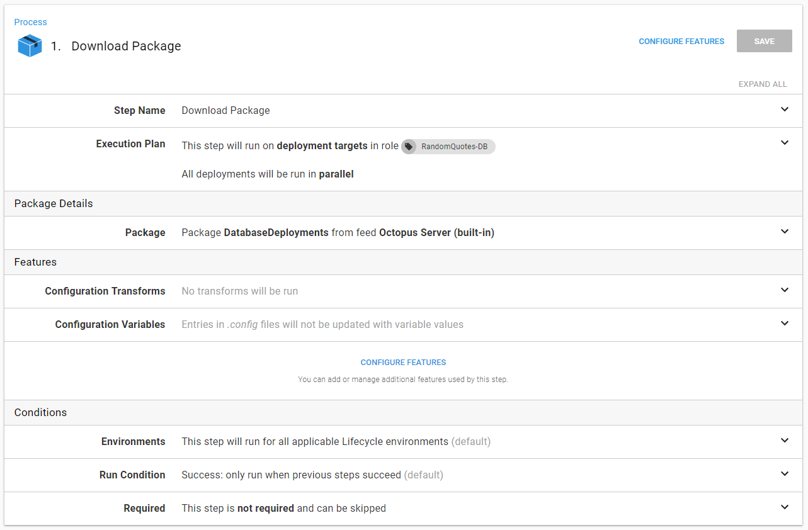

The Get Scripts From Package to Review is a step template that does the following:

1. Read the YAML file and set output parameters.
2. Add all the files in the package as artifacts.
3. Perform some basic analysis on the SQL files.
4. Set an output variable, `ManualInterventionRequired`, in the event the analysis fails.

This is all done in a step template.  The only parameter required is the step that downloaded the package:

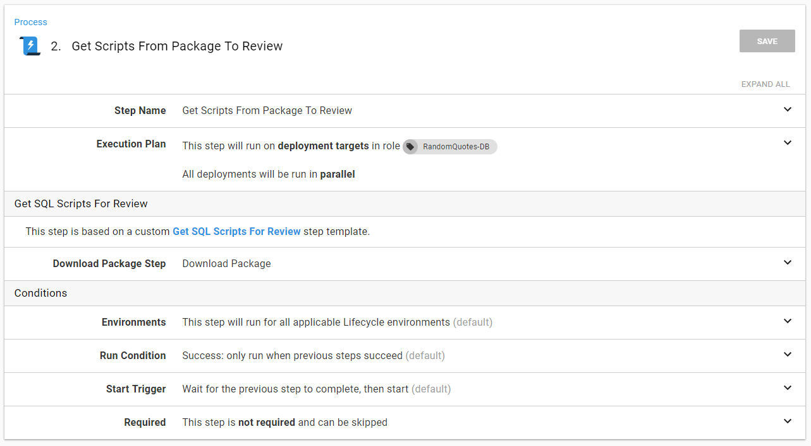

The format for output parameters with Octopus Deploy can be tricky to remember.  I know I would mistype something, so rather than do that, I use variables.  This way, if I do change something, I only have to change it one place:

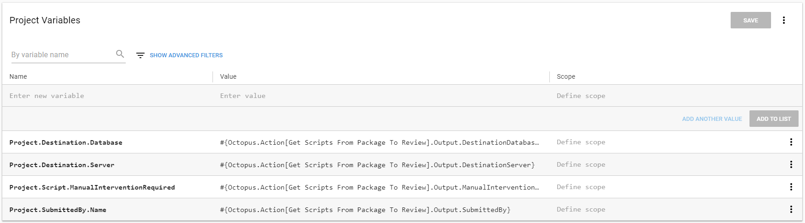

When I notify someone, I can include that information very easily.  Also, make note that this step will run based on the `ManualInterventionRequired` output variable:

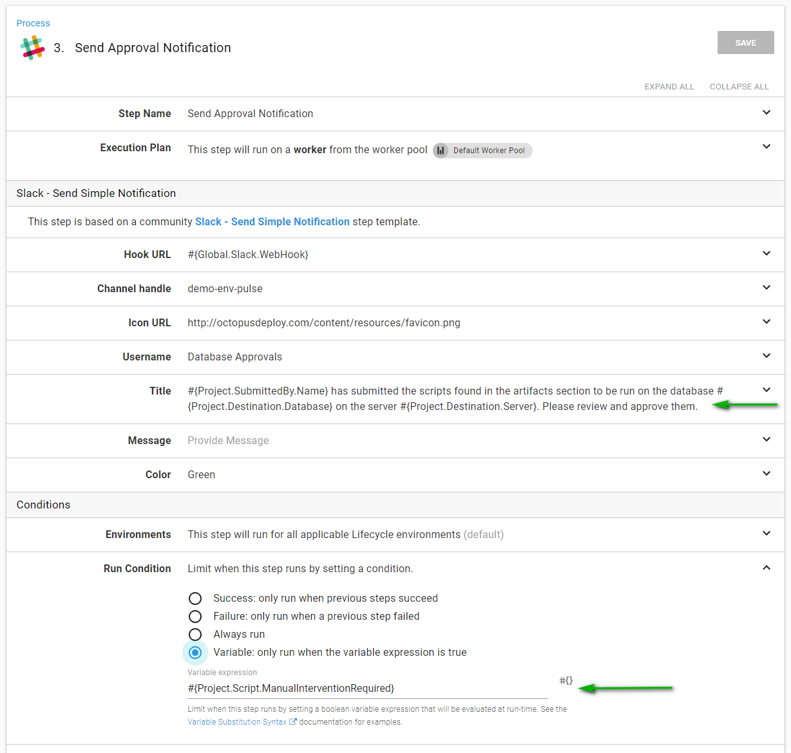

The same is true for the manual intervention.  The run condition is based on the `ManualInterventionRequired` output variable:

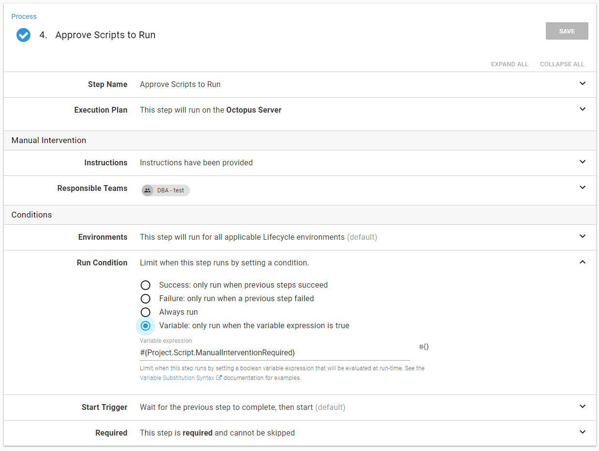

The Run SQL Scripts step will go through all the SQL files and run them.  Again, to make it easier, I used a step template.  This process used `invoke-sqlcmd` which will capture the output and add task history:

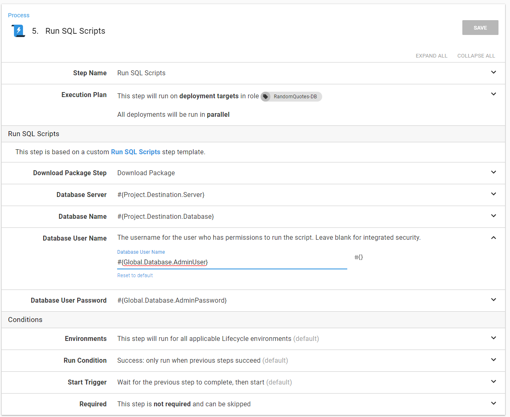

Assuming everything went well the success notification can go out:

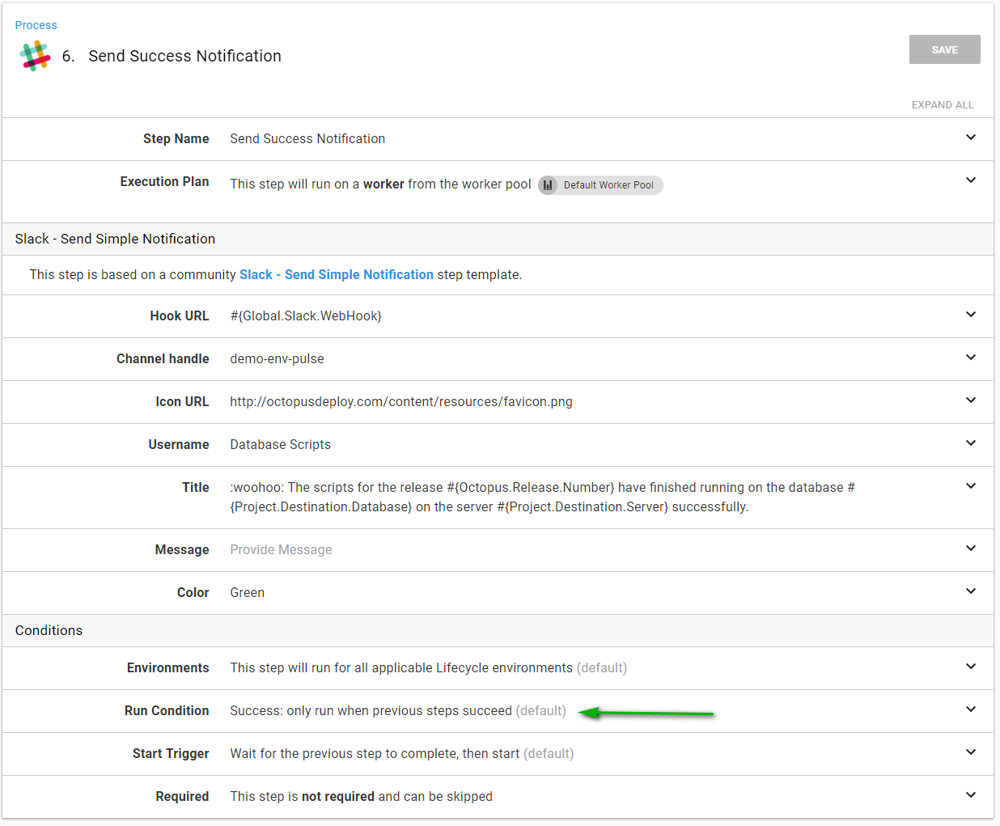

Otherwise, the failure notification can go out:

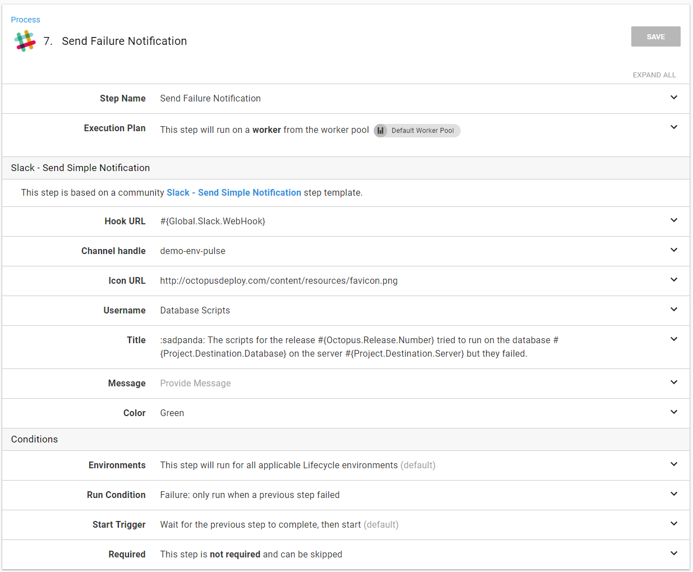

## Process demo

I have this contain a script ready to be run:

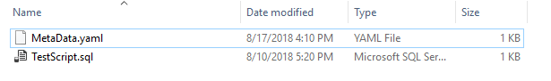

The MetaData.yaml file has the script set to run on Dev:

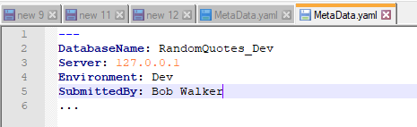

The script itself is nothing special.  I’m not going to use a transaction to show that the process will pick that up and force a manual intervention:

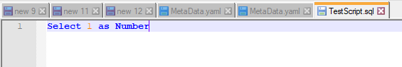

I’ve copied that folder into the hot folder:

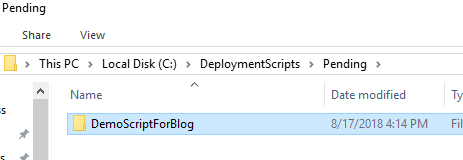

Octopus picks up that folder:


I now see that demo folder has been moved to the processed folder.  I put a timestamp on it so  I know exactly when that folder was processed:

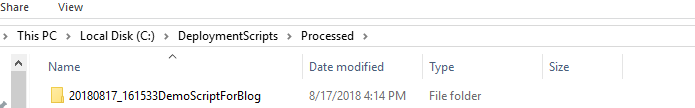

Looking at the project which runs the scripts, I can see a new release has been created and a manual intervention is waiting for me:

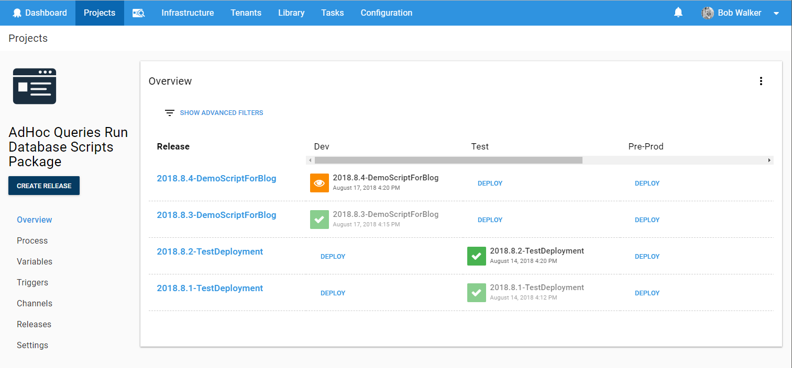

I can check the slack channel and see the approval message has been sent:

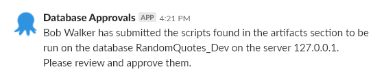

Going into the release, I can see the artifacts have been generated.  If I wanted to, I could download them and view the exact script which is about to be run.  When I view the approval details, I can see the message is the same as the slack notification:

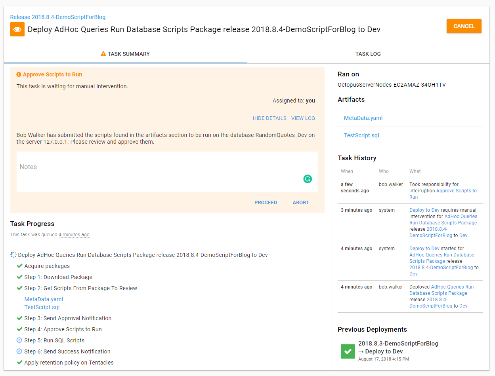

After approving the deployment, the script will run and the output will be captured:

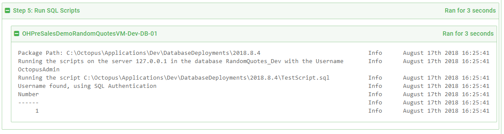

And because the script was successfully run, the success notification was sent to slack:


## FAQ

### How can I prevent someone from submitting a script to the dev environment but allow it for a production SQL Server?

When using integrated security, have a Tentacle per environment.  That Tentacle only has access to SQL Servers in its environment.  When using SQL Authentication, have separate users and passwords per environment.  Either way, the script will fail because the user being used to log in to SQL Server won’t be able to.

### What if I want to have every script reviewed when they are sent to pre-production and production?

Change the manual intervention step to always run.  In addition, change the environments to pre-production and production.  The conditional approval was put in place to only require approval when certain conditions are met.  In fact, starting out, I recommend all scripts sent to pre-production and production are manually approved.  When trust has been built in the process, it will be time to introduce conditional approvals.

### This seems like overkill.  Couldn’t you use prompted variables in Octopus Deploy?

Absolutely!  I have another project set up to do just that.  The question is, who will submit these scripts?  Should they have rights to create a release and have it go to production?  Should everybody have access to Octopus Deploy?  For my use cases, my answer was no to all of those.  My primary goal for this process was the elimination of as many manual steps as possible.  Manually creating a release using prompted variables added too many manual steps.  

## Conclusion

I’m the first to admit this process is far from perfect.  It will not work for every company.  The goal of this post is to provide an example of a process you can modify for use in your company.  

Until next time, happy deployments!

---

!include <database-deployment-automation-posts>
