Prior to joining Octopus Deploy, I worked on a .NET application with Oracle as its database for about three years.  I started working there a couple of years before Octopus Deploy version 1.0 was released.  Those were tough deployments.  Everything was manual, we could only deploy on Saturday mornings at 2.am, and the deployments took anywhere from two to four hours.

Thankfully, those days are over.  The tooling available today is light-years ahead of where it was.  In this post, I’ll cover deploying changes to Oracle databases.  The goal of this article is to build up entire CI/CD pipeline using TeamCity as the build server (though the core concepts do transfer over to Jenkins, Bamboo, TFS/VSTS/Azure DevOps), Octopus Deploy as the deployment tool, with the Redgate Oracle toolset doing the heavy lifting on the database side.  

_Disclaimer:_ I used Oracle between 2010 and 2013.  The Oracle instance was 10g, and I used Benthic and SQL Developer to query Oracle.  A lot has changed since that time.  I’m a SQL Server guy, and without question, I did some goofy things in this article, which are no longer best practice.  

!toc

## Getting started

If you wish to follow along, you need to download and install the following tools:

- [Oracle 12g Personal Edition](https://www.oracle.com/technetwork/database/enterprise-edition/downloads/index.html)
- [TeamCity](https://www.jetbrains.com/teamcity/download/)
- [Redgate Deployment Suite for Oracle](https://www.red-gate.com/dynamic/products/oracle-development/deployment-suite-for-oracle/download)
- [Octopus Deploy](https://octopus.com/downloads)

In order to download anything from Oracle, you have to create an account. I opted for personal edition because, just like SQL Server Developer Edition, it is fully-featured but limited in what you can do with the license, and I’m only using it for this demo.  

For the purposes of this article, I will deploy to the same Oracle database running on a Windows machine.  However, in a real-world environment, you should follow a setup similar to this.

With this setup, you install a Tentacle on a [worker](https://octopus.com/docs/infrastructure/workers) or a [jumpbox running Tentacle](https://octopus.com/docs/infrastructure/windows-targets) that sits between Octopus Deploy and the VIP in front of the Oracle Database.  

## Creating a source database

Redgate’s Oracle Toolset is a state-based tool.  For those of you who haven’t read my previous articles, a state-based tool is one where you save the desired state of the database into source control.  During the deployment, a unique delta script is generated to run against the Oracle database.  That delta script will only be used for that database for that environment.  The next environment will get a new delta script.

I’m starting this all from scratch.  I set up a VM and installed Oracle.  Next, I’ll create a source database.  This database will represent the desired state I want all the other databases to be in.  I’ll set up my database and then check that into source control using [Redgate’s Source Control for Oracle](https://www.red-gate.com/products/oracle-development/source-control-for-oracle/).  

I’m using the [database creation assistant](https://docs.oracle.com/cd/B16254_01/doc/server.102/b14196/install003.htm) provided by Oracle to create the database.

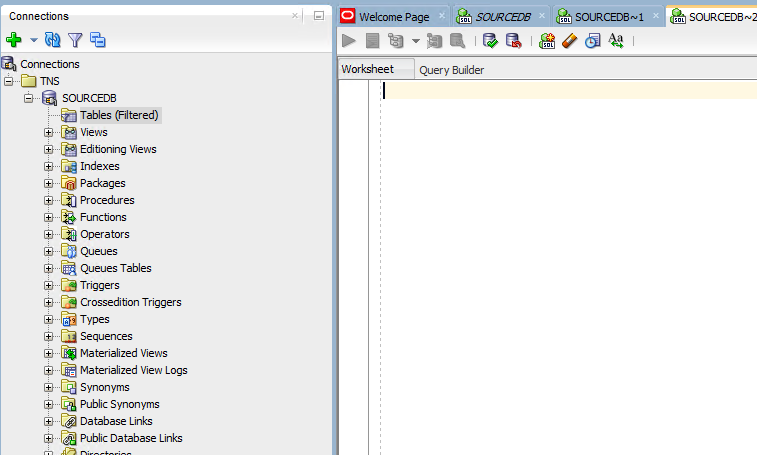

I am going to add a new table with two columns:

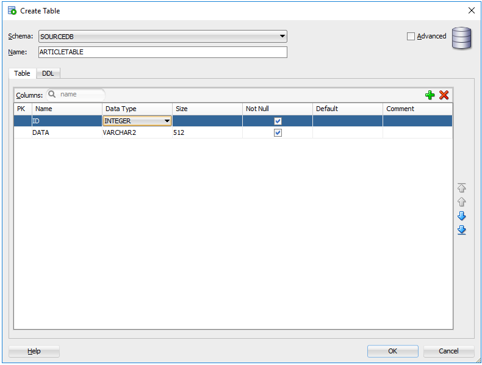

I’m also going to add in a sequence.  For those of you not familiar with Oracle, a sequence is needed when you want to use an auto-incrementing number for your ID field.  Well, in old-school Oracle anyway.  It looks like things have changed a bit.

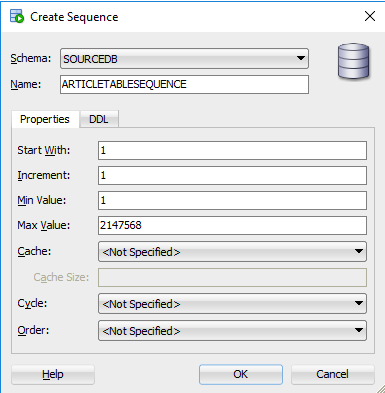

Finally, I am going to tie the sequence and the ID field together.  This gives me a couple of schema changes ready to deploy to a blank database.  Your changes will most likely be much more complex.

## Tying Oracle to source control

Now that the table we want to create is in place, it is time to put that table and sequence definition into source control.  For this, I use [Redgate’s Source Control for Oracle](https://www.red-gate.com/products/oracle-development/source-control-for-oracle/).

When we first launch the application we see a single option, **Create a new source control project…**:

First, you will need to configure the database connection.  Don’t forget to test your connection so you know that it works:

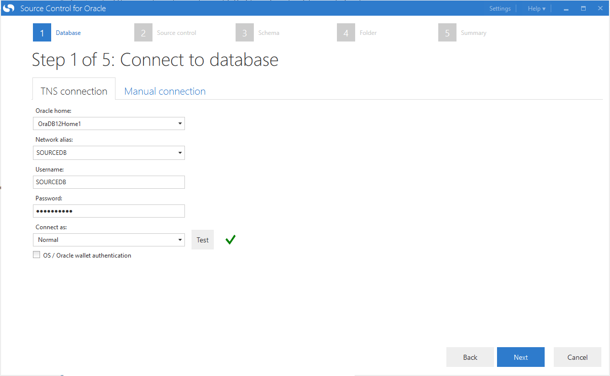

The database connection is good to go.  Next, we configure the source control system to use.  This repository will be a git repository, but rather than using the built-in git functionality. I prefer to use a working folder.  This is so I can use my git GUI of choice and get the full functionality of git, specifically branching.  Once you get this process working, a great next step is to set up Oracle on each developer’s machine.  With a dedicated instance, a developer can check in their source code and database changes at the same time.  Rather than make a database change on a shared server and then wait for the code to be checked in to make use of that change.

As you can see, I have an empty working folder:

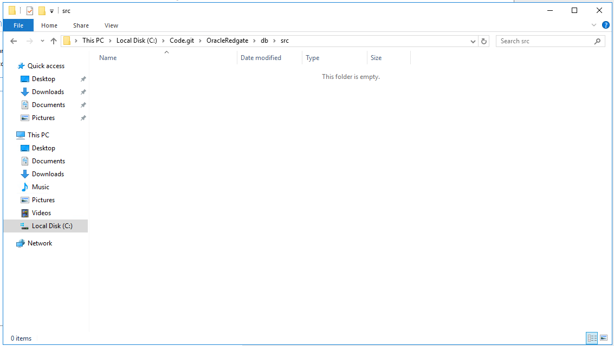

I can enter the directory of that working folder into Redgate’s Source Control for Oracle:

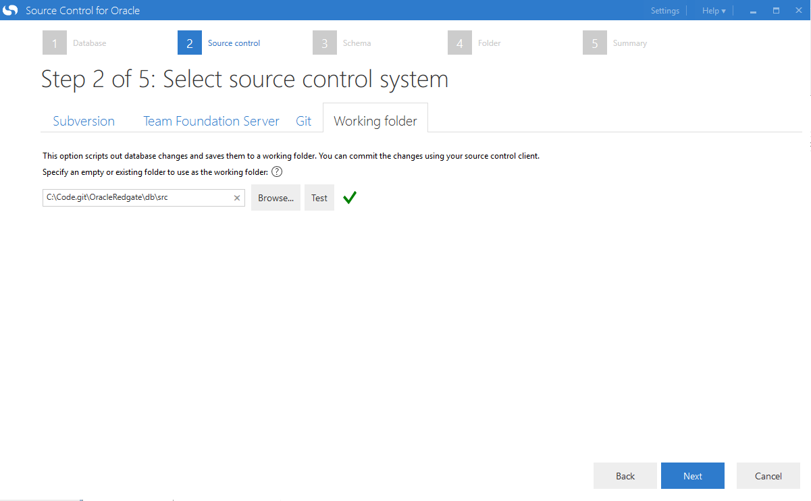

I need to choose the schema I want to use.  I put the tables in the SourceDB schema so that is the one I will be selecting:

What’s really nice is it will show all the folders it is about to create and the directory it will create them in:

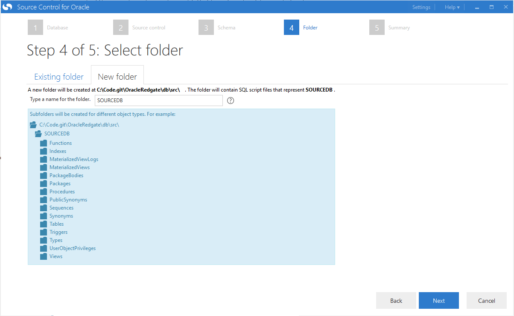

The tool will monitor this database and schema for any changes.  I’m going to keep the name as is so I don’t get confused later on:

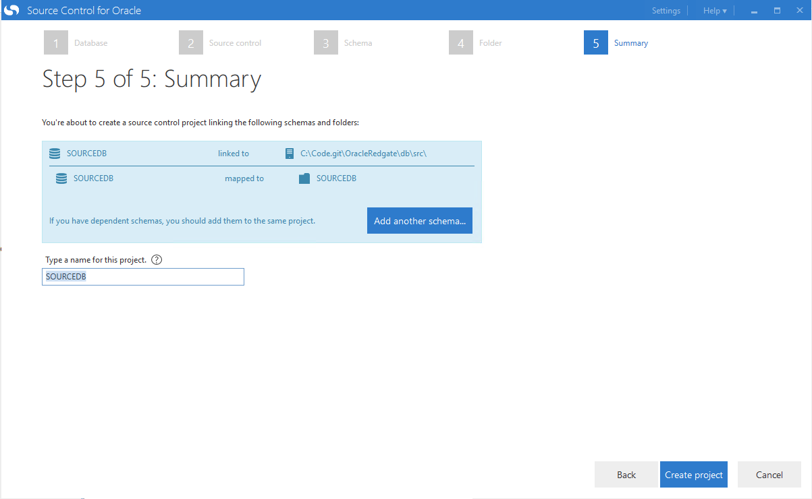

There are four changes to check in:

When I click on the big arrow, I am presented with a summary screen.  For those of you who have used Redgate’s SQL Source Control, this should look very familiar:

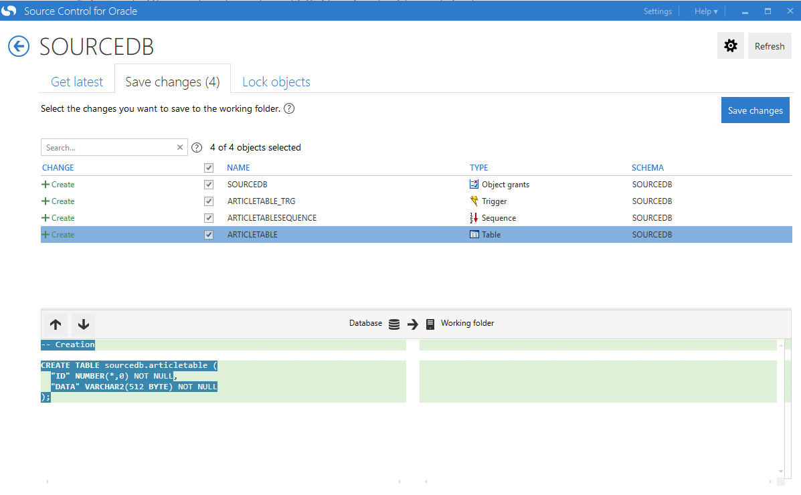

Clicking on the save button shows you everything has been saved successfully:

Open Git Extensions, and you can see all those files that have been created:

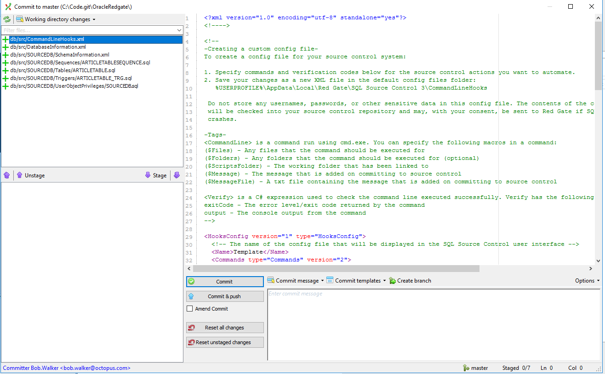

I’m going to commit those changes.  Now it’s time to set up a build and bundle those changes into a zip file for Octopus Deploy to use.

## Setting up a build server

In my TeamCity instance, I have created a simple project that packages the database, publish the package to Octopus Deploy, and create a new release in Octopus Deploy.  First is the package database.  For this build step, I will package up the entire db/src folder (which includes any additional schemas).  Right now it only contains the _SourceDB_ schema:

Pushing the package should be pretty straight-forward:

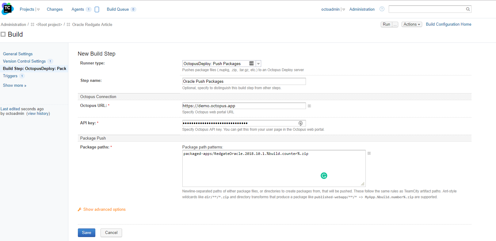

In Octopus Deploy, I’ve set up a very simple deployment process.  The goal at this point is to just make sure everything packages, pushes, and deploys successfully.  I’m not too worried about the deployment process yet (that will come in a couple of minutes):

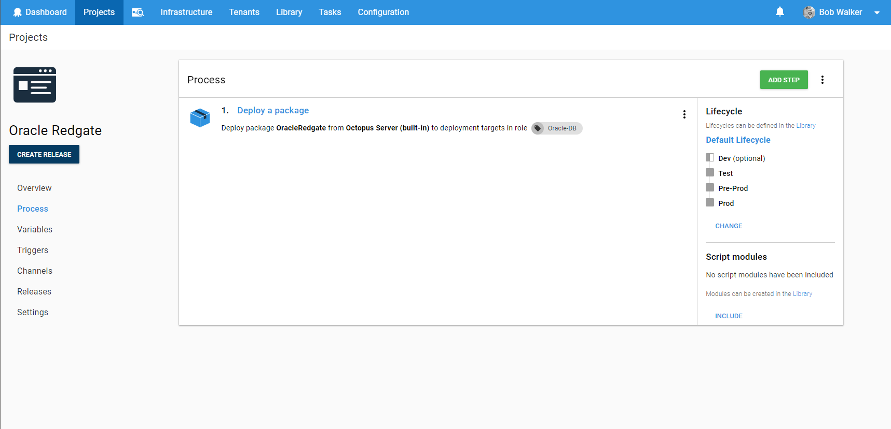

Back in TeamCity, I will use that new project in my create a release step:

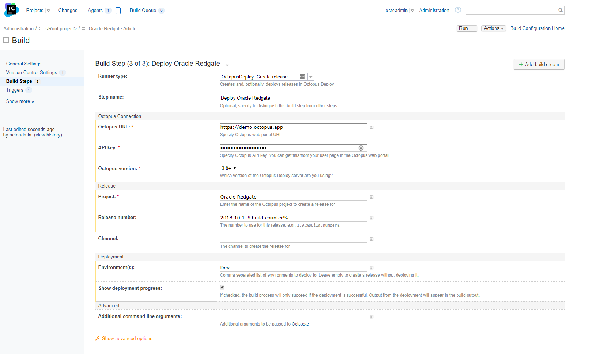

Now the moment of truth, running the build for the first time.  And...I messed it up.  Of course, I did.  Nothing works perfectly the first time:

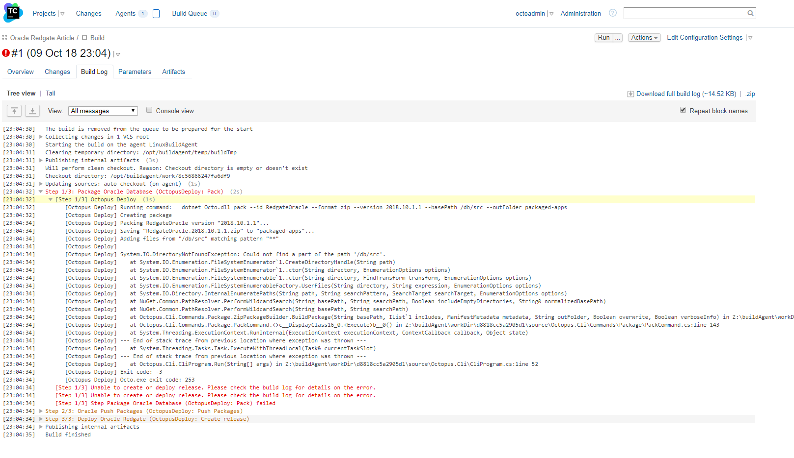

It took a couple of tries, but I got the build working:

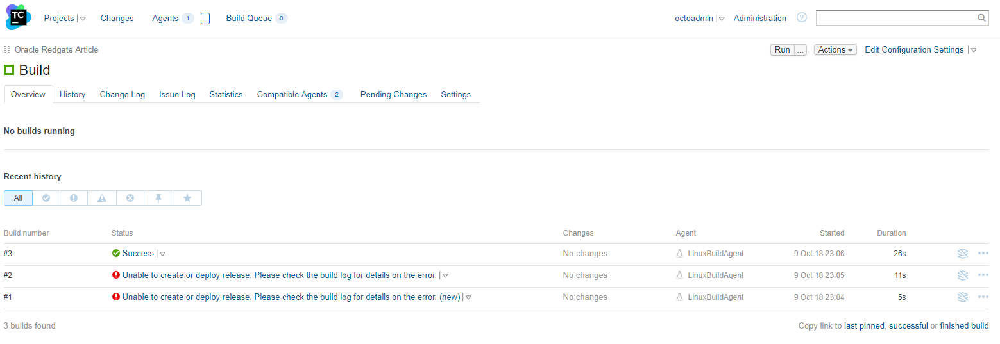

The issue was I put a / at the start of the packaging path.  It should’ve been db/src, like so:

If I download the package from Octopus and examine it, I can see all the files that were created are there:

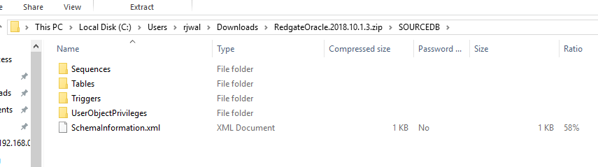

We have the build server packaging, publishing, and triggering a deployment.  Now it’s time to go to Octopus and get that process built out.

## Configure destination database

If you do what I did, which is setting everything up for the first time, then you will need to configure a destination database.  I configured a new one called **DestDB** using the database creation assistant.  The username for this database is also **DestDB**.

As you can see, I do not have anything set up on this database:

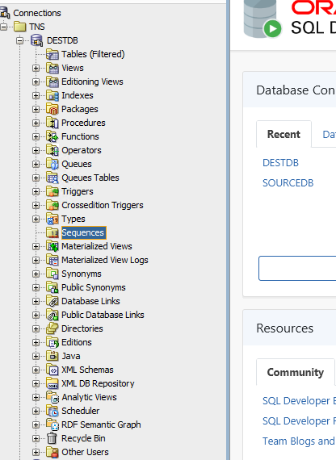

## Setup Octopus Deploy

As shown in an earlier screenshot, you should set up a jump box that sits between Octopus Deploy and your Oracle Database.  This machine needs to have Redgate’s Oracle Tool-belt, **SQL*Plus**, and the standard **tnsnames.ora** file installed. The **tnsnames.ora** file needs to contain all the hosts (database servers) you need to connect to from this jump box.

:::warning
Due to a quirk in the Redgate’s Oracle Tool-belt, you need to run the Tentacle as an account rather than as the local system account; otherwise, you will get errors saying the tool isn’t activated, even though it is.  Please follow [these instructions](https://octopus.com/docs/infrastructure/windows-targets/running-tentacle-under-a-specific-user-account) to set that up.
:::

I have added two new step-templates to the community library.  [Redgate - Create Oracle Release](https://library.octopus.com/step-templates/0aa40fba-949c-4065-a438-010349c3fd0c/actiontemplate-redgate-create-oracle-release) and [Run Oracle SQLPlus Script](https://library.octopus.com/step-templates/c7cd3ab4-5dfb-4f8d-957e-1940ed30359c/actiontemplate-run-oracle-sqlplus-script).  Please download and install them on your Octopus Deploy instance.

The process I have put together is very simple.  The first step generates a report and a delta script, in pre-prod and prod a DBA approves the changes, and then the delta script is run against the database.

I intentionally made this step only generate a delta script and a report file.  It is possible to make Redgate’s Oracle tools do the deployment for you by including the `/deploy` command line switch.  I omitted that command line switch because I feel it is important to build trust in the process first and have a human approve the changes.  The community library is open source. You are free to clone that step and adjust it to meet your needs:

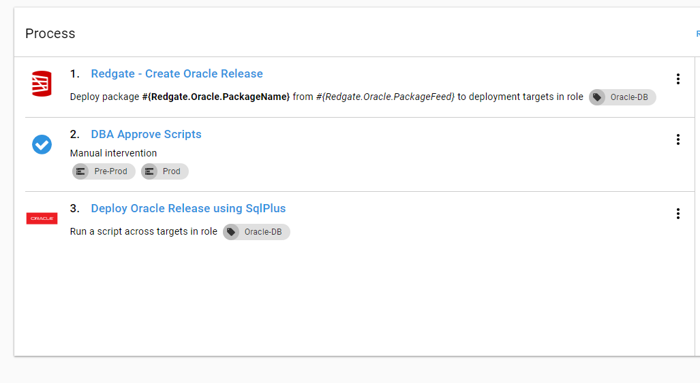

There are a few options to complete in the first step.  I’ve tried to include as much help text as possible.  If something isn’t clear, please let us know by emailing [support@octopus.com](mailto:support@octopus.com), and we will get that fixed up.

At the end of the step, you are asked to provide the source schema and the destination schema.  This is due to a setting Redgate’s tooling.  The step-template wraps the command-line, and it offers the schema name as an option, so the step template has to offer it as an option as well:

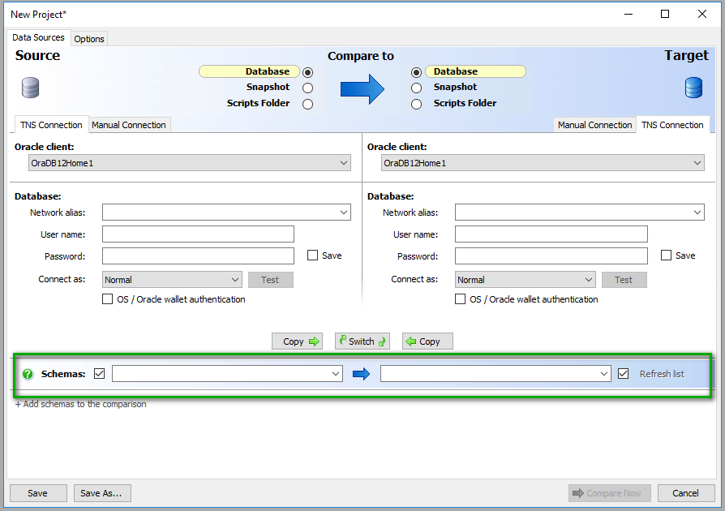

The second step template will take any script and run it against an Oracle database using SQL*Plus.  This step only requires the path of the script to run and the necessary credentials to access the Oracle database.  

**Please note**, the Redgate - Create Oracle Release step will generate a file in the export directory called **Delta.sql**. I wanted to make this script as generic as possible, which is why you have to supply the full path:

One thing I like about the Oracle tools is the report it generates to show the delta between the scripts stored in the package and the destination database.  The Redgate - Create Oracle Release will make this an artifact for you to download and review:

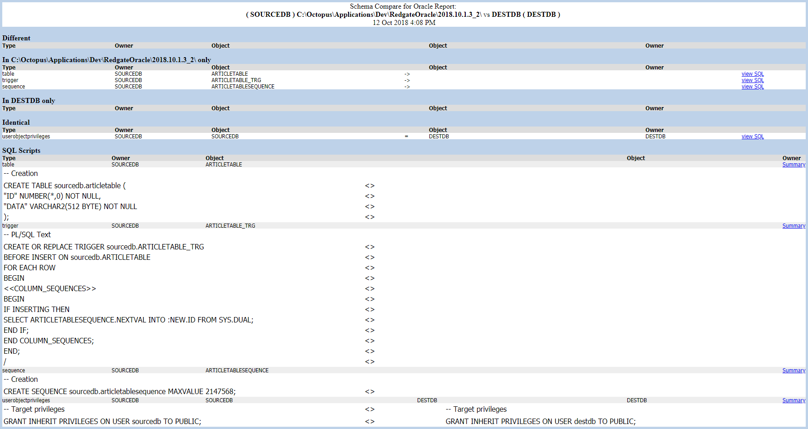

In addition, it also makes the delta script an artifact to download:

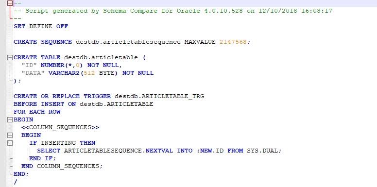

## Running the first deployment

Octopus is now configured and ready to go, and it’s time for the first test run. I’m only going to deploy to dev.  

Let’s check the database to make sure.  Yup, everything is there.

## Conclusion

The days of manually writing deployment scripts for each environment are rapidly drawing to a close.  In this article, we created an entire CI/CD pipeline for an Oracle database.  It still lacks a couple of key features, such as handling any sort of initialization data as well as static data, but it’s a good start.  I encourage you to take this basic process and start adding on to it.  

Until next time, happy deployments!

---

!include <database-deployment-automation-posts>
