In my previous post, [Deploy to Oracle Database using Octopus Deploy and Redgate](https://octopus.com/blog/oracle-database-using-redgate), I walked through setting up a CI/CD pipeline to deploy to Oracle with TeamCity as the build server, Octopus Deploy as the deployment server and Redgate handling all the heavy lifting.  This post builds on the concepts in that previous post.

Redgate’s tooling uses what is known as a model-based, or desired state approach, to database deployments.  A developer configures a database how they want it.  Add a table here, a view there, and then checks the entire state of the database into source control.  During a deployment, that desired state is compared with the destination database, and a delta script is generated.  

For teams starting out with automated database deployments, this is a very easy process to pick up and adapt.  Often times, tools that use this approach have plugins, or an external program with a nice UI, to handle all the heavy lifting.  Everyone can keep using their existing tooling, and all someone needs to do is make some changes is hit a few buttons.

The model-based approach is great most of the time.  It covers 85% of the scenarios out there.  What it doesn’t cover are complex database changes, such as renaming a table, moving a column from one table to another, renaming a column, etc.  With a model-based approach, if you were to rename a table and deploy it, the tool would generate a drop table script to delete the old table, and a create table script for the new table.

Dropping a table is never a good thing.  This blog post walks through how to manage that scenario as well as move the build server from TeamCity over to Jenkins.

!toc

## Non-breaking database changes

Renaming a column, moving a column from one table to another table, and consolidating tables are all breaking changes.  In order to deploy them, the system needs to be shut down; otherwise, the code will start throwing errors.  This means an out-of-hours deployment.

A better approach is to make non-breaking database changes.  Let’s use moving a column from one table to another as an example.  Using the tooling as is, this is what happens:

1. ColumnA is added to TableB.
2. ColumnA is removed from TableA.

In reality, you want the tooling to do this:

1. ColumnA is added to TableB
2. Data from TableA is backfilled into TableB
3. ColumnA is removed from TableA

The tooling doesn’t support that kind of functionality.  Or does it?  Do all three steps really need to be run in a single deployment?  What happens if a show-stopping bug is found and you need to rollback your code changes?  Rather than do all three steps in a single deployment, could you break it into multiple deployments?

Deployment #1
1. ColumnA is added to TableB.
2. Data from TableA is backfilled into TableB.

Deployment #2
1. ColumnA is removed from TableA.

Now we are getting somewhere.  You can deploy your database changes and then your code changes can be deployed across a web farm in a rolling deployment.  Now the process would look something like this:

Deployment #1
1. ColumnA is added to TableB as a nullable column.
2. The code is deployed to a web farm.
3. Data from TableA is backfilled into TableB.

Deployment #2
1. ColumnA is removed from TableA.
2. ColumnA on TableB is converted to a non-nullable field (if needed).

This approach takes a bit of discipline from both the database developer and the code developer (if they are two people).  The code needs to be flexible to handle ColumnA on TableB when it only has null values.  It will also take discipline to remember to remove the column from TableA in the subsequent deployment.  

The discipline will pay off as you gain flexibility in your deployments.  With your database supporting the two most recent versions of your code, you can start looking into more advanced deployment strategies such as blue/green deployments.

## Post-deployment scripts

In my previous article, everything we need is in place except for the scripts to backfill data from TableA into TableB.  All the necessary infrastructure is in place, and we just need to make a few modifications to the overall process.

To begin with, we add a new folder into the db/src folder called `DLMPostDeploymentScripts`:


This folder contains idempotent scripts, which means scripts that can always be run after a deployment.  In other words, if the script is moving data from one table to another, the script should include logic not to overwrite existing data.  Write the scripts with the assumption they will be run dozens of times.

Redgate’s Source Control for Oracle is okay with that folder being there.  It doesn’t throw an error or anything like that.  It just ignores the folder:

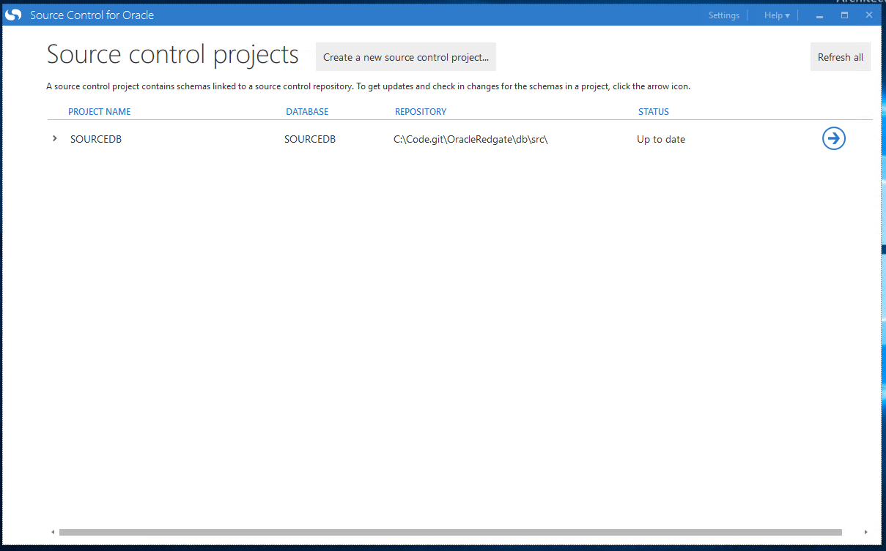

Git does not ignore the folder, which is perfect for our needs.  I’ve added in a new file called 001_TestScript.sql.  All it is doing is selecting a test value from dual:


## Jenkins configuration

I’ve checked in that test file and pushed it.  Now it is time to set up the build (again).  For this article, I am going to switch over from TeamCity to Jenkins.  I’m not changing because of a lack of functionality, but because I want to show how easy it is to configure any build server to deploy using Octopus Deploy.  Be it Jenkins, TeamCity, Bamboo, or TFS/Azure DevOps.  

### Prepping Jenkins for Octopus Deploy

Follow these instructions to install the [Octopus Deploy plugin]](https://jenkins.io/doc/book/managing/plugins/).

After installing the Octopus plugin, you need to configure an Octopus Server.  To do that click on **Manage Jenkins** and then **Configure System**:


Scroll down a little bit until you find the Octopus Deploy plugin section.  Enter in an ID, URL for the Octopus Deploy Server, and the API key and click the **add OctopusDeploy Server** button at the bottom of the screen:

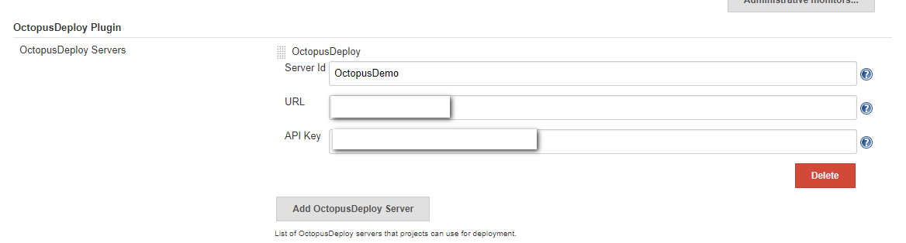

The Octopus Deploy plugin will handle creating the release and deploying the release, but it doesn’t handle packing and publishing those packages.  For this, we will use the Octopus CLI.  You can download the latest version from the [Octopus downloads page](https://octopus.com/downloads).  I’m going to put the Octopus CLI into a folder for the build to access.  In this case, it will be `C:\Utilities\Octo`.

### Project set up

I’m starting this project from scratch, so I’ll create a new freestyle project:

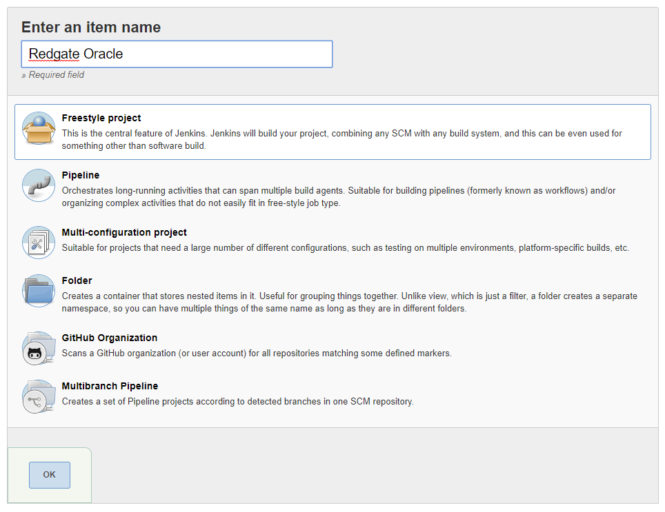

Next, I specify the Git repo I will be building from.  

**Please note:** this is a public repo in GitHub, which is why I’m not entering any credentials:

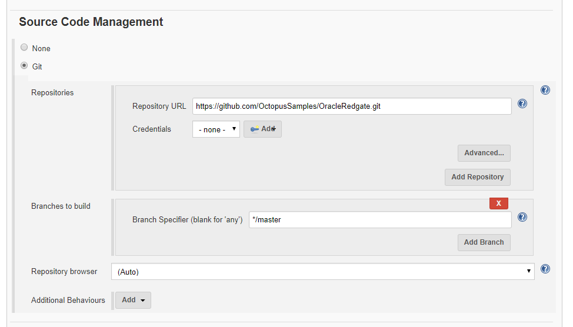

For this demo, I tell Jenkins to poll GitHub every three minutes using a cron expression.  You can adjust this as needed, but for my purposes, this is all I need:


The build steps pack the db\src folder into a .zip file and push that .zip file to Octopus Deploy built-in repository ready to be deployed:

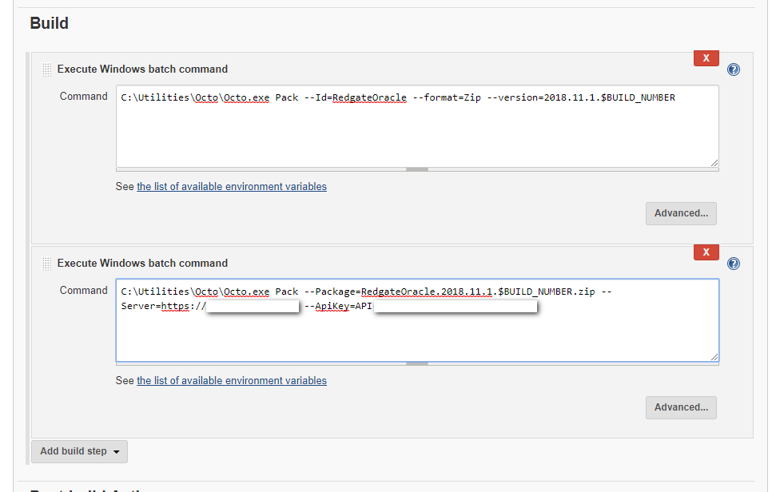

Next, let’s create the release.  

**Please note**: I haven’t made any changes to Octopus Deploy yet, I just want to get this build working and pushing to Octopus Deploy, and when that is successful I will make changes to the process:


That is it!  Let’s kick off a build and see what happens!  It fails!  I think the first ten builds in any CI system should count as _alpha_ builds.  I’ve yet to have a build succeed on the first try:

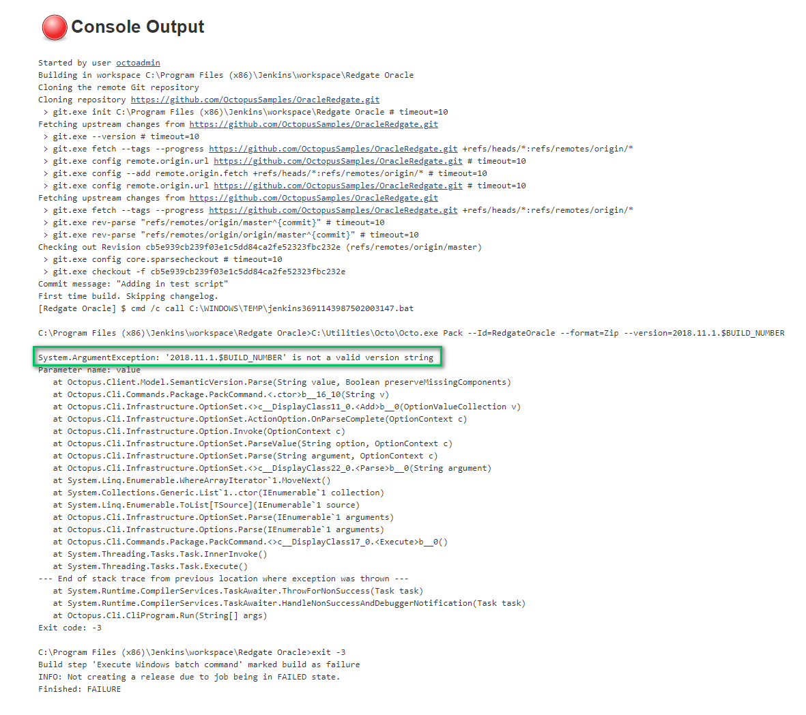

Let’s make a couple of tweaks to the pack and push process.  Use `%BUILD_NUMBER%` instead of `$BUILD_NUMBER`, have the second step do a push instead of a pack and make a few other tweaks.

These are the commands to use.

```
C:\Utilities\Octo\Octo.exe Pack --Id=RedgateOracle --format=Zip --version=2018.11.1.%BUILD_NUMBER% --BasePath=db\src
C:\Utilities\Octo\Octo.exe Push --Package=RedgateOracle.2018.11.1.%BUILD_NUMBER%.zip --Server=[Your Server URL] --ApiKey=[Your API Key]
```

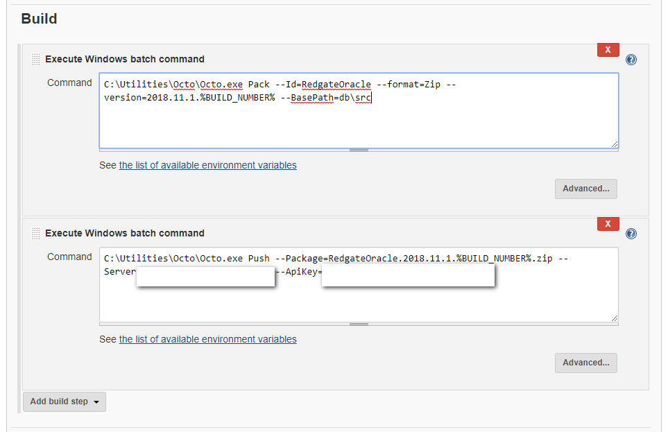

It took a few attempts, but eventually, Jenkins pushed to Octopus Deploy and deployed the release to dev.

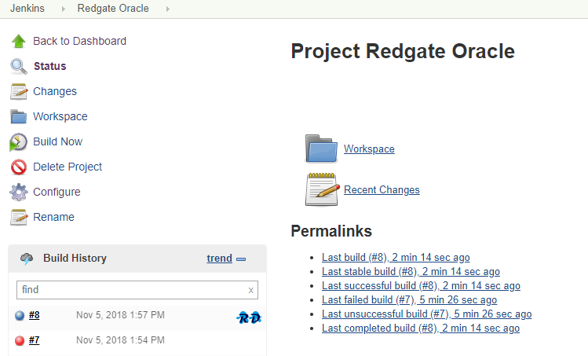

### Project update

At the end of the previous article, the deployment process looked like this:


We are going to extend that process to support the additional scripts.  First, we need to rearrange a few items.  Let’s start by moving some hardcoded values out of the steps and into variables.  For example, the export path:

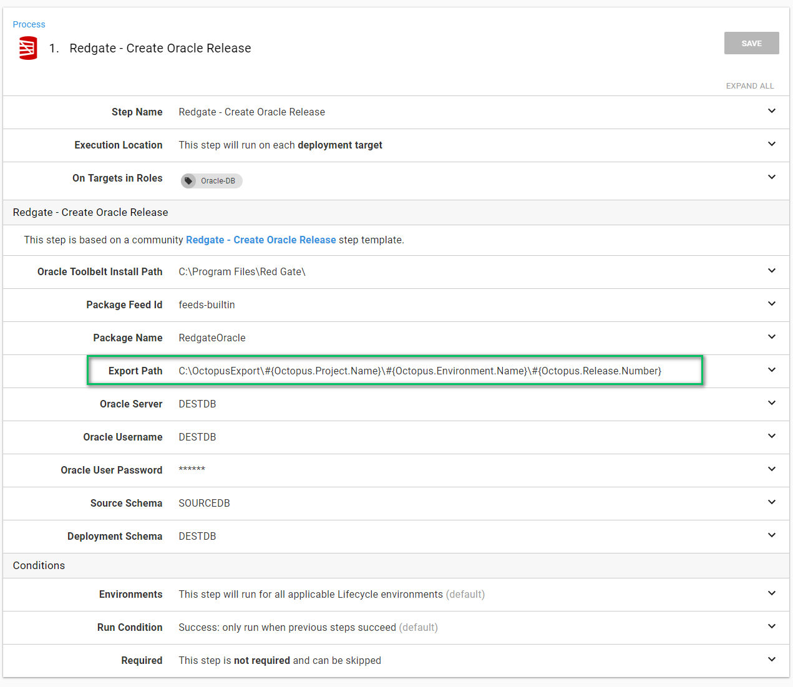

After some re-configuration, these are the variables I now have:


In looking at the Redgate - Create Oracle Release step, you can see all the spots where I used these variables.

:::warning
Since my last article, I have updated this step template based on feedback from users.  You now have more fine-grained control.  
:::

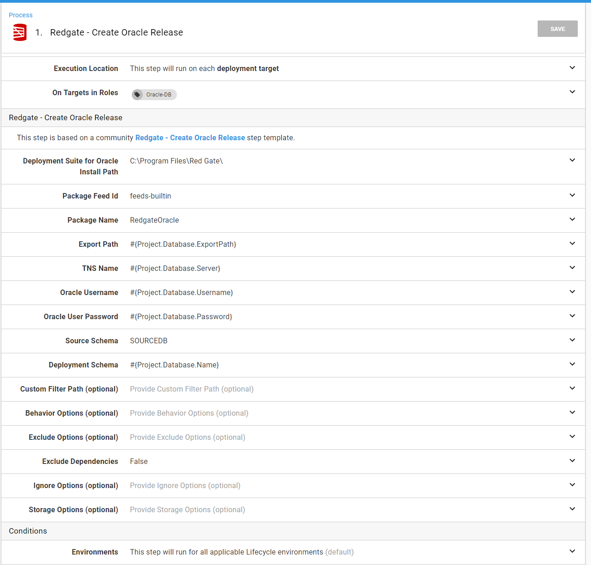

The same thing can be seen on the last step.  All the hardcoded values have been replaced by the variables:

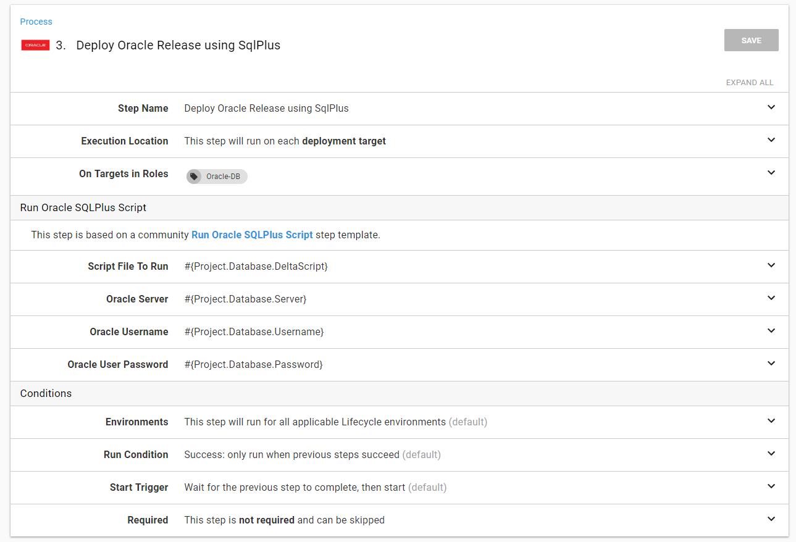

We are going to add two new steps to the process.  The first step combines all the scripts found in the **DLMPostDeploymentScripts** folder into a single script and uploads it as an artifact.  This allows an approver to look through the script to ensure it won’t do anything crazy.

I’ve created a step template in the library you can use called **File System - Combine all files in a directory into single file**. The step will handle all the heavy lifting for you.  You just need to provide it with the necessary parameters.  

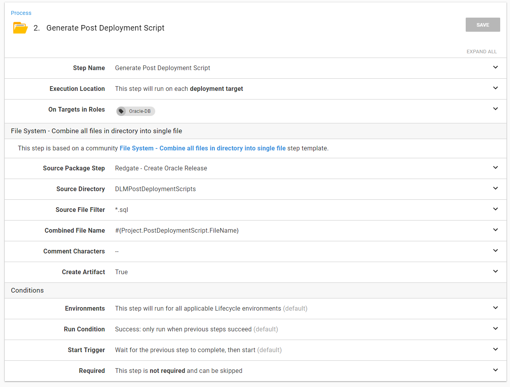

The next step I am going to add is another **Run Oracle SQLPlus Script** step.  This time it will run the post-deployment script.

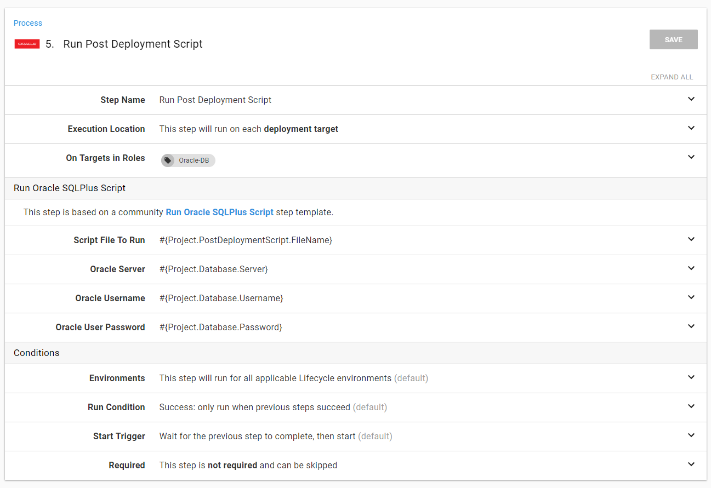

The process now looks like this:

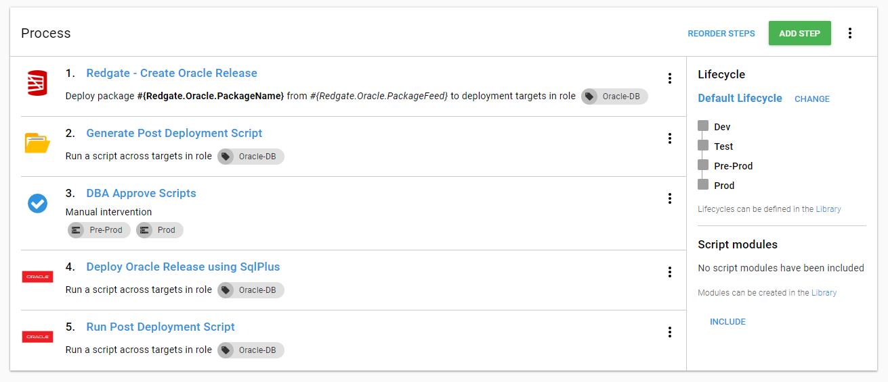

It’s time to run a deployment and see what happens.  As you can see an additional artifact was created:


And the script was run successfully:

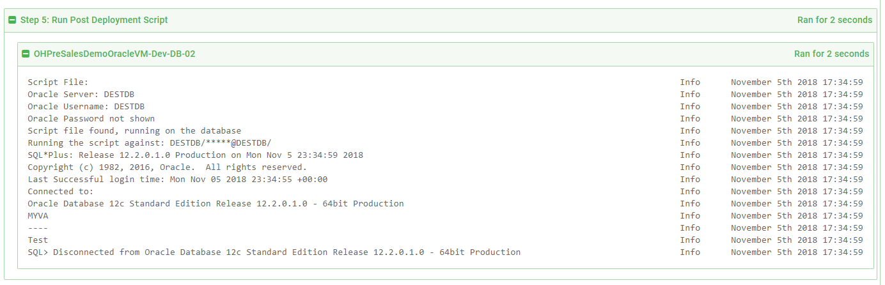

## Conclusion

With some minor modifications to the process, we can cover a lot more scenarios than before.  It will take a bit of discipline to use this process.  You will need to ensure the scripts can be run multiple times.  You will also have to remember to remove the scripts after they have been run, so you aren’t running scripts over and over.  The scripts will be manually written, so there is a small to large chance you will run into errors the first time the scripts run.  

But those are minor issues.  When I helped write this process at a previous company, I was surprised how well people took to it.  Once they knew they could write their own scripts to handle data migration or anything else, I started seeing some very unique uses.  One person ran a series of scripts to insert some initialization, or seed, data into tables.  We extended the process even further to check if the database existed.  If the database did not, then it would create it on the fly and initialize it with seed data.  This allowed us to spin up and down test environments and customers quickly.

And that is just the start.  With this is in place, it is possible to think about having a blue/green deployment strategy.  A process could be in place to finish the regular deployment, and when a blue/green switch is finished and successfully tested, a final database script could run to clean up the data.

Until next time, Happy Deployments!

---

!include <database-deployment-automation-posts>
