One of the most exciting aspects of database deployments in the last ten years is the number of tools that have been released.  Looking at my [previous posts](https://octopus.com/blog/tag/Database%20Deployments) on this topic, you can see I have a clear bias toward Redgate’s tooling, but I’m a friend of Redgate for a reason.  

In this post, I use [DbUp](https://dbup.readthedocs.io/en/latest/).  DbUp is a free, open-source tool, which we use here at Octopus Deploy for our database deployments.  Anytime you install or upgrade Octopus Deploy, DbUp runs the scripts to update your database.  Our founder, Paul Stovell, wrote a [blog post](https://octopus.com/blog/howto/deploy-a-sql-database) back in 2012 on how to use DbUp to deploy to a SQL Server.  For the most part, that blog post still holds up today.

This post is an update to that old post.  A lot of new features have been added to DbUp as well as Octopus Deploy, and I’m going to walk through some of those features and create a process to use it for database deployments.  It even includes a review step for a DBA to approve.

!toc

## Changes to DbUp

At its core, DbUp is a script runner.  Changes made to the database are done via a script:

- Script001_AddTableA.sql
- Script002_AddColumnTestToTableA.sql
- Script003_AddColumnTestAgainToTableA.sql

DbUp runs through a console application you write yourself, so you control which options to use, and you don’t need a lot of code:

```C
static int Main(string[] args)
{
    var connectionString =
        args.FirstOrDefault()
        ?? "Server=(local)\\SqlExpress; Database=MyApp; Trusted_connection=true";

    var upgrader =
        DeployChanges.To
            .SqlDatabase(connectionString)
            .WithScriptsEmbeddedInAssembly(Assembly.GetExecutingAssembly())
            .LogToConsole()
            .Build();

    var result = upgrader.PerformUpgrade();

    if (!result.Successful)
    {
        Console.ForegroundColor = ConsoleColor.Red;
        Console.WriteLine(result.Error);
        Console.ResetColor();

        return -1;
        }
    }

    Console.ForegroundColor = ConsoleColor.Green;
    Console.WriteLine("Success!");
    Console.ResetColor();
    return 0;
}
```

You bundle those scripts and tell DbUp to run them.  It compares that list against a list stored in the destination database.  Any scripts not in that destination’s database list will be run.  The scripts are executed in alphabetical order, and the results of each script are displayed on the console.  Very simple to implement and understand.  


That works great when you’re deploying to a development or test environment.  Many companies I talk to prefer their DBAs to approve scripts before going to production.  Maybe a staging or pre-production environment as well.  This approval process is essential, especially when you first start deploying databases.

### HTML report

Migration scripts are a double-edged sword, just like memory management in C++.  You have total control, which gives you great power. However, it’s also easy to mess up.  It all depends on the type of change being done and the SQL skills of the writer.  The DBA's trust in the process will be low when inexperienced C# developers are writing these migration scripts.

Recently the functionality was added to DbUp to generate an HTML report.  It is an extension method where you give it the path of the report you want to generate.  That means this section goes from:

```C
var result = upgrader.PerformUpgrade();

if (!result.Successful)
{
    Console.ForegroundColor = ConsoleColor.Red;
    Console.WriteLine(result.Error);
    Console.ResetColor();

    return -1;
    }
}
```

To:

```C
// --generateReport is the name of the example argument.  You can call it anything
if (args.Any(a => "--generateReport".Equals(a, StringComparison.InvariantCultureIgnoreCase)))
{
    upgrader.GenerateUpgradeHtmlReport("C:\\DeploymentLocation\\UpgradeReport.html");
}
else
{
    var result = upgrader.PerformUpgrade();

    if (!result.Successful)
    {
        Console.ForegroundColor = ConsoleColor.Red;
        Console.WriteLine(result.Error);
        Console.ResetColor();
        return -1;
    }
}
```

That code will generate a report containing all the scripts that will be run.

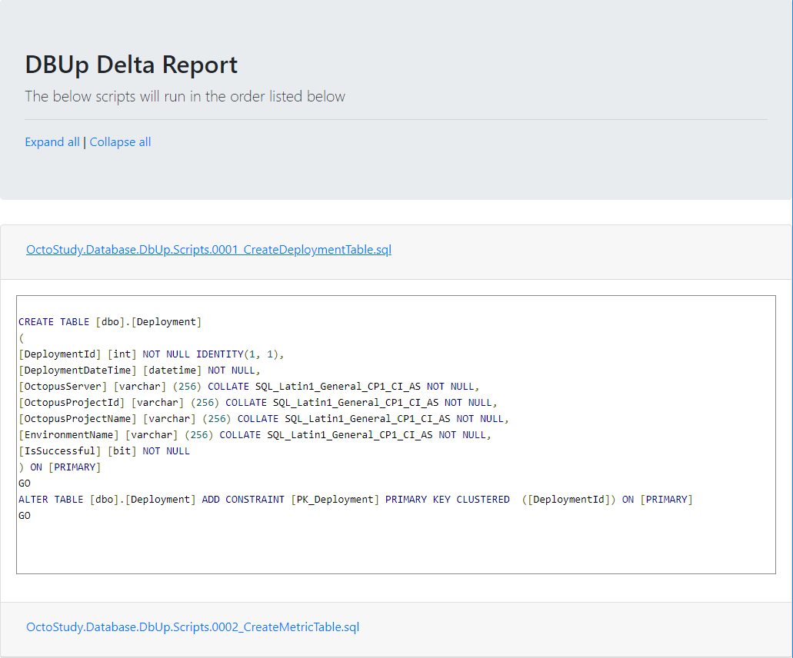

### Always run script and script grouping

By default, DbUp will run a script once, and the majority of the time that’s fine, but there are times when it would be nice to always run a script or set of scripts.  An example is a post-deployment script to refresh all the views.  Alternatively, a script to rebuild all the indexes and regenerate stats.  You don’t want to write a new script for each deployment.

Another feature recently added to DbUp is the ability to mark a group of scripts as `AlwaysRun` and provide a run group:

```C
var upgradeEngineBuilder = DeployChanges.To
    .SqlDatabase(connectionString, null) //null or "" for default schema for user
    .WithScriptsEmbeddedInAssembly(Assembly.GetExecutingAssembly(), script => script.StartsWith("SampleApplication.PreDeployment."), new SqlScriptOptions { ScriptType = ScriptType.RunAlways, RunGroupOrder = 1})
    .WithScriptsEmbeddedInAssembly(Assembly.GetExecutingAssembly(), script => script.StartsWith("SampleApplication.Scripts."), new SqlScriptOptions { ScriptType = ScriptType.RunOnce, RunGroupOrder = 2})
    .WithScriptsEmbeddedInAssembly(Assembly.GetExecutingAssembly(), script => script.StartsWith("SampleApplication.PostDeployment."), new SqlScriptOptions { ScriptType = ScriptType.RunAlways, RunGroupOrder = 3})
    .LogToConsole();

var upgrader = upgradeEngineBuilder.Build();

var result = upgrader.PerformUpgrade();

// Display the result
if (result.Successful)
{
    Console.ForegroundColor = ConsoleColor.Green;
    Console.WriteLine("Success!");
}
else
{
    Console.ForegroundColor = ConsoleColor.Red;
    Console.WriteLine(result.Error);
    Console.WriteLine("Failed!");
}
```

## Create the DbUp console application

With these new features, we are going to put together a .NET Core DbUp console application to deploy to SQL Server.  Then we will put together a process in Octopus Deploy to run that console application.  

All the code below can be found in the [GitHub repo](https://github.com/OctopusSamples/DbUpSample).

I chose .NET Core over .NET Framework because it could be built and run anywhere.  DbUp is a .NET Standard library.  DbUp will work just as well in a .NET Framework application.  

Let’s fire up our IDE of choice and create a .NET Core console application. I am using JetBrain’s Rider to build this console application.  I prefer it over Visual Studio.

### Scaffolding

The console application has been created.  Now we need to bring in the DbUp NuGet packages.  Let’s go to our NuGet Package Manager:

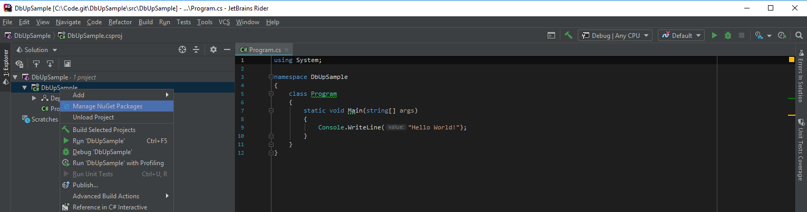

Next, we select the DbUp-SqlServer package.  That package includes the core package as well as the necessary code to deploy to SQL Server.  If you want to deploy to PostgreSQL, MySQL, Oracle, or SQLite, you can pick those:

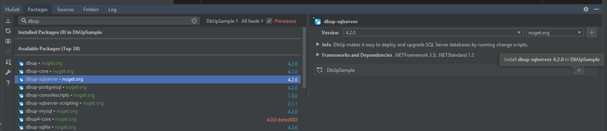

The console application needs some scripts to deploy.  I’m going to add three folders and populate them with some script files:

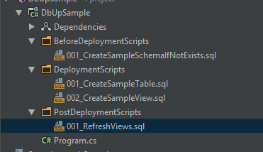

I recommend you add a prefix, such as 001, 002, etc., to the start of your script file name.  DbUp runs the scripts in alphabetical order, and that prefix helps ensure the scripts are run in the correct order.

By default, .NET will not include those scripts files when the console application is built, and we want to include those script files as embedded resources.  Thankfully, we can easily add a reference to those files by including this code in the `.csproj` file:

```XML
    <ItemGroup>
        <EmbeddedResource Include="BeforeDeploymentScripts\*.sql" />
        <EmbeddedResource Include="DeploymentScripts\*.sql" />
        <EmbeddedResource Include="PostDeploymentScripts\*.sql" />
    </ItemGroup>

```

The entire file looks like this:

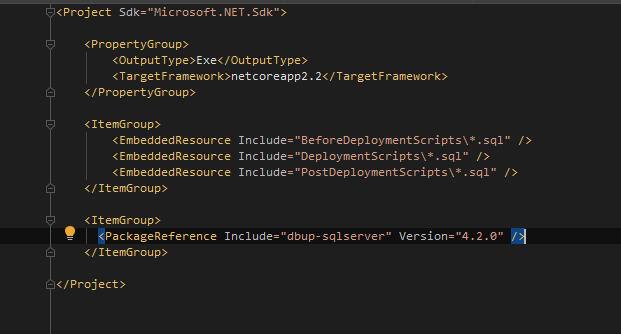

### Program.cs file

The final step to get this application going is to add in the necessary code in the `Program.cs` to call DbUp.  The application accepts parameters from the command-line, and Octopus Deploy will be configured to send in the following parameters:

- **ConnectionString**: For this demo, we are sending this as a parameter instead of storing it in the config file.
- **PreviewReportPath**: The full path to save the preview report.  The full path parameter is optional.  When it is sent in we generate a preview HTML report for Octopus Deploy to turn into an artifact.  When it is not sent in, the code will do the actual deployment.

Let’s start by pulling the connection string from the command-line argument:

```C
static void Main(string[] args)
{    
    var connectionString = args.FirstOrDefault(x => x.StartsWith("--ConnectionString", StringComparison.OrdinalIgnoreCase));

    // We expect the connection string to be there.  If it doesn’t this will throw an error.  
    connectionString = connectionString.Substring(connectionString.IndexOf("=") + 1).Replace(@"""", string.Empty);
```

DbUp uses a fluent API.  We need to tell it about our folders, the type of script each folder is, and the order we want to run scripts in. If you use the Scripts Embedded In Assembly option with a *StartsWith* search, you need to supply the full NameSpace in your search.

```C
var upgradeEngineBuilder = DeployChanges.To
    .SqlDatabase(connectionString, null)
    // Pre-deployment scripts, set them to always run first
    .WithScriptsEmbeddedInAssembly(Assembly.GetExecutingAssembly(), x => x.StartsWith("DbUpSample.BeforeDeploymentScripts."), new SqlScriptOptions { ScriptType = ScriptType.RunAlways, RunGroupOrder = 0 })
    // Main Deployment scripts, they run once and run in the second group
    .WithScriptsEmbeddedInAssembly(Assembly.GetExecutingAssembly(), x => x.StartsWith("DbUpSample.DeploymentScripts"), new SqlScriptOptions { ScriptType = ScriptType.RunOnce, RunGroupOrder = 1 })
    // Post deployment scripts, always run these scripts and run after everything has been deployed
    .WithScriptsEmbeddedInAssembly(Assembly.GetExecutingAssembly(), x => x.StartsWith("DbUpSample.PostDeploymentScripts."), new SqlScriptOptions { ScriptType = ScriptType.RunAlways, RunGroupOrder = 2 })
    // By default all the scripts are run in the same transaction
    .WithTransactionPerScript()
    // Set this so it can report back to Octopus Deploy how things are going
    .LogToConsole();

var upgrader = upgradeEngineBuilder.Build();

Console.WriteLine("Is upgrade required: " + upgrader.IsUpgradeRequired());
```

The upgrader has been built, and it is ready to run.  This section is where we inject the check for the upgrade report parameter.  If that parameter is set, do not run the upgrade.  Instead, generate a report for Octopus Deploy to upload as an artifact:

```C
if (args.Any(a => a.StartsWith("--PreviewReportPath", StringComparison.InvariantCultureIgnoreCase)))
{
    // Generate a preview file so Octopus Deploy can generate an artifact for approvals
    var report = args.FirstOrDefault(x => x.StartsWith("--PreviewReportPath", StringComparison.OrdinalIgnoreCase));
    report = report.Substring(report.IndexOf("=") + 1).Replace(@"""", string.Empty);

    var fullReportPath = Path.Combine(report, "UpgradeReport.html");

    Console.WriteLine($"Generating the report at {fullReportPath}");

    upgrader.GenerateUpgradeHtmlReport(fullReportPath);
}
else
{
    var result = upgrader.PerformUpgrade();

    // Display the result
    if (result.Successful)
    {
        Console.ForegroundColor = ConsoleColor.Green;
        Console.WriteLine("Success!");
    }
    else
    {
        Console.ForegroundColor = ConsoleColor.Red;
        Console.WriteLine(result.Error);
        Console.WriteLine("Failed!");
    }
}
```

When we put it all together, it looks like this:

```C
using System;
using System.IO;
using System.Linq;
using System.Reflection;
using DbUp;
using DbUp.Engine;
using DbUp.Helpers;
using DbUp.Support;

namespace DbUpSample
{
    class Program
    {
        static void Main(string[] args)
        {
            var connectionString = args.FirstOrDefault(x => x.StartsWith("--ConnectionString", StringComparison.OrdinalIgnoreCase));

            connectionString = connectionString.Substring(connectionString.IndexOf("=") + 1).Replace(@"""", string.Empty);

            var upgradeEngineBuilder = DeployChanges.To
                .SqlDatabase(connectionString, null)
                .WithScriptsEmbeddedInAssembly(Assembly.GetExecutingAssembly(), x => x.StartsWith("DbUpSample.BeforeDeploymentScripts."), new SqlScriptOptions { ScriptType = ScriptType.RunAlways, RunGroupOrder = 0 })
                .WithScriptsEmbeddedInAssembly(Assembly.GetExecutingAssembly(), x => x.StartsWith("DbUpSample.DeploymentScripts"), new SqlScriptOptions { ScriptType = ScriptType.RunOnce, RunGroupOrder = 1 })
                .WithScriptsEmbeddedInAssembly(Assembly.GetExecutingAssembly(), x => x.StartsWith("DbUpSample.PostDeploymentScripts."), new SqlScriptOptions { ScriptType = ScriptType.RunAlways, RunGroupOrder = 2 })
                .WithTransactionPerScript()
                .LogToConsole();

            var upgrader = upgradeEngineBuilder.Build();

            Console.WriteLine("Is upgrade required: " + upgrader.IsUpgradeRequired());

            if (args.Any(a => a.StartsWith("--PreviewReportPath", StringComparison.InvariantCultureIgnoreCase)))
            {
                // Generate a preview file so Octopus Deploy can generate an artifact for approvals
                var report = args.FirstOrDefault(x => x.StartsWith("--PreviewReportPath", StringComparison.OrdinalIgnoreCase));
                report = report.Substring(report.IndexOf("=") + 1).Replace(@"""", string.Empty);

                var fullReportPath = Path.Combine(report, "UpgradeReport.html");

                Console.WriteLine($"Generating the report at {fullReportPath}");

                upgrader.GenerateUpgradeHtmlReport(fullReportPath);
            }
            else
            {
                var result = upgrader.PerformUpgrade();

                // Display the result
                if (result.Successful)
                {
                    Console.ForegroundColor = ConsoleColor.Green;
                    Console.WriteLine("Success!");
                }
                else
                {
                    Console.ForegroundColor = ConsoleColor.Red;
                    Console.WriteLine(result.Error);
                    Console.WriteLine("Failed!");
                }
            }
        }
    }
}
```

Running the console application with the report parameter enabled generates the report we expected:


### Future work

Creating the scaffolding and writing the code for the program.cs file should only need to be done once.  With what we’ve set up, all you need to do is add files to the `PreDeployment`, `PostDeployment`, and `Deployment` folders.  

With this kind of setup, there’s a temptation to delete old files, but DbUp doesn’t like it when you do that.  The idea behind DbUp is that it provides a history of all your database changes.  When you want to create a new database on a new developer’s machine, for example, you just need to run this command-line application.  It will go through and run all the scripts to get the database up and running.  Deleting a file might end up removing a key sequence, such as creating a table, adding a critical column, or moving columns from one table to another.  There isn’t much of a performance hit to having those extra files around.  DbUp will see they have run and exclude them from the run list.

You could move the older files into a new folder and add a new command-line argument to pick up those files.  

## Octopus Deploy configuration

I’m going to assume you know how to build a .NET Core application and package it.  If you do not, here is the quick TL;DR:

- Run the `dotnet publish` command on the project (don’t forget the output path).
- Run `octo pack` to package the output path (or use the Octopus Deploy build server plugin).
- Push the package to Octopus Deploy using the `octo push` command (or use the Octopus Deploy build server plugin).

To make your life easier, for this demo, I have included version 1.0.0.1 of the sample application as a zip file in the root directory of the GitHub repo.  Upload the package to the Octopus built-in repository:


I subscribe to the theory that an Octopus Deploy project should be responsible for bootstrapping itself.  For database deployments, this means making sure the database exists before deployment and creating the necessary SQL Server users.

Before getting to the process, we need to define some variables.  Because this is a demo for a blog post, I'm using the same database server for all environments:

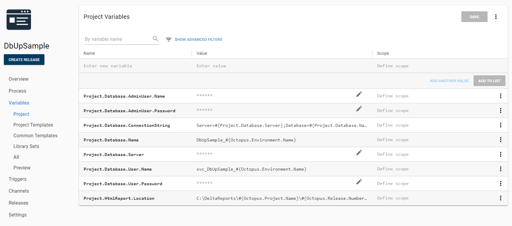

To create the database and user, the process will use the community step templates I created for earlier blog posts.  Please see [the documentation](https://octopus.com/docs/deployment-process/steps/community-step-templates#adding-community-step-templates) for how to download and install those community step templates on your Octopus Server.

I'm running the first step on a worker in the **Database Worker Pool**. I picked using a single worker pool because I am using SQL Authentication.  I don’t have to worry about integrated security and unique service accounts per environment.  If I was using integrated security with unique service accounts per environment with this process, there is some additional setup to be done, but I will cover that later in the post.  For now, I want to make this as simple as possible:

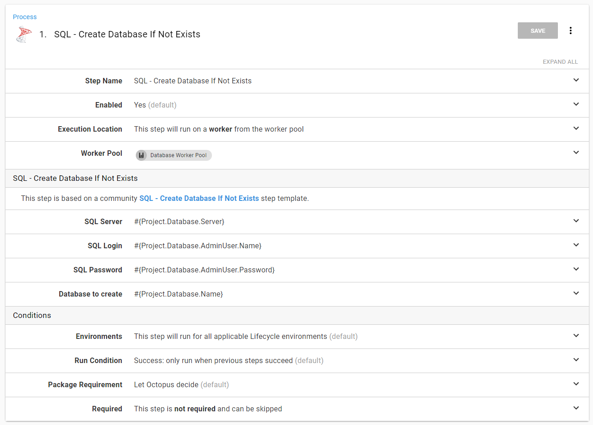

First, we want to put the scaffolding in place and create the database, the user, and assign the user database:

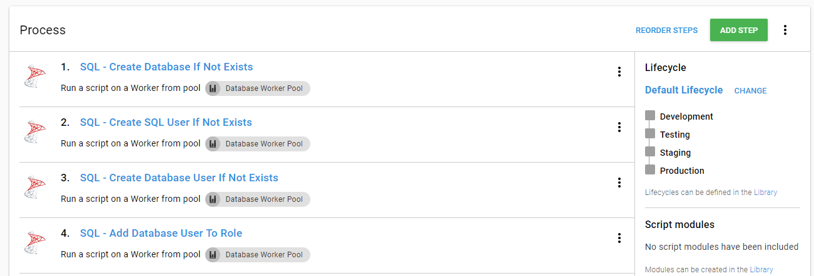

The next set of steps will deploy the database changes from DbUp.  If you recall [my previous Redgate articles](/blog/2020-02/database-deployment-automation-using-redgate-sql-change-automation/index.md) this was done in four steps:

1. Download the Package.
2. Run Redgate Create Database Release.
3. DBA Approve Deployment.
4. Run Redgate Deploy Database Release.

I have a couple of problems with that process.  Namely, the download package step is designed to extract the package and leave it on the Tentacle.  By default, it will leave it there forever unless [retention policies](https://octopus.com/docs/administration/retention-policies) are configured.  After the deployment is complete, there’s no need to keep that extracted package on the Tentacle.  The SQL scripts have been run, and now they are just taking up space.  Also, that process has steps 2 and 4 referencing step 1.  It feels like a lot of extra work.

If you are using Octopus Deploy 2018.8 or higher, the good news is we can now reference packages from the **Run a Script** step.  The package will be downloaded and extracted, and after the step has completed, it will delete the extracted package.  Aside from cleaning up unneeded content, using package references in the **Run a Script** step lends itself nicely to running the deployment on workers, which assumes each step is isolated. This also means different workers can do the work per step.

The first step in the deployment piece of this process generates the HTML report and uploads it as an artifact to Octopus Deploy. Add a package reference to the step by clicking the **Add** button:

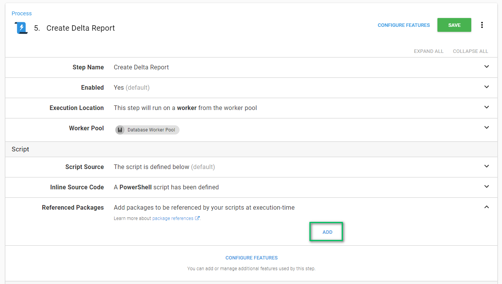

When the modal window appears, choose the package to extract:

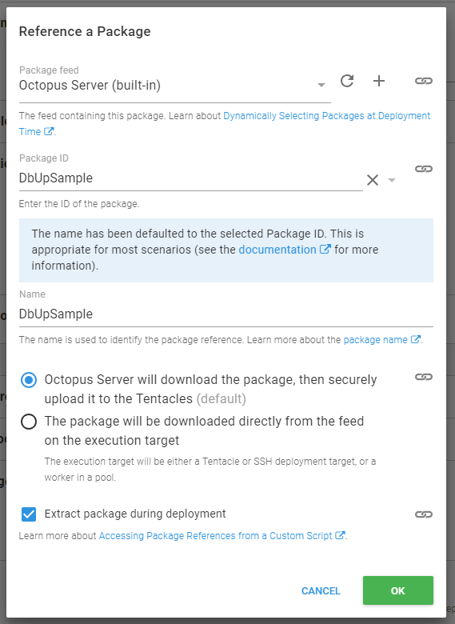

Now we can add a script to handle the deployment.  Running .NET Core console apps is a little different than running .NET Framework Console apps.

It all depends on the switches you set when building and publishing the application.  You could create a self-contained console application (.exe) with all the necessary .dlls, but doing so increases the size of the package.  Alternatively, you could set it to create a .dll only, with references to all the external dependencies.  In the example package, I created a self-contained package, but I exclude the .exe in the zip file.  This way, you don’t have to worry about running a restore:

```PS
# How you reference the extracted path
$packagePath = $OctopusParameters["Octopus.Action.Package[DbUpSample].ExtractedPath"]
$connectionString = $OctopusParameters["Project.Database.ConnectionString"]
$reportPath = $OctopusParameters["Project.HtmlReport.Location"]

$dllToRun = "$packagePath\DbUpSample.dll"
$generatedReport = "$reportPath\UpgradeReport.html"

if ((test-path $reportPath) -eq $false){
    New-Item $reportPath -ItemType "directory"
}

# How you run this .NET core app
dotnet $dllToRun --ConnectionString="$connectionString" --PreviewReportPath="$reportPath"

New-OctopusArtifact -Path "$generatedReport"
```

The entire step looks like this when you are done:


Nothing super fancy about the manual intervention.  In this example, I configured it to run only in staging and production and have the DBAs approve this deployment:


The deployment step is similar to the **Generate Delta Report** step, except it will deploy the changes, and not worry about generating the report.  The PowerShell for this step is:

```PS
# How you reference the extracted path
$packagePath = $OctopusParameters["Octopus.Action.Package[DbUpSample].ExtractedPath"]
$connectionString = $OctopusParameters["Project.Database.ConnectionString"]

$dllToRun = "$packagePath\DbUpSample.dll"

# How you run this .NET core app
dotnet $dllToRun --ConnectionString="$connectionString"
```

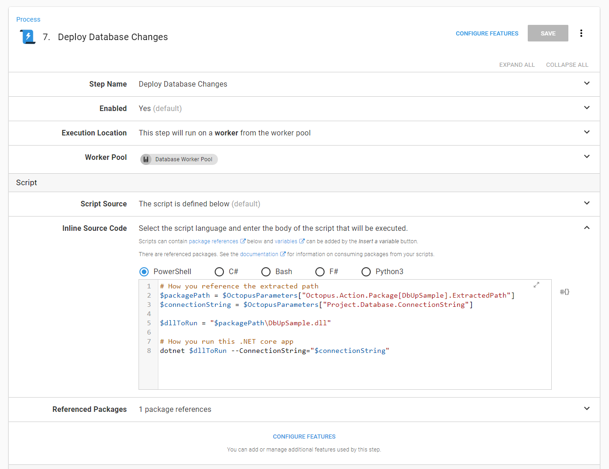

The final process is now:

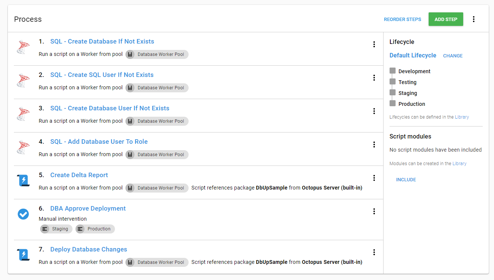

The variables are there.  The process is set.  Let’s deploy some database changes:


Whoops! Forgot to install .NET Core on my worker:


A quick jump over to the [Script Console](https://octopus.com/docs/administration/managing-infrastructure/script-console) to run a chocolatey install:

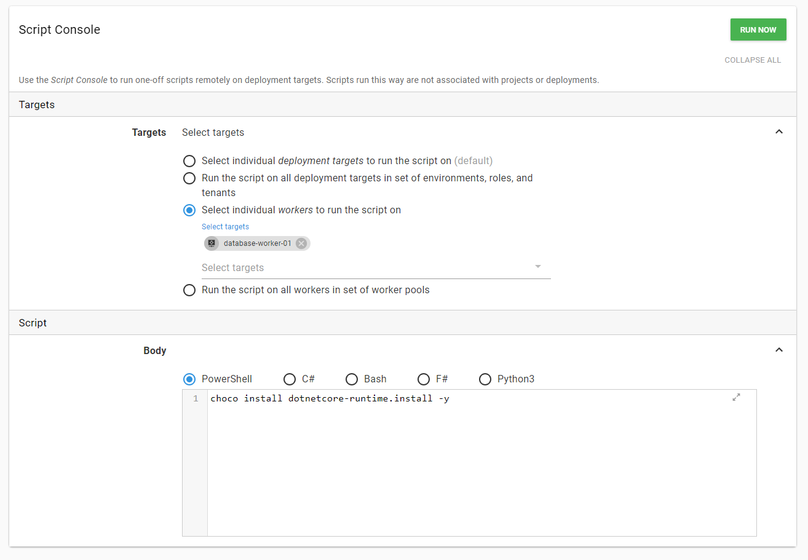

That is successful:

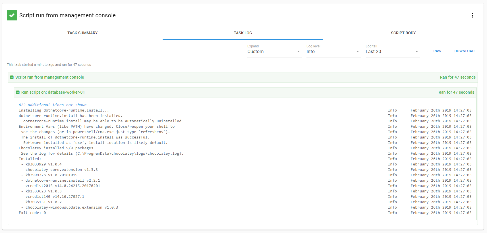

Let’s try that release again.  Hindsight being what it is, I could’ve told it to retry the release, but I decided to create a new one:


This one was successful.  You can see the artifact created by the process.  That is what the DBA will download to review in staging and production:


If we take a look at the database, we see the items were created as expected:

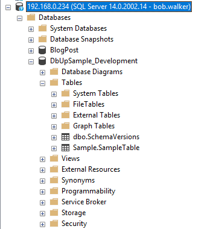

## Integrated security and workers

In this demo, I used SQL Authentication.  However, many of you are using integrated security.  For an additional layer of security, each environment has its own Active Directory service account.  That makes complete sense, and I recommend that approach.  

How can you accomplish this with the current generation of workers?  It is not as straight-forward as it should be (something we are hoping to address in workers v2).  I’ll walk you through the necessary steps to set it up.

To start, we need to create a dedicated worker pool for each environment.


Next, we need to create cloud region deployment targets.  

You need to create a cloud region for each environment.  I created a new role called `DbWorker` for these cloud regions because I want a way to differentiate these new deployment targets:


When I am done, I have four new cloud regions:


I will change the execution location of the process to run on a target with the `DbWorker` role for that environment:


Repeat that same change for each step in the process:


When a new release is deployed to testing the `Test Database Worker Region` is picked:


## Conclusion

Recent modifications made to DbUp help create a robust deployment pipeline for databases.  Now DBAs (and others) can review changes via Octopus Deploy before they are deployed.  Having the ability to review the changes should help build trust in the process and help speed up the adoption.

---

!include <database-deployment-automation-posts>
