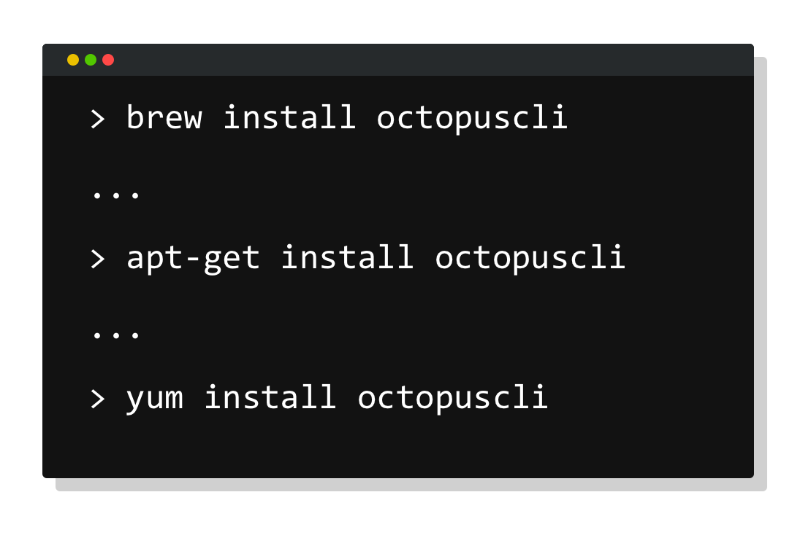
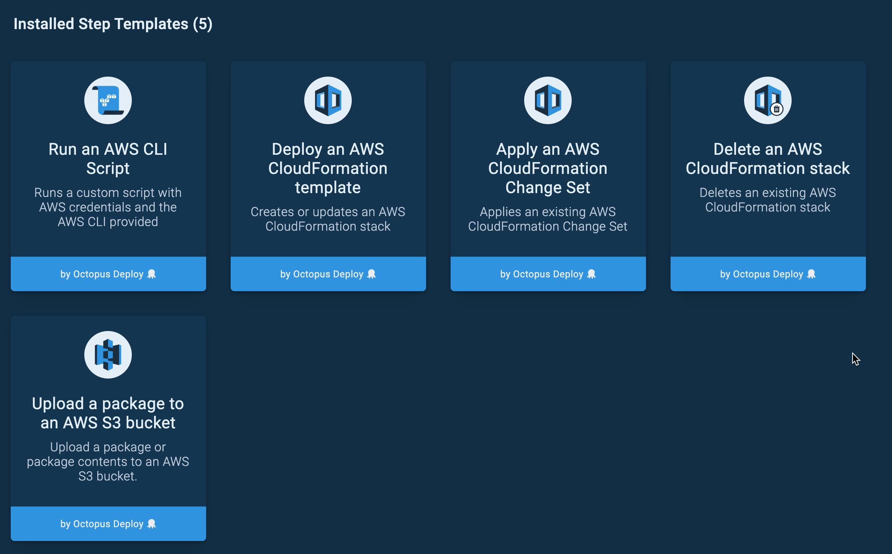
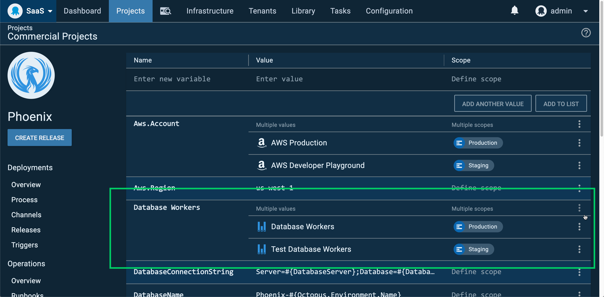

<iframe width="560" height="315" src="https://www.youtube.com/embed/xJqjn4s2VCI" frameborder="0" allowfullscreen></iframe>

**We’ve pulled Octopus 2020.1.x due to a couple of nasty bugs. We’re actively working on them, and we’ll publish the updated release as soon as we’re confident it won’t cause problems.**

---

We're proud to ship Octopus 2020.1, our first release of the year, with some great updates and benefits.

* [Dark Mode 😎](blog/2020-03/octopus-release-2020-1/index.md#dark-mode) is cool and it's easier on your eyes.
* [Octopus and Octopus CLI are more at home on Linux and macOS](blog/2020-03/octopus-release-2020-1/index.md#octopus-and-octopus-cli-are-now-more-at-home-on-linux-and-macos): AWS and Azure built-in steps are cross-platform, and you can now install and use the Octopus CLI via Homebrew, Yum, and APT.
* [Environment and tenant specific worker pools](blog/2020-03/octopus-release-2020-1/index.md#environment-and-tenant-specific-worker-pools): New worker pool variables unlock the ability to have dedicated worker pools for different environments or tenant tags.

This release is the [first of six in 2020](/blog/2020-03/releases-and-lts/index.md), and it includes 6 months of long term support. The following table shows our current releases with long term support. 

| Release               | Long term support           |
| --------------------- | --------------------------- |
| Octopus 2020.1        | Yes                         |
| Octopus 2019.12       | Yes                         |
| Octopus 2019.9        | Yes                         |
| Octopus 2019.6        | Expired                     |

Keep reading to learn more about the updates.

## Dark mode

<iframe width="560" height="315" src="https://www.youtube.com/embed/ZMM8BowrUjQ" frameborder="0" allowfullscreen></iframe>

Developers and operations folks love dark mode, and I'm thrilled to share that Octopus now supports dark mode. It's a cool feature, but it also easier on eyes, helps reduce eye strain, and looks fantastic. 😎

Octopus includes support to detect if your OS is running dark mode and can switch automatically. I highly recommend turning it on for a test drive.

## Octopus and Octopus CLI are now more at home on Linux and macOS

Octopus aims to have world-class support for multiple platforms, including Windows machines, Linux machines, and popular cloud services. This release includes two changes to make Octopus feel more at home on Linux and macOS.

### Octopus CLI available via Homebrew, APT, and YUM

The Octopus CLI, formerly known as `octo.exe`, is a handy and powerful tool that enables teams to interact with Octopus from the command line. It's now available to install quickly and easily via the following platforms and package repositories:

* Chocolatey
* Homebrew
* APT
* YUM
* Docker

The new additions are Homebrew, APT, and YUM so that teams using macOS and Linux can take advantage of this in a more natural way.

[Check it out](https://octopus.com/downloads/octopuscli)

### AWS and Azure deployments work on Windows and Linux machines

Octopus includes numerous popular step templates to deploy to AWS and Azure cloud infrastructure. These steps can now be executed seamlessly on Windows and Linux targets/workers. Further, our Kubernetes steps can now authenticate with AWS and Azure accounts in Octopus on both Windows and Linux targets/workers as well.

This improvement is small but significant to ensure teams can execute their cloud deployments and runbooks on their platform of choice.

Note: Azure Web Apps, Cloud Services and Service Fabric steps are still Windows only.

Learn more:
* [Azure deployments](https://octopus.com/docs/deployment-examples/azure-deployments)
* [AWS deployments](https://octopus.com/docs/deployment-examples/aws-deployments)
* [Kubernetes](https://octopus.com/docs/deployment-examples/kubernetes-deployments)

## Environment and tenant specific worker pools

Workers enable teams to move deployment work off the Octopus Server and onto other machines running in pools. You can create a pool of dedicated workers that can be used for specific deployment work by multiple projects and teams. Common examples are database deployments and deployments to cloud services.

In Octopus 2020.1, we have added support for worker pool variables unlocking the ability to scope worker pools by environment or tenants. For example, you could have a database deployment worker pool dedicated to deployments to your dev and test environments and a larger pool dedicated to deployments to production.

This update was a popular customer request, and we're pleased to ship it.

[Learn more](https://octopus.com/docs/projects/variables/worker-pool-variables)

## Breaking changes

This release includes two breaking changes. 

1. **[Octopus Server minimum requirements](https://octopus.com/blog/raising-minimum-requirements-for-octopus-server)** - We are raising the minimum requirements for running Octopus Server to Windows Server 2012 R2 and SQL Server 2017.
2. **[Library variable set permission changes](https://octopus.com/blog/libraryvariableset-permission-changes)** - You can now scope variables stored inside library variable sets to environments and tenants, giving you fine-grain access control and more consistent permissions.

It's also important to note that Octopus Server has been ported to .NET Core 3.1, thus it longer requires the .NET Framework to be installed.

## Upgrading

Octopus Cloud users are already running this release, and self-hosted Octopus customers can [download](https://octopus.com/downloads/2020.1.0) the latest release now.  

As usual, the [steps for upgrading Octopus Deploy](https://octopus.com/docs/administration/upgrading) apply. Please see the [release notes](https://octopus.com/downloads/compare?to=2020.1.0) for further information.

## What's coming in Octopus 2020.2?

Check out our [public roadmap](https://octopus.com/roadmap) to see what's coming next. We're about to start work on some incredible new features, including deep git integration, unlocking pipeline as code.

## Conclusion

Octopus 2020.1 includes dark mode, cross-platform Azure and AWS step templates, Octopus CLI on Homebrew, APT, and YUM package repositories, and new worker pool variables. This release is an excellent start to the year, and we're working hard to keep shipping a great product.

Feel free to leave us a comment, and let us know what you think! Happy deployments!

## Related posts

- [Introducing dark mode](/blog/2020-03/octopus-dark-mode/index.md)
- [Lessons learned porting Octopus Server to .NET Core 3.1](/blog/2020-03/octopus-server-dotnet-core-lessons-learned/index.md)
