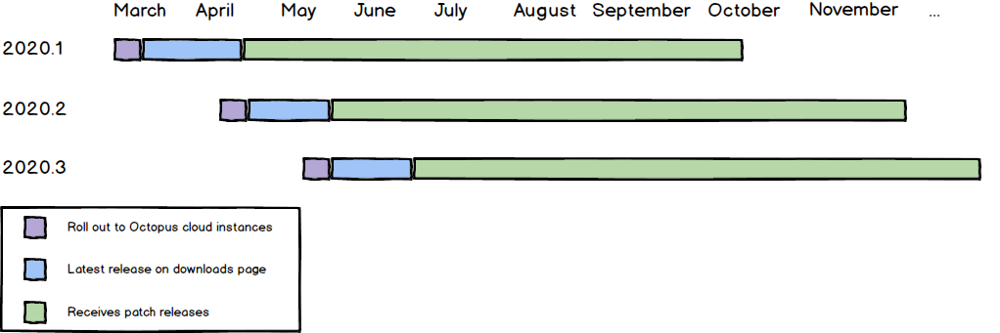

We’re iterating on the way we deliver releases of Octopus Deploy.  The highlights are:

- We will ship six feature releases per year (`2020.1`, `2020.2`, ...).
- Every feature release will receive critical patches for **six months**.
- We will no longer explicitly mark releases as LTS (Long Term Support).
- Releases will be rolled out to Octopus Cloud instances before being made available to download for self-hosted instances.

We are confident that this will result in clearer messaging, even more, stable releases, and a better overall experience for both our customers and us.

These changes take effect immediately. The 2020.1 release is currently being rolled-out to Octopus Cloud instances and will be made available for download very soon.

This release will receive patches (`2020.1.1`, `2020.1.2`, etc.) for the next six months. The next feature release (`2020.2`) will begin roll-out to Octopus Cloud instances in April and will be available for download in early May.

The points above are the key messages to take from this post. But for those interested, read on for a little historical context, and hopefully, a window into our thinking.    

## The challenge of .0 releases

The way a software company makes new releases available is fundamental to the customer relationship. At Octopus, our delivery process has evolved, and while each decision was the rational one at the time, we weren’t satisfied with the current state.

Originally, Octopus only had a self-hosted product (no Octopus Cloud).  For a product that users download and install on their own infrastructure, there is a tension: _the releases you want to make the most noise about are also the least stable_.  The `.0` releases, which contain the new features, are the most exciting but also the most disruptive.  They have the highest installation rates, but they are also the most likely to contain issues.  This is not an ideal combination for our users or for us.  For many of our customers, stability is more important than the latest features, and when they asked, “Which is the most stable release we can upgrade to?” we couldn’t always honestly answer, “The latest.”  So in 2018, the [LTS program](https://octopus.com/blog/long-term-support) was born.      

By marking certain releases LTS we were attempting to give people the choice:

 1. Use the very latest features.
 2. Use the most stable release.

In a sense, the program was successful; it achieved the goal.  But it makes us sad when a large portion of our users don’t have the newest features. We also don’t believe it’s the best experience for new users.  When a user comes to the Octopus downloads page for the first time, we are making them choose between stability and the latest features.  

We want to give them both!

## Extending long term support

We will **no longer designate releases as LTS**. This isn’t removing the LTS program, but rather expanding it to every release. We will **provide six months of patches for every feature release**.  The downloads page on octopus.com will now show a single option to download the latest release (you can still download [previous releases](https://octopus.com/downloads/previous) if necessary).    

But what about the stability of those `.0` releases?  

In 2018 we released [Octopus Cloud](https://octopus.com/docs/octopus-cloud).  This changed the game.   

Perhaps the biggest downside of shipping self-hosted software is that if a release contains an issue, there is no way to automatically upgrade everyone (many of our customers use Octopus in environments without Internet connectivity). It is always painful for us to see users encountering issues that we have already released fixes for. But when _we_ host Octopus, if one user discovers an issue, we can roll-out a resolution to all affected instances immediately, greatly reducing the impact.

For this reason, we are going to **roll-out new releases to Octopus Cloud instances first**.  This allows us to manage the rate of the roll-out (deploying to a small number of instances initially), and to stabilize the release quickly.  When we are confident in the stability of the release, we will deploy to all Octopus Cloud instances and make it available for self-hosted customers to download.

## Better for everyone

We believe this will be an improvement for everyone.    

- Self-hosted users will be able to install the latest release with greater confidence, and they will not have to choose between features or stability.    
- Octopus Cloud users will get access to new features faster.  Previously we announced new features when they became available for download.  At that point, those features were not available on Octopus Cloud instances, and we couldn’t even say exactly when they would be.  From now on, when we announce a new feature, it will be available to all Octopus customers.   
- Any issues that do slip through our testing should impact a smaller number of customers for a shorter duration.

If you have any questions or concerns about these changes, please reach out to us at support@octopus.com.

Happy Deployments!
