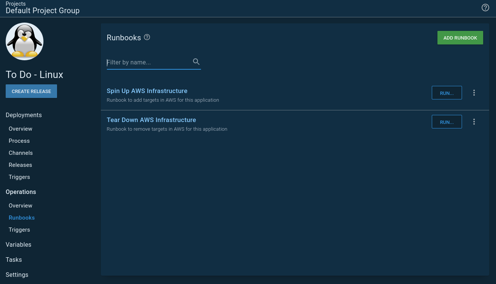
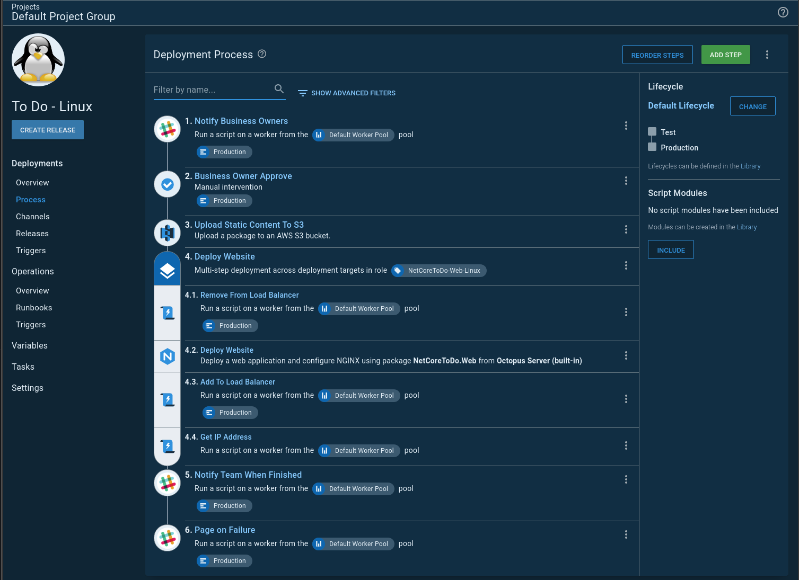
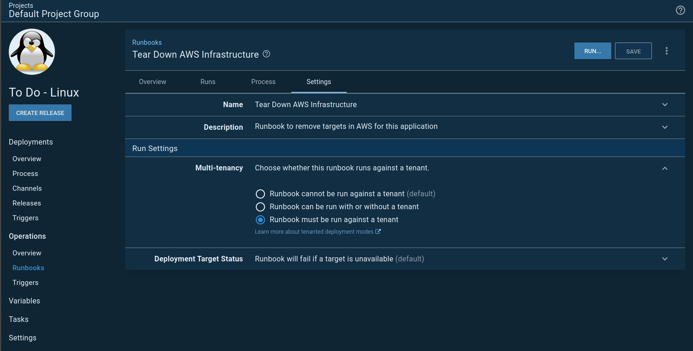

In preperation for the [2020.1 Release Webinar](https://www.youtube.com/watch?v=M5ejzd8KdbQ&feature=youtu.be) I needed to spin up and down infrastructure.  Prior to runbooks I would've had a separate "Infrastructure as Code" project to handle this.  The runbooks feature came out late last year, and I knew it could replace my "Infrastructure as Code" project.  But runbooks are just different enough.  This post walks through some of the lessons I learned in doing a deep dive into the new runbooks feature in Octopus Deploy.

!toc

## Brief Intro to Infrastructure as Code 

I want to ensure everyone is on the same page when I use the term Infrastructure as Code, or IaC.  Infrastructure as Code is when a person models their desired infrastructure in a file, typically written in YAML, JSON, or Hashcorp Language (HCL).  Cloud providers provide a mechanism which ingests that file and provisions your requested infrastructure.  Each cloud provider has its own infrastructure definitions:

- [AWS CloudFormation](https://aws.amazon.com/cloudformation/)
- [Azure ARM Templates](https://docs.microsoft.com/en-us/azure/azure-resource-manager/templates/overview)
- [GCP Deployment Manger](https://cloud.google.com/deployment-manager/docs)

The upside to using the tooling provided by the cloud provider is the support.  Most of them provide the ability for you to define your desired infrastructure using the UI and then export your infrastructure as a file.  Incidentally, this is how I create ARM templates.

The downside is each tool is tied to its specific provider.  All the time and effort spent learning AWS Cloudformation doesn't translate over to Azure ARM Templates.  This is where third party tooling such as [Hashcorp's Terraform](https://www.terraform.io/) is useful.  

## Infrastructure as Code prior to Runbooks

Prior to runbooks my Infrastructure as Code process was a regular deployment process.  I wasn't ever "deploying" anything.  Rather I was running some scripts against a cloud provider.  This led to some quirks.

First up, because it was a deployment process I had to define a lifecycle.  In this example I have two environments, `Test` and `Production`.  However, I needed an environment to tear every thing down.  Which led to my second quirk.  I needed another environment called `Teardown`.

My deployment process was a bit complex.  It had steps which were either:

- Scoped to any environment but `Teardown`
- Scoped to `Teardown`

You will notice in my lifecycle `Test` and `Production` are optional.  This brings me to my next quirk.  Configuring IaC for the first time, be it AWS CloudFormation, Azure ARM Templates, or GCP Deployment Manager, is fraught with trial and error.  A VM is created but the bootstrap script missed something.  Once the bootstrap script is fixed I want to test it.  So I had to rip everything down and try again.  Sometimes the error happened in `Test` and other times `Production`.  I needed a way to get to `Teardown` if the deployment actually failed.  Hence, `Test` and `Production` are optional.

## AWS Region Specific Settings

I am going to be using AWS CloudFormation for this article.  I am going to set up a process to spin up a Ubuntu VM, install a tentacle, and register that tentacle with Octopus Deploy.  After choosing AWS I discovered a fun final quirk.  Each region is segregated.  For the most part, resources cannot be shared between regions.  This includes:

- SSH Keys for VMs
- AMI Images
- Subnets
- Security Groups

That is not an all inclusive list.  I _did not_ want to have an environment per region.  That scales poorly.  But I needed a way to have region specific settings.  Time to levage [Octopus Deploy's multi-tenancy](https://octopus.com/docs/deployment-patterns/multi-tenant-deployments) functionality.  The phrase `Tenants` was chosen for a reason.  A tenant can be

- A customer for a SaaS application
- A sandbox per developer
- A data center
- A AWS Region

Obviously, I picked the last option.

One of my favorite features with tenants is each tenant can have a unique variable value per environment.  This works great the majority of the time.  Except in my IaC example.  I don't want to have to define the same AMI on `Test`, `Production` and `Teardown`.  What I did to get around that particular problem was create a Tenant Tag Set called `AWS Region`.

I did this because tenant tags can be scoped to a variable.  You can access that variable scoping by clicking on the `Open Editor` link.

That will open up a modal window which will allow you to select the tenant tag.

I created a variable set called `AWS`, which I populated with variables I'd need for my CloudFormation template.

## Porting The Deployment Process to Runbooks

I quickly learned I shouldn't do a straight port from a deployment process to runbooks.  I needed to change my thinking on how I configured my IaC process.  My goal with that "Infrastructure as Code" project was to have a single project to spin up and down my infrastructure.  That goal of a single project caused me to make some suboptimal configurations.  

Those suboptimal configurations were:

- The entire concept of a `Teardown` environment and the subsequent lifecycle.
- Having to scope a step to either `Teardown` or run in every environment but `Teardown`.  Essentially I had two processes jammed into one.  
- That `Teardown` environment required me to write scripts to tear down `Test` and `Production` at the same time.  
- Because I needed to tear down everything at the same time, I had to have complex scoping of variables.  

In `Test` and `Production` the variable name for my VM name was something like `[Application Name]-[Component]-[Environnment Abbreviation]`, or `todo-web-t` for the web server for the To Do application.  But for `Teardown` the variable was `[Application Name]-[Component]`.  The script to deregister the targets from Octopus looked at all the targets which started with `[Application Name]-[Component]` and removed each one.  That is a simple example.  When I threw regions into the mix it got more complex.  It took quite a bit of time to come up with a variable template which didn't result in accidentially deleting the wrong target. 

### Split The Process

The first change I made was I split my IaC process into two runbooks.  One runbook spun up the infrastructure, while the other deleted the infrastructure.  

Because of that split I no longer needed the `Teardown` environment. This, in turn, simplified the variables.  I also learned I could scope variables to specific runbooks.  This meant I wasn't passing in unused variables to my deployments.  In other words, I could have simple variables and they were only used for specific runbooks?  Sold!

The process also became easier to wrap my head around.  I wasn't trying to smush together two processes into one.

### Tenants

I still wanted to keep my tenant per region configuration.  However, my sample application isn't multi-tenant.  My application is a small .NET core web application running on NGINX with a NoSQL backend.  It doesn't require anything other than to be split across some regions.  Doing something like Canary deployments or Blue/Green deployments is overkill.

What I wanted was:

- When I deploy to test, deploy to the servers in the `Ohio` region.
- When I deploy to production, deploy to all servers across `Ohio`, `California`, and `Oregon` regions using a rolling deployment.

This is when I found out it is possible for a project to not allow tenanted deployments BUT a runbook can require them.  In my project settings I set it to disable tenanted deployments.

However, I set each runbook to require a tenant.

Because runbooks don't have a lifecycle the overview screen looks a little different than the usual project overview screen you might be used to.

### Spinning up and down infrastructure on a schedule

VMs cost money.  For this example I don't need the VMs running 24/7.  I'd rather have them run during workdays only.  You might have a similar requirement for your testing environments.  If nothing is going to use the VMs, why keep paying money to have them running?

This led me to a slight problem.  The scheduled trigger for runbooks allows me to select 1 to N number of environments.  

When the trigger runs it kicks off two tasks, one for each of my specified environments.  With two environments, that isn't that big of a deal.  But I ran into a wall when I was configuring another example and I wanted four environments.  That is just two projects.  I didn't want to overload my task queue with spinning up and down my infrastructure.  I could schedule the triggers 15 minutes apart.  For example:

- Project A spin up `Development` infrastructure: 6:00 AM
- Project A spin up `Test` infrastructure: 6:15 AM
- Project B spin up `Test` infrastructure: 6:30 AM
- Project A spin up `Staging` infrastructure: 6:45 AM
- Project A spin up `Production` infrastructure: 7:00 AM
- Project B spin up `Production` infrastructure: 7:15 AM

That doesn't scale all that well.  Especially when I add more projects.  And sometimes it takes 5 minutes to spin up the infrastructure.  Sometimes it takes 20 minutes. 

What I wanted was to create a runbook that would spin up all my infrastructure in an orderly fashion.  If you are familiar with JQuery promises, essentially I wanted to chain my promises.  Run one runbook at a time, and when it was done start on the next one.  

You know what's good at waiting for something to finish and then kicking off the next step?  Runbooks.  I needed a way to have a runbook kick off another runbook.  But there is no built-in step to do that.  So I wrote this [step template](https://library.octopus.com/step-templates/0444b0b3-088e-4689-b755-112d1360ffe3/actiontemplate-run-octopus-deploy-runbook).  Now I can have a runbook spin up and down my infrastructure in an orderly fashion.  I called that runbook `Unleash the Kraken`.

I have two scheduled triggers, one to spin up everything, and another to tear everything down.  You'll notice the tear down trigger runs every day while the spin up only runs on the weekends.  That is in case any infrastructure is spun up on the weekends.  

## Conclusion

There are a few changes to go from spinning up infrastructure using a deployment process to a runbook.  All in all, I am happy with making those changes.  Everything feels a lot cleaner.  

My absolute favorite part about runbooks is not having to create a release for each run.  To get my CloudFormation template and bootstrap script right I had to do a lot of runs before landing on something which worked.  Not having to do the release dance was very nice.

This sample is avaiable on our [samples instance](https://samples.octopus.app/app#/Spaces-102/projects/to-do-linux/operations/runbooks) for you to poke around on.  You will need to sign in as a guest.  The guest has read-only permissions to the space.