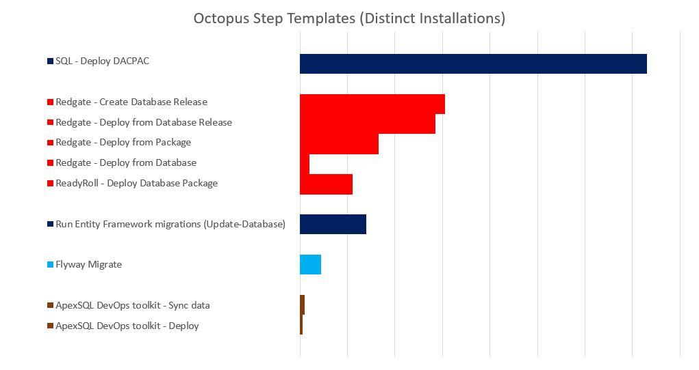
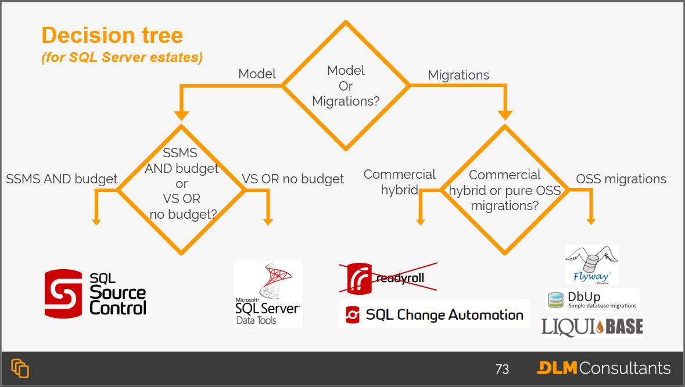

If you have a SQL Server database and you use Octopus Deploy, you have several options with regards to database source control and deployment tooling. This blog post provides a basic overview of the most widely used tools to help you decide which option will best suit your team.

## Model-based and migration-based solutions

Most database source control and deployment tools can be broadly classified as either _model-based_ (aka _state-based_) or _migration-based_.

Model-based tools script out the desired end state of your database schema, typically with a CREATE script for each object. At some point within the deployment pipeline, software will compare the source code with the target database and generate a deployment script.

Migrations-based tools require the user to save an ordered list of migration scripts. The tool will execute them against the target database. Typically, the tool will also add a table to your target databases to log which scripts have been deployed.

Plenty of folks have strong opinions about which is better. It’s a bit of a flame-war, and I don’t intend to get bogged down with that here. However, there are pros and cons to each approach, and if you aren’t aware of what those are, I recommend you read [this blog post](http://workingwithdevs.com/delivering-databases-migrations-vs-state/) before continuing.

## Home-grown solutions

Migrations-based solutions sound deceptively simple to develop in-house. However, home-grown solutions often result in knowledge hoarding, complex and unpredictable deployments, and significant maintenance costs.

Home-grown migrations-based tools are often produced as side-projects and, frankly, it’s unlikely that they will ever be as mature as the countless similar open source migrations-based tools that have been refined over years by an experienced community of maintainers and battle-worn by thousands of developers around the world.

In my ten years working in the database DevOps space, I am yet to see a single example of a home-grown solution working better for an organization than a similar open source or vendor solution. Don’t do it. Use one of the tools in this post instead.

## The most popular tools

It generally pays to use a popular tool. Widely used tools are typically better supported, better documented, and often have active communities where answers can be found. It’s also often possible to recruit folks with prior experience using the tools.

To determine the most widely used tools, I started by examining the relative popularity of various [Octopus Deploy community step templates](https://library.octopus.com/listing), based on some feature usage data kindly provided by the team at Octopus:

This data has limitations. It is entirely possible that people have triggered their database deployment tools through a PowerShell step for example, without using the step template from the library. There are also popular tools, like DbUp, that do not have step templates. That said, the relative popularity of the step templates above matches my real word experience.

In this post I’ll discuss DbUp and each of tools above, apart from ApexSQL which has fewer users.

## SSDT

**Type:** Model-based

The most popular step template listed above deploys DacPacs. These are the build artifacts generated from a Visual Studio Database Project with [SQL Server Data Tools](https://visualstudio.microsoft.com/vs/features/ssdt/) (SSDT).

SSDT is built by Microsoft and comes out of the box with Visual Studio (VS), so assuming your developers have appropriate MSDN licenses, it’s essentially free. That makes it the natural solution for most regular VS users. However, for database developers and DBAs who are more familiar with SQL Server Management Studio (SSMS), VS can be pretty confusing.

A Visual Studio Database Project feels a bit like a .NET project, complete with a solution and project file. Hence, this will probably be a natural fit for most .NET developers but is likely to be confusing to any SQL Server specialist with limited .NET experience. Also, some people get frustrated at the constant hopping between SSMS and VS.

As a state-based tool it provides many of the productivity benefits of declarative database development, but sometimes the auto-generated deployment scripts can do painful things like dropping data or rebuilding indexes on giant tables. These issues might only be spotted when deployed to big production databases for the first time.

SSDT does have some hybrid features to catch these issues, like the Refactor Log and Pre-Deployment and Post-Deployment Scripts, but these often become a pain to manage over time.

**Best thing:** De facto standard for SQL Server, the build process in Visual Studio, SQL Environment Variables.

**Worst thing:** Managing complicated refactors in bulging pre/post-deployment scripts, managing dependencies.

## Redgate
Redgate supports two types of SQL Server source control project. Both project types can be deployed using a PowerShell module called SQL Change Automation:
* [SQL Source Control](https://www.red-gate.com/products/sql-development/sql-source-control/) is a plugin for SSMS that creates a model-based project for your database.
* The [SQL Change Automation](https://www.red-gate.com/products/sql-development/sql-source-control/) (SCA) VS and SSMS plugins create a migration-based project for your database. However, while SCA projects are primarily migrations-based, they have several powerful hybrid features. This makes SCA projects the truest hybrid migrations-based and model-based tool available at the time of writing.

### SQL Source Control Projects

**Type:** Model-based

SQL Source Control is almost certainly the most popular SQL Server source control tool after SSDT. The primary difference between SQL Source Control and SSDT is that rather than being built into VS, it’s built into SSMS. This makes it significantly simpler to use for SQL Server developers and DBAs who spend most of their time in SSMS. No more hopping between IDEs.

Deployment is handled through the SCA PowerShell module, and there are some excellent step templates that make setting up your Octopus Deploy projects relatively straight-forward. The diff reports are really handy too. Check out [Bob’s recent post](https://octopus.com/blog/database-deployment-automation-using-redgate-sql-change-automation) for more info on this.

I’ve written [a much more detailed account of the differences between SSDT and SQL Source Control here](https://www.brentozar.com/archive/2018/12/comparison-review-microsoft-ssdt-vs-red-gate-sql-source-control/), and there’s also a [30-page whitepaper on the topic](https://dlmconsultants.com/redgate-vs-ssdt/).

**Best thing:** Usability, integration with SSMS, release diff reports.

**Worst thing:** Price, managing complicated refactors.

### SQL Change Automation (SCA) Projects

**Type:** Migration-based / Hybrid

At the time of writing, SCA projects (previously called ReadyRoll projects) are, hands-down, the most advanced SQL Server project types around. They aim to give you the best bits of both a model-based and migrations-based tool. This does add some complexity, so there’s a bit of a learning curve, but SCA generally delivers on its promises.

SCA is primarily a migrations-based tool, but because it comes from Redgate, it’s got schema comparison and script generation built in. It’s also built on top of SSDT, so you inherit a lot of the best SSDT features for free (pre/post-deploy scripts, SQL environment variables, etc). And it comes with plugins for both SSMS and VS so you can use whichever IDE you prefer.

The basic principle is that once you’ve completed some development work on a dev database, you click a button, and SCA will generate your script and add it to your project. If the generated script has done something a bit silly, like dropping a column, you can edit it before committing to source control.

Since stored procedures and functions are often a nightmare to manage with migrations-based tools due to overwrites, all the _programmable objects_ are extracted into a separate part of your project where they are treated as a mini model-based subproject. This also helps to reduce the total number of migration-scripts, making the migrations-based part easier to manage. That’s the two biggest issues with migrations-based projects avoided/reduced.

One of the other challenges with migration-based tools is spotting conflicts. SCA offers a handy solution by keeping a _schema model_ in another mini subproject, with create scripts for all your tables. If two migration scripts update the same table, you’ll see a merge conflict in the schema model. The schema model also acts as a handy reference point for the desired end state, despite the fact it’s not used for deployment.

This hybrid approach does have some flaws. It’s more complicated so there’s a learning curve, and baselining existing projects isn’t very easy. Also, if you use a stored procedure within any of your migrations scripts, you can hit some complicated race conditions with the stored procedure updates always being applied last, but that’s a bit of an edge case for most teams.

Frankly, the biggest issue with SCA is that you need to ask someone for budget. Unlike all the other tools listed in this blog post, the Redgate tools aren’t free.

**Best thing:** Best hybrid solution, providing the benefits of both a model-based and a migrations-based solution.

**Worst thing:** Price, Complexity.

## Entity Framework (EF) Migrations

**Type:** Migration-based

[Entity Framework](https://docs.microsoft.com/en-us/ef/) (EF) Migrations is the default deployment solution that comes out of the box for folks using EF, the most popular Object-Relational Mapping (ORM) tool for .NET/SQL Server.

The main consideration with EF migrations isn’t the deployment functionality itself, it’s whether you want to use an ORM tool at all. If you ask most .NET developers, they’ll probably love it. If you ask most DBAs, they’ll probably hate it. It’s another age-old flame-war.

EF, especially if running code-first rather than database-first (as most people do), abstracts away the complexity of dealing with database objects for .NET developers, which makes it much easier for them to develop their .NET applications. This makes EF vary popular with developers who don’t have a lot of SQL Server experience or knowledge.

However, the developers tend to get poor feedback about the code that ends up being pushed to the database. The combination of developers with limited SQL Server experience and poor feedback about the code often results in queries that make DBAs very unhappy.

Certainly, ORMs are popular in the .NET community, but approach with caution. And, with my DevOps hat on, make sure you remember to optimize for the whole value stream, rather than an individual developer or team/silo, at the expense of downstream workers.

**Best thing:** ORMs.

**Worst thing:** ORMs.

## Flyway

**Type:** Migration-based

[Flyway](https://flywaydb.org/) is an open source, migrations-based tool. Originally written by [Axel Fontaine](https://twitter.com/axelfontaine), it was [recently acquired by Redgate](https://tech.eu/brief/redgate-acquires-flyway-for-10-million/). While it’s not the most widely used tool for SQL Server, it’s hugely popular in the open source community.

It’s a Java application, which might seem a little odd for a SQL Server deployment tool, but that’s because, unlike the other tools in this blog post, from the start Flyway was designed to be cross-platform. Flyway users could be running MySQL, Postgres, Oracle or any of the other of the twenty or so RDBMSs that Flyway supports. This makes it a popular choice for shops that support multiple relational databases.

Using it is relatively simple compared to most similar tools: download, update the config file with your connection string, and drop your scripts into the `flyway-[version]/sql` directory. Then open the command prompt, and enter `flyway migrate`.

That said, it does not have a comparison engine built-in. That means it can’t generate your deployment scripts for you. You’ll need to create them by hand or use a database comparison tool.

Flyway is the Marie Kondo of database migration tools.

**Best thing:** Cross platform support, simple – no bells and whistles.

**Worst thing:** Java, no bells and whistles.

## DbUp

**Type:** Migration-based

[DbUp](https://dbup.github.io/) is another open source migration tool that’s very popular, especially with Octopus Deploy users. That’s probably got a lot to do with the fact that it was written by [Paul Stovell](https://twitter.com/paulstovell). If you are an Octopus Deploy user, you’ve almost certainly used it too because it’s wrapped into the Octopus Deploy installer. How do you think your Octopus Deploy database was deployed?

DbUp is a .NET library that you add to your own .NET apps, which explains why there is not a step template for it.

Like Flyway, DbUp doesn’t come with any clever comparison tooling or fancy features. It’s deliberately a plain, simple migrations runner. All the work of creating and managing those upgrade scripts is up to you.

**Best thing:** Simple/customizable, .NET.

**Worst thing:** Requires some C# skills.

## And the rest…

There’s a long tail of other solutions. Some people might be annoyed I didn’t include more vendor tools like [Idera](https://www.idera.com/productssolutions/it-database-management-tools#DESIGNModelsandDatabases), [ApexSQL](https://www.apexsql.com/), [DBmaestro](https://www.dbmaestro.com/), or any of the zillions of the other open source migration script runners like [Liquibase](https://www.liquibase.org/), [RoundhousE](https://code.google.com/archive/p/roundhouse/downloads), or [DBDeploy](http://dbdeploy.com/).

As stated above, my aim was to list the most popular options. Based on the data provided by Octopus and my personal experience, the tools listed in this blog post are the tools that I believe are most popular for SQL Server deployment among Octopus Deploy users.

## Conclusion

None of the tools are perfect. They all have their challenges, but they also all have advantages. Almost certainly, however, in almost all cases you would be better off using one of these tools than creating your own database deployment framework. 

Which tool is the best suited for your environment? Well, it depends. But here is a decision tree from one of [DLM Consultants’ 2-day Database DevOps training classes](https://dlmconsultants.com/dlm-workshops/) to prompt some discussion amongst your team:

Have you had any positive or negative experiences using any of the tools above? Have you tried any other tools? If so, drop a comment below. I’d love to hear your thoughts.

---

Alex Yates has been helping organisations to apply DevOps principles to their data since 2010. He’s most proud of helping Skyscanner develop the ability to  [deploy 95 times a day](https://www.youtube.com/watch?v=sNsPnCv7hHo) and for supporting the United Nations Office for Project Services with their release processes. Alex has worked with clients on every continent except Antarctica – so he’s keen to meet anyone who researches penguins.
 
A keen community member, he co-organises [Data Relay](https://datarelay.co.uk/), is the founder of [www.SpeakingMentors.com](http://www.speakingmentors.com/) and has been recognised as a  [Microsoft Data Platform MVP](https://mvp.microsoft.com/en-us/PublicProfile/5002655?fullName=Alex%20Yates) since 2017.
 
Alex is the founder of [DLM Consultants](https://dlmconsultants.com/), an official Octopus Deploy partner. He enjoys mentoring, coaching, training and consulting with customers who want to achieve better business outcomes through improved IT and database delivery practices.
 
If you would like to work with Alex, email: [enquiries@dlmconsultants.com](mailto:enquiries@dlmconsultants.com) 