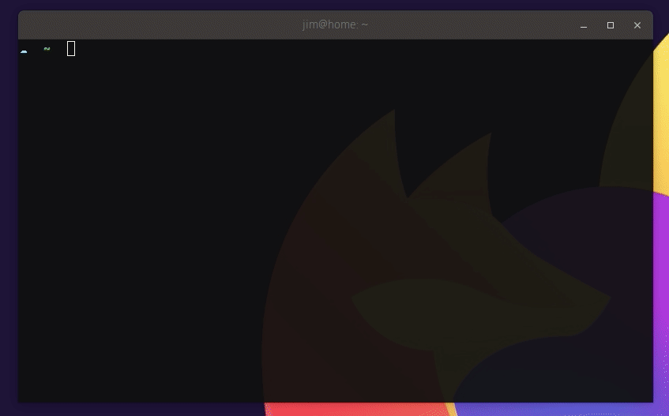
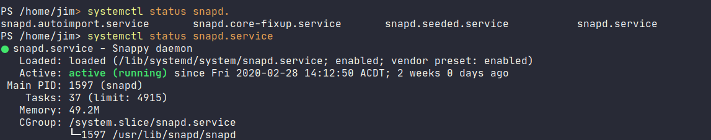

As a developer, I like my IDE and text editors to provide useful hints when I'm doing a lot of typing. This not only speeds me up when I know what I'm trying to do, but it also speeds me up _when I'm learning_ how to use a tool or framework feature. Thinking back, I probably owe the speed at which I picked up C# programming to features like IntelliSense.

I was recently a bit frustrated with our own [Octopus CLI](https://octopus.com/downloads/octopuscli) because I had to flip between my shell and a browser to check what flags I needed to pass.

Why should my command-line experience be any different from Visual Studio? I can't remember the exact CLI invocations at the best of times, let alone when I'm under pressure to fix something!

## Shell completion to the rescue

The good news is that for a small upfront investment, you can tune your command-line experience to give these kinds of hints and automatically complete phrases and options for you, and CLI creators can make changes to their products to make things even easier.

The result of my frustration is some additional features in our CLI to support and configure tab completion in popular shells.

If you grab the latest version of Octopus CLI, you can install the required scripts into popular shells too:

```powershell
# install into your ~/.zshrc
octo install-autocomplete --shell zsh

# install into your ~/.bashrc
octo install-autocomplete --shell bash

# install into your pwsh $PROFILE
octo install-autocomplete --shell pwsh

# using legacy powershell on windows?
octo install-autocomplete --shell powershell

# unsure? do a dry run first and show the result without saving
octo install-autocomplete --shell bash --dryRun
```

Once installed, just dot source or restart your shell and you can complete all the things! Here it is in action:



## How does tab completion work?

At a high level, most of your favorite shells provide _built-in_ commands to accept suggestions from an external source, like a file, or another application. This means you can [write them for any command-line tool](https://www.cyberciti.biz/faq/add-bash-auto-completion-in-ubuntu-linux). These built-ins all work in roughly the same way:

1. Register a command to invoke when the tab key is encountered.
2. Process the text input prior to the tab key.
3. Read in suggestions from a source (list, other command).
4. If there are multiple suggestions, display the choices to the user. Some shells even allow the user to choose one!
5. If there is a single suggestion, use that.

Systemd has built-in completion support for `bash` and `zsh` but not for `pwsh`. So, let's make it happen! A small example is the sub-command `systemctl status` which takes a single service by name and shows you its status.

In `zsh` and `bash`, I get tab completion over the possible services to show, so let's implement a similar thing in `pwsh`.

We can get `pwsh` to use this list whenever the `tab` key is hit to provide hints to us with the following script:

```powershell
# Register our script block against usages of systemctl
Register-ArgumentCompleter -Native -CommandName systemctl -ScriptBlock {
  # Declare the expected parameters for this feature
  param($wordToComplete, $commandAst, $cursorPosition)

  # Split the incoming words into an array
  $words = $commandAst.ToString() -split ' '

  # The first word is our sub-command
  $subCommand = $words[0]

  # The last word is our search term
  $searchTerm = $words[-1]

    # if the status sub-command was chosen
    if ( $words -eq 'status' ) {

      # Find all enabled unit file names
      $services = systemctl list-unit-files | grep enabled | cut -d' ' -f1

      # Find some suggestions based on our search term
      $suggestions = $services | select-string $searchTerm

      # Provide parameter name suggestions to pwsh
      $suggestions | % {
        [System.Management.Automation.CompletionResult]::new($_, $_, 'ParameterName', $_)
      }
    }
}
```

If we write this to `$PROFILE` and then 'dot source' it with `. $PROFILE` you'll see you can now get completion over any enabled services.



## What does Octopus CLI do to make this easy?

The above example requires me to do work up front to handle suggestions. What if `systemctl` itself, having the best knowledge of its sub-commands, provided those completions instead? This is what tools like `dotnet`, `nuke`, and `octo` do; they provide a subcommand of their own to handle the suggestions side of things. You can try this out with the latest version of Octopus CLI:

```powershell
octo complete list

# returns subcommands starting with 'list'
list-deployments
list-environments
list-latestdeployments
list-machines
list-projects
list-releases
list-tenants
list-workerpools
list-workers
```

This makes the registrations above much simpler. Now, they can look more like this:

```powershell
Register-ArgumentCompleter -Native -CommandName octo -ScriptBlock {
    param($wordToComplete, $commandAst, $cursorPosition)

    $parms = $commandAst.ToString().Split(' ') | select -skip 1

    # throw everything at `octo complete` and let it figure things out
    octo complete $parms | % {
        [System.Management.Automation.CompletionResult]::new($_, $_, 'ParameterName', $_)
    }
}
```

## Wrapping up

Shell completion is a great time-saver, and you can write support for it in your own tools, or build support for existing ones.

Tell us how you're using Octopus CLI in the comments! What tools do you wish were easier to use at the command line?

Octopus CLI is now able to help you hook this up really quickly in your favorite shell. Enjoy!
