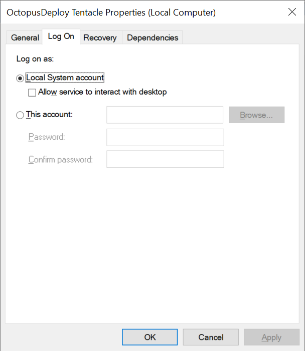
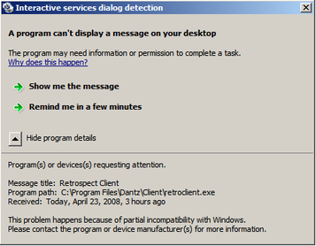

End to end testing by simulating user interaction through a web browser has become increasingly commonplace. WebDriver is now an [open W3 standard](https://www.w3.org/TR/webdriver/), and all major web browsers provide a WebDriver interface. Recent projects like [Cypress](https://www.cypress.io/), have implemented their own method of interacting with browsers specifically for the purpose of writing tests. With such a range of well supported and mature testing platforms, it has never been easier to write browser-based tests.

However, there are some considerations to take into account when running browser-based tests in an automated CI/CD environment. In this blog post, we look at how to run these tests and the limitations of testing environments.

## Windows interactive services

Before we dive into using Windows for interactive testing, it is worth understanding the history of interactive services.

If you have ever configured a Windows service, you may have noticed the `Allow service to interact with the desktop` option:



Back with Windows XP, this option allowed a Windows service to draw on the desktop of the first logged in user, who was assigned session 0. This wasn’t ideal from a security point of view, leading to exploits like the [Shatter attack](https://en.wikipedia.org/wiki/Shatter_attack).

To solve this vulnerability, Windows Vista introduced a change that ran services in session 0 and users in sessions 1 and above. This meant that users were no longer exposed to any interfaces drawn by services, which created backward compatibility issues for services that expected a user to interact with a dialog prompt.

The Interactive Services Detection service was created to facilitate interaction with these prompts, displaying messages like this:



It was also possible to switch to session 0 with the command `rundll32 winsta.dll,WinStationSwitchToServicesSession`.

However, the latest versions of Windows 10 have [removed the Interactive Services Detection service](https://support.microsoft.com/en-au/help/4014193/features-that-are-removed-or-deprecated-in-windows-10-creators-update) and disabled any access to session 0. This means users are now completely isolated from interactive services without [third party workarounds](https://kb.firedaemon.com/support/solutions/articles/4000106823-manually-enabling-interactive-services-interactive-service-detection-and-session-0).

Also, the option to allow services to interact with the desktop is [disabled by default](https://docs.microsoft.com/en-us/windows/win32/services/interactive-services) via the `NoInteractiveServices` registry key.

The bottom line is that while Microsoft has never officially said running interactive services is unsupported or depreciated, all changes to Windows affecting interactive services have been to limit or disable their use. Even if you do manage to implement an interactive service today, it is unwise to assume that it will continue to work in the future.

## Headless browsers to the rescue

The concept of a headless browser was popularized by PhantomJS. This allowed automated tests to be run in non-interactive environments.

Since then, Chrome/Chromium and Firefox have added support for headless modes. With headless support in mainstream browsers, PhantomJS became redundant and is [no longer maintained](https://groups.google.com/forum/#!topic/phantomjs/9aI5d-LDuNE).

Still, there are a good number of browsers like Internet Explorer and Edge that do not (and probably never will) support headless mode. Nor does headless mode provide a solution for testing desktop application user interfaces or capturing screen recordings. So what options are available when you need a _real_ desktop for tests?

## Windows interactive agents

For Windows, we can look to the Azure DevOps interactive agents for guidance on how Microsoft supports running tests on a real desktop. Microsoft’s solution is to configure a Windows machine with [auto-logon](https://support.microsoft.com/en-au/help/324737/how-to-turn-on-automatic-logon-in-windows), and then run the agent launching UI tests on startup. In this way, the applications being tested appear on a regular user’s desktop.

But this solution is [not without its risks](https://github.com/MicrosoftDocs/vsts-docs/blob/master/docs/pipelines/agents/agents.md#interactive-or-service):

> There are security risks when you enable automatic logon or disable the screen saver because you enable other users to walk up to the computer and use the account that automatically logs on. If you configure the agent to run in this way, you must ensure the computer is physically protected; for example, located in a secure facility.

A similar solution for Octopus is to run the Tentacle on startup with the following command (replace the `instance` name with the name of your local Tentacle):

```
"C:\Program Files\Octopus Deploy\Tentacle\Tentacle.exe" run --instance="Tentacle"
```

## Linux headless desktops

Linux users have more flexibility to run applications in headless environments with [xvfb](https://www.x.org/releases/X11R7.6/doc/man/man1/Xvfb.1.xhtml). Xvfb emulates a dumb framebuffer using virtual memory, meaning all applications are rendered into memory without needing any display hardware.

We’ve used xvfb to create the [Octopus Guides](https://octopus.com/blog/devops-documentation) by configuring a complete Linux desktop environment in which the browsers are launched. This [webdriver](https://github.com/OctopusDeploy/WebDriverTraining/blob/master/docker/webdriver) script shows how xvfb is launched, and the `DISPLAY` environment variable is defined to make this happen.

## Off-site testing

There are many services like Browserstack or Sause Labs that provide automated testing as a service. By controlling remote browsers, you are no longer responsible for configuring the underlying operating system, and most will offer features like video recording.

## Conclusion

Headless browsers should be your first choice when running automated tests on remote systems. Linux users can take advantage of xvfb to run applications on a headless desktop. But if you need a real desktop to test applications in Windows, enabling auto-logon and running agents or Tentacles on startup is the best solution.

You may have some luck using interactive services, but this option is fragile, given the moves by Microsoft to limit and disable interactive services with each update of Windows.
