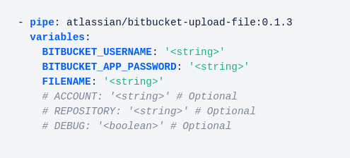

When I first started at Octopus Deploy, I never really knew much about [Bitbucket](https://bitbucket.org/product). I naively assumed it was just Atlassian's version of Source control. As I found out recently, it's much more than that, and offers (amongst other things) a cloud-based continuous integration solution - [Bitbucket Pipelines](https://bitbucket.org/product/features/pipelines). 

We've written previously about Bitbucket pipelines and how they can help streamline your continous delivery process through the use of [containers](https://confluence.atlassian.com/bitbucket/use-docker-images-as-build-environments-792298897.html). If you aren't familiar with Bitbucket pipelines, I'd recommend having a read of the posts:

 - How to guide - [Setting up a CI/CD pipeline with Bitbucket and Octopus](https://octopus.com/blog/continuous-delivery-bitbucket-pipelines)
 - Container redux - [Using the Octopus CLI containers in your pipeline](https://octopus.com/blog/bitbucket-pipelines-redux)
 
 As part of the Customer Success team, we get to talk to our customers and understand how they are using Octopus. Over time, that experience has taught us that when someone has a particular problem to solve, having a concrete sample to show is helpful for everyone. 
 
 In this post, I'll describe my journey to do just that, with the next evolution in Bitbucket pipelines; [Pipes](https://bitbucket.org/product/features/pipelines/integrations). I create a pipe for an [Octopus CLI](https://g.octopushq.com/OctopusCLI) command and integrate this into a Bitbucket pipeline for our Sample node.js application - [RandomQuotes-Js](https://bitbucket.org/octopussamples/randomquotes-js), and finally deploying it using Octopus.

<h2>In this post</h2>

!toc

## What are Bitbucket Pipes?

Before we dive right in, its important to understand what pipes are, and how they fit into a Bitbucket pipeline. 

Atlassian [says](https://confluence.atlassian.com/bitbucket/learn-about-pipes-978200267.html):

> Pipes provide a simple way to configure a pipeline. They are especially powerful when you want to work with third-party tools. Just paste the pipe into the yaml file, supply a few key pieces of information, and the rest is done for you. You can add as many pipes as you like to your steps, so the possibilities are endless!

Pipes build on the core concept of pipelines; containers. A pipe makes use of a script that lives inside of a [Docker](https://www.docker.com/) container. It typically has the commands that you'd have written in your pipeline yaml file before you used a pipe.

### Example Pipe usage

This is what the Atlassian [bitbucket-upload-file](https://bitbucket.org/product/features/pipelines/integrations?p=atlassian/bitbucket-upload-file) pipe would look like in your pipeline yaml file:



where: 
 - `atlassian/bitbucket-upload-file:0.1.3` is the name of the Docker [image](https://hub.docker.com/r/bitbucketpipelines/bitbucket-upload-file) containing the pipe to run.
 - `BITBUCKET_USERNAME` is an example of a variable that you would to provide a value for the pipe to use when executing inside of the container.

 :::hint
**Referring to a Pipe in a pipeline step:** 

There are 2 ways you can refer to a pipe in a step within a pipeline:

1. Refer to the docker image directly:
```
pipe: docker://<Docker_Account_Name>/<Image_Name>:<tag>
```

2. Refer to a pipe repository hosted on Bitbucket:
```
pipe: <Bitbucket_account>/<Bitbucket_repo>:<tag>
```

This method looks for the location of the Docker image from the `pipe.yml` file within the referenced `<Bitbucket_account>/<Bitbucket_repo>` pipe repository.
 :::

### Why are they useful?

So why go to the trouble of writing a pipe at all? 

Well, Pipes are all about **re-use**. They allow you to repeat the same action in multiple steps of your pipeline.  By centralising the core of your action into a pipe, you end up with a simpler pipeline configuration. Another key feature of a pipe versus directly scripting in your pipeline is the ability to include dependencies that your main pipeline doesn't require.

## Creating a Bitbucket pipe

 How to create a pipe is well [documented](https://confluence.atlassian.com/bitbucket/how-to-write-a-pipe-for-bitbucket-pipelines-966051288.html) on Atlassian's website. Rather than repeating their instructions, I'll focus on some of the key steps I took. I created this pipe using my Octopus work laptop running [Ubuntu 18.04.4](http://releases.ubuntu.com/18.04.4/)


### Choosing a candidate for a pipe

I've often heard people say that naming something is the hardest thing when it comes to Software, and the same was true for choosing a command to wrap up in a pipe. However in most CI/CD pipelines, once you have built and run any tests on your code, you probably want to package up your applications. So it felt pretty natural to choose the Octopus CLI [pack](https://octopus.com/docs/octopus-rest-api/octopus-cli/pack) command to create a pipe for.

The added bonus was that the `pack` command only has a few required parameters, and the optional ones could be tackled later.

There are 2 types of pipe that you can author:
 - Simple
 - Complete

I opted for a **Complete** pipe so that I could publish it and make use of it in other repositories.
 
### Creating the pipe repository

Next up, I needed to create a new [octopusdeploy/pack](https://bitbucket.org/octopusdeploy/pack) git repository in Bitbucket, and then I cloned it locally.

:::hint
For further information on creating a new Git repository, please see the Atlassian [documentation](https://confluence.atlassian.com/bitbucket/create-a-git-repository-759857290.html).
:::

### Create pipe skeleton

Atlassian provides a method to generate a skeleton of a pipe repository using [Yeoman](http://yeoman.io/). Once you have all the pre-requisites (`nodejs` and `npm`) installed, from a terminal window you can run the generator using the `yo` command:

```bash
yo bitbucket-pipe
```
This will prompt you to select which pipe you want to create. I chose the **New Advanced Pipe (Bash)** option.


You will be asked some questions to answer - this is all to help fill in the metadata and other useful information for consumers of the pipe. Once complete, it will generate the required files you need to get started:


Once you have all of the files, you'll likely want to edit the following ones to suit your pipe:

 - [bitbucket-pipelines.yml](#creating-the-pipe-pipeline)
 - [Dockerfile](#creating-the-pipe-Dockerfile)
 - [LICENSE.txt](#creating-the-pipe-LICENSE)
 - [pipe.yml](#creating-the-pipe-definition)
 - [pipe/pipe.sh](#creating-the-pipe-bash-script)
 - [README.md](#creating-the-pipe-readme)

:::hint
**Tip: ** Check other repositories to see how they have written their pipe!

One of the great things about every Bitbucket pipe is that the code is public, so you can browse it. For example you can view the source code for the `bitbucket-upload-file` pipe on [Bitbucket](https://bitbucket.org/atlassian/bitbucket-upload-file/).

This is a really great way to see how other authors have structured their pipes.
:::

### Creating the pipe pipeline

### Creating the pipe Dockerfile

### Creating the pipe LICENSE

### Creating the pipe bash script

The pipe I chose using the generator was a `bash` one. This created a `pipe/pipe.sh` file for me. 

### Creating the pipe README


## Testing the pipe

 - BATS

## Publishing the pipe

 - Dockerfile
 - bitbucket-pipelines.yml

## Integrating the pipe into a pipeline

## Integrating the pipeline with Octopus

## Conclusion

Once I'd got to grips with writing bash, creating my first Bitbucket pipe was pretty straight forward. I can definitely see the advantages of creating a pipe in Bitbucket. That being said, it's important to point out that your pipe shouldnt try to do too much. It's tempting to try to cram as much as you can into a pipe. By doing this you end up fighting against the single biggest advantage that pipes offer; re-use.

## Learn more
 - Pipe authoring - [Advanced techniques for pipe writing](https://confluence.atlassian.com/bitbucket/advanced-techniques-for-writing-pipes-969511009.html)
 - Take a peek at our first *experimental* pipe - [pack](https://bitbucket.org/octopusdeploy/pack/src/master/README.md)
 - View the sample `bitbucket-pipelines.yml` for [RandomQuotes-Js](https://bitbucket.org/octopussamples/randomquotes-js/src/master/bitbucket-pipelines.yml)
 - Take a look at the Octopus [sample](https://samples.octopus.app/app#/Spaces-104/projects/randomquotes-js) project.
 - Guides - [Octopus CI/CD pipeline Guides](https://octopus.com/docs/guides)

Feel free to leave a comment, and let us know what you think about Bitbucket pipes, pipelines or container-based build chains!