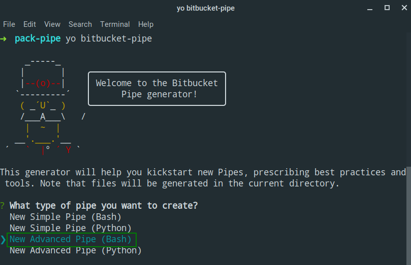
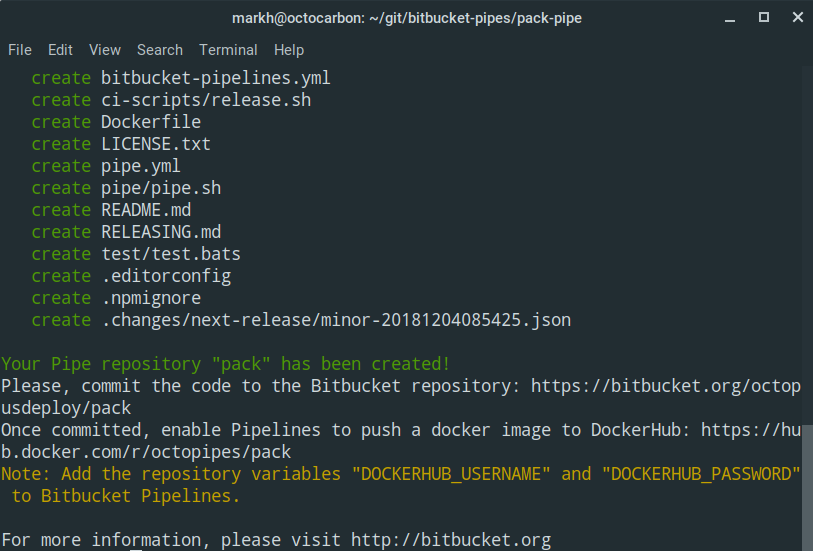
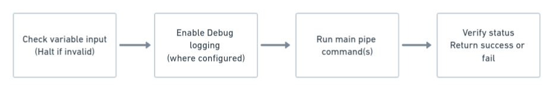
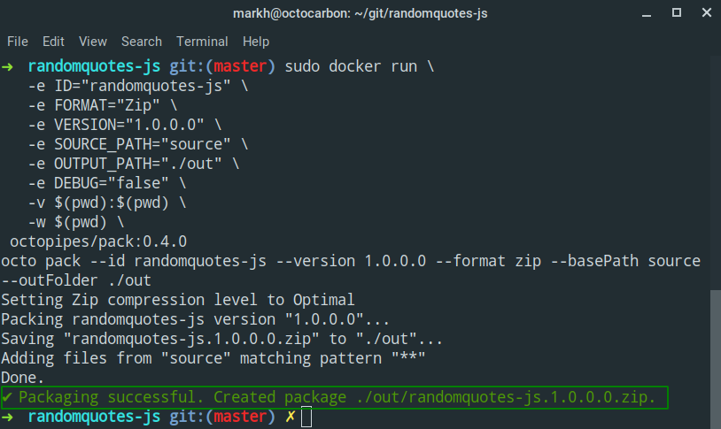
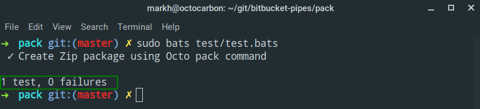
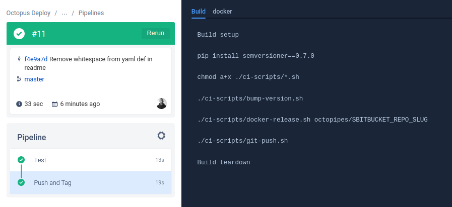
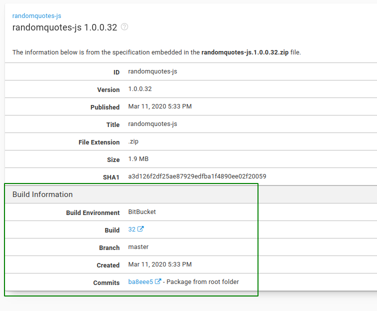

Atlassian’s [Bitbucket Pipelines](https://bitbucket.org/product/features/pipelines) is a lightweight cloud continuous integration server that uses pre-configured Docker containers, allowing you to define your infrastructure as code. [Pipes](https://bitbucket.org/product/features/pipelines/integrations) let you add configuration to your Pipelines and are particularly useful for third-party tools.

In this post, I create an experimental Pipe for an [Octopus CLI](https://g.octopushq.com/OctopusCLI) command, use it in a Bitbucket Pipeline for our sample node.js application [RandomQuotes-Js](https://bitbucket.org/octopussamples/randomquotes-js), and finally, integrate the Pipeline with Octopus.

<h2>In this post</h2>

!toc

## What are Bitbucket Pipes?

Atlassian [says](https://confluence.atlassian.com/bitbucket/learn-about-pipes-978200267.html):

> Pipes provide a simple way to configure a pipeline. They are especially powerful when you want to work with third-party tools. Just paste the pipe into the YAML file, supply a few key pieces of information, and the rest is done for you. You can add as many pipes as you like to your steps, so the possibilities are endless!

Pipes build on the core concept of Pipelines, containers. A Pipe makes use of a script that lives inside of a [Docker](https://www.docker.com/) container, and it typically has the commands you’d write in your pipeline YAML file before pipes were available.

## Example Pipe usage

This is what the Atlassian [bitbucket-upload-file](https://bitbucket.org/product/features/pipelines/integrations?p=atlassian/bitbucket-upload-file) Pipe looks like in your Pipeline YAML file:

```yaml
- pipe: atlassian/bitbucket-upload-file:0.1.3
  variables:
    BITBUCKET_USERNAME: '<string>'
    BITBUCKET_APP_PASSWORD: '<string>'
    FILENAME: '<string>'
    # ACCOUNT: '<string>' # Optional
    # REPOSITORY: '<string>' # Optional
    # DEBUG: '<boolean>' # Optional
```

 - `atlassian/bitbucket-upload-file:0.1.3` is the name of the Docker [image](https://hub.docker.com/r/bitbucketpipelines/bitbucket-upload-file) containing the Pipe to run.
 - `BITBUCKET_USERNAME` is an example of a variable you need to provide that has the value for the Pipe to use when executing inside of the container.


### Refer to a Pipe in a Pipeline step

There are two ways you can refer to a Pipe in a step within a pipeline:

1. Refer to the Docker image directly:
```yaml
pipe: docker://<Docker_Account_Name>/<Image_Name>:<tag>
```

2. Refer to a Pipe repository hosted on Bitbucket:
```yaml
pipe: <Bitbucket_account>/<Bitbucket_repo>:<tag>
```

This method looks for the location of the Docker image from the `pipe.yml` file within the referenced `<Bitbucket_account>/<Bitbucket_repo>` Pipe repository.

## Why are Pipes useful?

Why go to the trouble of writing a Pipe at all?

Pipes are all about *re-use*. They allow you to repeat the same action in multiple steps of your Pipeline.  By centralizing the core of your action into a Pipe, you end up with a simpler Pipeline configuration. Another key feature of a Pipe versus directly scripting in your Pipeline is the ability to include dependencies that your main Pipeline doesn’t require.

## Create a Bitbucket Pipe

A Pipe consists of a bunch of files that make up a Docker image. The Pipe I created has its image based on the pre-existing [octopusdeploy/octo](https://hub.docker.com/r/octopusdeploy/octo) image. The finished Pipe has been published as [octopipes/pack](https://hub.docker.com/r/octopipes/pack/) on Docker Hub.

At first, creating a Pipe might seem quite daunting, but Atlassian provide a helpful step-by-step [guide](https://confluence.atlassian.com/bitbucket/how-to-write-a-pipe-for-bitbucket-pipelines-966051288.html).

:::warning
I created this Pipe on an Ubuntu machine using a Bash terminal. If you are using a different platform, you may need to tweak the commands you use.
:::

## Choose a candidate for a Pipe

I’ve often heard people say that naming something is the hardest thing when it comes to software, and the same is true for choosing a command to wrap in a Pipe. However, in most CI/CD pipelines, after you have built and run any tests on your code, you probably want to package your applications. So it felt natural to choose the Octopus CLI [pack](https://octopus.com/docs/octopus-rest-api/octopus-cli/pack) command to create a Pipe for.

The added bonus was that the `pack` command only has a few required parameters, and the optional ones can be tackled with some pipeline magic (more on that [later](#optional-pipe-variables)).

There are two types of Pipe that you can author:
 - Simple
 - Complete

I opted for a **Complete** Pipe so that I can publish it and make use of it in other repositories.

### Create the Pipe repository

Next up, I needed to create a new [octopusdeploy/pack](https://bitbucket.org/octopusdeploy/pack) Git repository in Bitbucket, and clone it locally.

:::hint
For further information on creating a new Git repository, please see the Atlassian [documentation](https://confluence.atlassian.com/bitbucket/create-a-git-repository-759857290.html).
:::

### Create the Pipe skeleton

Atlassian provides a method to generate a skeleton of a Pipe repository using [Yeoman](http://yeoman.io/). When you have all the pre-requisites (`nodejs` and `npm`) installed, you can run the generator using the `yo` command from a terminal:

```bash
yo bitbucket-pipe
```
This prompts you to select the Pipe you want to create. I chose **New Advanced Pipe (Bash)**.



You are prompted with some questions to help fill in the metadata and other useful information for consumers of the Pipe. Once complete, it will generate the required files you need to get started:



At a minimum, you need to edit the following files to suit your Pipe requirements:

 - [pipe.yml](#create-the-pipes-metadata)
 - [pipe/pipe.sh](#create-the-pipe-script)
 - [Dockerfile](#create-the-pipe-Dockerfile)
 - [bitbucket-pipelines.yml](#create-the-pipes-own-pipeline)
 - [README.md](#create-the-pipe-readme)

:::hint
**Tip:** Check other repositories to see how they have written their Pipe!

One of the great things about every Bitbucket Pipe is that the code is public, so you can browse it. For example, you can view the source code for the `bitbucket-upload-file` Pipe on [Bitbucket](https://bitbucket.org/atlassian/bitbucket-upload-file/).

This is a really great way to see how other authors have structured their Pipe.
:::

### Create the Pipe’s metadata

When you create a **Complete** Pipe, Atlassian requires you to create a `pipe.yml` file. This document contains metadata about your Pipe and includes things like:
 - A name for the Pipe.
 - The Docker Hub image for your Pipe in the format: `account/repo:tag`.
 - A list of Pipe variables where you can specify default values.

If you chose one of the *Advanced* Pipes using the Pipe generator, the `pipe.yml` file will be created for you with all of the relevant information already added. Here are the contents of my auto-generated [pipe.yml](https://bitbucket.org/octopusdeploy/pack/src/master/pipe.yml) file:

```yaml
name: Octo Pack
image: octopipes/pack:0.0.0
description: Creates a package (.nupkg or .zip) from files on disk, without needing a .nuspec or .csproj
repository: https://bitbucket.org/octopusdeploy/pack
maintainer: support@octopus.com
tags:
    - octopus
    - package
    - deployment
```

### Create the Pipe script

The main part of your Pipe is the script or binary that will run when it’s executed within a container. It will include all of the logic needed to execute the Pipe task. You can choose any language you are familiar with. When I created the [skeleton](#create-the-pipe-skeleton) of our Pipe earlier, I used [Bash](https://en.wikipedia.org/wiki/Bash_(Unix_shell)), and a sample `pipe/pipe.sh` file was created for me to finish.

**TL;DR**

If you want to see the complete Pipe script, skip straight to the [end](#complete-pipe-script) or view the [source code](https://bitbucket.org/octopusdeploy/pack/src/master/pipe/pipe.sh). If not, read on!

The general structure of a Pipe script file follows this convention:



#### Mandatory Pipe variables

The `pack` command has five parameters I want the Pipe to handle:

1. The `--id` of the package to create.
1. The `--format` for the package, e.g. `NuPkg` or `Zip`.
1. The `--version` for the package (SemVer).
1. The `--basePath` to specify the root folder containing files and folders to pack.
1. The `--outFolder` to specify the folder where the generated package will be written.

To support these parameters, I mapped each one to a Bitbucket Pipeline [variable](https://confluence.atlassian.com/bitbucket/variables-in-pipelines-794502608.html).

I also followed the validation of variables, as shown in the Atlassian [demo-pipe-bash](https://bitbucket.org/atlassian/demo-pipe-bash/src/master/pipe/pipe.sh) script:

```bash
NAME=${NAME:?'NAME variable missing.'}
```

This checks for a `$NAME` variable value and errors with a message when the variable isn’t present.

For the five variables I created, my variable validation looks like this:

```bash
# mandatory parameters
ID=${ID:?'ID variable missing.'}
FORMAT=${FORMAT:?'FORMAT variable missing.'}
VERSION=${VERSION:?'VERSION variable missing.'}
SOURCE_PATH=${SOURCE_PATH:?'SOURCE_PATH variable missing.'}
OUTPUT_PATH=${OUTPUT_PATH:?'OUTPUT_PATH variable missing.'}
```

#### Optional Pipe variables

Next up were some optional variables consumers of the Pipe could choose to supply if they wish.

I included an `EXTRA_ARGS` array variable to include multiple additional arguments for the `pack` command. You can specify this variable by using a special Bitbucket array type in your pipeline:

```yaml
variables:
  EXTRA_ARGS: ['--description', 'text containing spaces', '--verbose']
```

The array type is really useful, as it provides an easy way to supply any other arguments to the Pipe. In my case, this allows consumers of the `pack` Pipe the ability to provide any of the additional argument options that I haven’t explicitly handled.

:::hint
**Advanced Pipe writing techniques:**

To learn more about the array type and how its values are passed to the Docker container, please see Atlassian’s [documentation](https://confluence.atlassian.com/bitbucket/advanced-techniques-for-writing-pipes-969511009.html).
:::

Lastly, I included a boolean `DEBUG` variable to include additional debugging information. You specify its value in your Pipe like this:

```yaml
variables:
  DEBUG: 'true'
```

#### Run the Pack Pipe

The `pack` Pipe’s sole purpose is to package a set of files, to achieve that, we make use of our reference to the [octopusdeploy/octo](https://hub.docker.com/r/octopusdeploy/octo) Docker image I used as a base for our Pipe Docker image. This gives us access to the full [Octopus CLI](https://octopus.com/docs/octopus-rest-api/octopus-cli/) in our Pipe.

To package the files in the Bitbucket Pipeline, our script needs to run the `pack` command and pass in our variables:

```bash
run octo pack --id "$ID" --version "$VERSION" --format "$FORMAT" --basePath "$SOURCE_PATH" --outFolder "$OUTPUT_PATH" "${EXTRA_ARGS[@]}"
```

Lastly, we check if the command was successful. If it was, we display a success message and set a variable with the filename of the package that was created. If not, we display an error message and halt execution.

:::hint
The `run` command is a helper function specified in a separate `common.sh` file. It looks like this:

```bash
run() {
  output_file="/var/tmp/pipe-$(date +%s)-$RANDOM"

  echo "$@"
  set +e
  "$@" | tee "$output_file"
  status=$?
  set -e
}
```
The function wraps the call to the supplied command, in this case `octo pack`, logs the output to a temporary file, and captures the exit status.
:::

#### Complete Pipe script

And that’s all there is to our script. Here is the finished `pipe.sh` file:

```bash
#!/usr/bin/env bash

# Creates a package (.nupkg or .zip) from files on disk, without needing a .nuspec or .csproj
#
# Required globals:
#   ID
#   FORMAT
#   VERSION
#   SOURCE_PATH
#   OUTPUT_PATH
#
# Optional globals:
#   EXTRA_ARGS
#   DEBUG

source "$(dirname "$0")/common.sh"

# mandatory parameters
ID=${ID:?'ID variable missing.'}
FORMAT=${FORMAT:?'FORMAT variable missing.'}
VERSION=${VERSION:?'VERSION variable missing.'}
SOURCE_PATH=${SOURCE_PATH:?'SOURCE_PATH variable missing.'}
OUTPUT_PATH=${OUTPUT_PATH:?'OUTPUT_PATH variable missing.'}

FORMAT=$(echo "$FORMAT" | tr '[:upper:]' '[:lower:]')

# Default parameters
EXTRA_ARGS_COUNT=${EXTRA_ARGS_COUNT:="0"}
DEBUG=${DEBUG:="false"}

enable_debug

if [ "${EXTRA_ARGS_COUNT}" -eq 0 ]; then
  # Flatten array of extra args
  debug "Setting EXTRA_ARGS to empty array"
  EXTRA_ARGS=
fi

debug "Flattening EXTRA_ARGS"
init_array_var 'EXTRA_ARGS'

debug ID: "${ID}"
debug FORMAT: "${FORMAT}"
debug VERSION: "${VERSION}"
debug SOURCE_PATH: "${SOURCE_PATH}"
debug OUTPUT_PATH: "${OUTPUT_PATH}"
debug EXTRA_ARGS_COUNT: "${EXTRA_ARGS_COUNT}"
debug EXTRA_ARGS: "${EXTRA_ARGS}"

run octo pack --id "$ID" --version "$VERSION" --format "$FORMAT" --basePath "$SOURCE_PATH" --outFolder "$OUTPUT_PATH" "${EXTRA_ARGS[@]}"

if [ "${status}" -eq 0 ]; then
  OCTO_PACK_FILENAME="$ID.$VERSION.$FORMAT"
  success "Packaging successful. Created package $OUTPUT_PATH/$OCTO_PACK_FILENAME."

else
  fail "Packaging failed."
fi
```

### Create the Pipe Dockerfile

Now that we have our main script to run, we need to create our image using a Dockerfile. If you ran the Pipe generator, you already have the Dockerfile ready to edit to suit your Pipe.

For the `pack` Pipe, the Dockerfile looks like this:

```docker
FROM octopusdeploy/octo:7.3.2

RUN apk add --update --no-cache bash

COPY pipe /
RUN chmod a+x /*.sh

ENTRYPOINT ["/pipe.sh"]
```

The Dockerfile takes the `octopusdeploy/octo` as its base, and then adds `bash` to the image. It then copies the contents of the `pipe` folder and grants permissions for all users to execute the `.sh` files present. Lastly, it sets the `ENTRYPOINT` for the container to the [pipe.sh](#complete-pipe-script) file we created earlier.

### Create the Pipe’s own pipeline

When you’ve completed your Pipe, you could deploy your Docker image manually to Docker Hub. However, it’s also possible to get Bitbucket Pipelines to do the heavy lifting for you automatically when you push changes to your Bitbucket repository with your own `bitbucket-pipelines.yml` file.

For the `pack` Pipe, in the auto-generated file, I only modified the push step:

```yaml

push: &push
  step:
    name: Push and Tag
    image: python:3.7
    script:
    - pip install semversioner==0.7.0
    - chmod a+x ./ci-scripts/*.sh
    - ./ci-scripts/bump-version.sh
    - ./ci-scripts/docker-release.sh octopipes/$BITBUCKET_REPO_SLUG
    - ./ci-scripts/git-push.sh
    services:
    - docker
```

The step installs [semversioner](https://pypi.org/project/semversioner/), which is a python tool to help automatically generate release notes and version your Pipe according to [SemVer](https://semver.org/). After this, it increments the version of the Pipe, creates a new Docker image, and pushes it to Docker Hub. Finally, it tags the new version and pushes that back to the Bitbucket repository.

You can view the complete `bitbucket-pipelines.yml` file for the `pack` Pipe on [Bitbucket](https://bitbucket.org/octopusdeploy/pack/src/master/bitbucket-pipelines.yml).

:::hint
**No double Docker push:**
The `push` step doesn’t trigger two Docker images to be pushed to Docker Hub when the step is doing its own commit and push back to the Bitbucket repository. The reason for this is that Bitbucket Pipelines support the option to skip a Pipeline run if `[skip ci]` or `[ci skip]` is included anywhere in the commit message.
:::

### Create the Pipe README

You might be thinking, "Why spend time creating a readme file?" Well, Atlassian themselves recommend it:

> Your readme is how your users know how to use your pipe. We can display this in Bitbucket, so it needs to be written with markdown, in a specific format.

Including an informative `README` increases the chances of your users being successful with your Pipe.

One of the more important parts of the `README` is the **YAML Definition**. This tells users what to add to their `bitbucket-pipeline.yml` file.

Here’s what the `pack` one looks like:

```yaml
script:
  - pipe: octopipes/pack:0.6.0
    variables:
      ID: "<string>"
      FORMAT: "<string>"
      VERSION: "<string>"
      SOURCE_PATH: "<string>"
      OUTPUT_PATH: "<string>"
      # EXTRA_ARGS: "['<string>','<string>' ..]" # Optional
      # DEBUG: "<boolean>" # Optional
```

You can view the `README` for the `octopipes/pack` in full [here](https://bitbucket.org/octopusdeploy/pack/src/master/README.md).

## Run the Pipe

Since the Pipe is just a Docker image, after you have built the image, you can execute the Pipe using `docker run`, passing in any required parameters as environment variables.

Here’s what the command looks like to run the `pack` Pipe to package the root directory from our `RandomQuotes-JS` application:

```bash
sudo docker run \
   -e ID="randomquotes-js" \
   -e FORMAT="Zip" \
   -e VERSION="1.0.0.0" \
   -e SOURCE_PATH="." \
   -e OUTPUT_PATH="./out" \
   -e DEBUG="false" \
   -v $(pwd):$(pwd) \
   -w $(pwd) \
 octopipes/pack:0.6.0
```

The output shows the successful packaging of the `randomquotes-js.1.0.0.0.zip` file:



## Test the Pipe

To make sure your Pipe does what you expect it to, it’s a good idea to write tests for it. Following Atlassian’s lead, I opted to use [BATS](https://www.systutorials.com/docs/linux/man/1-bats/) (Bash Automated Testing System).

Just like a lot of testing frameworks, a test file (which typically ends in `.bats`) contains the following constructs:
 - A `setup` method to set up any required variables or shared resources for your tests.
 - A number of individual `@test` declarations; these are your test cases.
 - A `teardown` method to remove any resources you used.

Here is my [test.bats](https://bitbucket.org/octopusdeploy/pack/src/master/test/test.bats) file:

```bash
#!/usr/bin/env bats

setup() {
  DOCKER_IMAGE=${DOCKER_IMAGE:="test/pack"}

  echo "Building image..."
  run docker build -t ${DOCKER_IMAGE}:test .

  # generated
  RANDOM_NUMBER=$RANDOM

  # locals
  ID="MyCompany.MyApp"
  FORMAT="zip"
  VERSION="1.0.0.0"
  SOURCE_PATH="test/code"
  OUTPUT_PATH="test/out"

  echo "$FORMAT"

  EXPECTED_FILE="$ID.$VERSION.$FORMAT"

  # Create test output dir
  rm -rf test/out
  mkdir test/out/extract -p

  echo "Create file with random content"
  echo $RANDOM_NUMBER > test/code/test-content.txt
}

teardown() {
  echo "Cleaning up files"
  chmod -R a+rwx test/out/
  rm -rf test/out
}

@test "Create Zip package using Octo pack command" {

    echo "Run test"
    run docker run \
        -e ID="${ID}" \
        -e FORMAT="${FORMAT}" \
        -e VERSION="${VERSION}" \
        -e SOURCE_PATH="${SOURCE_PATH}" \
        -e OUTPUT_PATH="${OUTPUT_PATH}" \
        -e DEBUG="false" \
        -v $(pwd):$(pwd) \
        -w $(pwd) \
        ${DOCKER_IMAGE}:test

    echo "Status: $status"
    echo "Output: $output"
    [ "$status" -eq 0 ]

    # Verify
    unzip "test/out/$EXPECTED_FILE" -d test/out/extract
    run cat "test/out/extract/test-content.txt"
    echo "Output: $output"
    [[ "${status}" -eq 0 ]]
    [[ "${output}" == *"$RANDOM_NUMBER"* ]]

}
```

In my `test.bats` file, the `setup` builds a local Docker image of the Pipe called `test/pack`. Next, it creates a file with a random number for its contents.

My `test` then executes `docker run` (just as I did in my local test) and verifies the container ran to completion, and finally extracts the files from the package and checks the content matches the random number I generated in the `setup`.

The tests run as part of my automated CI/CD pipeline configured in my `bitbucket-pipeline.yml`. You can also run the tests locally if you have `bats` installed.

Here is the output from a test run of my `test.bats` file:



And that’s all there is to testing your Pipe!

## Publish the Pipe

When you are happy your Pipe is working, you can publish your Docker image directly by running `docker push`.

If you have set up an automated [pipeline](#create-the-pipes-own-pipeline) like we did earlier, then you can make use of `semversioner` to create a changeset:

```bash
semversioner add-change --type patch --description "Initial Docker release"
```

After you have committed your changeset, push them to Bitbucket and your pipeline should handle the rest. It will also automatically update the version number in:

 - The `CHANGELOG.md` file.
 - The `README.md` file.
 - The metadata `pipe.yml`.

You can see an example of the `pack` Bitbucket pipeline creating the `0.5.1` release here:



## Integrating the Pipe into a Pipeline

If you’ve got this far, you have your Pipe published to Docker Hub, but how do you integrate that Pipe in another repository’s Pipeline?

To find out, I imported one of our existing node.js samples `RandomQuotes-JS`, which is hosted on [GitHub](https://github.com/OctopusSamples/RandomQuotes-js), into a new Bitbucket repository with the same [name](https://bitbucket.org/octopussamples/randomquotes-js/).

### Use the Pipe

Next, I created a `bitbucket-pipelines.yml` file and set up my Pipeline. After the build and testing step, I inserted a package step like this:

```yaml
- step:
    name: Pack for Octopus
    script:
      - export VERSION=1.0.0.$BITBUCKET_BUILD_NUMBER
      - pipe: octopusdeploy/pack:0.6.0
        variables:
          ID: ${BITBUCKET_REPO_SLUG}
          FORMAT: 'Zip'
          VERSION: ${VERSION}
          SOURCE_PATH: '.'
          OUTPUT_PATH: './out'
          DEBUG: 'false'
    artifacts:
      - out/*.zip
```

The step looks similar to the examples in the Pipe’s `README` file. I’ve added a line just before the `pipe` instruction to set a variable:

```yaml
- export VERSION=1.0.0.$BITBUCKET_BUILD_NUMBER
```

The `export` command tells Bitbucket to create the `VERSION` variable and use it in the Pipe.

I also make use of Bitbucket [artifacts](https://confluence.atlassian.com/bitbucket/using-artifacts-in-steps-935389074.html), where I specify a glob pattern to choose any zip files present in the `out` folder:

```yaml
artifacts:
    - out/*.zip
```

This allows the package created by the Pipe to be used by future steps in the Pipeline.

## Integrate the Pipeline with Octopus

After I have created a package, I want to complete the Bitbucket Pipeline by integrating Bitbucket with Octopus; specifically, I want to push the package I created and the related commit information to Octopus.

### Push the package to Octopus

After the packaging step I’d created earlier, I added another step to push the package to the Octopus [built-in repository](https://octopus.com/docs/packaging-applications/package-repositories/built-in-repository).

This step makes use of a feature in Bitbucket that allows you to specify a container image, which can be different to the default image used elsewhere in the Pipeline. In this case, I chose the `octopusdeploy/octo:7.3.2` Docker image.

This means I can run the `octo push` command and specify the package I created in the previous `Pack for Octopus` step like so:

```yaml
octo push --package ./out/$BITBUCKET_REPO_SLUG.$VERSION.zip  --server $OCTOPUS_SERVER --space $OCTOPUS_SPACE --apiKey $OCTOPUS_APIKEY
```

You can see the minimum YAML required to achieve the push to Octopus below:

```yaml
- step:
    name: Push to Octopus
    image: octopusdeploy/octo:7.3.2
    script:
      - export VERSION=1.0.0.$BITBUCKET_BUILD_NUMBER
      - octo push --package ./out/$BITBUCKET_REPO_SLUG.$VERSION.zip  --server $OCTOPUS_SERVER --space $OCTOPUS_SPACE --apiKey $OCTOPUS_APIKEY
```

### Push build information to Octopus

To round off the integration, I want to have the [build information](https://octopus.com/docs/packaging-applications/build-servers/build-information) available within Octopus.

For me, one of the best things about Octopus is that it’s built [API-first](https://octopus.com/docs/octopus-concepts/rest-api). This allows us to build a first-class CLI on top of it. Pushing build information turned out to be pretty easy. Once I knew the format of the JSON payload, I created a [Bash script](https://bitbucket.org/octopussamples/randomquotes-js/src/master/create-build-info.sh) to do just that using the [build-information](https://octopus.com/docs/octopus-rest-api/octopus-cli/build-information) command.

:::hint
**Tip: Build information payload**
To help demystify some of the complexities of the build information payload, I followed my colleague Shawn’s excellent [piece](https://octopus.com/blog/manually-push-build-information-to-octopus) on its structure.
:::

To add to our previous `Push to Octopus` step, we can include that script to push build information as well. The complete step looks like this:

```yaml
- step:
    name: Push to Octopus
    image: octopusdeploy/octo:7.3.2
    script:
      - apk update && apk upgrade && apk add --no-cache git curl jq
      - export VERSION=1.0.0.$BITBUCKET_BUILD_NUMBER
      - octo push --package ./out/$BITBUCKET_REPO_SLUG.$VERSION.zip  --server $OCTOPUS_SERVER --space $OCTOPUS_SPACE --apiKey $OCTOPUS_APIKEY
      - /bin/sh create-build-info.sh $BITBUCKET_REPO_OWNER $BITBUCKET_REPO_SLUG $BITBUCKET_BUILD_NUMBER $BITBUCKET_COMMIT $BITBUCKET_BRANCH $BITBUCKET_GIT_HTTP_ORIGIN
      - octo build-information --package-id $BITBUCKET_REPO_SLUG --version $VERSION --file=octopus.buildinfo --server $OCTOPUS_SERVER --space $OCTOPUS_SPACE --apiKey $OCTOPUS_APIKEY
```

The `create-build-info.sh` script creates a JSON payload output file called `octopus.buildinfo`, and then we use that in the `build-information` command to push commit information.

After the commits have been pushed to Octopus, you can see them in the Packages section of the Library:



And that’s it!

You can view the complete `bitbucket-pipelines.yml` file on [Bitbucket](https://bitbucket.org/octopussamples/randomquotes-js/src/master/bitbucket-pipelines.yml).

:::success
**Sample Octopus project**
You can view the RandomQuotes-JS Octopus project setup in our [samples](https://samples.octopus.app/app#/Spaces-104/projects/randomquotes-js/) instance.
:::

## Conclusion

Creating my first Bitbucket Pipe was pretty straightforward. I can definitely see the advantages of creating a Pipe in Bitbucket. That said, I found that when making changes to the pipe, the feedback cycle took a while to get right. My advice is to write only the minimum functionality you require, and then build on that over time. Integrating a Bitbucket Pipeline with Octopus is a breeze with the Octopus CLI, and for anything more complex, you always have the API at your disposal.

## Learn more
 - Take a peek at the *experimental* Pipe - [pack](https://bitbucket.org/octopusdeploy/pack/src/master/README.md)
 - Guides: [Octopus CI/CD pipeline guides](https://octopus.com/docs/guides)

Watch our recent webinar to learn how to integrate your Atlassian Cloud Pipeline with Octopus Deploy. We cover a lot of the concepts from this post so check it out:

<iframe width="560" height="315" src="https://www.youtube.com/embed/yPjooXDJUA0" frameborder="0" allowfullscreen></iframe>

Feel free to leave a comment, and let us know what you think about Bitbucket Pipes, Pipelines, or container-based build chains!
