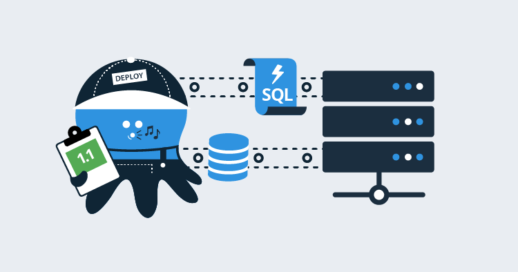
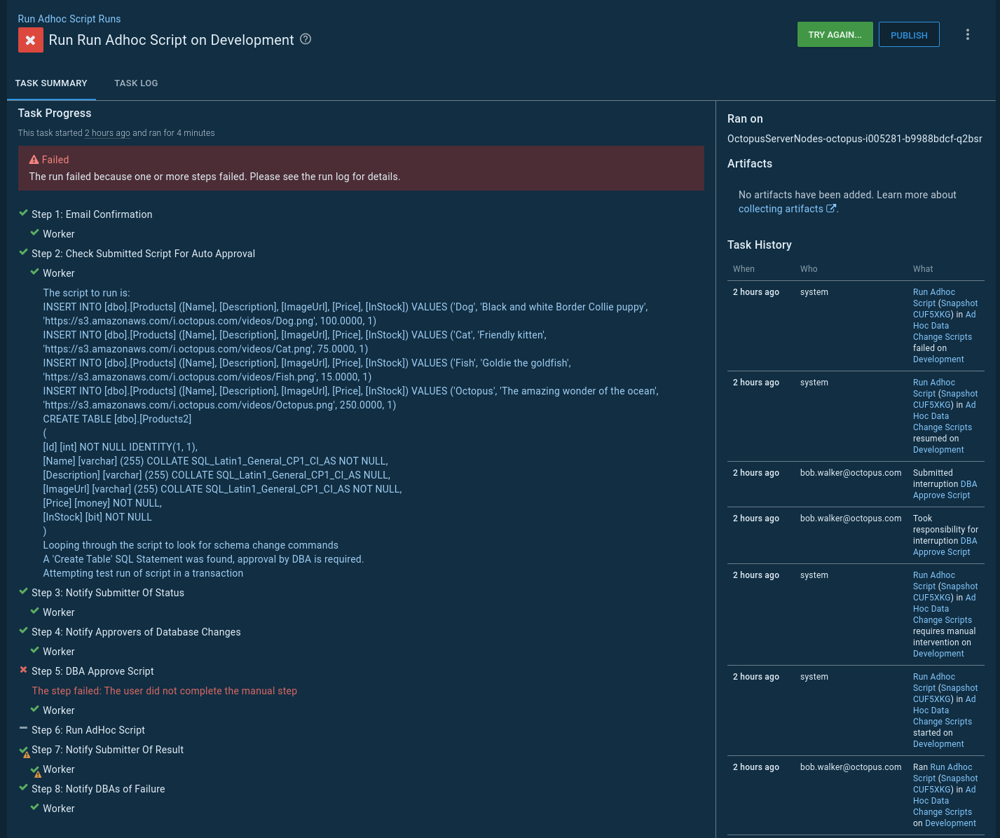
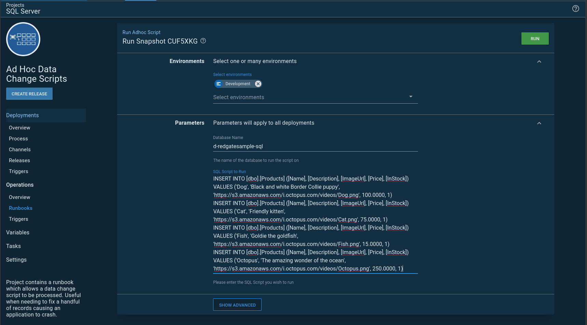
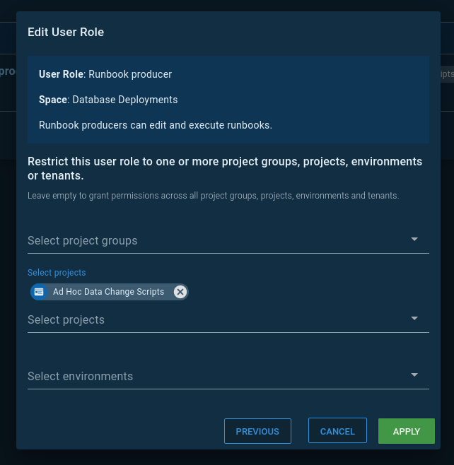
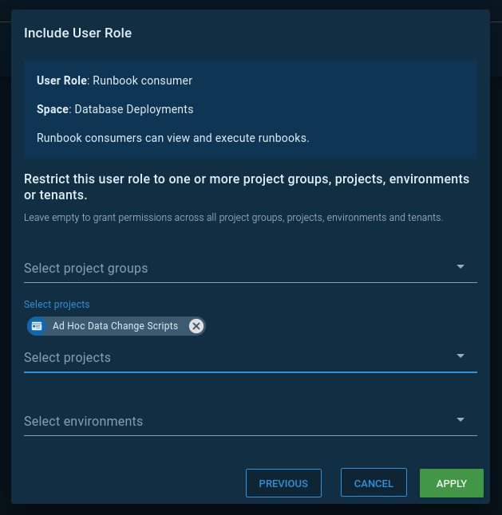
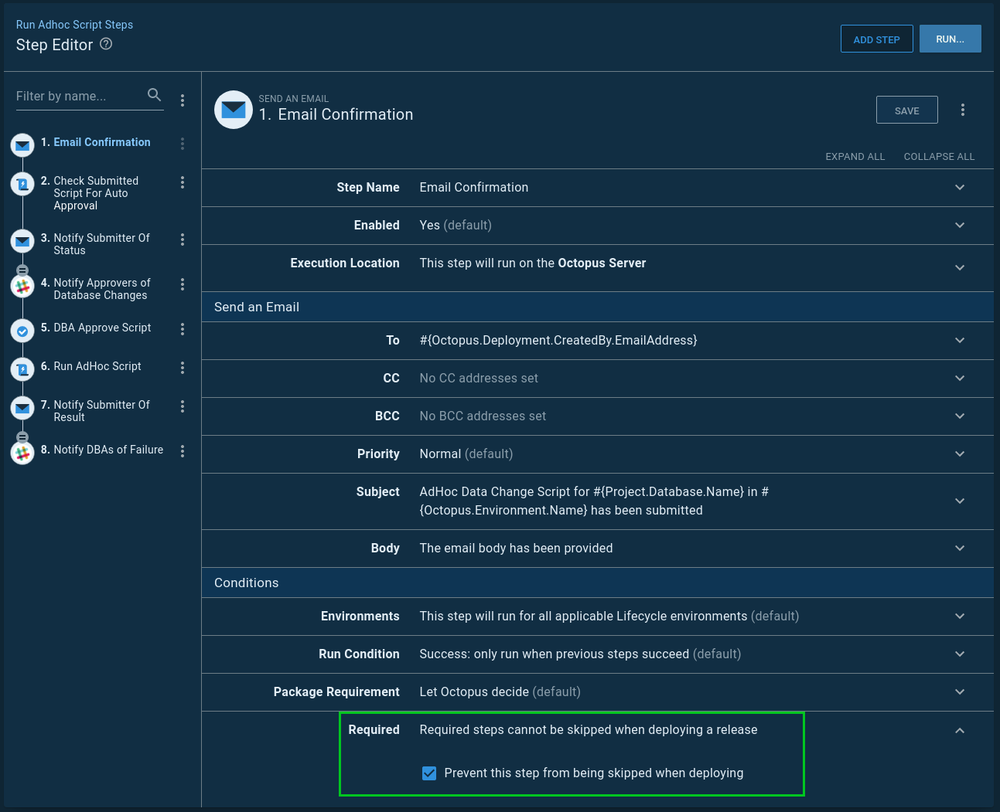

In a previous post, I wrote [how to run ad-hoc SQL scripts in the database deployment pipeline](https://octopus.com/blog/database-deployment-automation-adhoc-scripts).  At the time of writing, I felt that was the best process for my requirements.  The new [runbooks feature](https://octopus.com/runbooks), released as part of our 2019.11 release, looks like it could be a much better fit for this process.  In this article, I walk through a new process I put together using the Operations Runbooks feature.

!toc

## Why we need ad-hoc SQL scripts

In that previous article, I went into detail about why we need ad-hoc SQL scripts in an automated database deployment pipeline.  Below is a quick summary to bring you up to speed.

All software has bugs, but not all bugs are worth the time and effort to fix.  It is hard to justify the engineering cost to fix a bug that only happens once a quarter to one person and only when *the sun, moon, and stars all align*.  However, sometimes bugs like this cause data to get into a bad state. The bug is unlikely to be fixed, but the data needs to be fixed so the user can continue to use the application. Typically, a developer writes a SQL script for the DBAs to run to fix the data.

Each company I’ve worked at and worked with all have a process for running these kinds of scripts.  It could be as simple as emailing a DBA to ask them to run the script, or it could be as complicated as a multi-page form requiring lots of sign-off, but the process always seems to be manual.

Automating this process with a tool like Octopus Deploy has many advantages:

- **Auditing**: Octopus Deploy can tell you who made the request, who approved the request, and when this all happened.  
- **Artifacts**: Using the artifact functionality built into Octopus Deploy, it’s possible to store and capture the exact SQL script that was run, however, if someone changes the script after the fact on a file-share, there is no way to know that.
- **Approvals**: In some cases, it’s important to have another set of eyes look at the script. Octopus Deploy can be set up to conditionally approve scripts based on a set of criteria.
- **Automation**: No more manually sending emails.  No more manually sending confirmations.  No more opening SSMS to run the SQL script.
- **Repeatable**: The same process will be used across all environments to run the scripts.

## Automation requirements

In looking at my previous article, I see a lot of moving parts.  I want to simplify this process when porting it to a runbook.  That complexity was a result of forcing an ad-hoc SQL script process into a deployment process, but is there anything else in my requirements forcing that complexity?

Here are those requirements again:

- Octopus Deploy.
- No source control. A lot of DBAs, support engineers, and business analysts are not familiar with source control tooling.
- Automated. When the scripts are ready, they should be run within five minutes without having to fill out a form or notify anyone.
- Analysis of the script. If the script contains certain keywords, then a human should review the script prior to running it.
- Work in any environment. We want to encourage people to run this for any environment, even dev.

This one stands out:

> Automated. When the scripts are ready, they should be run within five minutes _without having to fill out a form_ or notify anyone.

With runbooks, I can tweak that requirement a bit:

> Automated.  When the scripts are ready, they should be submitted via an easy to use form and executed straight away.

## The runbook process

All right, the requirements are updated; it is now time to re-work the process:

1. A user initiates a runbook run and enters the database name and a SQL script into [prompted variables](https://octopus.com/docs/projects/variables/prompted-variables).
2. A confirmation message is sent to the submitter.
3. A script is run that evaluates the submitted script.  It looks for schema change commands, uses a transaction to run and rollback the script, and checks the number of changed rows.  The [output variable](https://octopus.com/docs/projects/variables/output-variables) `DBA Approval Required` is set to `False` if all conditions are met, otherwise it is set to `True`.
4. The submitter is sent the results of the auto-approval.
5. If a DBA is required to review the script, a notification is sent, and the process is paused for a [manual intervention](https://octopus.com/docs/deployment-process/steps/manual-intervention-and-approvals).  
6. If the script was auto-approved or the DBA approves the script, then the script runs.
7. DBAs and the submitter are notified of the result of the run.

I am going to put that runbook into a new project.  This will help when I configure security later in the article:


## The auto-approval script

The auto-approval script is the brains of the whole operation.  It ensures standards are met, and no one is trying to sneak in a schema change script.

You can view the script in our [samples instance](https://samples.octopus.app/app#/Spaces-106/projects/ad-hoc-data-change-scripts/operations/runbooks/Runbooks-225/steps/RunbookProcess-Runbooks-225/step/7ff33a39-2088-4a52-aea2-cce41c70c61b).  

Below are some of the highlights from the script.  First, I put all the schema change commands to look out for into a variable:

```PowerShell
$scriptToRun = $OctopusParameters["Project.ScriptToRun.Text"]
$commandsToLookFor = $OctopusParameters["SQLServer.Commands.Warnings"]

$approvalRequired = $false
$messages = ""

Write-Highlight "Looping through the script to look for schema change commands"
$commandsToCheck = $CommandsToLookFor -split ","
foreach ($command in $commandsToCheck)
{
    Write-Host "Checking for command $command"
    $foundCommand = $scriptToRun -match "$command"

    if ($foundCommand)
    {
        $warningMessage = "A '$command' SQL Statement was found, approval by DBA is required."
        $messages += $warningMessage + "`r`n"
        Write-Highlight $warningMessage
        $approvalRequired = $true        
    }
}
```

Next, it attempts to run the SQL script provided in a transaction.  No matter what, the transaction is rolled back:

```PowerShell
$scriptToRun = $OctopusParameters["Project.ScriptToRun.Text"]
$databaseName = $OctopusParameters["Project.Database.Name"]
$databaseServer = $OctopusParameters["Project.Database.Server"]
$connectionString = $OctopusParameters["Project.Database.ConnectionString"]
$environmentName = $OctopusParameters["Octopus.Environment.Name"]

Write-Highlight "Attempting test run of script in a transaction"
$sqlConnection = New-Object System.Data.SqlClient.SqlConnection
$sqlConnection.ConnectionString = $connectionString

$command = $sqlConnection.CreateCommand()
$command.CommandType = [System.Data.CommandType]'Text'
$command.CommandText = $scriptToRun

Write-Host "Opening the connection to $databaseName on $databaseServer"

$sqlConnection.Open()   

try
{
    Write-Host "Creating transaction"
    $command.Transaction = $sqlConnection.BeginTransaction()

    Write-Host "Running query now"
    $rowsChanged = $command.ExecuteNonQuery()
}
catch
{
    throw $_
}
finally
{
    $command.Transaction.Rollback()
}
```

Make a note of this line in the above script:

```PowerShell
$rowsChanged = $command.ExecuteNonQuery()
```

The final check makes sure the SQL script isn’t going to change a lot of records without someone looking at it.  It uses the `$rowsChanged` variable:

```PowerShell
if ($rowsChanged -gt 10)
{
    $warningMessage = "The number of rows which will changed is $rowsChanged, approval by DBA is required."
    $messages += $warningMessage + "`r`n"
    Write-Highlight $warningMessage

    $approvalRequired = $true
}
elseif ($rowsChanged -le 0)
{
    $warningMessage = "No rows will be changed, verify change with DBA"
    $messages += $warningMessage + "`r`n"
    Write-Highlight $warningMessage
    $approvalRequired = $true
}
```

Finally, it sets an output variable indicating if a DBA needs to approve the script:

```PowerShell
Set-OctopusVariable -name "ApprovalRequired" -value $approvalRequired
```

This is just the first iteration of the script.  I’d expect anyone reading this article to modify the script to their business requirements.

## Automating ad-hoc SQL script runs

The script that runs the submitted data change is a modified version of the auto-approval script.  One requirement I tend to see is that every script needs to be wrapped in a transaction.  Either it all goes or none of it goes.  I agree entirely with that requirement.  The script that runs the submitted data change enforces that requirement:

```PowerShell
$scriptToRun = $OctopusParameters["Project.ScriptToRun.Text"]
$databaseName = $OctopusParameters["Project.Database.Name"]
$databaseServer = $OctopusParameters["Project.Database.Server"]
$connectionString = $OctopusParameters["Project.Database.ConnectionString"]

$sqlConnection = New-Object System.Data.SqlClient.SqlConnection
$sqlConnection.ConnectionString = $connectionString

$command = $sqlConnection.CreateCommand()
$command.CommandType = [System.Data.CommandType]'Text'
$command.CommandText = $scriptToRun

Write-Host "Opening the connection to $databaseName on $databaseServer"

$sqlConnection.Open()   

try
{
	Write-Highlight "Creating transaction"
	$command.Transaction = $sqlConnection.BeginTransaction()

    Write-Highlight "Running query now"
	$rowsChanged = $command.ExecuteNonQuery()

    Write-Highlight "Committing Transaction"
    $command.Transaction.Commit()
}
catch
{
	Write-Highlight "Exception with running script, rolling back transaction"
	$command.Transaction.Rollback()
	throw $_
}
```

## Seeing it in action

Now it’s time to test the process.  I want to do two tests:

1. A SQL script with data and schema changes. I’d expect the manual intervention to be triggered.
2. A SQL script with only data changes.  No manual intervention.

### SQL script with data and schema changes

As stated earlier, I’m using prompted variables for the database and script to run.  When I create a runbook run, I have to provide values for both:


As expected, the `Create Table` command triggers a manual intervention:


There are cases where a `Create Table` is needed.  Perhaps the script is creating a temp table, but in this case, the DBA would reject a script like this:



### SQL script with data changes only

In my next test, I remove the create table command:



As expected, that change was auto-approved and ran straight away:


## Database automation and security

Anyone can submit an ad-hoc script, but only DBAs should be allowed to edit this process.  Let’s set up two teams in Octopus to enforce this requirement.

The DBAs will be assigned the role `Runbook producer` for the new project.  That grants them the ability to edit and execute runbooks in that specific project:



Meanwhile, developers will be assigned the role `Runbook consumer` for the new project.  That grants them the ability to execute runbooks only:



Finally, it is important that no step in this process is skipped when the runbook run is created.  Every step in the process will be marked as required to prevent that from happening:



## Conclusion

I’ll be honest; I like this process a lot more than my previous process.  Runbooks made everything simpler and easier to maintain.  The number of moving parts has been reduced.  I really like not having to create a release to run an ad-hoc SQL script.  And I don’t have to create a funky lifecycle just to run a script in any environment.  

I think it’s a great start to a better process.  As I’m typing this, I can think of a few more iterations to make this process even more useful.  Eventually, retention policies will run, and runbook runs will be cleaned up.  Retention policies are needed to keep Octopus running lean and mean, but we don’t want to lose any audit history for specific environments.  I could add a step to save the submitted script and results in a file share.  

If you would like to see a working example, you can visit our [samples instance](https://samples.octopus.app/app#/Spaces-106/projects/ad-hoc-data-change-scripts/operations/runbooks).  

Until next time, happy deployments!

---

!include <database-deployment-automation-posts>
