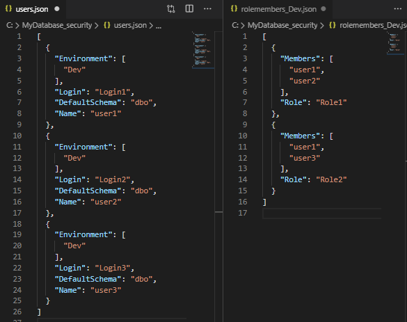
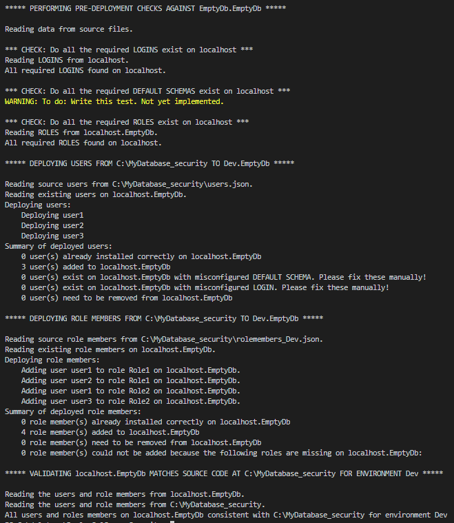
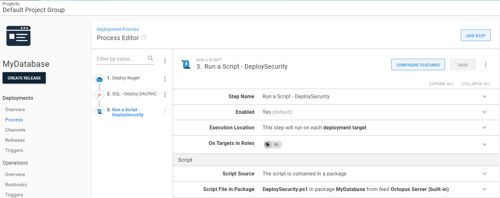

Last month, I wrote about your [SQL Server deployment tooling options](https://octopus.com/blog/sql-server-deployment-options-for-octopus-deploy). This month, I’m going to discuss the often painful and poorly supported challenge of managing database security.

Since I’ve been working on this challenge for the last couple of weeks for one of my customers, I’ll finish with a link to some PowerShell scripts that you can use for your own databases.

## The challenge of security

If you can script it, you should source control it and deploy it through your pipeline.

This gives you visibility into what has changed, when and why, and it allows for much easier troubleshooting and rollbacks. Auditors love it. But security poses a challenge because some parts are likely to be the same in each environment (e.g., database roles), but others are likely to change (e.g., the users that are assigned to those roles).

Scripting everything out on a per-environment basis is likely to lead to lots of repetition, administrative toil, and a big old mess. However, using a standard security model for all environments isn’t viable either. Clearly, your developers need the permission to write against their dev databases, but you probably don’t want to give every developer admin access to the production database.

Practicing Role-Based Access Control (RBAC) helps a lot. If your roles are consistent throughout your pipeline, you can source control and deploy them using the tools I discussed last month. However, this still leaves you with the challenge of managing which users should be members of those roles in each environment. The tools I discussed in my last post don’t generally offer an elegant solution to that problem – apart from allowing you to filter out the users so you can manage them by some other means.

## Possible solutions

Generally, you want some sort of environment-aware post-deploy process that deploys the environment-appropriate users and assigns them to the required roles.

Octopus Deploy has some cool features to help you manage environment-specific config. For example, we could create a [#{SecurityModel} variable](https://octopus.com/docs/projects/variables) and set it to *DEV* or *PROD*, etc. in each environment we deploy to. We could then use this variable to select whether we want to deploy the *DEV* or *PROD* users to a given environment. For example, in the screenshot below, I deploy the *DEV* security model to both the *DEV* and *TEST* environments, but I used a different *PROD* security model for production.


Some tools, like [SSDT](https://docs.microsoft.com/en-us/sql/ssdt/how-to-specify-predeployment-or-postdeployment-scripts?view=sql-server-ver15) and the [Redgate tools](https://documentation.red-gate.com/soc6/common-tasks/working-with-pre-post-deployment-scripts), have built-in support for *Post-Deployment Scripts*. As part of my research, I looked in some detail at [a project by Peter Schott](http://schottsql.blogspot.com/2013/05/ssdt-setting-different-permissions-per.html), who himself was building on Jamie Thompson’s earlier work (Thanks Peter, your work really helped me!).

However, Peter’s work only supports SSDT projects, and as I discussed in my previous post, there are lots of deployment tools out there, for instance, the customer I’ve been working with this month uses a different tool. What we really want is something that works regardless of whether you are using SSDT, Redgate, DbUp, or whatever else.

Since 2013 (when Peter published his work), PowerShell has become the automation tool of choice on the Microsoft stack and over the last few years [dbatools](https://dbatools.io/) (the community driven SQL Server PowerShell module) has revolutionized the way that automation loving DBAs have been working with SQL Server. Big thanks to [Chrissy LeMaire and all the others](https://dbatools.io/team/) for making my job so much easier! If you love automation, you work with SQL Server, and you haven’t heard of dbatools, you really need to check it out.

dbatools comes with [over 500 cmdlets](https://dbatools.io/commands/), including (for example) [New-DbaDbUser](https://docs.dbatools.io/#New-DbaDbUser) and [Add-DbaDbRoleMember](https://docs.dbatools.io/#Add-DbaDbRoleMember). Since PowerShell is one of the default automation languages for Octopus Deploy, and dbatools helps us to avoid dynamically generating a load of T-SQL, I set about creating a pure PowerShell version of Peter’s SSDT post-deploy scripts that would be easy to maintain and simple to run from Octopus Deploy, regardless of your database deployment tooling.

## Putting it all together

What we want is an environment aware, post-deployment script that can be easily called from Octopus Deploy. I’ve created some PowerShell scripts to explore how you might go about this. They aren’t perfect by any means, but hopefully, they give you some ideas. Feel free to fork the repo if you like:
[https://github.com/Alex-Yates/DeploySqlServerSecurity](https://github.com/Alex-Yates/DeploySqlServerSecurity).

First, a couple of disclaimers. This is still a work in progress. And I know enough PowerShell to be dangerous but not enough to be elegant. Use it at your own risk.

The first thing you want to do is run GetSecurity.ps1:

```powershell
git clone https://github.com/Alex-Yates/DeploySqlServerSecurity.git
cd .\DeploySqlServerSecurity
\DeploySqlServerSecurity> .\GetSecurity -SqlInstance DevSql01 -Database MyDatabase -Environment Dev -OutputDir “C:\MyDatabase_security”
```

This will export all your users and role members to your chosen output directory.

Unlike Peter, I’m assuming you are practicing RBAC, so I’m not including roles or permissions. I’m expecting that your roles are consistent across all environments, and that all your permissions are managed through your roles and that those roles are deployed though your regular database deployment tooling. I’m also only supporting Windows Auth users at this point. If that’s unrealistic, let me know, and we can look at adding roles, permissions, and/or SQL users.

The data is stored in JSON files. (Apologies XML fans. I’m planning to add XML support soon.) My hope is that these are easy to understand and maintain:



Now you can run GetSecurity.ps1 a second time, this time by pointing it at the Test database:

`\DeploySqlServerSecurity> .\GetSecurity -SqlInstance TestSql01 -Database MyDatabase -Environment Test -OutputDir “C:\MyDatabase_security”`

You’ll get a single users.json file, which specifies which environment each user should be deployed to. You’ll also get a separate rolemembers_$Environment.json file for each environment. The role members files define which users should be added to which role in specific environments:


You can now edit these files as you choose. For example, you can add users or change which users are members of which role. When you are ready, you can deploy the users using `DeploySecurity.ps1`. This script will perform a bunch of tests on your source code and ensure the appropriate roles and logins etc., exist, and then it will deploy your users and ensure all users are added to the appropriate roles.

By default, it won’t delete anything, but it will warn you if any unexpected users or role members exist on the target database. However, if you use the `-DeleteAdditional` switch, it will drop anything on the target database that doesn’t exist in the source files. In this case, I’ve created a mostly empty database, containing only the required roles, and deployed all my *Dev* security to it.

`\DeploySqlServerSecurity> .\DeploySecurity -SqlInstance localhost -Database EmptyDb -Environment Dev -SourceDir “C:\MyDatabase_security”`



Now you’ll want to set up a build process to pack your source files and the deployment scripts into a NuGet or zip file and pass them to Octopus Deploy. You might like to run `TestSecurity.ps1` as part of a build process to check you haven’t mashed the keyboard when editing the source files or missed any logins.

Then, in your Octopus project, after your regular database deployment has completed, you need to run a standard Octopus Deploy PowerShell step, passing through the appropriate environment variable to ensure the correct security configuration is deployed to the target database.



## What’s next?

I’ve got a bunch of stuff I want to do with this, and I’m really interested to hear your thoughts about how it could be improved. Could you use this? If not, why not? What’s missing? Leave me a GitHub issue or submit a pull request.

However, I should also mention that in the last few days, I’ve learned that [Stuart Moore is working on something similar](https://github.com/sqlcollaborative/dbasecurityscan). Earlier this week, he published his work to [the sqlcollaborative](https://github.com/sqlcollaborative). He’s come at the problem more from a security auditing/testing perspective than a source control/deployment perspective, but our work is so tightly connected that it might be best to combine our efforts.

The thing I love most about this community is how many people are willing to share their work and collaborate to solve hard problems.

---

Alex Yates has been helping organisations to apply DevOps principles to their data since 2010. He’s most proud of helping Skyscanner develop the ability to  [deploy 95 times a day](https://www.youtube.com/watch?v=sNsPnCv7hHo) and for supporting the United Nations Office for Project Services with their release processes. Alex has worked with clients on every continent except Antarctica – so he’s keen to meet anyone who researches penguins.
 
A keen community member, he co-organises [Data Relay](https://datarelay.co.uk/), is the founder of [www.SpeakingMentors.com](http://www.speakingmentors.com/) and has been recognised as a  [Microsoft Data Platform MVP](https://mvp.microsoft.com/en-us/PublicProfile/5002655?fullName=Alex%20Yates) since 2017.
 
Alex is the founder of [DLM Consultants](https://dlmconsultants.com/), an official Octopus Deploy partner. He enjoys mentoring, coaching, training and consulting with customers who want to achieve better business outcomes through improved IT and database delivery practices.
 
If you would like to work with Alex, email: [enquiries@dlmconsultants.com](mailto:enquiries@dlmconsultants.com) 