When you think of automating application deployments, what usually comes to mind is automating the deployment web code, containers, and or database.  In this series, I’ll demonstrate how to automate supporting components such as SQL Server Integration Services (SSIS) packages and SQL Server Reporting Services (SSRS) reports.

- [Deploying SQL Server Integration Services (SSIS) packages with Octopus](/blog/2020-04/deploying-ssis/index.md)
- **Deploying SQL Server Reporting Services (SSRS) reports with Octopus**

---

Collecting and storing data is often the main functions of web applications.  The collected data needs to be analyzed and shown in graphical format to help make decisions.  This usually takes the form of a report.  SQL Server Reporting Services (SSRS) is Microsofts reporting solution.  SSRS is a web-based application that can use a number of different data sources to populate reports for users.  In this part of my series, I will demonstrate how to deploy SSRS reports using Octopus Deploy.

## Build the project
As of Visual Studio (VS) 2017, MSBuild can build .rtpproj files.  Projects that are created in older versions of Visual Studio will need to configure the build agents similar to my [SSIS post](/blog/2020-04/deploying-ssis/index.md) in order to build the project using Visual Studion itslef (devenv.exe).  This post utilizes Azure DevOps as the build platform, however any build server that can use MSBuild will be able to do this (for VS 2017+).

### Add the build task
To build an SSRS project, simply add any MSBuild type task to your build definition.  For my build definition, I chose a Visual Studio build task, which invokes MSBuild:

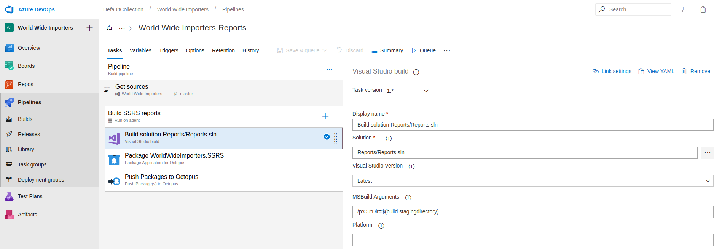

### Package the artifacts
When the SSRS project is built, it places the built reports into the `bin` folder.  In this case, they are in `Reports/Reports/bin/release`  We to package these reports into either a .zip or a .nupkg package for deployment.  For this post, I choose the .nupkg format:

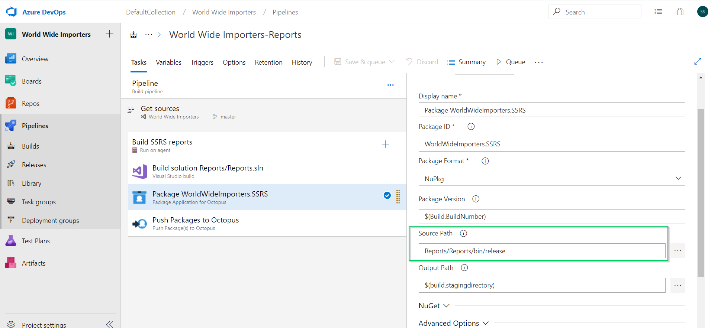

### Push the artifacts
Now that we have the artifacts packaged, we can push them to our Octopus Deploy server:

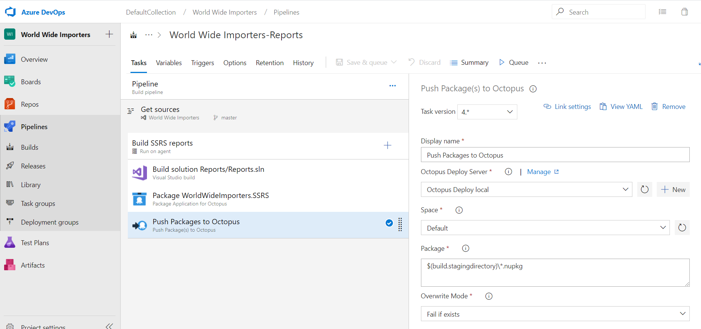

And that’s all we need for our build definition.

## Octopus Deploy
Now that we have our artifacts in Octopus Deploy, we can create our project for deployment.

### Create the project
Click on **Projects**, then **ADD PROJECT**:

### Deploy the package
The first step in our process is to deploy the package to the SSRS server. Click **ADD STEP**:

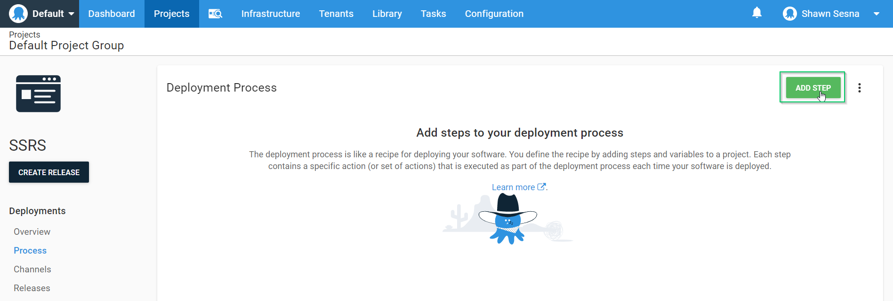

Add a Deploy a Package step and select the package we pushed to the Octopus Server:

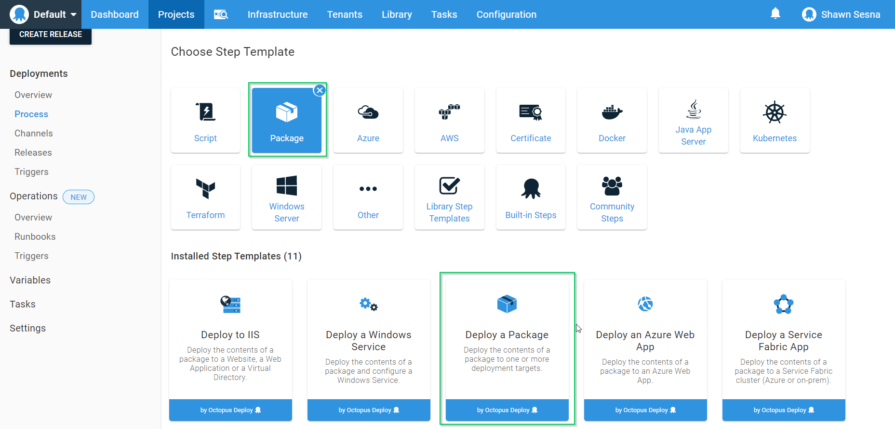

After the step has been added, fill in the text boxes:

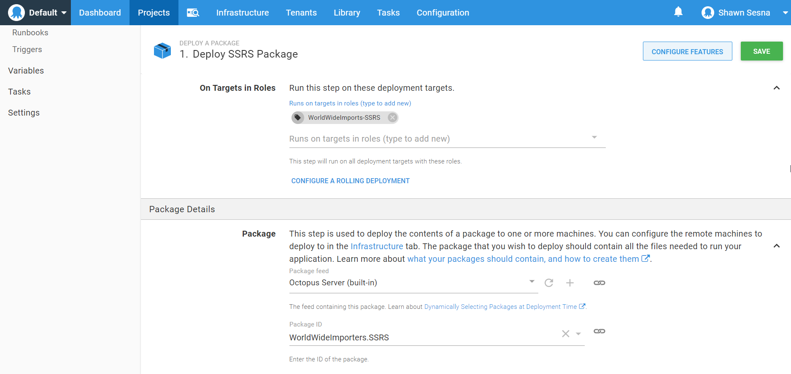

### Add the SSRS step

To deploy SSRS reports, I add a Community Step template.  Filter steps by SSRS and select Deploy SSRS Reports from a package step:

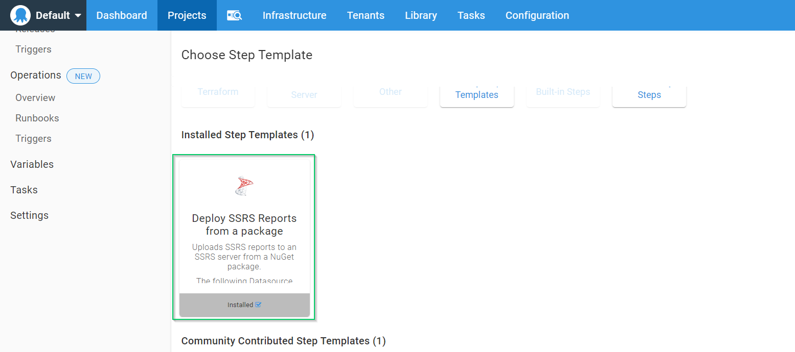

This step needs to execute on the same target that the package was deployed, for the Execution Location, choose Deployment Target and fill in the same role you chose for the Deploy a package step:

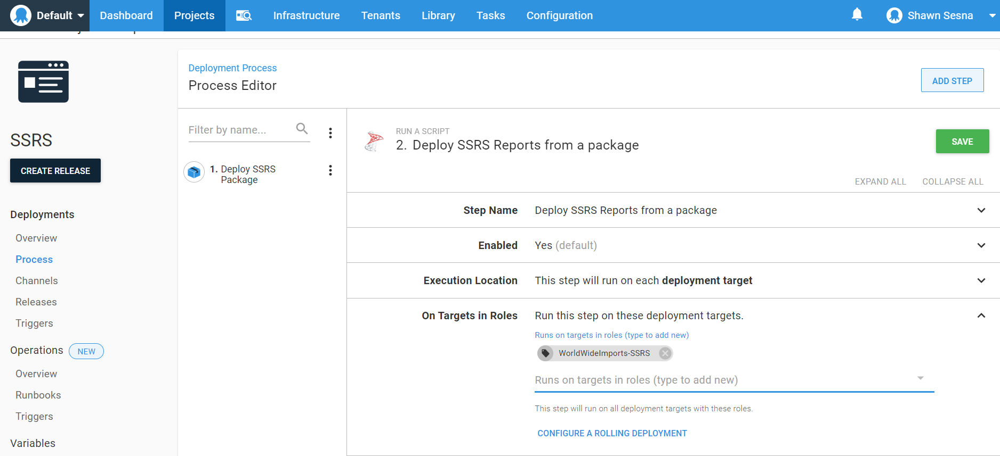

Fill in the values for the step.

- **SSRS Package Step**: This is the Deploy a Package step we created previously.
- **URL of SSRS Server service**:  This is the URL of the Report Service web service.  For example, http://servername/ReportServer/reportservice2010.asmx?wsdl.
- **Report Execution Url**:  This is the URL of the Report Execution web service.  For example, http://servername/ReportServer/ReportExecution2005.asmx?wsdl.
- **Report Folder**: The Relative path to the folder where the reports will be deployed.  For example, `/MyFolder`.
- **Report data source folder**: The relative path to the folder where the datasources will be deployed.  For example `/MyFolder/MyDataSources`.
- **Overwrite Datasources**: Check this if you want to overwrite the datasources when deploying.

:::hint
To specify the datasource details, you need to create Octopus Deploy variables that match the datasource to overwrite.  The following properties can be overridden:

- ConnectionString
- Username
- Password

For example, if the name of the datasource is `MyDatasource`, the variables would be:

- MyDatasource.ConnectionString
- MyDatasource.Username
- MyDatasource.Password

If the username and password are for a domain account, you need to create an additional variable called `MyDatasource.WindowsCredentials` with a value of `True`.
:::

- **Backup Location (optional)**:  The location on the Deployment Target to back up reports before overwriting them.
- **DataSet Folder (optional)**:  The relative path to the folder where Shared DataSets will be deployed.  For example `/MyFolder/MyDatasets`.
- **Report Parts Folder (optional)**: The relative path to the folder where Report Parts will be deployed.  For example `/MyFolder/MyReportParts`.
- **Service Domain (optional)**:  Domain name of the account to use when deploying.
- **Service Username (optional)**:  Username of the account to use when deploying.
- **Service Password (optional)**:  Password for the user to use when deploying.
- **Clear the report folder**: Check this box if you want to delete reports from the target folder prior to deployment.
- **Use package folder structure**: Check this box if you want the step to follow the folder structure included in the package.  This setting ignores `Report folder`, `Report data source folder`, and `DataSet folder` settings.
- **Root folder**: Used specifically with the `Use package folder structure` option, specifies where on the SSRS folder is the root for this project.

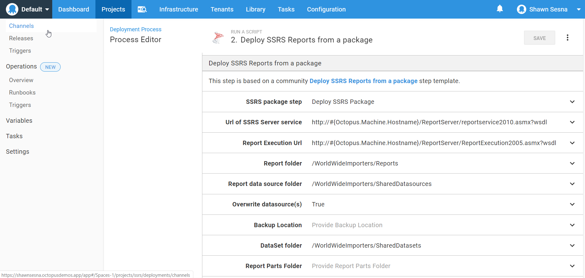

That’s all for the steps.  We’re now ready to deploy.

## Deploy the reports
With our process complete, let’s create a release. Click **CREATE RELEASE**:

After you click **SAVE**, choose the deployment environment:

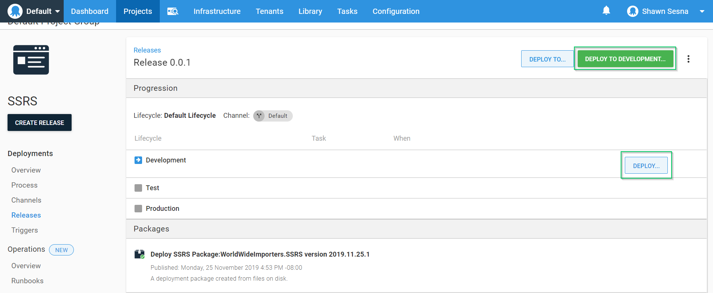

Click **DEPLOY**:

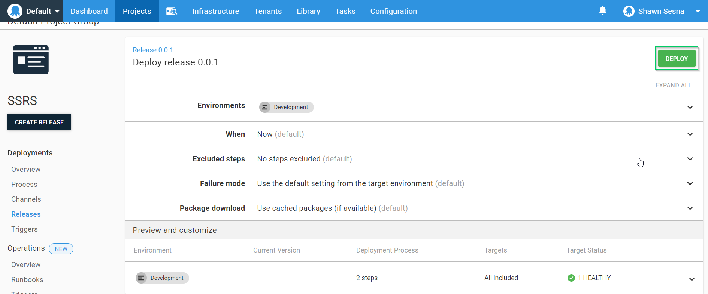

After the deployment is complete, it should look like this:

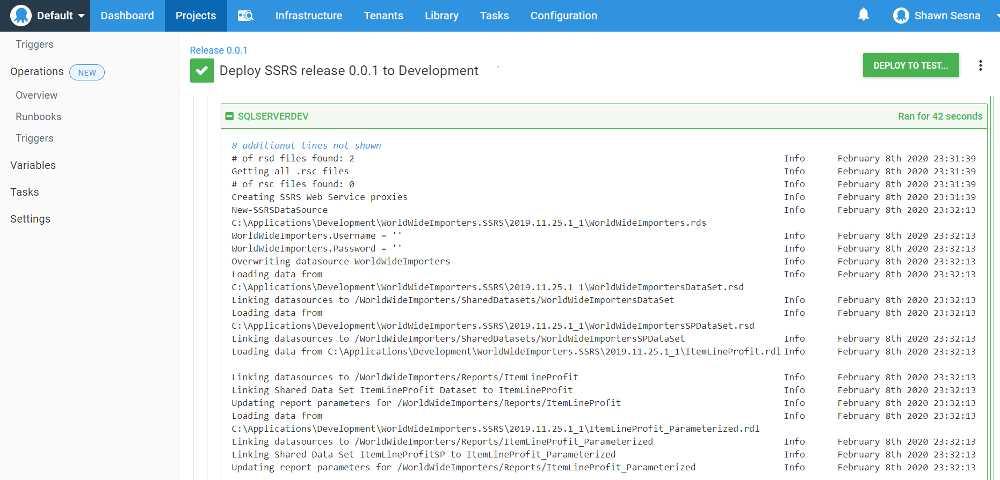

## Conclusion
In this post, I demonstrated how easy it is to deploy SSRS reports using Octopus Deploy. Happy Deployments!
