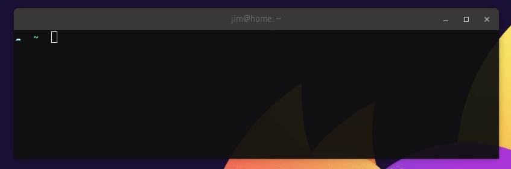

As a developer, I like my IDE and text editors to provide me with useful hints while I'm doing a lot of typing. This not only speeds me up when I know what I'm trying to do, it also speeds me up _when I'm learning_ how to use a tool or framework feature. Thinking back, I probably owe the speed at which I picked up C# programming to features like Intellisense.

Why should my command line experience be any different? I can't remember the exact `aws` CLI invocations at the best of times, let alone when I'm under pressure to fix something!

The good news is that for a small up front investment, you can tune your command line experience to give these kinds of hints and automatically complete phrases and options for you.

For example, `zsh` and `oh-my-zsh` make it really easy to find and install [completion plugins for many popular tools](https://github.com/ohmyzsh/ohmyzsh/wiki/Plugins). One of my absolute favorite plugins is zsh-autosuggester` which keeps track of your shell history to provide completion on entire statements.



Even better news is that most shells provide some kind of facility for injecting completion hints at the command line, so you can [write them for other peoples tools](https://www.cyberciti.biz/faq/add-bash-auto-completion-in-ubuntu-linux/), or even your own!

## How does tab completion work?

Powershell, bash and zsh alike, as well as many other shell environments provide 'built in' commands to accept suggestions from an external source - like a file, or another application. These builtins all work in roughly the same way:

1. Register a command to invoke when the tab key is encountered
2. Process the text input prior to the tab key
3. Read in suggestions from a source (list, other command)
4. If there are multiple suggestions, display the choices to the user. Some shells even allow the user to choose one!
5. If there is a single suggestion, use that

Some example of these builtin commands are [compctl](https://linux.die.net/man/1/zshcompctl) (zsh), [complete and compgen](https://www.gnu.org/software/bash/manual/html_node/Programmable-Completion-Builtins.html) (bash), [Register-ArgumentCompleter](https://docs.microsoft.com/en-us/powershell/module/microsoft.powershell.core/register-argumentcompleter?view=powershell-7) (powershell & pwsh).

For example, the `dotnet` CLI provides a little known subcommand called `complete` which allows you to type something like `dotnet command lis`. What is returned is a list of possible matches against the different options and subcommands that are available in dotnet: 

```bash
$ dotnet command lis

--list-runtimes
--list-sdks
list
publish
```

They implemented this so that it can be used to provide the shell completion builtins the data they need to do their work. [As per their documentation](https://github.com/dotnet/cli/blob/master/Documentation/general/tab-completion.md?WT.mc_id=-blog-scottha#how-to-enable-it), in order for this to work you then need to go and edit your profile and sprinkle in some functions to hook it all up.

### Compctl scripting

Imagine we have a CLI called `acme` which has a subcommand called `suggest` that simply takes a search argument and spits out the suggestions. To hook this into `zsh` we would insert the following script into our profile `~/.zshrc`:

```bash
# ~/.zshrc

_acme_zsh_complete() 
{
  local completions=("$(acme suggest "$words")")

  reply=( "${(ps:\n:)completions}" )
}

compctl -K _acme_zsh_complete acme
```

The first few lines declare a function `_acme_zsh_complete`. The last line sets up a registration: when the command `acme` is used prior to a `tab` key hit, then execute that function.

The function itself handles passing the words used prior to the `tab` key to the `acme suggest` subcommand and capturing its output into a local variable. This is then rendered as a newline delimited string to a known output variable called `reply`. `compctl` knows about `$words` and `$reply` and it uses the latter to render the list of suggestions to the user while they are still typing.

The Powershell equivalent would work in a similar way. It might look something like this:

```powershell

# when `acme foo[tab] happens: run this script block
Register-ArgumentCompleter -Native -CommandName acme -ScriptBlock {
    param($wordToComplete, $commandAst, $cursorPosition)
    acme suggest $commandAst.ToString() | % {
        [System.Management.Automation.CompletionResult]::new($_, $_, 'ParameterName', $_)
    }
}
```

Again, the registration knows to look for `acme` invocations and when the `tab` key is hit, the script block is executed. Its job is to take the output of our `acme suggest` command and transform it into something that `pwsh` can understand. In this case, that is a `CompletionResult` object.


## Wait a sec, doesn't Octopus have a CLI?

Oh yeah, you're right! Turns out, we've recently implemented our own completion subcommand for octo, and you can use it with `octo complete [searchterm]` right now! That means that if your favourite shell has a completion system, you can setup tab completion.

```powershell
C:\> octo complete list

list-workerpools
list-tenants
list-releases
list-projects
list-machines
list-workers
list-environments
list-deployments
list-latestdeployments
```

But we didn't stop there, we've also made it very simple to install the required scripts into popular shells too.

```powershell
# install into your ~/.zshrc
octo install-autocomplete --shell zsh

# install into your pwsh $PROFILE
octo install-autocomplete --shell pwsh

# unsure? do a dry run first and show the result without saving
octo install-autocomplete --shell bash --dryRun
```

Once installed, just dot source or restart your shell and you can complete all the things! Here it is in action...


