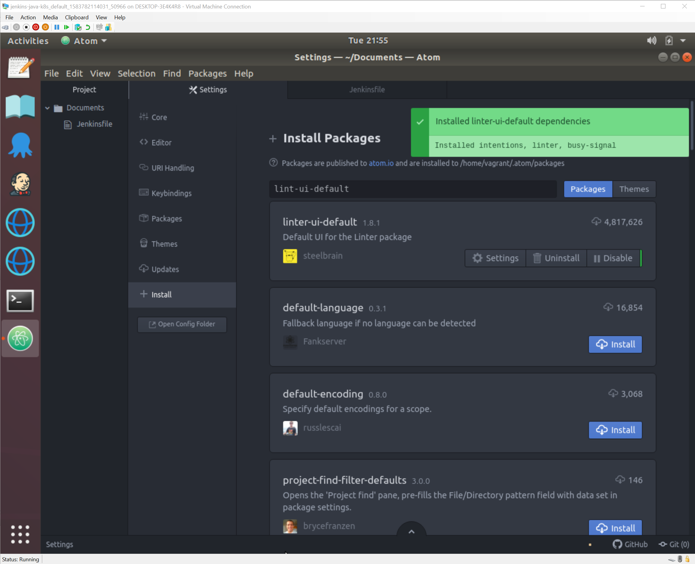
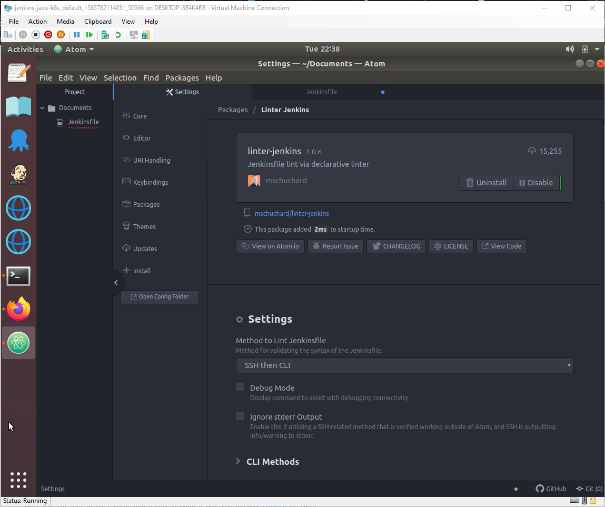
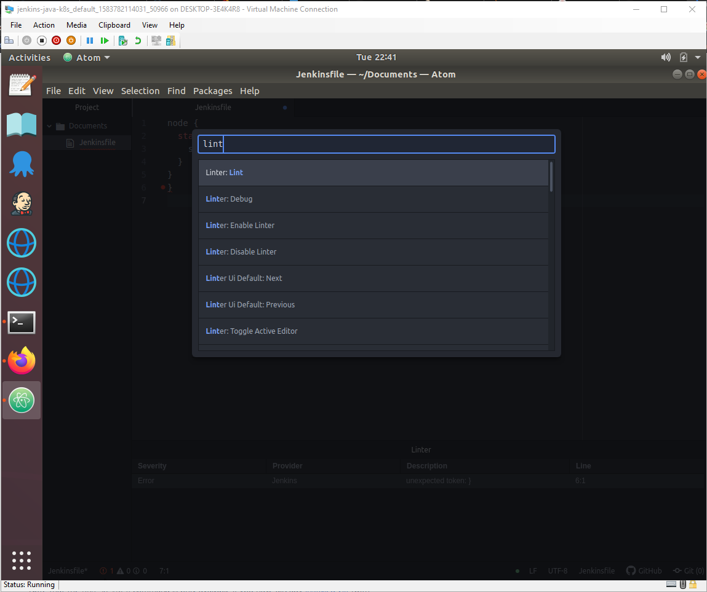
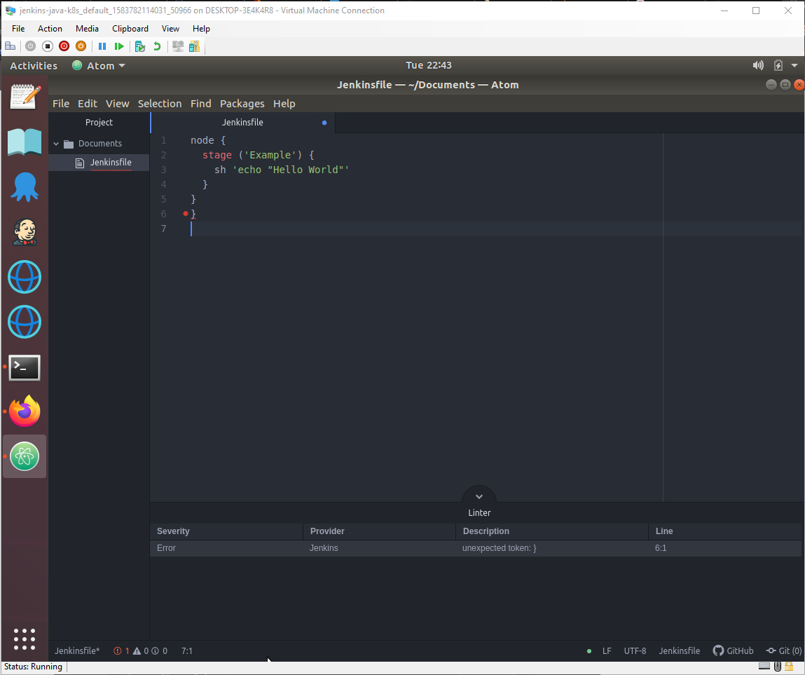

Declarative pipelines are a popular feature in Jenkins, allowing build processes to be committed alongside the code being built. Jenkinsfiles are essentially Groovy syntax; however, for developers used to relying on a local compile to ensure their code is valid, it can be frustrating to have to wait for Jenkins to attempt to execute their Jenkinsfile before finding syntax errors.

Jenkins provides a solution by making it possible to verify a Jenkinsfile before it is executed. This can be performed [manually from the command line](https://jenkins.io/doc/book/pipeline/development/#linter), or with IDE plugins to provide a more integrated experience.

In this blog post, we'll look at the Jenkinsfile linting tools available in the Atom editor.

## Preparing Jenkins

Linting a Jenkinsfile involves a network request to the Jenkins server. There are a variety of ways to make these network connections, but Jenkins typically recommends accessing the server via SSH.

It is important to note here that we are not talking about SSH access to the OS that Jenkins runs on. Rather, Jenkins exposes its own SSH server. The SSH server is enabled in the Jenkins security configuration screen under the `SSH Server` section. In the screenshot below I have started the SSH server on port `2222`:


The next step is to add a user's public key so they can authenticate via SSH. The key is created with the command:

```
ssh-keygen -t rsa -C "your_email@example.com"
```

This will create the public key in the default file `~/.ssh/id_rsa.pub`. The contents of this file are then assigned to a Jenkins user by opening the user's details, clicking the `Configure` option, and pasting the contents of the public key into the `SSH Public Keys` field:


Jenkins also requires the `Pipeline` plugin to be installed:


With these changes made, we are ready to configure Atom.

## Preparing Atom

Three packages need to be installed in Atom:

* language-jenkinsfile
* linter-jenkins
* linter-ui-default

The linter-ui-default package will ask to install a number of dependencies. These are required, so allow them to be installed:



The linter package requires additional configuration to make network connections to Jenkins.

We'll use the `SSH then CLI` connection option:



The `SSH Port` and `SSH User@Hostname` options must be updated to reflect the custom port that we exposed the Jenkins SSH server on (port `2222`) and the name of the Jenkins user that we added our Linux user's public SSH key to:


## Linting a Jenkinsfile

With a Jenkinsfile open, display the command palette with cmd-shift-p (macOS) or ctrl-shift-p (Linux/Windows) and select the `Linter: Lint` command:



The contents of the Jenkinsfile is then sent to the Jenkins server for validation, and any errors are returned:



## Conclusion

Jenkins IDE plugins, like the one we demonstrated in Atom, reduce the feedback time for errors in your Jenkinsfile, allowing you to complete a successful build faster. Because validating Jenkinsfiles requires a connection to the Jenkins server, some work is required to configure a secure connection and define the required credentials, but when this initial configuration is complete, validating your code is done with one command.
