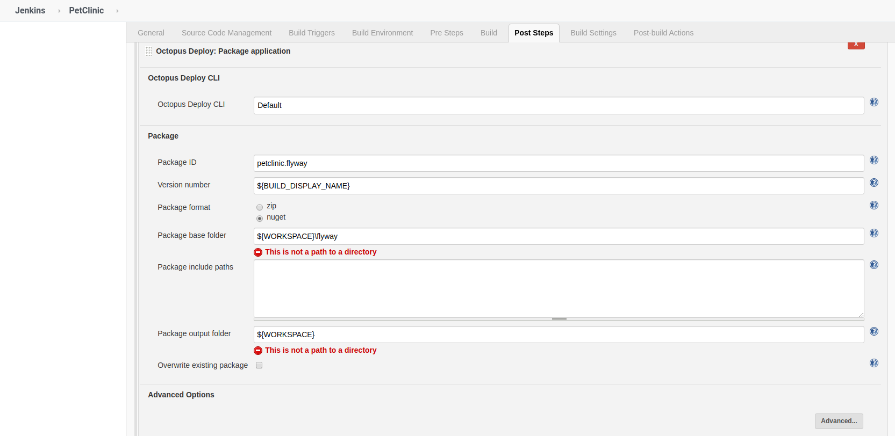
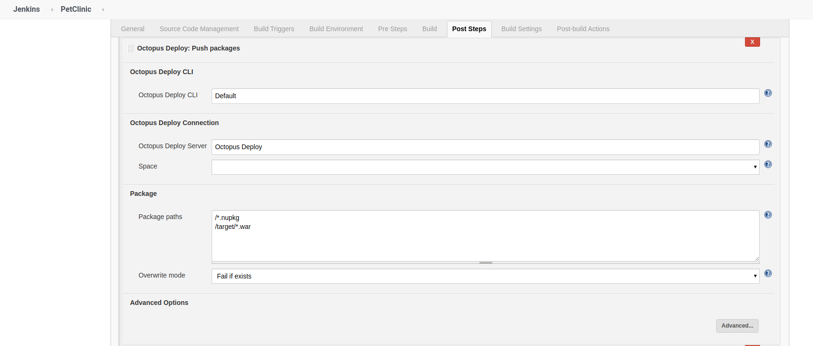
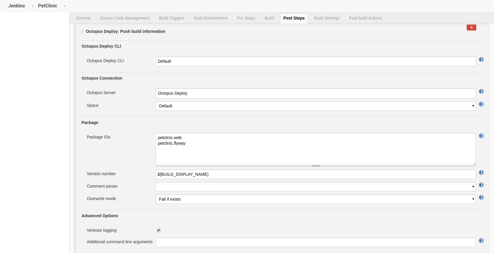
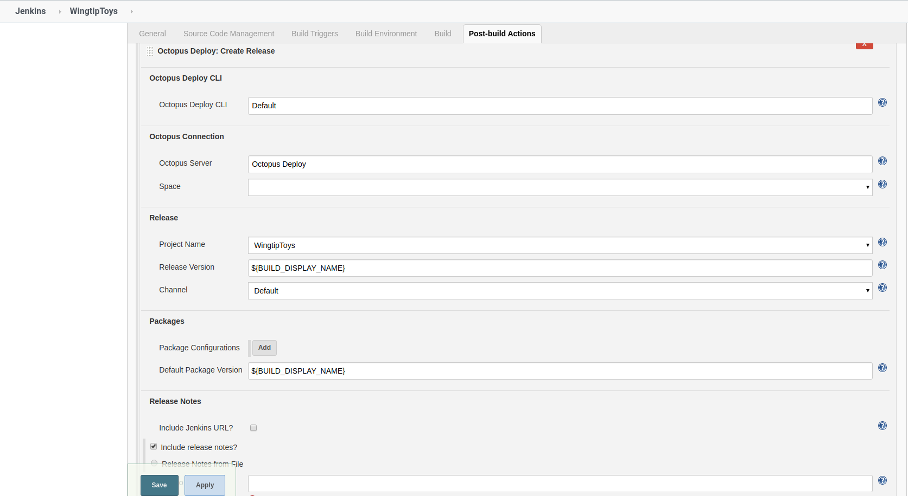
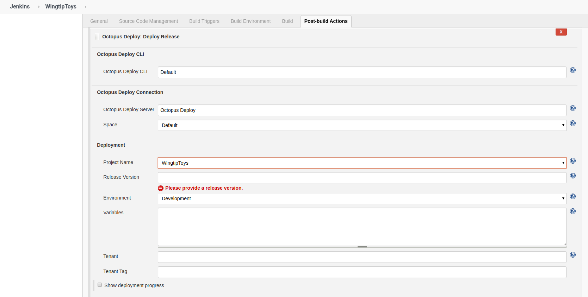

DevOps adoption has dramatically increased in recent years as people recognize the benefits it offers.  Integration of Continuous Integration (CI) solutions with Continuous Delivery (CD) solutions are now quite commonplace, though few provide any input to the continuous feedback loop of DevOps.  In this post, I will show you how to integrate Jenkins, Octopus Deploy, and Jira to provide a solution that will hook into the continuous feedback loop.

## Jenkins Octopus plugin
An Octopus Deploy plugin for Jenkins has existed for a number of years, however, this plugin was developed by the Jenkins community and not by Octopus Deploy.  In 2019, Octopus Deploy officially took over development and maintenance of the Jenkins plugin, implementing the same features that are avialable on other build platforms.

:::hint
Prior to Octopus Deploy taking ownership of the plugin, there was a security issue where passwords were stored in plain text.  This is no longer an issue and the warning that Jenkins would display has since been removed.
:::

### Installation of the Octopus Deploy plugin
Installation of the Octopus Deploy plugin is no different than installing any other plugin for Jenkins.  From the landing page in Jenkins, click Manage Jenkins

From here, click on Manage Plugins

Click on the `Available` tab, then filter by Octo.  Tick the box next to Octopus Deploy and then choose either `Install without restart` or `Download now and install after restart`.

Once the plugin has been installed, you will have access to the following build tasks
- Octopus Deploy: Package application
- Octopus Deploy: Push packages
- Octopus Deploy: Push build information

Along with those build tasks, you will also have the following Post Build tasks
- Octopus Deploy: Create Release
- Octopus Deploy: Deploy Release

:::hint
The Jenkins plugin differs from those of Azure DevOps, TeamCity, and Bamboo in that Create Release and Deploy Release are only available as Post build actions.  Jenkins only allows one of each type of Post build action type meaning you cannot have more than one Create Release action per build.  
:::

#### Package Application
The package application build task will archive all the files and folders into either a NuGet package or a Zip file from a given base folder.  The resulting archive will be placed in the specified output folder with the package name and version number as teh file name.

#### Push packages
The push packages step will upload the specified packages to the built-in Octopus Deploy Nuget Feed for the desired Space.

#### Push build information
This task will push the following information
- Build URL: A link to the build which produced the package.
- Commits: Details of the source commits related to the build.
- Issues: Issue references parsed from the commit messages.

#### Create Release
The Create Release task will create a new release in your Octopus Deploy project.  This task also includes the ability to deploy to an environment, however, the specified environment must be one that can be deployed to according to the lifecycle rules.

#### Deploy Release
The Deploy Release step will deploy the specified release version to the specified environment.  The environment must be allowed to deployed to according to lifecycle rules.

## Jira Integration
Jira is a popular software package used to track issues within software projects.  Jira is able to keep track of logged bugs, tasks, and epic items that are associated with your project.